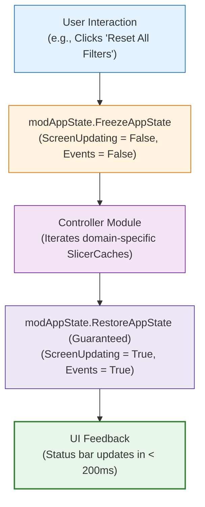

# 🤖 Advanced VBA for Dashboards

> [!abstract] Automation Engineering Mental Model
> Advanced VBA for Dashboards is the practice of applying **clean software engineering principles (modularity, error trapping, state encapsulation)** to automate user experience workflows, navigation, and administrative tasks without using macros to replace native Excel calculation strengths.

---

## 1. What is it?
Advanced VBA for Dashboards is the modular automation layer that manages the application shell. Rather than placing messy, recorded macros in a single worksheet code pane, it organizes code into specialized standard modules (`modAppState`, `modNavigation`, `modFilterController`, `modDataRefresh`, `modExportPDF`).



---

## 2. Why is it used?
Native Excel features have specific UX boundaries that require automation:
- **Multi-Slicer Clearing**: Clearing 5 slicers manually requires 5 separate user clicks; VBA accomplishes this in a single click.
- **Application Shell Navigation**: Hiding and revealing sheets smoothly while maintaining scroll alignment.
- **Automated Publishing**: Generating presentation-ready vector PDFs formatted for executive meetings.
- **Data Model Refresh Coordination**: Updating background connections, recalculating models, and logging exact completion timestamps.

---

## 3. How does it work?
1. **Separation of Concerns**: UI actions call controller procedures; controller procedures delegate to utility modules.
2. **Defensive Error Trapping**: Using `On Error GoTo ErrHandler` ensures that run-time errors never leave Excel in a frozen or broken state (`ScreenUpdating = False` permanently).
3. **Strict Variable Typing**: Enforcing `Option Explicit` prevents typographical bugs in variable names.

---

## 4. Syntax & Structure: The Universal Macro Template

```vba
Option Explicit

Public Sub ExecuteUserAction()
    On Error GoTo ErrHandler
    
    ' 1. Freeze application state to eliminate screen flicker
    FreezeAppState
    
    ' 2. Core Business / UI Logic
    ' ... do targeted work ...
    
    ' 3. Restore application state safely
    RestoreAppState
    Exit Sub

ErrHandler:
    ' 4. Guaranteed restoration even during failure
    RestoreAppState
    MsgBox "An error occurred: " & Err.Description, vbExclamation, "Macro Exception"
End Sub
```

---

## 5. Practical Example: Domain-Scoped Slicer Reset
In a multi-module workbook, a user clicking "Reset Filters" on the Call Center page should *only* clear Call Center slicers, not reset the Customer Retention view!
```vba
Public Sub ResetCallCenterFilters()
    FreezeAppState
    Dim sc As SlicerCache
    For Each sc In ThisWorkbook.SlicerCaches
        If InStr(1, sc.Name, "Agent", vbTextCompare) > 0 Or _
           InStr(1, sc.Name, "Topic", vbTextCompare) > 0 Then
            sc.ClearManualFilter
        End If
    Next sc
    RestoreAppState
End Sub
```

---

## 6. Common Mistakes
1. **Using `.Select` and `.Activate` Everywhere**: Slows execution down by $10\times$ and causes violent screen flashing.
2. **Unqualified `On Error Resume Next`**: Silently ignores critical errors, leaving broken formulas uncorrected.
3. **Using VBA for Simple Lookups**: Writing 100 lines of VBA to do what `XLOOKUP` or Power Pivot does in 1 millisecond.
4. **Saving Macro Code in `.xlsx`**: Strips the code upon save, permanently losing all automation.

---

## 7. When to use
- Application shell view switching and layout toggles.
- Coordinated multi-slicer cache clearing.
- Automated report generation and PDF distribution.
- Synchronous data refresh with UI timestamping.

---

## 8. When NOT to use
- Data cleaning (use Power Query instead).
- Business metric calculations (use Power Pivot DAX or dynamic formulas).
- Conditional formatting (use native rules).

---

## 9. Real-World Analytics Use Case: PwC Digital Transformation Suite
In the `PwC_Digital_Transformation_Suite.xlsm` application, the modular VBA suite (`modNavigation`, `modFilterController`, `modDataRefresh`, `modExportPDF`) provides the complete interactivity of a web application while consuming **less than 200 lines of clean, modular code**.

---

## 10. Related Concepts
- 🤖 [[VBA Architecture]]
- 🏗️ [[Excel Dashboard Architecture]]
- 🎛️ [[Interactive Excel Dashboards]]
- ⚡ [[Excel Performance Optimization]]
