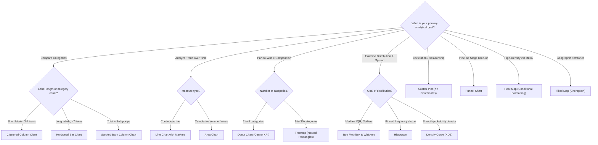

# Concept: Chart Selection Matrix

> [!abstract] Architectural Overview
> The Chart Selection Matrix is a formal analytical framework that maps business questions and statistical data types (Qualitative: Nominal vs. Ordinal; Quantitative: Continuous vs. Discrete) to the optimal visual encodings. By replacing guesswork with cognitive perception rules, it eliminates misleading charts, reduces cognitive load, and maximizes data clarity.

---



---

## The 10 Essential Architectural Questions

### 1. What is it?
The Chart Selection Matrix is a standardized decision-support tool that prescribes the mathematically and perceptually correct chart type based on the analytical objective (Comparison, Trend, Composition, Distribution, Relationship, Process, Intensity, Geographic) and the data types present.

### 2. Why is it used?
Choosing charts based on aesthetic novelty rather than analytical intent creates cognitive distortions. For example, using a line chart for nominal categories implies a false continuity, while using a 14-slice pie chart makes angle comparison impossible. The matrix ensures accuracy, cognitive speed, and visual integrity.

### 3. How does it work?
The matrix evaluates three inputs:
1. **The Core Analytical Question**: Are we comparing entities, tracking temporal trends, analyzing part-to-whole share, evaluating statistical spread, or testing correlation?
2. **Primary Data Type**: Qualitative (Nominal vs. Ordinal) or Quantitative (Continuous vs. Discrete).
3. **Data Cardinality**: Number of categories (2–4 vs. >7 items) or time horizons (discrete quarters vs. continuous daily timestamps).

### 4. Syntax & Decision Architecture
```
IF Goal = "Comparison" AND Labels = "Long"        --> Horizontal Bar Chart
IF Goal = "Trend"      AND Time = "Continuous"    --> Line Chart
IF Goal = "Part/Whole" AND Categories <= 4        --> Donut Chart
IF Goal = "Part/Whole" AND Categories > 5         --> Treemap
IF Goal = "Spread"     AND Multi-Group Comparison --> Box Plot
IF Goal = "Bivariate"  AND Variables = 2 Numeric  --> Scatter Plot (XY)
IF Goal = "Conversion" AND Stages = Sequential    --> Funnel Chart
IF Goal = "Spatial"    AND Key = Country/State    --> Filled Map
```

### 5. Practical Example in Excel
In the course project [`Hotel Reservation Analysis`](file:///d:/courses/Data%20Analysis%2026-27/7-Introducation%20to%20Data%20Fields%20(Excel)/09_Source_Materials/Module%206/4-%20Hotel%20Reservation%20Dashboard.xlsx):
- **Channel Performance**: `market_segment_type` is Nominal with long text names ("Online Travel Agency", "Offline Tour Operator"). $\rightarrow$ **Horizontal Bar Chart** sorted descending.
- **Seasonality**: `arrival_month` is continuous chronological time. $\rightarrow$ **Line Chart with Markers**.
- **Booking Status**: `booking_status` has 2 discrete categories summing to 100%. $\rightarrow$ **Donut Chart** with `32.8% Cancellation Rate` in the hollow center.
- **Lead Time Outliers**: `lead_time` is continuous numeric days. $\rightarrow$ **Box Plot** exposing that cancellations cluster above 90-day lead times.

### 6. Common Mistakes to Avoid
- **Line Charts on Nominal Data**: Plotting non-temporal categories on a line chart.
- **Truncating the Column Baseline**: Starting a vertical column chart at non-zero, exaggerating trivial variances.
- **The 3D Pie Chart Trap**: Distorting slice proportions via 3D perspective angles.
- **Overcrowded Legends**: Forcing viewers to decode 10 floating legend swatches instead of direct labeling.

### 7. When to Use
- Whenever designing a new executive dashboard or report tab.
- During exploratory data analysis (EDA) to expose distributions and correlations.
- In client or stakeholder presentations to ensure instant visual clarity.

### 8. When NOT to Use
- When raw tabular records or structured accounting schedules are legally or operationally mandated (e.g. general ledger auditing).
- When a single summary KPI number is sufficient (use a direct KPI scorecard instead of a full chart).

### 9. Real-World Analytics Use Case
In financial risk analysis, analysts frequently default to plotting portfolio losses as a simple column chart of averages. By consulting the Chart Selection Matrix, the team switches to a **Box Plot**, exposing extreme tail-risk outliers and negative skewness that were completely invisible when only evaluating the mean.

### 10. Related Concepts
- [[Dashboard Design Principles]]: The macro layout system housing selected charts.
- [[Pivot Tables]]: The aggregation engine that structures data into the exact format required for charting.
- [[Conditional Formatting]]: The mechanism for building in-cell heatmaps and data bars.
