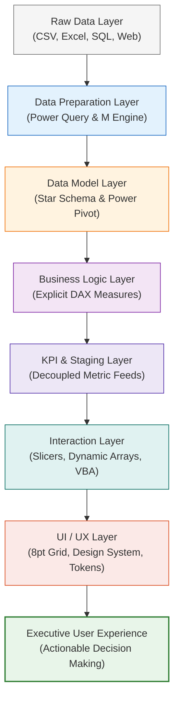

# 🗺️ Dashboard Design & Analytics Engineering MOC

> [!abstract] Map of Content (MOC)
> This Map of Content serves as the central knowledge hub for architecting **professional, UI/UX-oriented Excel analytics applications**. Rather than treating spreadsheets as passive grids of numbers and charts, this domain operationalizes the complete engineering pipeline from raw enterprise ingestion to executive web-application shell interfaces.

---

## 🏛️ The Analytics Application Pipeline

---

## 📚 Core Atomic Knowledge Concepts

| Concept Note | Core Focus & Theoretical Foundation | Key Techniques Covered |
| :--- | :--- | :--- |
| **[[Dashboard UI UX Principles]]** | Human-computer interaction (HCI), ergonomics, cognitive load | The decision loop, 8pt spatial grid, visual hierarchy |
| **[[Excel Dashboard Architecture]]** | Multi-tier application architecture inside Excel | Decoupled staging, web-app shell, container models |
| **[[KPI Design]]** | Metric governance and business definition standards | 11-field specification, explicit DAX vs implicit pivots |
| **[[Excel Visualization Principles]]** | Visual storytelling, cognitive ergonomics (Tufte, Few) | Question-to-visual framework, decluttering, chart selection |
| **[[Interactive Excel Dashboards]]** | Cross-filtering mechanics and interface controls | SlicerCaches, domain-scoped isolation, active breadcrumbs |
| **[[Dynamic Excel Techniques]]** | Modern calculation engines and resilient formatting | Dynamic arrays, LET/LAMBDA, CUBE formulas, custom masks |
| **[[Excel Performance Optimization]]** | Computational efficiency and memory management | VertiPaq compression, volatile function audit, calculation tree |
| **[[Advanced VBA for Dashboards]]** | Minimal, robust automation and view orchestration | `modAppState`, safe navigation, refresh coordination, PDF export |

---

## 💼 Flagship Implementation & Portfolio Assets

- 🏢 **PwC Digital Transformation Suite**:
  - 🏗️ [[Dashboard Architecture Assessment]] — Forensic audit of legacy workbooks & multi-dataset target architecture.
  - 📱 [[Dashboard UX Specification]] — Product design spec for Claire, David Chen, and Dr. Helena Weber.
  - 📖 [[KPI Dictionary]] — 38 explicit DAX measures across Call Center, Retention, and D&I.
  - 🎨 [[Dashboard Design System]] — PwC Corporate palette, typography scale, 8pt grid tokens.
  - 📐 [[Dashboard Wireframe]] — ASCII blueprints and exact grid coordinates for Portal and modules.
  - 📊 [[Dashboard Visualization Guide]] — Visual decision matrix and anti-pattern catalog.
  - 🤖 [[VBA Architecture]] — Modular production codebase (`modNavigation`, `modFilterController`, `modDataRefresh`).
  - ⚡ [[Excel Dashboard Performance]] — Memory benchmarks and the 7 golden performance rules.
  - ✅ [[Dashboard Testing Checklist]] — 32-point verification test suite.
  - 💼 [[Excel Dashboard Case Study]] — Master portfolio write-up for recruiters.

---

## 🔗 Related Curriculum Nodes
- 📊 [[Dashboard Design Principles]] — Foundations of executive dashboard ergonomics.
- 📐 [[Data Analysis Expressions (DAX)]] — The VertiPaq formula language.
- 🗄️ [[Dimensional Modeling]] — Fact and dimension table architectures.
- ⚡ [[Power Query]] — Automated repeatable ETL workflows.
