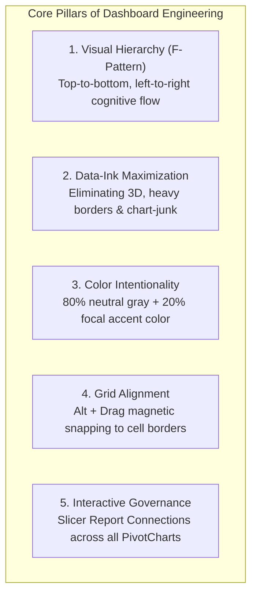

# Concept: Dashboard Design Principles

> [!abstract] Architectural Overview
> Executive dashboard design is the systematic arrangement of visual metrics, analytical charts, and interactive controls to facilitate fast, accurate, and low-cognitive-load business decision-making. Grounded in cognitive psychology, Gestalt visual perception, and Edward Tufte's data-ink principles, professional dashboards organize metrics into a 3-tier F-pattern hierarchy that answers executive inquiries within 5 seconds.

---

---

## The 10 Essential Architectural Questions

### 1. What is it?
Dashboard Design Principles are a cohesive set of cognitive, spatial, and aesthetic rules governing how business metrics, key performance indicators (KPIs), charts, and filters are assembled on a single digital screen in Microsoft Excel.

### 2. Why is it used?
Raw data tables and uncoordinated charts overwhelm executive decision-makers with **extraneous cognitive load**. Dashboard design principles ensure that senior stakeholders can evaluate corporate health, spot critical anomalies, and diagnose root causes without mental fatigue or misinterpretation.

### 3. How does it work?
Effective dashboards structure information through **progressive disclosure** across three structural tiers:
- **Tier 1 (North / Header)**: Strategic aggregate KPI scorecards (Total Bookings, Cancellation Rate, Net Revenue) that deliver immediate organizational pulse checks.
- **Tier 2 (Center / Mid)**: Core categorical comparisons and compositional splits (Bar charts, Donut charts, Treemaps) that answer *"Where is performance coming from?"*.
- **Tier 3 (South / Base)**: Temporal trends, seasonality lines, geographic maps, and granular operational drill-downs that answer *"How did this evolve over time, and where do we act?"*.

### 4. Layout Architecture & Anatomy
| Layout Tier | Section Scope | Visual Component & Example Data | Analytical Function |
| :--- | :--- | :--- | :--- |
| **Header Band** | Global Navigation | `Title: Hotel Performance` \| `Date Range: 2017–2018` \| `Slicers: Channel, Room Type` | Establishes organizational context and user interactivity controls |
| **Tier 1: North** | KPI Scorecard Cards | • **Total Revenue**: `$3,751,550` • **Total Bookings**: `36,275` • **Cancel Rate**: `32.8%` • **Average ADR**: `$103.42` • **Avg Lead Time**: `85.2 Days` | 5-second pulse check on aggregate organizational performance |
| **Tier 2: Mid** | Comparative & Compositional Views | • **Revenue by Channel**: `Horizontal Bar Chart` *(Online TA: 56.7%, Offline TO: 29.0%)* • **Booking Status Split**: `Donut Chart` *(Completed: 67.2%, Canceled: 32.8%)* | Explains operational drivers and volume contribution |
| **Tier 3: South** | Temporal Dynamics & Seasonality | • **Monthly Booking & Cancellation Dynamics**: `Dual-Series Line Chart` *(Q3 Summer peak: 4,400 bookings/mo; Winter trough: 1,800 bookings/mo)* | Exposes seasonality patterns and forward planning risks |

### 5. Practical Example in Excel
In the companion course workbook [`4- Hotel Reservation Dashboard.xlsx`](file:///d:/courses/Data%20Analysis%2026-27/7-Introducation%20to%20Data%20Fields%20(Excel)/09_Source_Materials/Module%206/4-%20Hotel%20Reservation%20Dashboard.xlsx):
1. **Canvas Setup**: Select entire sheet $\rightarrow$ fill with subtle cool off-white (`#F8FAFC`). Uncheck *Gridlines*, *Headings*, and *Formula Bar*.
2. **Card Creation**: Insert rounded rectangles with white fill (`#FFFFFF`), 1pt soft gray border (`#E2E8F0`).
3. **Magnetic Snapping**: Hold `Alt` while resizing charts so every component snaps perfectly to cell boundaries.
4. **Slicer Integration**: Right-click Slicer $\rightarrow$ *Report Connections* $\rightarrow$ link to all PivotTables.

### 6. Common Mistakes to Avoid
- **The "Fruit Salad" Palette**: Using 10 bright, unrelated colors across charts. (Fix: Restrict to 80% neutral slate gray `#64748B` and 20% brand accent `#0284C7`).
- **3D Chart-Junk**: Using 3D columns or exploded pie charts that distort visual proportionality.
- **Floating / Misaligned Objects**: Eyeballing chart positions instead of using `Alt + Drag` to snap to cell grids.
- **Scroll Fatigue**: Designing dashboards that require vertical or horizontal scrolling. An executive dashboard must fit comfortably on a standard 1080p display.
- **Detached Legends**: Forcing readers to look back and forth between a color legend and data bars. (Fix: Use direct labeling).

### 7. When to Use
- Executive quarterly and monthly operational reporting.
- High-level business intelligence presentations for C-suite leadership.
- Monitoring automated daily KPI trackers and performance scorecards.

### 8. When NOT to Use
- Granular data auditing or error debugging (use structured Excel Tables or Power Query for line-item inspection).
- Academic statistical research papers requiring deep tabular regression printouts.
- Ad-hoc one-time scratchpad calculations.

### 9. Real-World Analytics Use Case
In the **Hotel Reservation Analysis Project** (36,275 rows), the executive dashboard revealed that while total revenue was dominated by Online Travel Agencies (56.7%), the highest cancellation rates were driven by bookings with lead times exceeding 90 days (58% cancellation rate). By placing this correlation directly beneath the KPI cards, hotel revenue managers adjusted deposit policies within 48 hours.

### 10. Related Concepts
- [[Chart Selection Matrix]]: The decision engine determining which chart type belongs in each dashboard tier.
- [[Pivot Tables]]: The multi-dimensional calculation engine powering dashboard PivotCharts.
- [[Slicers and Timelines]]: The interactive visual filtering layer linking multiple dashboard views.
- [[Conditional Formatting]]: Creating in-cell heatmaps and micro-indicators.
