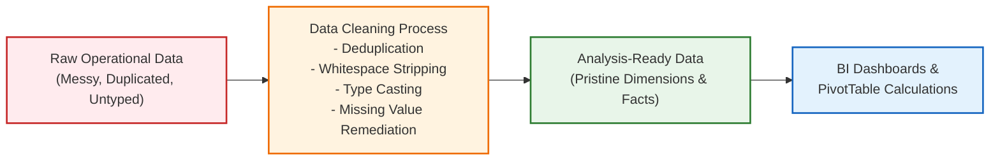
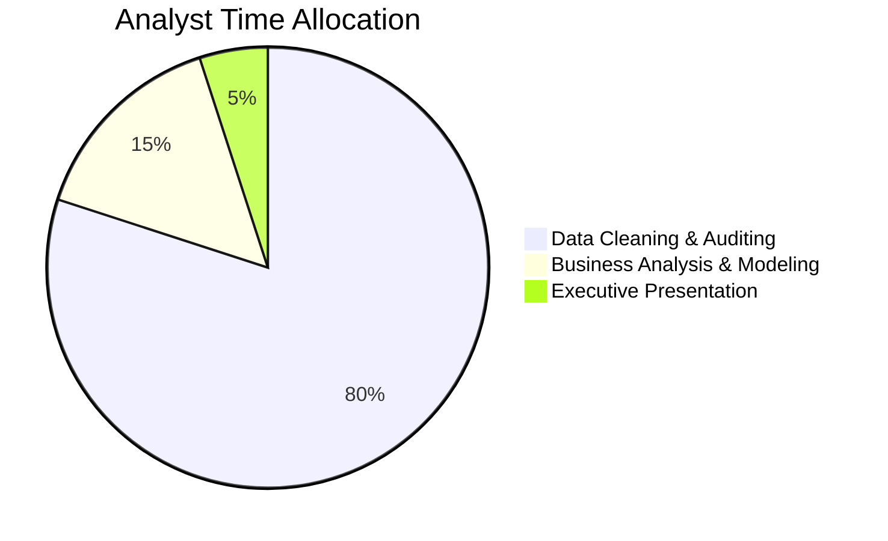
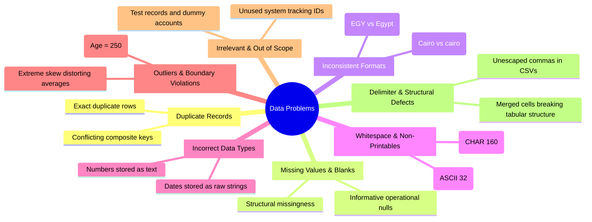
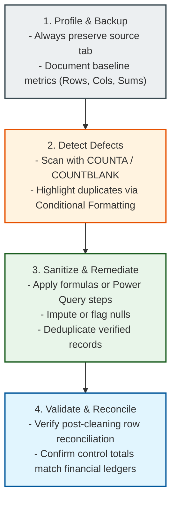

# Concept: Data Cleaning (Data Cleansing)

> [!summary] Definition & Mental Model
> **Data Cleaning** is the systematic, auditable process of identifying and remediating corrupt, inaccurate, incomplete, or irrelevant records from raw datasets prior to analysis. It is the defensive barrier that prevents the **Garbage In, Garbage Out (GIGO)** syndrome from poisoning dashboards, statistical models, and strategic executive decisions.

---

## 1. What Data Cleaning Means: Core Conceptual Framework

In the modern data analytics pipeline, data cleaning is the critical bridge between raw data ingestion and analytical modeling:

### Essential Distinctions: Cleaning vs Wrangling vs Validation
- **Data Cleaning**: Correcting defects, stripping noise, deduplicating records, repairing data types, and standardizing categorical naming.
- **Data Wrangling (Munging)**: Restructuring and reshaping clean data (unpivoting wide columns, pivoting tall rows, merging disparate tables via relational keys).
- **Data Validation**: Establishing defensive guardrails (Excel Data Validation rules, database schema constraints) to reject invalid entries at the moment of capture.

---

## 2. Why Data Cleaning Matters: The Impact of Dirty Data

Industry research (including IBM and Gartner studies) highlights that **data analysts spend up to 80% of their working time discovering, preparing, and cleaning messy data**.

### The Cost of Dirty Data
1. **Financial Loss**: IBM estimates poor data quality costs the US economy **$3.1 trillion annually**.
2. **Formula & Calculation Failures**: Numbers formatted as text cause Excel `=SUM()` and `=AVERAGE()` to return `0` or ignore cells silently.
3. **Broken Joins & Lookups**: Hidden trailing whitespace or non-breaking web spaces (`CHAR(160)`) cause `XLOOKUP` and `VLOOKUP` to throw `#N/A` errors.
4. **Distorted Aggregations**: Duplicate transactions overstate sales revenue, skew inventory re-order points, and artificially inflate sales representative bonuses.
5. **Loss of Stakeholder Trust**: If an executive catches a single glaring data contradiction on a dashboard, the entire credibility of the analytics department is destroyed.

---

## 3. The 8 Most Common Data Problems

---

## 4. The Excel Cleaning Arsenal

### A. Core Formula Suite
| Function | Formula Syntax | Operational Function |
| :--- | :--- | :--- |
| **Universal Sanitizer** | `=TRIM(CLEAN(SUBSTITUTE(A2, CHAR(160), " ")))` | Strips leading/trailing spaces, ASCII 0-31 non-printables, and HTML non-breaking spaces. |
| **Proper Case** | `=PROPER(TRIM(A2))` | Standardizes customer names and geographic categories. |
| **Double Unary** | `=--TRIM(A2)` or `=VALUE(TRIM(A2))` | Coerces numeric strings into true Excel floating-point numbers. |
| **Date Parser** | `=DATEVALUE(SUBSTITUTE(A2, ".", "/"))` | Converts text date strings into true Excel serial integers. |

### B. Interactive Power Tools
- **Go To Special Blanks (`F5` $\rightarrow$ Special $\rightarrow$ Blanks)**: Mass-populates thousands of scattered empty cells simultaneously via `Ctrl + Enter`.
- **Flash Fill (`Ctrl + E`)**: Fast pattern recognition to split, concatenate, and reformat text strings without formulas.
- **Text to Columns**: Splits delimited strings and repairs regional date formatting mismatches (`DMY` vs `MDY`).
- **Remove Duplicates**: High-speed deduplication across single primary keys or composite multi-column keys.
- **Data Validation**: Enforces strict in-cell validation rules (dropdown lists, numeric boundaries) to prevent dirty data entry.

---

## 5. The 4-Stage Cleaning Workflow

---

## Related Knowledge
- Lessons:
  - [[01_Data_Quality_Dimensions_and_Audit]]
  - [[02_Data_Cleaning_Techniques_in_Excel]]
  - [[03_Importing_Data_from_Enterprise_Sources]]
  - [[04_Business_Systems_for_Analysts]]
- Concepts:
  - [[Six Dimensions of Data Quality]]
  - [[ETL Process]]
  - [[Power Query]]
  - [[M Language]]
