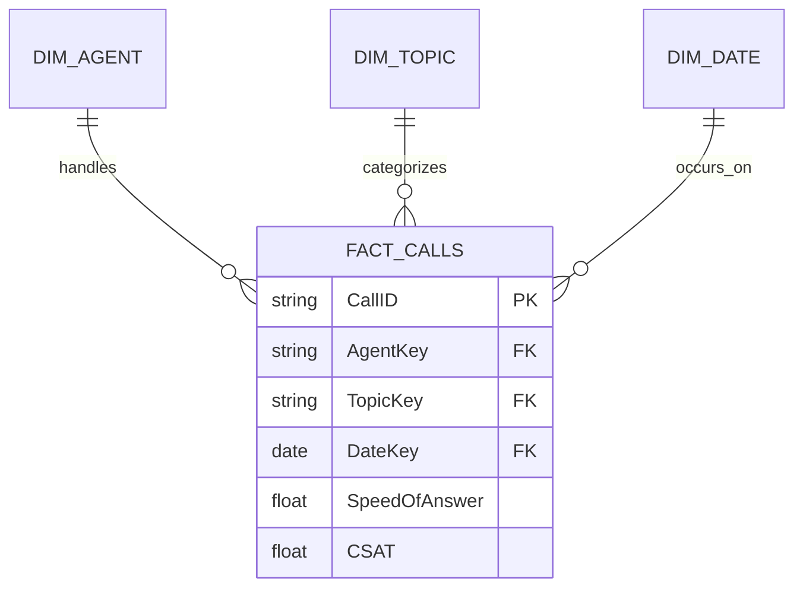

# Concept: Dimensional Modeling

> [!summary] Definition & Mental Model
> Dimensional Modeling (Ralph Kimball methodology) is an analytical database design technique that organizes data into numeric measurement tables (**Fact Tables**) surrounded by context-providing attribute tables (**Dimension Tables**).

## 1. What Is It?
The foundation of modern Business Intelligence. It rejects single flat tables in favor of structured schemas that optimize query performance, simplify report authoring, and eliminate data redundancy.

## 2. Core Building Blocks
- **Fact Table**: Contains quantitative metrics, transactions, and foreign keys (e.g. `Fact_Calls`: call ID, speed of answer, duration, rating).
- **Dimension Table**: Contains descriptive business attributes, hierarchies, and primary keys (e.g. `Dim_Agent`: name, department, tenure; `Dim_Topic`: category).

## 3. Related Concepts
- [[Star Schema vs Snowflake Schema]]
- [[Fact vs Dimension Tables]]
- [[Data Analysis Expressions (DAX)]]
