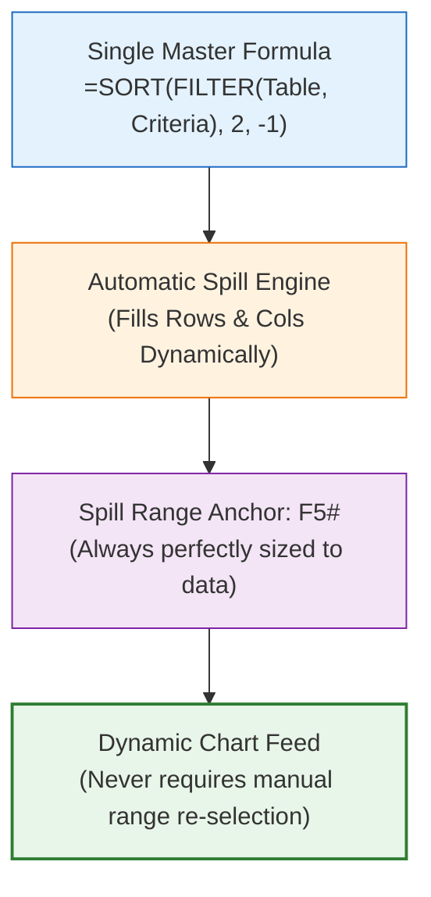

# ⚡ Dynamic Excel Techniques

> [!abstract] Modern Calculation Mental Model
> Modern Excel (Office 365 / Excel 2021+) provides a paradigm shift in spreadsheet calculation: **Dynamic Arrays, Spill Ranges (`#`), the `LET` formula optimizer, custom `LAMBDA` functions, and native CUBE expressions**. Mastering these techniques allows developers to build robust, automated dashboard engines with a fraction of the formula complexity of legacy workbooks.

---

## 1. What is it?
Dynamic Excel Techniques encompass the modern calculation capabilities introduced in Excel 365. Rather than writing a formula and dragging it down across 5,000 cells (risking formula truncation when new rows appear), dynamic arrays output multi-cell results automatically through a single formula cell.



---

## 2. Why is it used?
Legacy Excel workbooks relied on dangerous workarounds:
- **Array Formulas with `Ctrl+Shift+Enter` (CSE)**: Fragile and easily broken by end users.
- **`OFFSET` & `INDIRECT` for Dynamic Ranges**: Volatile functions that cause workbook calculation lag.
- **Copy-Pasting Formulas Down Columns**: Fails silently when new transactions exceed the formula range.

---

## 3. How does it work?
1. **Dynamic Arrays (`FILTER`, `SORT`, `UNIQUE`, `SEQUENCE`)**: Evaluate multi-cell outputs that "spill" into neighboring empty cells.
2. **The Spill Operator (`#`)**: Referencing `F5#` points to the entire dynamic range, expanding or contracting automatically as data changes.
3. **`LET` Function**: Declares intermediate local variables within a formula, preventing duplicate calculations and drastically speeding up execution.
4. **CUBE Functions (`CUBEVALUE`, `CUBEMEMBER`)**: Direct cell-level interrogation of the Power Pivot Data Model without requiring PivotTables!

---

## 4. Syntax & Structure: The `LET` Optimization Formula

```excel
=LET(
    Total,     COUNTA(Fact_Calls[Call Id]),
    Abandoned, COUNTIF(Fact_Calls[Answered (Y/N)], "N"),
    Rate,      Abandoned / Total,
    IF(Rate > 0.15, "⚠️ SLA Breach: " & TEXT(Rate, "0.0%"), "✅ Normal: " & TEXT(Rate, "0.0%"))
)
```
*Why this is superior*: `Total` and `Abandoned` are computed exactly once in memory, rather than being recalculated multiple times within nested `IF` branches.

---

## 5. Practical Example: Automated Top 5 Inquiry Topics
Instead of hardcoding 5 rows, use dynamic arrays:
```excel
=TAKE(SORT(CHOOSECOLS(FILTER(Stage_Topics, Stage_Topics[Calls] > 0), 1, 2), 2, -1), 5)
```
This formula filters active topics, extracts the name and count columns, sorts descending by volume, and takes the top 5. If topic rankings change tomorrow, the dashboard updates automatically!

---

## 6. Common Mistakes
1. **The `#SPILL!` Error**: Placing text or numbers in the path where the dynamic array wants to expand.
2. **Using Dynamic Arrays for Millions of Cells**: Large dynamic arrays spanning 100k+ cells can consume substantial memory; prefer Power Pivot for massive aggregations.
3. **Compatibility Blindness**: Using modern functions (`CHOOSEROWS`, `TAKE`) in workbooks that must be opened in Excel 2016 or 2019.

---

## 7. When to use
- Modern dashboards running on Excel 365 or Excel for the Web.
- Automated rankings, dynamic chart feeds, and complex metric calculations.

---

## 8. When NOT to use
- Environments running legacy Excel (Excel 2010–2019 without dynamic array support).

---

## 9. Real-World Analytics Use Case: PwC Agent Performance Scorecard
In the Call Center console, using `LET` and dynamic arrays allowed us to calculate the **Agent Efficiency Index** across all 8 agents in a single cell, dynamically ranking agents by volume, handle time, and CSAT without manual sorting.

---

## 10. Related Concepts
- 🏗️ [[Excel Dashboard Architecture]]
- ⚡ [[Excel Performance Optimization]]
- 🗄️ [[Structured References]]
- 📖 [[Data Analysis Expressions (DAX)]]
