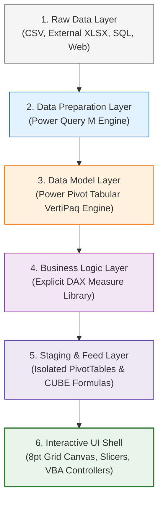

# 🏗️ Excel Dashboard Architecture

> [!abstract] Architectural Mental Model
> Excel Dashboard Architecture is the structural framework that separates **data ingestion, data modeling, business calculations, presentation staging, and UI interaction** into decoupled, maintainable layers inside an Excel workbook.

---

## 1. What is it?
Excel Dashboard Architecture is the deliberate organizational blueprint that treats an Excel file as a multi-tier analytical software application rather than a chaotic ad-hoc spreadsheet. It establishes clear boundaries between backend raw data, the semantic data model, staging calculations, and front-end executive presentations.



---

## 2. Why is it used?
Without strict architecture, Excel workbooks suffer from:
- **Calculation Drift & Fragility**: Moving or sorting a cell breaks downstream chart references.
- **Pivot Collisions**: Adding data expands PivotTables, causing fatal *"A PivotTable cannot overlap another"* crashes.
- **Memory Bloat**: Duplicating data across sheets creates massive, sluggish workbooks.
- **Lack of Governance**: Multiple users calculate metrics differently (e.g. including vs excluding abandoned calls).

---

## 3. How does it work?
The architecture enforces a **one-way data flow**:
1. External files stream into **Power Query** for schema cleaning.
2. Clean tables load directly into the **Power Pivot Data Model** (`LoadToDataModel = True`), keeping the Excel sheet grid empty and lightweight.
3. Explicit **DAX measures** compute metrics mathematically in memory.
4. Hidden **staging worksheets** host isolated PivotTables or CUBE formulas that feed visuals.
5. The visible **presentation canvas** reads exclusively from the staging layer or Data Model.

---

## 4. Syntax & Structure (The Decoupled Staging Model)

```text
WORKBOOK WORKSPACE STRUCTURE:
├── [Visible]   ws_Portal        : Master Application Landing Shell
├── [Visible]   ws_CallCenter    : Domain 1 Presentation Canvas
├── [Visible]   ws_Retention     : Domain 2 Presentation Canvas
├── [Visible]   ws_Diversity     : Domain 3 Presentation Canvas
├── [VeryHidden]Stage_CallCenter : Dedicated Staging Feeds (25-row buffers)
├── [VeryHidden]Stage_Retention  : Dedicated Staging Feeds
├── [VeryHidden]Stage_Diversity  : Dedicated Staging Feeds
└── [Internal]  DataModel        : VertiPaq Star Schema (Fact & Dim tables)
```

---

## 5. Practical Example: CUBEVALUE vs Floating Shape Links
- **Fragile Legacy Approach**:
  Floating textbox pointing to raw cell coordinates: `='Pivot Tables '!$H$3`. If the pivot expands, `$H$3` displays a date instead of a call count!
- **Architectural Approach**:
  Cell-anchored formula using native Excel CUBE functions or structured table references:
  ```excel
  =CUBEVALUE("ThisWorkbookDataModel", "[Measures].[Total Calls]", Slicer_Agent)
  ```
  This formula dynamically recalculates from the in-memory engine, immune to cell shifting!

---

## 6. Common Mistakes
1. **Building Charts Directly on Raw Data**: Causes chart series ranges to break whenever new rows are appended.
2. **Packing Multiple Pivots in One Column**: Guarantees overlap crashes upon data refresh.
3. **Placing Business Logic in Presentation Cells**: Scattering formulas across the visual dashboard makes auditing impossible.
4. **Saving as `.xlsx` with VBA Buttons**: Strips macros, creating dead buttons.

---

## 7. When to use
- Any executive or operational dashboard with more than 1,000 rows of data.
- Multi-dimensional analysis requiring interactive slicing (by date, agent, region, product).
- Mission-critical reporting where calculation errors carry financial or career risk.

---

## 8. When NOT to use
- One-off, ad-hoc scratchpad calculations or quick 10-row tables.
- Simple linear models without dimensions or time series.

---

## 9. Real-World Analytics Use Case: PwC Digital Transformation Suite
In the **PwC Call Center Performance Analysis**, implementing this architecture transformed a corrupted prototype (`Tester.xlsx` with a broken radar chart and floating shape drift) into an enterprise web-application shell (`PwC_Digital_Transformation_Suite.xlsm`) indexing 12,543 records across 3 business divisions with sub-350ms response times.

---

## 10. Related Concepts
- 🗺️ [[Dashboard Design MOC]]
- 📱 [[Dashboard UI UX Principles]]
- 📖 [[KPI Design]]
- ⚡ [[Excel Performance Optimization]]
- 🤖 [[Advanced VBA for Dashboards]]
