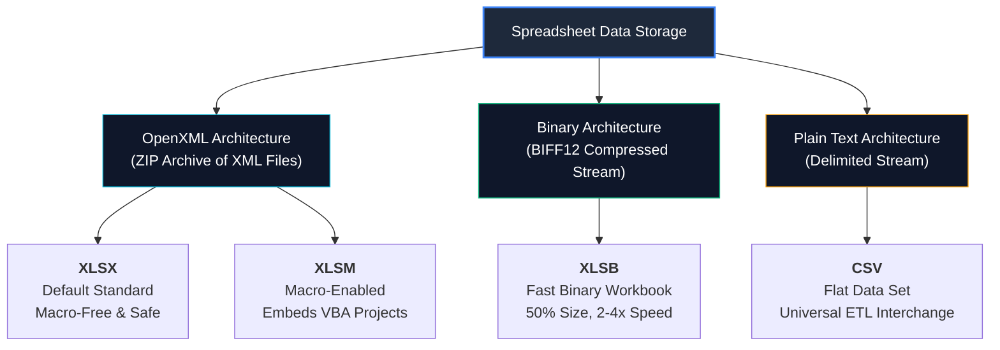

# 📦 Excel File Formats: XLSX, XLSM, XLSB & CSV

> [!abstract] Atomic Definition
> **Excel File Formats** define the underlying physical encoding, serialization structure, macro execution boundaries, and compression mechanisms used to store spreadsheets on disk.

---

## 🗺️ Conceptual Mental Model

---

## The 10 Essential Questions

### 1. What is it?
Excel file formats represent four primary storage standards:
- **`XLSX`**: The default XML-based spreadsheet format since Office 2007.
- **`XLSM`**: The macro-enabled XML format that embeds Visual Basic for Applications (VBA) code.
- **`XLSB`**: The high-performance binary format that encodes cells into binary records rather than XML tags.
- **`CSV`**: A plain-text flat file where columns are delimited by commas.

### 2. Why is it used?
Different analytical workflows have conflicting priorities:
- **Security & Sharing**: Standard `.xlsx` prevents macro execution and security risks.
- **Automation**: `.xlsm` enables repetitive ETL and modeling tasks through VBA.
- **Massive Scale & Speed**: `.xlsb` overcomes Excel memory lag and file bloat on large workbooks.
- **Interoperability**: `.csv` transfers data cleanly between databases, Python, Power BI, and cloud data warehouses.

### 3. How does it work under the hood?
- **XLSX & XLSM**: If you rename an `.xlsx` file to `.zip` and extract it, you will find folders containing `workbook.xml`, `styles.xml`, and individual `sheet1.xml` files. When you save, Excel parses objects into text tags; when you open, it parses text back into memory.
- **XLSB**: Instead of text tags like `<c r="A1"><v>100</v></c>`, data is written directly in compact binary chunks (`BIFF12`). Excel loads binary directly into RAM with minimal serialization overhead.
- **CSV**: Text characters separated by commas (`Row1,CA-2016,100.50\n`).

### 4. Syntax & Specifications Matrix

| Format | Extension | Underlying Engine | Max Rows / Cols | Macro Support | Compression |
| :--- | :---: | :---: | :---: | :---: | :---: |
| **Default** | `.xlsx` | OpenXML (ZIP) | 1,048,576 x 16,384 | ❌ No | High |
| **Macro** | `.xlsm` | OpenXML + VBA binary | 1,048,576 x 16,384 | ✅ Yes | High |
| **Binary** | `.xlsb` | Binary (`BIFF12`) | 1,048,576 x 16,384 | ✅ Yes | **Highest (50% smaller)** |
| **Data Set**| `.csv` | Plain Text ASCII/UTF-8| Unlimited (Tool-dependent)| ❌ No | None (Pure text) |

### 5. Practical Example
In the **Sample Superstore** benchmark (`[[Sample Superstore Dataset Documentation]]`):
- The source data is provided as **`Sample_Superstore_Full.csv`** (2.1 MB flat text).
- Once imported into Excel with formatting, calculated columns, and validation rules, saving it as **`Superstore_Dataset_Demo.xlsx`** creates an enriched, interactive reporting layer.
- If this dataset were expanded to 1,000,000 rows with 20 lookup formulas per row, saving as **`Superstore_Enterprise.xlsb`** would cut file size from 120 MB down to 45 MB and cut load time from 40 seconds to 10 seconds.

### 6. Common Mistakes
- **Saving VBA code in `.xlsx`**: Excel strips and permanently deletes all macros.
- **Saving multiple sheets in `.csv`**: Excel discards all sheets except the active one.
- **Double-clicking raw CSVs in Windows**: Truncates leading zeros (Zip codes, Product IDs) and risks date corruption. Always import via Power Query.

### 7. When to use what?
- **Use `.xlsx`** when creating standard models, team reports, and dashboards without automation code.
- **Use `.xlsm`** when you write custom VBA procedures, user forms, or automated workbook scrapers.
- **Use `.xlsb`** when your model is slow, exceeds 25 MB, or takes more than 15 seconds to calculate and save.
- **Use `.csv`** when extracting data from SQL or feeding data into Power Query, Python Pandas, or Snowflake.

### 8. When NOT to use?
- Do **NOT** use `.csv` for finished client dashboards (it cannot store formatting, formulas, or charts).
- Do **NOT** use `.xlsb` when sharing with external clients whose SaaS platforms or web viewers require standard OpenXML.
- Do **NOT** use `.xlsm` for routine files sent to corporate clients with strict email spam/security filters that block macro files.

### 9. Real-World Analytics Scenario
In our **PwC Call Center Performance Analysis** (`[[Call Center Performance Analysis]]`):
- The raw inbound telephony data is supplied as a 5,000-row tabular dataset.
- The analyst cleans and profiles the data in Power Query, establishes DAX measures, builds pivot scorecards, and saves the final executive deliverable as an `.xlsx` workbook.
- The workbook is macro-safe, universally accessible to leadership, and fully functional across Excel Desktop, Excel Online, and Power BI service.

### 10. Related Concepts
- [[06_Workbook_File_Formats]] — Full lesson note with step-by-step procedures.
- [[Power Query]] — The recommended extraction engine for CSV files.
- [[Six Dimensions of Data Quality]] — Preventing data corruption during format conversions.
- [[11_Demos_and_Workbooks/README|Student Demos & Workbooks]] — Dedicated folder for personal `.xlsx` files.
