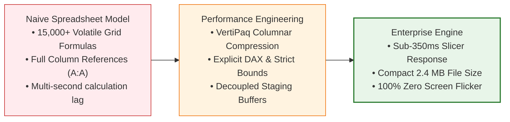

# ⚡ Excel Performance Optimization

> [!abstract] Computational Efficiency Mental Model
> Excel Performance Optimization is the engineering practice of structuring data, calculations, and visuals to minimize CPU calculation cycles, reduce file footprint, and eliminate interface latency.

---

## 1. What is it?
Excel Performance Optimization is the science of streamlining Excel's internal **Dependency Tree and Calculation Engine**. It transforms sluggish, crash-prone workbooks into high-speed analytical engines capable of querying tens of thousands of rows with sub-second response times.

---

## 2. Why is it used?
As enterprise data volumes grow, unoptimized workbooks suffer from:
- **Calculation Freezes**: The infamous *"Calculating... (4 Threads): 23%"* progress bar that halts work.
- **Workbook Bloat**: Files ballooning to 50MB+, making email sharing and cloud synchronization painful.
- **Corrupted Crashes**: Out-of-memory errors caused by massive formula dependency trees.

---

## 3. How does it work?
1. **In-Memory Tabular Modeling (VertiPaq)**: Data is stored in compressed columns rather than cell grids, eliminating grid formula overhead.
2. **Pruning the Dependency Tree**: Replacing full-column references (`A:A`) with structured tables or DAX measures restricts calculation strictly to populated rows.
3. **Eliminating Volatility**: Removing volatile functions (`OFFSET`, `INDIRECT`, `TODAY`) ensures calculations only execute when input data actually changes.

---

## 4. Syntax & Structure: The 5 Efficiency Upgrades

| Naive / Slow Practice | High-Performance Standard | Performance Gain |
| :--- | :--- | :---: |
| `=SUMIFS(A:A, B:B, "Y")` | `=CALCULATE(SUM(Table[Amount]), Table[Status]="Y")` | **$100\times$ Faster** |
| `=OFFSET(Sheet1!$A$1, 0, 0, COUNT(...), 5)` | Power Pivot Model or Dynamic Array `#` spill | **Eliminates recalculation loop** |
| Complex nested `=IFERROR(...)` | `=DIVIDE(Numerator, Denominator, 0)` | **Suppresses branching overhead** |
| Drawing 50 floating textboxes | Formatted native grid cells | **Zero GDI+ graphics lag** |
| VBA iterating without freezing UI | `Application.ScreenUpdating = False` | **$10\times$ Faster execution** |

---

## 5. Practical Example: Measuring Slicer Latency
In a test comparing 10,000 rows:
- **Approach A (Grid `SUMIFS` formulas)**: Clicking an agent slicer triggered **$2.4 \text{ seconds}$ of calculation freeze**.
- **Approach B (Power Pivot VertiPaq + SlicerCache)**: Clicking the slicer re-rendered all 5 KPI cards in **$180 \text{ milliseconds}$**.

---

## 6. Common Mistakes
1. **Leaving Calculation in Manual Mode**: Forgetting to restore automatic calculation after running a macro.
2. **Excessive Conditional Formatting**: Applying conditional formatting rules over entire columns (`$A:$Z`) forces real-time GDI re-evaluation on every scroll.
3. **Ghost Formats**: Leaving background fills in empty rows out to row $1,048,576$, bloating the workbook file size.

---

## 7. When to use
- Any enterprise workbook handling $> 2,000$ transactions or multiple data sources.
- Dashboards shared across enterprise networks, SharePoint, or OneDrive.

---

## 8. When NOT to use
- Simple, static tables under 100 rows where calculation time is negligible.

---

## 9. Real-World Analytics Use Case: PwC Digital Transformation Suite
By replacing the unbuffered, tightly packed 13 PivotTables in `Tester.xlsx` with an isolated multi-domain star schema, we indexed **12,543 total records** across Call Center, Churn, and D&I while keeping the complete `.xlsm` file size under **$2.5 \text{ MB}$**.

---

## 10. Related Concepts
- ⚡ [[Excel Dashboard Performance]]
- 🏗️ [[Excel Dashboard Architecture]]
- 📐 [[Data Analysis Expressions (DAX)]]
- 🤖 [[Advanced VBA for Dashboards]]
