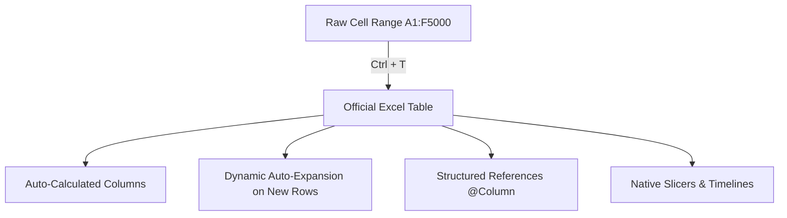

# Concept: Excel Tables (ListObjects)

> [!summary] Definition & Mental Model
> An Excel Table is a formal, self-expanding database-like container (`ListObject`) within a worksheet that treats rows as records and columns as structured attributes, automatically managing calculation propagation, formatting, and dynamic references.

## 1. What Is It?
An official object in Excel created via `Ctrl + T` that converts an unorganized, static coordinate grid range into a structured tabular entity with named fields, automatic range expansion, and native integration with Pivot Tables and Slicers.

## 2. Why Is It Used? (Problem It Solves)
In traditional cell ranges (`A2:D50`), adding new rows requires manually re-dragging formulas, updating chart source ranges, and modifying Pivot Table data sources. Tables eliminate this manual overhead by dynamically expanding to encompass appended records.

## 3. How Does It Work?
Excel maintains an internal XML definition of the table bounds. When data is typed into the immediately adjacent bottom row or right column, the table engine automatically incorporates the new cells, styles them, and applies existing column formulas.



## 4. Syntax & Structure
- Table Name: Defined in `Table Design > Table Name` (e.g., `CallCenterData`).
- Column References: `CallCenterData[Agent]`.
- Current Row Reference: `[@Topic]`.

## 5. Practical Example
In the PwC Call Center project:
Converting the 5,000-row raw sheet into table `CallData` allows instant calculation of response duration in minutes:
```excel
=[@[Speed of answer in seconds]] / 60
```
This formula immediately populates down all 5,000 rows automatically.

## 6. Common Mistakes & Misconceptions
> [!caution] Gotchas
> - **Leaving Default Names**: Leaving tables named `Table1`, `Table2` degrades readability. Always rename tables meaningfully.
> - **Spaces in Headers**: While allowed, clean headers without spaces or special symbols make downstream Power Query and DAX modeling much cleaner.

## 7. When to Use
- Whenever storing raw transactional or master dimensional data.
- As the feeding source for Pivot Tables, Slicers, and Power Query queries.

## 8. When NOT to Use
- Final formatted printable summary reports or executive dashboard display tabs.
- Scenarios requiring legacy shared workbook features or multi-cell array merges.

## 9. Real-World Analytics Use Case
Enterprise sales operations ingest weekly raw CSV extracts into an Excel Table. Because the summary dashboard references `SalesTable[Revenue]`, the KPI cards update dynamically upon paste without formula maintenance.

## 10. Related Concepts
- [[Structured References]]
- [[Pivot Tables]]
- [[Slicers and Timelines]]
