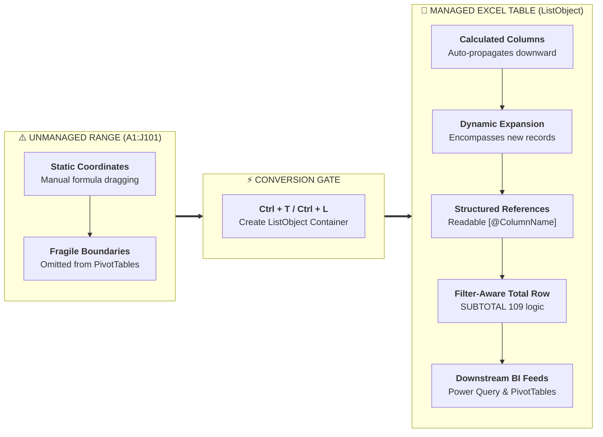

# Concept: Excel Tables (ListObjects)

> [!summary] Definition & Mental Model
> An **Excel Table** is a formal, self-expanding database-like container (`ListObject`) within a worksheet that treats rows as records and columns as structured fields, automatically managing formula propagation (calculated columns), formatting retention, and dynamic references for downstream Pivot Tables and Power Query ETL pipelines.

---

## 1. What Is It?
An official object in Excel created via **`Ctrl + T`** (or **`Ctrl + L`**) that converts an unorganized, static coordinate grid range into a managed tabular entity with named fields, automatic range expansion, and native integration with Pivot Tables and Slicers.

As demonstrated in `11_Demos_and_Workbooks/04_Tables/Module_4_Demo.xlsx` on the sheet **`table VS range `**, Excel explicitly contrasts:
- A standard coordinate range (`C6:E12`)
- An official table container (`Table2`, `G6:J12` styled with `TableStyleLight9`)

---

## 2. Why Is It Used? (The Problem It Solves)
In traditional cell ranges (`A2:D50`):
1. **Formula Dragging**: Adding new rows requires manually re-dragging formulas (`Ctrl + D`), risking calculation gaps.
2. **Broken Reports**: Appended records are omitted from downstream Pivot Tables unless the user manually opens "Change Data Source".
3. **Cryptic Formulas**: Formulas rely on abstract cell coordinates (`=E2*F2`) rather than meaningful business metrics.

Excel Tables eliminate this manual maintenance by dynamically expanding to encompass newly typed or pasted records.

---

## 3. How Does It Work?
Excel maintains an internal XML definition of the table bounds. When data is typed into the immediately adjacent bottom row or right column, the table engine automatically incorporates the new cells, styles them, and applies existing column formulas.



---

## 4. Syntax & Structure
- **Table Name**: Defined in `Table Design > Table Name` (e.g., `SalesTable`, `InventoryTable`).
- **Column Data Reference**: `SalesTable[UnitPrice]`.
- **Current Row Reference**: `[@Quantity]`.
- **Total Row Reference**: `InventoryTable[[#Totals], [CurrentStock]]`.

---

## 5. Practical Example from `Module_4_Demo.xlsx`

### Example A: Sales Operations (`Sales_Data`)
In `Module_4_Demo.xlsx`, converting the 101-row sales transactions into table `SalesTable`:
```excel
=[@Quantity] * [@UnitPrice]
```
Entering this formula into the `TotalPrice` column automatically evaluates down all 101 rows without a single drag operation.

### Example B: Inventory Valuation (`Product_Inventory`)
In `InventoryTable`:
```excel
=[@CurrentStock] * [@CostPerUnit]
```
Enabling the Total Row (`Ctrl + Shift + T`) instantly calculates the total warehouse valuation:
```excel
=SUBTOTAL(109, InventoryTable[InventoryValue])
```

---

## 6. Common Mistakes & Misconceptions

> [!caution] Top Table Gotchas
> 1. **Leaving Default Names (`Table1`, `Table2`)**: Degrades model readability. Always rename tables immediately on the **Table Design** tab.
> 2. **Converting Data with Trailing Blank Rows**: As seen in `Sales_Data` row 102 (which had orphan text `  Mohamed El-Sayed  `), blank or corrupt trailing rows expand the table unnecessarily. Always clean data before pressing `Ctrl + T`.
> 3. **Using `SUM` Instead of `SUBTOTAL` in Total Row**: Standard `SUM()` adds hidden rows when filtered. Excel Tables use `=SUBTOTAL(109, ...)` to ensure filtered summaries stay accurate.
> 4. **Trying to Merge Cells**: Excel Tables strictly forbid merged cells within the table boundary to preserve database record integrity.

---

## 7. When to Use
- Whenever storing raw transactional logs (orders, calls, inventory, employees).
- As the feeding source for Pivot Tables, Slicers, and Power Query queries.
- When creating structured calculation models requiring uniform column formulas.

---

## 8. When NOT to Use
- Final formatted printable summary reports or executive dashboard display tabs.
- Multi-cell merged presentation scorecards.
- Dynamic array formulas that spill across multiple columns/rows (e.g., `#SPILL!` occurs if a spill formula is placed inside a table).

---

## 9. Real-World Analytics Use Case
Enterprise sales operations ingest weekly raw CSV extracts into an Excel Table (`SalesTable`). Because the executive Pivot Table (`Sheet1`) references `SalesTable` rather than a static coordinate range, hitting `Alt + F5` (Refresh) instantly captures all new records without formula or range maintenance.

---

## 10. Related Concepts & Vault Links
- **Concepts**: [[Structured References]], [[Pivot Tables]], [[Slicers and Timelines]], [[Calculated Columns vs DAX Measures]], [[Power Query]]
- **Lessons**: [[01_Excel_Tables_Architecture]], [[02_Structured_References]], [[03_Table_Features_and_Best_Practices]]
- **Formulas**: [[SUBTOTAL]], [[XLOOKUP]], [[SUMIFS]]
- **Practice**: [[Ex03_Excel_Tables_and_Structured_References]]
- 📂 **Personal Workbook Demo**: [`11_Demos_and_Workbooks/04_Tables/Module_4_Demo.xlsx`](file:///d:/courses/Data%20Analysis%2026-27/7-Introducation%20to%20Data%20Fields%20%28Excel%29/11_Demos_and_Workbooks/04_Tables/Module_4_Demo.xlsx)
