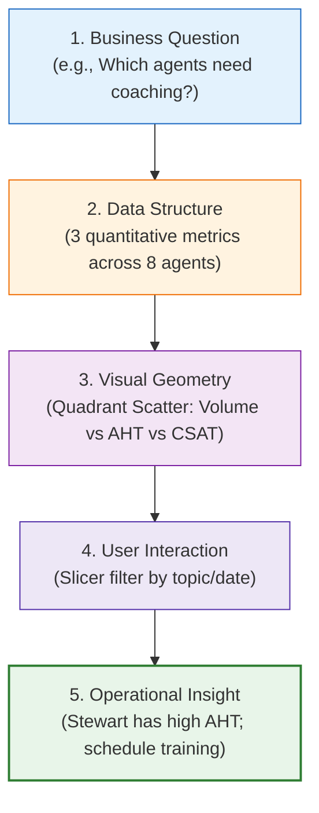

# 📊 Excel Visualization Principles

> [!abstract] Visual Decision Framework
> Excel Visualization Principles dictate that **visual geometry must be an exact mathematical mapping of the underlying analytical question**. Charts are analytical tools designed to expose patterns, trends, correlations, and anomalies—not decorative illustrations.

---

## 1. What is it?
Excel Visualization Principles are the disciplined visual guidelines (grounded in Edward Tufte's data-ink ratio and Stephen Few's perceptual ergonomics) applied to chart design in Microsoft Excel. It mandates that every chart component must justify its existence by conveying essential data.



---

## 2. Why is it used?
Unprincipled Excel chart design leads to:
- **Misleading Scales**: Truncated axes or secondary axes with crossing slopes that deceive viewers.
- **Chart Junk**: Heavy gridlines, 3D shadows, and dark backgrounds that obscure the data points.
- **Inappropriate Geometries**: Using radar charts for binary metrics, or pie charts for 15 categories.

---

## 3. How does it work?
The **Visual Selection Hierarchy**:
1. **Time-Series / Trends**: Use Line charts or Area charts (X-axis continuous chronological).
2. **Categorical Comparison**: Use Horizontal Bar charts (for long text labels) or Vertical Column charts.
3. **Proportions / Parts-of-a-Whole**: Use 100% Stacked Bar or minimalist Donut with center KPI value (limit to $\le 3$ slices).
4. **Correlation / Multi-Metric**: Use Scatter plots or Bubble charts.
5. **Distribution**: Use Histograms or Box plots.

---

## 4. Syntax & Structure: The Decluttering Audit Checklist

```text
DECLUTTERING AUDIT:
[✓] Eliminate 3D shapes, bevels, and cylinder geometries
[✓] Suppress heavy black axis borders and gridlines (use subtle #F1F5F9 lines)
[✓] Remove redundant legends if chart has direct data labels
[✓] Orient category labels horizontally (never angled at 45° or 90°)
[✓] Format numbers directly ($139k, not $139130.8523)
[✓] Use focus colors (gray for context, brand accent for highlight)
```

---

## 5. Practical Example: Replacing the Broken Radar Chart
- **The Defect in `Tester.xlsx`**: An Excel Radar chart attempted to display "Resolved vs Not Resolved" (binary 2-state variable). Radar charts require multiple continuous axes. The chart failed to render and threw *"This chart isn't available in your version of Excel"*.
- **The Solution**: An **Executive Donut Gauge** with a center-embedded callout: `89.9% Resolved (Answered Calls)`. Crisp, mathematically sound, and immediately interpretable.

---

## 6. Common Mistakes
1. **Using Dual-Axis Charts Without Shared Context**: Causes viewers to compare slopes that have different units.
2. **Alphabetical Sorting of Bars**: Bars should almost always be sorted by value (descending), not alphabetically, so the viewer instantly sees top and bottom performers.
3. **Omitting Units of Measure**: Displaying `67.5` instead of `67.5s` or `67.5 seconds`.

---

## 7. When to use
- Whenever designing analytical charts, scorecards, or executive presentations in Excel.

---

## 8. When NOT to use
- Raw data staging or database administrative tables where raw tabular records are required.

---

## 9. Real-World Analytics Use Case: PwC Customer Retention
In analyzing customer churn across contract horizons, a **100% Stacked Bar Chart** instantly exposed that **$42.7\%$ of Month-to-Month subscribers churn**, compared to just **$2.8\%$ of Two-Year contract subscribers**, driving immediate strategy alignment around multi-year incentive contracts.

---

## 10. Related Concepts
- 📱 [[Dashboard UI UX Principles]]
- 📊 [[Chart Selection Matrix]]
- 🎨 [[Dashboard Design System]]
- 📊 [[Dashboard Visualization Guide]]
