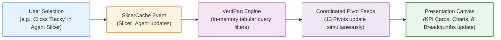

# 🎛️ Interactive Excel Dashboards

> [!abstract] Architectural Mental Model
> Interactive Excel Dashboards transform static reporting sheets into **responsive analytical software**. Through coordinated Slicers, Timelines, Form Controls, and VBA event handling, users can interrogate multi-dimensional data models, isolate anomalies, and drill into granular details in real time.

---

## 1. What is it?
Interactive Excel Dashboards are workbooks engineered with interactive interface controls that dynamically modify the calculation context of PivotTables, dynamic arrays, and charts without requiring manual formula adjustments or table filtering.



---

## 2. Why is it used?
- **Self-Service Analytics**: Eliminates the need for analysts to generate 50 separate reports for different managers; one dashboard satisfies all filtering needs.
- **Hypothesis Testing**: Allows business leaders to test questions in seconds (e.g., *"What is churn specifically for month-to-month fiber customers using electronic checks?"*).
- **Reduced Cognitive Burden**: Slicers visually indicate active filters, eliminating the risk of viewing filtered data while believing it to be the global total.

---

## 3. How does it work?
1. **SlicerCaches**: When a Slicer is added, Excel creates an underlying `SlicerCache` object in the workbook.
2. **Multi-Pivot Binding**: Multiple PivotTables are connected to the same `SlicerCache` via PivotTable Connections (`Report Connections`).
3. **Domain Isolation**: In multi-module dashboards, SlicerCaches are strictly scoped to prevent cross-module filter pollution.

---

## 4. Syntax & Structure: Connecting Slicers to Multiple Pivots (VBA & Native)

```vba
' Programmatic Slicer Binding in VBA
Dim sc As SlicerCache
Set sc = ThisWorkbook.SlicerCaches("Slicer_Agent")

' Connect Slicer to multiple isolated staging pivots
sc.PivotTables.AddPivotTable Worksheets("Stage_CallCenter").PivotTables("pt_CallsByAgent")
sc.PivotTables.AddPivotTable Worksheets("Stage_CallCenter").PivotTables("pt_AHTByAgent")
sc.PivotTables.AddPivotTable Worksheets("Stage_CallCenter").PivotTables("pt_TopicDistribution")
```

---

## 5. Practical Example: Dynamic Active Filter Breadcrumbs
When a user filters by `Agent: Becky` and `Topic: Streaming`, how do they remember what is filtered if the slicer panel is collapsed?
- **Solution**: A dynamic breadcrumb formula or VBA status string in cell `F3`:
  ```excel
  ="Active Filter Scope: " & IF(ISBLANK(SelectedAgent), "All Agents", SelectedAgent) & " | " & IF(ISBLANK(SelectedTopic), "All Topics", SelectedTopic)
  ```
  Provides immediate orientation and prevents misinterpretation!

---

## 6. Common Mistakes
1. **Accidental Global Slicing**: Connecting a Slicer to every pivot in the workbook, causing the Call Center agent slicer to corrupt the Customer Churn pivot!
2. **Duplicating Slicers Without Synchronization**: Having separate Agent slicers on Page 1 and Page 2 that don't share the same SlicerCache.
3. **Forgetting a "Reset All" Trigger**: Forcing the user to manually click the clear button on 6 different slicers.

---

## 7. When to use
- Multi-dimensional data models where users need to slice by time, agent, department, geography, or product.
- Operational dashboards reviewed during team meetings and 1-on-1 coaching sessions.

---

## 8. When NOT to use
- Static printable PDF reports or legal filings that require frozen, immutable numbers.

---

## 9. Real-World Analytics Use Case: PwC Customer Retention Console
In the Customer Retention console, linking the `Contract` and `InternetService` slicers allowed the retention team to instantly isolate **Month-to-Month Fiber Optic users**, revealing that this specific sub-segment had an alarming **$54.6\%$ churn rate**, pinpointing the primary driver of enterprise revenue loss.

---

## 10. Related Concepts
- 🎛️ [[Slicers and Timelines]]
- 🏗️ [[Excel Dashboard Architecture]]
- 🤖 [[Advanced VBA for Dashboards]]
- ⚡ [[Excel Performance Optimization]]
