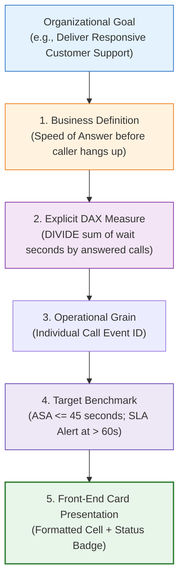

# 📖 KPI Design & Metric Governance

> [!abstract] Architectural Mental Model
> KPI Design is the disciplined process of translating strategic organizational goals into **quantifiable, mathematically unambiguous metrics**. Every KPI must have an explicit business definition, mathematical formula, defined grain, target benchmark, and operational owner before being placed on a dashboard.

---

## 1. What is it?
KPI Design is the governance methodology that ensures operational indicators actually reflect business realities. Rather than creating metrics based on arbitrary spreadsheet calculations, KPI Design establishes a formal **Metric Dictionary** specifying calculation rules, edge cases, and targets.



---

## 2. Why is it used?
Dashboards built without rigorous KPI design suffer from:
- **Calculation Ambiguity**: Two analysts report different numbers for "Customer Churn" because one excludes trials and the other includes them.
- **Null Distortion**: Standard mathematical averages include empty cells, generating distorted baselines.
- **Vanity Metrics**: Visually impressive numbers that drive no actual business decision.

---

## 3. How does it work?
The **11-Field KPI Governance Standard**:
1. **KPI Name**: Standard corporate title.
2. **Business Definition**: Clear prose explaining what the metric represents.
3. **Formula**: Strict mathematical expression and DAX definition.
4. **Data Source**: Specific table and column references.
5. **Grain**: Level of detail (transaction, customer, daily).
6. **Dimensions**: Allowed slicing attributes (Agent, Topic, Date).
7. **Target Benchmark**: Exact threshold defining good vs bad performance.
8. **Reporting Frequency**: Real-time, daily, monthly, or quarterly.
9. **Operational Owner**: Named stakeholder responsible for the metric.
10. **Interpretation**: What a high vs low value means.
11. **Caveats / Edge Cases**: Known exclusions, filters, or operational nulls.

---

## 4. Syntax & Structure: Explicit DAX vs Implicit Pivot Aggregations

```dax
// Anti-Pattern: Relying on Excel's drag-and-drop implicit aggregation:
// "Average of Satisfaction rating" implicitly includes/excludes blanks without control.

// Enterprise Pattern: Explicit DAX Measure with strict denominator control:
Satisfaction Score = 
DIVIDE(
    CALCULATE(
        SUM(Fact_Calls[Satisfaction rating]), 
        Fact_Calls[Answered (Y/N)] = "Y"
    ), 
    CALCULATE(
        COUNT(Fact_Calls[Call Id]), 
        Fact_Calls[Answered (Y/N)] = "Y"
    ), 
    0
)
```

---

## 5. Practical Example: Gross Resolution Rate vs Answered Resolution Rate
- **Gross Resolution Rate**: $3,646 / 5,000 = \mathbf{72.92\%}$ (Evaluates issue resolution against *gross customer demand*, including callers who hung up in queue).
- **Answered Resolution Rate**: $3,646 / 4,054 = \mathbf{89.94\%}$ (Evaluates issue resolution against *calls actually connected to agents*).
- Both metrics are valid, but confusing them leads to erroneous management conclusions. KPI Design forces explicit labeling!

---

## 6. Common Mistakes
1. **Divide-by-Zero Crashes**: Using `A / B` instead of `DIVIDE(A, B, 0)`.
2. **Averaging Averages**: Calculating the mathematical average of departmental averages rather than re-aggregating the underlying numerator and denominator.
3. **Omitting Targets**: Displaying a number without context (e.g. `3.40` CSAT—is that good or bad?).

---

## 7. When to use
- Every single metric displayed on an operational or executive dashboard.
- Any time data is shared across multiple business departments.

---

## 8. When NOT to use
- Exploratory data analysis where metrics are being hypothesized.

---

## 9. Real-World Analytics Use Case: PwC Diversity & Inclusion
In analyzing executive succession at Pharma Group AG, defining **Executive Gender Parity** strictly as female representation in Job Levels 1 & 2 revealed an acute **$18.8\%$ female executive ratio**, preventing HR from hiding behind entry-level parity ($43\%$).

---

## 10. Related Concepts
- 📖 [[KPI Dictionary]]
- 📐 [[Data Analysis Expressions (DAX)]]
- 🏗️ [[Excel Dashboard Architecture]]
- ⚡ [[Excel Performance Optimization]]
