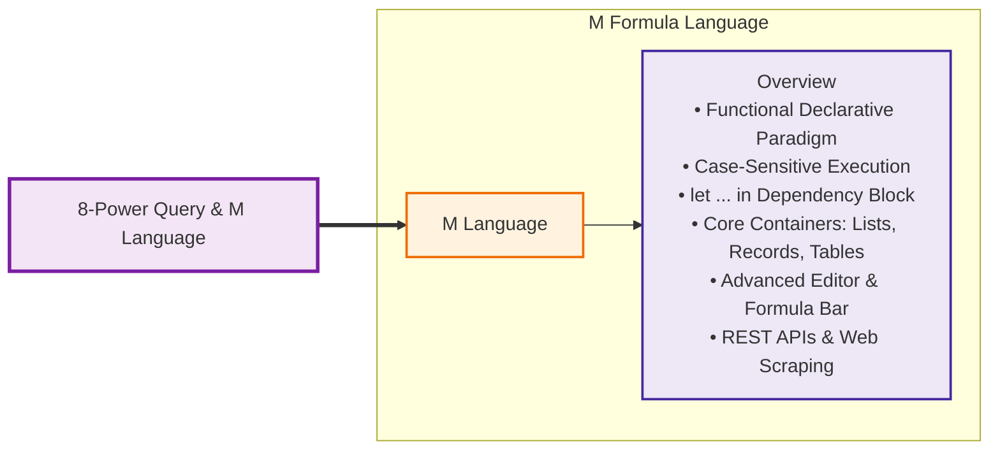
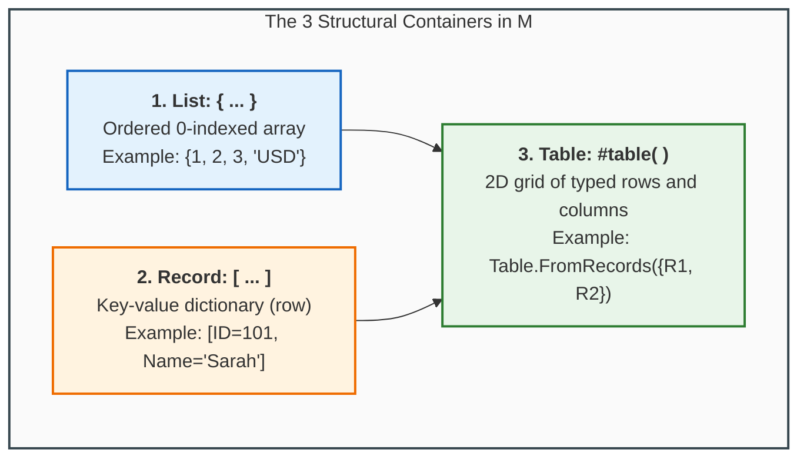

# Concept: M Language (Power Query Formula Language)

> [!summary] Definition & Mental Model
> The **M Language** (formally the *Power Query Formula Language*) is Microsoft's functional, case-sensitive, declarative mashup programming language that executes every transformation inside Power Query. Structured within immutable **`let ... in`** dependency blocks, M treats data transformations as pure mathematical evaluations without mutating state or procedurally looping. It supports primitive types, lists, records, and tables, enabling analysts to inspect, modify, and build custom connectors in the **Advanced Editor**.

---

## 🧠 Curriculum Mindmap Integration



```text
8-Power Query & M Language
└── M Language
    └── Overview
        ├── Functional Declarative Paradigm
        ├── Case-Sensitive Syntax
        ├── The let ... in Dependency Block
        ├── Primitives & Structured Containers (List, Record, Table)
        └── Advanced Editor & Custom Connectors
```

---

## 🧱 1. The `let ... in` Structural Syntax

Every M query evaluates an ordered sequence of named immutable expressions defined in a `let` block, concluding with an expression defined in the `in` block:

```powerquery
let
    // 1. Ingest CSV file
    Source = Csv.Document(File.Contents("D:\Data\Sales.csv"), [Delimiter=","]),
    
    // 2. Promote first row to headers
    #"Promoted Headers" = Table.PromoteHeaders(Source, [PromoteAllScalars=true]),
    
    // 3. Enforce strong data types
    #"Changed Type" = Table.TransformColumnTypes(#"Promoted Headers",{
        {"OrderID", Int64.Type}, 
        {"Revenue", type number}, 
        {"Date", type date}
    }),
    
    // 4. Filter rows with revenue above threshold
    #"Filtered Rows" = Table.SelectRows(#"Changed Type", each [Revenue] >= 500)
in
    // Return final transformed table
    #"Filtered Rows"
```

### Essential Syntax Rules:
1. **Case-Sensitivity**: Every function name is case-sensitive (`Table.SelectRows` works; `table.selectrows` errors).
2. **Trailing Commas**: Every step inside the `let` block must end with a comma, **except** the step immediately preceding `in`.
3. **Quoted Identifiers**: Step names with spaces or symbols must be enclosed in hash-quotes: `#"Changed Type"`.

---

## 🗃️ 2. Core Data Containers: Lists, Records, and Tables



| Container | Delimiters | Indexing & Access | Code Example |
| :--- | :---: | :--- | :--- |
| **List** | `{ ... }` | 0-indexed: `MyList{0}` | `Fruits = {"Apple", "Banana", "Cherry"}` |
| **Record** | `[ ... ]` | Field name: `MyRecord[FieldName]` | `Employee = [ID = 205, Name = "Diane", Dept = "Support"]` |
| **Table** | `#table(...)` | Cell selector: `MyTable{rowIndex}[colName]` | `#table({"ID", "Value"}, {{1, 100}, {2, 200}})` |

---

## 🌐 3. Live Enterprise Ingestion Connectors in M

M functions provide direct native connectors across enterprise storage protocols:

| Connector Function | Protocol / Target | Course Lab Case Study |
| :--- | :--- | :--- |
| `Csv.Document()` | Delimited flat text files | `Hotel Reservations.csv` & `Sample_ Superstore.csv` |
| `Excel.Workbook()` | External spreadsheet workbooks | `01 Call-Center-Dataset.xlsx` (PwC Switzerland) |
| `Json.Document()` | Web APIs and document streams | `People` register & live Exchange Rate FX API |
| `Xml.Tables()` | Hierarchical XML documents | `Product` catalog (AdventureWorks parts) |
| `Sql.Database()` | Relational RDBMS pushdown | `Query1` on local `AdventureWorks2022` instance |
| `Web.BrowserContents()` | Headless browser DOM rendering | Arabic Wikipedia (`التركيبة السكانية في مصر`) |
| `Html.Table()` | CSS selector table scraping | Demographic tables `Table 15`–`Table 19` |

---

## 🔗 Related Knowledge
- Lessons:
  - [[01_Power_Query_Fundamentals_and_ETL|Lesson 8.1: Power Query Fundamentals & ETL Architecture]]
  - [[04_Introduction_to_M_Language_and_APIs|Lesson 8.4: M Language Architecture & API Ingestion]]
- Concepts: [[Power Query]], [[ETL Process]], [[Data Cleaning]], [[Dimensional Modeling]]
- Course Reference: 
  - [[Module 7 Dataset Documentation]]
  - [[Module 8 Dataset Documentation]]
