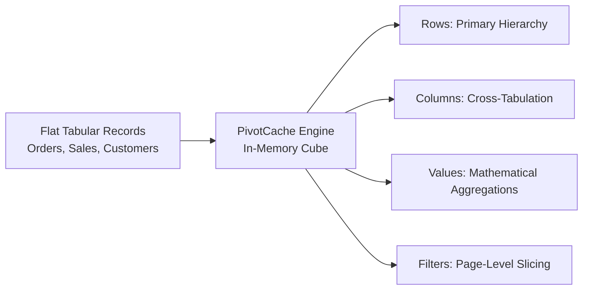
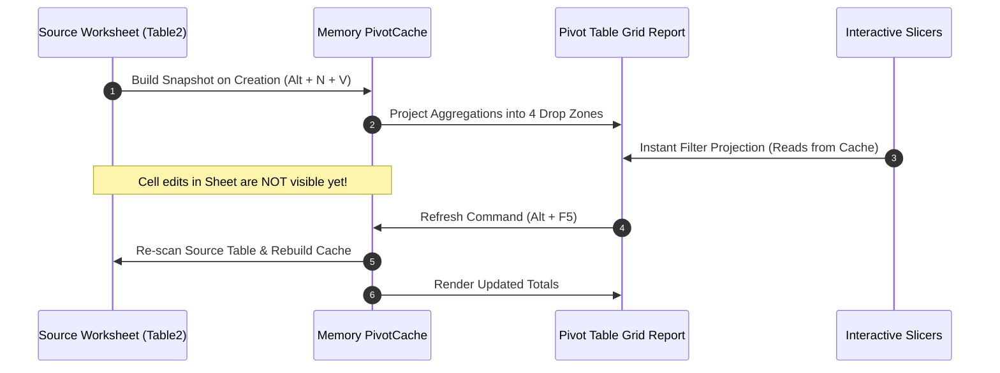

# Concept: Pivot Tables

> [!summary] Definition & Mental Model
> A **Pivot Table** is an interactive, multidimensional aggregation engine built into Microsoft Excel. It compiles raw tabular data into an in-memory high-speed cache (*PivotCache*) and allows analysts to rotate (*pivot*) dimensions across Rows, Columns, Values, and Filters, executing instant statistical aggregations, percentage shares, and variances without writing code or nested conditional formulas.

---

## 1. What Is It?
The central pillar of business intelligence in spreadsheets. As articulated in [`Module_5_Demo.xlsx`](file:///d:/courses/Data%20Analysis%2026-27/7-Introducation%20to%20Data%20Fields%20(Excel)/11_Demos_and_Workbooks/05_Pivot_Tables/Module_5_Demo.xlsx):
> *"A Pivot Table is a tool in Excel used to quickly summarize and analyze large datasets. It's called 'pivot' because you can rotate data around axes—turning rows into columns and vice versa—to view data from different perspectives without changing the original."*

---

## 2. Why Is It Used?
Writing hundreds of individual `SUMIFS`, `COUNTIFS`, or `AVERAGEIFS` formulas across large grids creates high cognitive load, formula maintenance friction, and spreadsheet bloat. Pivot Tables deliver:
- **Instant Speed**: Summarize 40,000+ rows in milliseconds.
- **Zero Syntax Errors**: Eliminates broken cell ranges and formula typos.
- **Flexible Reorganization**: Swap regional views, product splits, or date groupings with simple drag-and-drop actions.
- **Secondary Analytics**: Compute percentage shares, running totals, and growth rates natively via *Show Values As*.

---

## 3. How Does It Work? (The PivotCache Architecture)
When you create a Pivot Table (`Alt + N + V`), Excel does not query the spreadsheet cells directly for every calculation. Instead:
1. **Cache Compilation**: Excel reads the source table once and builds an optimized, in-memory data cube called the **PivotCache**.
2. **Instant Rendering**: As you drag fields into the 4 Drop Zones, the interface reads directly from the PivotCache.
3. **Decoupled Operation**: Changing numbers in the underlying source worksheet does **not** update the Pivot Table immediately. The analyst must trigger a **Refresh** (`Alt + F5` or `Ctrl + Alt + F5`) to rebuild the PivotCache.

---

## 4. Architecture: The 4 Drop Zones & Contextual Ribbons

| Drop Zone | Orientation | Analytical Purpose | Supported Data Types |
|---|---|---|---|
| **`Rows`** | Vertical Axis (Left) | Categorical group hierarchy (e.g. `Country` $\rightarrow$ `Product`). | Text, Dates, Binned Numbers |
| **`Columns`** | Horizontal Axis (Top) | Cross-tabulation secondary dimension (e.g. `Category` or `Region`). | Text, Quarters, Years |
| **`Values`** | Central Matrix | Numerical metrics mathematically computed (`SUM`, `COUNT`, `AVERAGE`, `MAX`, `MIN`). | Numbers, Currency, Quantities |
| **`Filters`** | Top Header | Global page filter isolating specific segments without crowding the main grid. | Any Discrete Category |

### Contextual Ribbon Controls:
- **PivotTable Analyze Tab**: Controls data source bounds, field settings, calculated fields, slicer insertions, and refresh commands.
- **Design Tab**: Controls visual layout (**Tabular Form**, **Compact Form**, **Outline Form**), subtotals, grand totals, and style palettes.

---

## 5. Practical Application: Multi-Dimensional Retail Analysis

Using the course demo workbook [`Module_5_Demo.xlsx`](file:///d:/courses/Data%20Analysis%2026-27/7-Introducation%20to%20Data%20Fields%20(Excel)/11_Demos_and_Workbooks/05_Pivot_Tables/Module_5_Demo.xlsx) (*Sheet: `Sample Data`*):
- **Rows**: `Country`
- **Columns**: `Category` (`Fruit` vs. `Vegetables`)
- **Values**:
  - `Amount` (Summarized as **`SUM`**, formatted as `$#,##0`)
  - `Amount` (Displayed as **`% of Column Total`**)
- **Filters**: `Region`

| Country | Fruit ($) | Fruit (%) | Vegetables ($) | Vegetables (%) | Combined Total ($) |
| :--- | :---: | :---: | :---: | :---: | :---: |
| **US** | $58,940 | 20.2% | $62,490 | 20.4% | **$121,430** |
| **Germany** | $42,800 | 14.7% | $51,320 | 16.7% | **$94,120** |
| **UK** | $44,530 | 15.3% | $48,220 | 15.7% | **$92,750** |
| **Canada** | $48,910 | 16.8% | $39,640 | 12.9% | **$88,550** |
| **Australia** | $35,420 | 12.1% | $42,180 | 13.7% | **$77,600** |
| **New Zealand** | $29,670 | 10.2% | $34,110 | 11.1% | **$63,780** |
| **France** | $31,250 | 10.7% | $28,900 | 9.5% | **$60,150** |
| **Grand Total** | **$291,520** | **100.0%** | **$306,860** | **100.0%** | **$598,380** |

---

## 6. Edge Cases & Boundary Conditions
1. **Mixed Data Types in Numeric Columns**: A single text string (e.g. `"N/A"` or space) forces Excel to default to **`COUNT`** instead of **`SUM`**.
2. **Text in Date Columns**: Prevents date grouping (Years/Quarters/Months) and causes the error *"Cannot group that selection"*.
3. **Empty Source Headers**: If any column header is blank, Excel refuses to build the Pivot Table.
4. **Calculated Field Evaluation Order**: Evaluates $\frac{\sum A}{\sum B}$, never $\sum \left(\frac{A}{B}\right)$.

---

## 7. Common Pitfalls & Mistakes (The 6 Mindmap Traps)
1. **Generic Default Naming**: Leaving names as `PivotTable1` creates confusion when wiring Report Connections.
2. **Static Coordinate Range**: Sourcing from `$A$1:$J$218` rather than an official dynamic Excel Table (`Table2`).
3. **Multi-Source Fragmentation**: Attempting to pivot `Retail_part_1 ` and `Retail_part_2` directly without joining on `OrderID`.
4. **Autofit Column Widths Override**: Pivot refresh destroys column widths unless **"Autofit column widths on update"** is disabled in PivotTable Options.
5. **Hidden Active Filters**: Forgetting that a filtered slicer is hiding critical historical records from executive totals.
6. **Ghost Items in Slicers**: Slicers showing items that were deleted from the source. (Set *Number of items to retain per field* to `None`).

---

## 8. Best Practices
- **Always convert source data to an Excel Table (`Ctrl + T`)** before creating a Pivot Table.
- **Format via Value Field Settings > Number Format**, never the Home ribbon.
- **Use Tabular Form with Repeated Item Labels** for data exportability and downstream lookups.
- **Uncheck "Autofit column widths on update"** to maintain visual stability.
- **Name every Pivot Table** with descriptive prefixes (`pt_SalesSummary`).

---

## 9. Performance & Enterprise Scaling
- In datasets exceeding 100,000 rows, standard Pivot Tables can experience memory latency.
- Upgrading to the **Power Pivot Data Model (xVelocity / VertiPaq engine)** provides 10x columnar compression and enables explicit DAX measures (`DISTINCTCOUNT`, time-intelligence functions).

---

## 10. Related Concepts & Next Steps
- **Preceding Foundation**: [[01_Excel_Tables_Architecture]], [[03_Table_Features_and_Best_Practices]]
- **Slicers & Controls**: [[Slicers and Timelines]]
- **Advanced Modeling**: [[Calculated Columns vs DAX Measures]], [[Power Pivot and DAX Overview]]
- **Practice Challenge**: [[Ex04_Pivot_Table_Summaries]]
