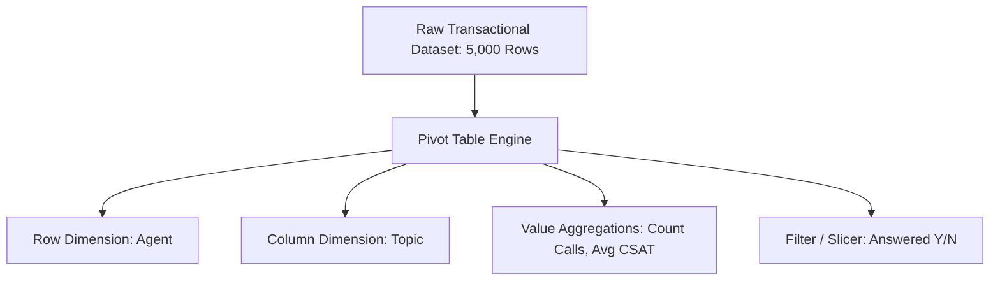

# Concept: Pivot Tables

> [!summary] Definition & Mental Model
> A Pivot Table is an in-memory aggregation engine that dynamically groups, summarizes, and reorganizes large transactional datasets along customizable row, column, and filter dimensions without altering source data.

## 1. What Is It?
The primary analytical engine in Microsoft Excel. It enables drag-and-drop multidimensional business reporting, instantly computing sums, counts, averages, and percentage distributions.

## 2. Why Is It Used?
Writing individual `SUMIFS` and `COUNTIFS` formulas for every category combination across millions of cells is tedious, slow, and error-prone. Pivot Tables generate comprehensive cross-tabulations in seconds.

## 3. How Does It Work?
Excel compiles a hidden background cache (the *PivotCache*) from the source data. When dimensions are placed into Rows, Columns, or Filters, the engine groups records in the cache and computes aggregate metrics.

## 4. Practical Application: Call Center Analytics
- **Rows**: `Agent`
- **Columns**: `Answered (Y/N)`
- **Values**: `Count of Call Id`
- **Show Values As**: `% of Row Total` ➔ Instantly reveals each individual agent's call answering percentage!

## 5. Common Mistakes
> [!caution] Data Edits Not Reflected Automatically
> Pivot Tables do NOT recalculate instantly upon source cell modification. Analysts must right-click -> **Refresh** (or `Alt + F5`).

## 6. Related Concepts
- [[Slicers and Timelines]]
- [[Excel Tables]]
- [[Calculated Columns vs DAX Measures]]
