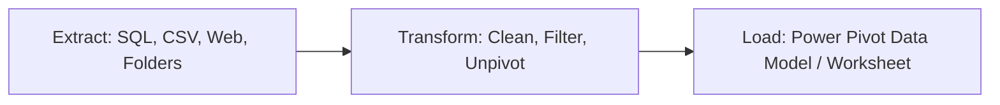

# Concept: Power Query & Automated ETL

> [!summary] Definition & Mental Model
> Power Query is Excel's visual ETL (Extract, Transform, Load) engine that records transformation sequences into an automated pipeline, allowing analysts to connect to external sources, clean messy data, and refresh pipelines with a single click.

## 1. What Is It?
A dedicated data transformation sub-environment built into Excel and Power BI driven by the functional M formula language.

## 2. Why Is It Used?
Traditional Excel data preparation requires repeating manual copy-pasting, deleting columns, and running text-to-columns every single week. Power Query turns this into a repeatable, automated script.

## 3. Core Capabilities
- **Unpivoting Columns**: Transforming wide reporting grids into narrow normalized tabular datasets.
- **Merging Queries**: Performing relational database joins (Left Outer, Inner, Anti-Joins).
- **Appending Queries**: Stacking historical files together (SQL `UNION ALL`).
- **Direct Data Model Loading**: Ingesting datasets directly into Power Pivot memory without writing to worksheet cells.

## 4. Related Concepts
- [[ETL Process]]
- [[M Language]]
- [[Dimensional Modeling]]
