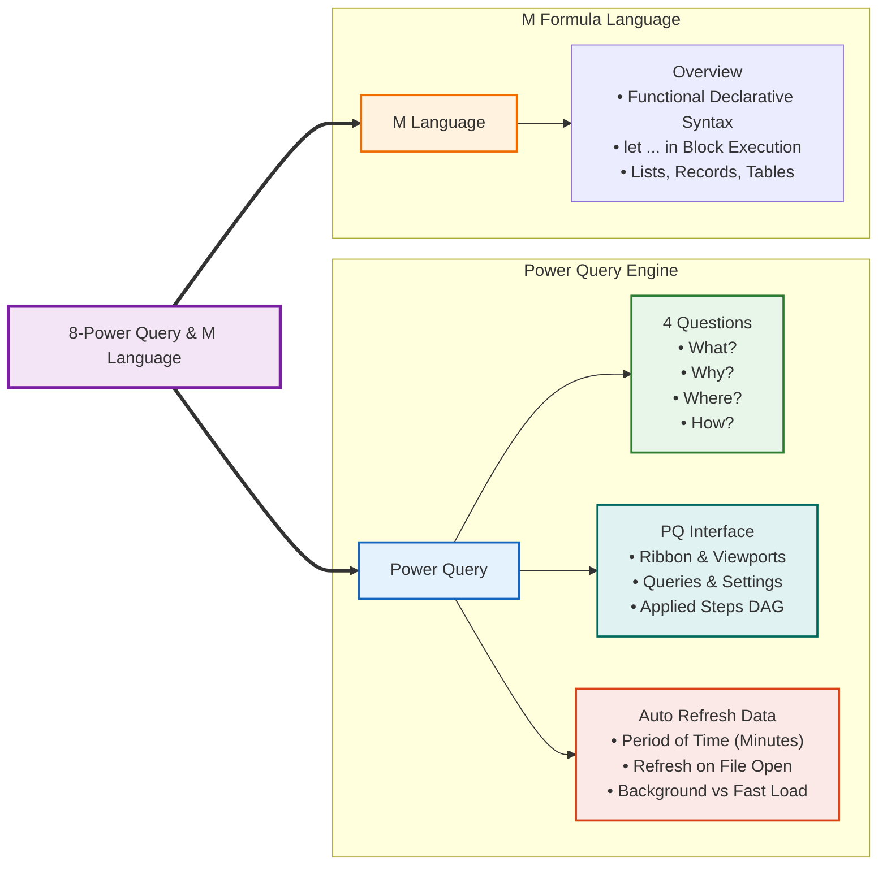

# Concept: Power Query & Automated ETL

> [!summary] Definition & Mental Model
> **Power Query** is Microsoft's enterprise visual ETL (Extract, Transform, Load) and data mashup engine built natively into Excel and Power BI. Operating on the declarative, functional **M language**, it records data preparation sequences into an immutable, non-destructive **Applied Steps** pipeline. It allows data analysts to ingest disparate sources (CSV, SQL Server, Web, JSON, REST APIs), automate routine data cleaning, schedule periodic background refreshes (**Period of Time**), and feed multi-million row datasets directly into Power Pivot Data Models.

---

## 🧠 Curriculum Mindmap Integration

---

## ❓ The 4 Foundational Questions

1. **What?**: An in-memory, visual ETL engine and data preparation middleware connecting external storage to analytical models.
2. **Why?**:
   - **Non-Destructive**: Original files remain strictly unmodified.
   - **Repeatable**: Every click is recorded in **Applied Steps**; clicking **Refresh** re-runs the entire pipeline.
   - **Eliminates Formula Bloat**: Replaces thousands of slow `=VLOOKUP` or `=INDEX/MATCH` helper formulas.
   - **Bypasses Row Limits**: Streams multi-million row tables directly into Power Pivot memory without writing to worksheet cells.
3. **Where?**: Located on the Ribbon at **Data > Get Data**. Positioned as Layer 1 in the Modern Excel Stack: `Power Query (ETL)` $\to$ `Power Pivot (Star Schema & DAX)` $\to$ `Pivot Tables (Summary Dashboards)`.
4. **How?**: Powered by an immutable dependency DAG (Directed Acyclic Graph) written in M, with **Query Folding** pushing filtering and joins down to database servers.

---

## 🖥️ The Power Query Interface Anatomy

| Interface Component | Location in PQ Editor | Key Functions & Educational Scope |
| :--- | :--- | :--- |
| **The Ribbon** | Top navigation bar | **Home** (Close & Load, Reduce Rows, Combine Queries), **Transform** (in-place Unpivot, Transpose, Text/Math parsing), **Add Column** (derived Custom, Conditional, Examples), **View** (Data profiling, formula bar). |
| **Queries Pane** | Left collapsible sidebar | Directory of loaded queries, connection-only staging feeds, and parameters. |
| **Formula Bar** | Top under Ribbon | Displays real-time M code function for the currently active step. |
| **Data Preview Grid** | Center main viewport | 1,000-row interactive table preview with data type badges (`123`, `ABC`, `📅`) and quality health bars (Valid, Error, Empty). |
| **Query Settings** | Right sidebar | Query Name properties and the chronological **Applied Steps** audit log with time-travel and step-level parameter editing (`⚙️`). |
| **Status Bar** | Bottom edge | Column/row counts and profiling metrics. |

---

## 🔄 Auto Refresh Data: Scheduling & Polling ("Period of time")

In enterprise operational monitoring, queries can be configured to poll live sources on a scheduled interval:
- **Path**: **Data > Queries & Connections** $\to$ Right-click query $\to$ **Properties...**
- **Period of Time**: Check **"Refresh every [ X ] minutes"** (e.g., 15 or 30 mins) for live operational logs (Call Center queues, hotel booking desks, exchange rates).
- **Refresh on File Open**: Guarantees current data whenever a report is launched.
- **Background Refresh**: Allows asynchronous execution so analysts can continue working while queries run in the background.

---

## 🔗 Related Knowledge
- Lessons:
  - [[01_Power_Query_Fundamentals_and_ETL|Lesson 8.1: Power Query Fundamentals & ETL Architecture]]
  - [[02_Core_Data_Transformations|Lesson 8.2: Core Transformations: Unpivot, Split, & Types]]
  - [[03_Combining_Data_Append_and_Merge|Lesson 8.3: Combining Datasets: Append vs Merge]]
  - [[04_Introduction_to_M_Language_and_APIs|Lesson 8.4: M Language Architecture & API Ingestion]]
- Concepts: [[ETL Process]], [[M Language]], [[Data Cleaning]], [[Dimensional Modeling]]
- Course Labs & References:
  - Reference: [[Module 7 Dataset Documentation]]
  - Reference: [[Module 8 Dataset Documentation]]
  - Laboratory 1: [`Module_7_Demo.xlsx`](file:///d:/courses/Data%20Analysis%2026-27/7-Introducation%20to%20Data%20Fields%20(Excel)/11_Demos_and_Workbooks/07_Data_Cleaning/Module_7_Demo.xlsx)
  - Laboratory 2: [`Module_8_Demo.xlsx`](file:///d:/courses/Data%20Analysis%2026-27/7-Introducation%20to%20Data%20Fields%20(Excel)/11_Demos_and_Workbooks/08_Power_Query/Module_8_Demo.xlsx)
