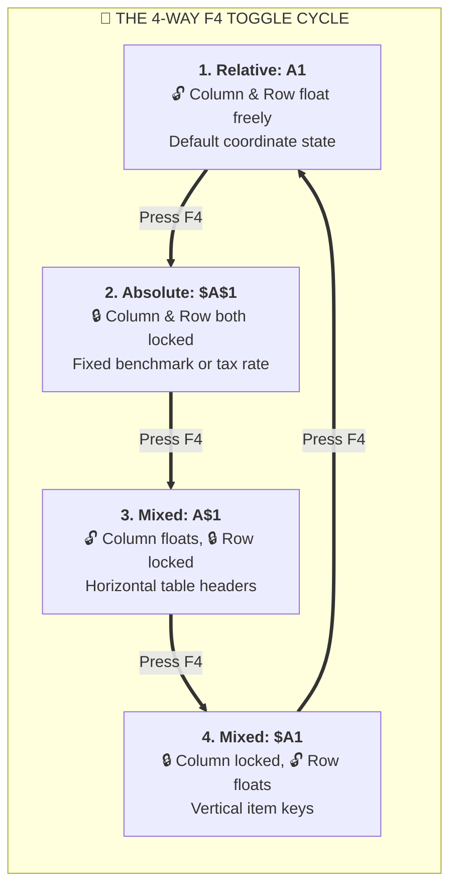

# Concept: Relative vs Absolute References

> [!summary] Definition & Mental Model
> Cell referencing defines how a formula's coordinate targets behave when copied or dragged across rows and columns: relative references shift dynamically based on distance, while absolute references remain locked to specific coordinates using `$`.

## 1. What Is It?
- **Relative (`A1`)**: Offset-based coordinate.
- **Absolute (`$A$1`)**: Fixed anchor point.
- **Mixed (`$A1` or `A$1`)**: Locks either the column or the row independently.

## 2. Why Is It Used?
Without absolute references, copying a formula down a column would cause lookup tables or constant tax/discount rates to drift downward into empty cells, producing `#VALUE!` or incorrect calculations.

## 3. How Does It Work?
The dollar sign `$` acts as a padlock:
- `$A$1`: Locks column A, locks row 1.
- `$A1`: Locks column A, allows row to change.
- `A$1`: Allows column to change, locks row 1.



## 4. Practical Example: Two-Way Multiplication Table
In cell `B2`: `=$A2 * B$1`.
When copied down and across, `$A2` always pulls the row factor from Column A, while `B$1` always pulls the column factor from Row 1.

## 5. Common Mistakes

> [!caution] Forgetting to Lock Table Ranges in Lookups
> Dragging lookup formulas down without absolute locks causes table ranges to shift down into empty cells, dropping top records and causing `#N/A` errors.

### Example of Reference Drift
```excel
=VLOOKUP(A2, F2:G50, 2, FALSE)
```
When dragged down to row 3, the lookup array shifts from `F2` to `G50` down to `F3` to `G51`, omitting the first record.

### Correct Fixed Anchor
```excel
=VLOOKUP(A2, $F$2:$G$50, 2, FALSE)
```
The dollar signs anchor both column and row boundaries, keeping the lookup matrix locked at all rows.


## 6. Real-World Use Case
Applying a static corporate tax rate or currency exchange rate in cell `$K$1` across thousands of invoice line items.

## 7. Related Concepts
- [[Structured References]]
- [[01_Formula_Basics_and_Cell_Referencing]]
- 📂 **Personal Practice Workbook**: `11_Demos_and_Workbooks/03_Formulas_and_Functions/Conditional Formatting & Absolute Relative.xlsx` (Sheet: *Relative vs Absolute*)

