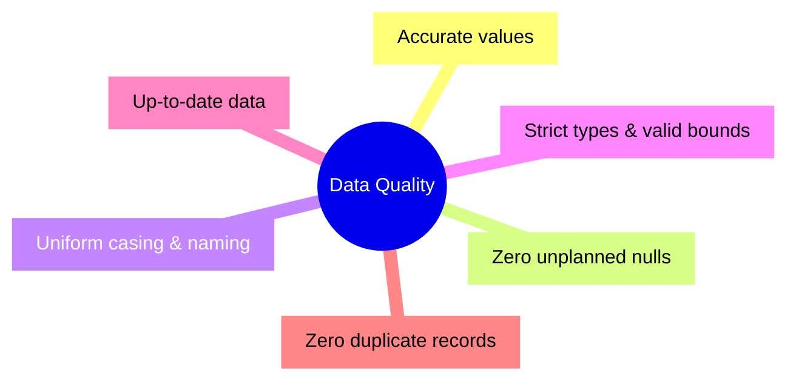

# Concept: The Six Dimensions of Data Quality

> [!summary] Definition & Mental Model
> The formal data governance framework established by DAMA International defining the six measurable facets required for data to be deemed fit for business decision-making.

## The Six Core Dimensions
1. **Accuracy**: The degree to which data correctly reflects real-world events or facts.
2. **Completeness**: The proportion of expected data that is populated (audit of null/blank records).
3. **Consistency**: Data values in one system do not contradict data values in another system.
4. **Validity**: Conformance to strict business rules, data types, and syntax constraints.
5. **Timeliness**: The degree to which data represents the current operational period.
6. **Uniqueness**: Absence of duplicate records; each entity has a single primary key.

## Grounded Example: PwC Call Center Audit
- **Completeness**: 946 null values exist in `Speed of answer in seconds`. Audit confirms these calls have `Answered (Y/N) == "N"`. They are *valid operational nulls*.
- **Uniqueness**: 5,000 calls tested; exactly 5,000 distinct `Call Id` values.

## Related Concepts
- [[Data Cleaning]]
- [[Six Dimensions of Data Quality]]
