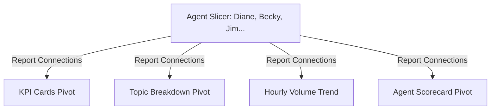

# Concept: Slicers & Timelines

> [!summary] Definition & Mental Model
> Slicers and Timelines are visual filtering controls that link to one or more Pivot Tables or Excel Tables, enabling one-click exploratory filtering with clear visual feedback on active subsets.

## 1. What Is It?
Interactive UI components that sit above worksheets:
- **Slicers**: Categorical filter buttons (e.g. `Agent`, `Topic`, `Status`).
- **Timelines**: Dedicated chronological date scrubber bars (Years, Quarters, Months, Days).

## 2. Why Is It Used?
Standard table dropdown filters hide what has been selected and require multiple clicks. Slicers display all available options, highlighting selected items in color and dimming filtered-out items.

## 3. Report Connections Architecture
A single Slicer can control 10 different Pivot Tables across multiple sheets:


## 4. Resetting Filters via VBA
In complex executive dashboards with multiple slicers, a "Clear Filters" button powered by a macro restores default views:
```vba
Sub ClearAllSlicers()
    Dim sc As SlicerCache
    For Each sc In ThisWorkbook.SlicerCaches
        sc.ClearManualFilter
    Next sc
End Sub
```

## 5. Related Concepts
- [[Pivot Tables]]
- [[Dashboard Design Principles]]
