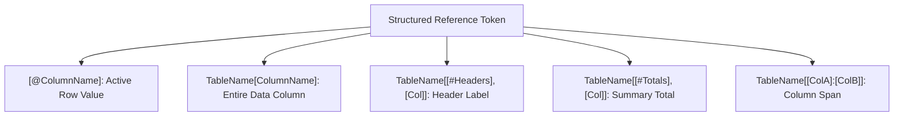

# Concept: Structured References

> [!summary] Definition & Mental Model
> **Structured Referencing** is the official formula syntax used by Excel Tables (`ListObjects`). It replaces cryptic cell coordinates (`E2*F2`, `$A$2:$J$101`) with clear, human-readable column names and special item qualifiers (such as `[@Quantity] * [@UnitPrice]`), making formulas self-documenting and resilient against column restructuring.

---

## 1. What Is It?
Instead of referencing `$C$2:$C$101`, structured references refer to `SalesTable[Category]`. Instead of referencing row 2's specific column `F2`, a formula inside the table uses `[@UnitPrice]`.

As highlighted under **Benefits of Using Tables** in the Module 4 mindmap, structured referencing allows analysts to write clear expressions that describe *what* is being calculated rather than *where* it sits on the grid.

---

## 2. Why Is It Used? (The Problem It Solves)
1. **Auditing Clarity**: Formulas become self-explanatory: `=[@SellingPrice] - [@CostPerUnit]`.
2. **Structural Immunity**: Inserting, deleting, or reordering columns does not break structured formulas.
3. **Automatic Uniformity**: Formulas written inside an Excel Table automatically expand down the entire column without manual dragging.



---

## 3. How Does It Work?
Excel resolves table tokens against the internal XML schema of the `ListObject`:
- **`@` (Implicit Intersection)**: Directs Excel to pull the scalar value on the current evaluated row.
- **Column Name**: Targets the 1D array of data body cells.
- **Special Items**:
  - `[#Headers]`: The header row.
  - `[#Totals]`: The summary total row.
  - `[#Data]`: The data body range.
  - `[#All]`: The entire table bounds (Headers + Data + Totals).

---

## 4. Syntax & Structure Table

| Syntax | Scope Referenced | Example in `Module_4_Demo.xlsx` | Evaluation Output |
| :--- | :--- | :--- | :--- |
| `[@ColumnName]` | Value in current row | `=[@Quantity] * [@UnitPrice]` | Current row line total |
| `TableName[ColumnName]` | Data body of column | `=SUM(InventoryTable[CurrentStock])` | Total stock across all rows |
| `TableName[[#Headers], [Col]]` | Header cell | `=SalesTable[[#Headers], [TotalPrice]]` | String: `"TotalPrice"` |
| `TableName[[#Totals], [Col]]` | Total row cell | `=SalesTable[[#Totals], [TotalPrice]]` | Evaluated subtotal |
| `TableName[#Data]` | All data body cells | `=ROWS(SalesTable[#Data])` | Number of records (`101`) |
| `TableName[[ColA]:[ColB]]` | Contiguous column span | `SalesTable[[Quantity]:[TotalPrice]]` | 3-column data slice |

---

## 5. Practical Examples from `Module_4_Demo.xlsx`

### Example A: Sales Operations (`Sales_Data`)
```excel
=[@Quantity] * [@UnitPrice]
```
Evaluates transaction revenue across all 101 records.

### Example B: Inventory Stock Valuation (`Product_Inventory`)
```excel
=[@CurrentStock] * [@CostPerUnit]
```
Calculates total capital invested per SKU.

### Example C: Cross-Table Relational Lookup (`Employee_Records` $\rightarrow$ `Dept_Heads`)
```excel
=XLOOKUP([@Department], Dept_Heads!$A$1:$F$1, Dept_Heads!$A$2:$F$2, "Unassigned")
```
Enriches each employee row with their department manager's name from an external reference matrix.

### Example D: Dynamic Slicer-Aware Total Row
```excel
=SUBTOTAL(109, SalesTable[TotalPrice])
```
Dynamically recalculates revenue when filtered by Slicers (e.g. `Governorate = "Asyut"`).

---

## 6. Common Mistakes & Gotchas

> [!caution] The Drag-Lock Gotcha Outside Tables
> When dragging a structured reference horizontally outside of an Excel Table:
> - `=SUM(SalesTable[Quantity])` dragged right shifts relatively to `=SUM(SalesTable[UnitPrice])`!
> - To lock the column reference (like `$E$2:$E$102`), use the double bracket syntax:
>   `=SUM(SalesTable[[Quantity]:[Quantity]])`.

---

## 7. When to Use
- Any calculation performed inside an official Excel Table.
- Dashboard summary cards and KPI formulas referencing tabular data sources.
- Feeding parameters into aggregations (`SUMIFS`, `COUNTIFS`, `XLOOKUP`).

---

## 8. When NOT to Use
- Unstructured legacy grids.
- Matrix formulas requiring 2D dynamic array spilling inside the table container (tables require 1D scalar column formulas).

---

## 9. Real-World Analytics Use Case
In HR turnover modeling, calculating employee tenure:
```excel
=INT(YEARFRAC([@HireDate], TODAY()))
```
Because the formula uses `[@HireDate]`, onboarding a new cohort of 200 hires automatically calculates tenure for every new hire the instant they are pasted into the table.

---

## 10. Related Concepts & Vault Links
- **Concepts**: [[Excel Tables]], [[Relative vs Absolute References]], [[Pivot Tables]], [[Slicers and Timelines]]
- **Lessons**: [[02_Structured_References]], [[01_Excel_Tables_Architecture]], [[03_Table_Features_and_Best_Practices]]
- **Formulas**: [[SUBTOTAL]], [[XLOOKUP]], [[HLOOKUP]], [[IF]]
- **Practice**: [[Ex03_Excel_Tables_and_Structured_References]] & [[Ex03_Solutions]]
- 📂 **Personal Workbook Demo**: [`11_Demos_and_Workbooks/04_Tables/Module_4_Demo.xlsx`](file:///d:/courses/Data%20Analysis%2026-27/7-Introducation%20to%20Data%20Fields%20%28Excel%29/11_Demos_and_Workbooks/04_Tables/Module_4_Demo.xlsx)
