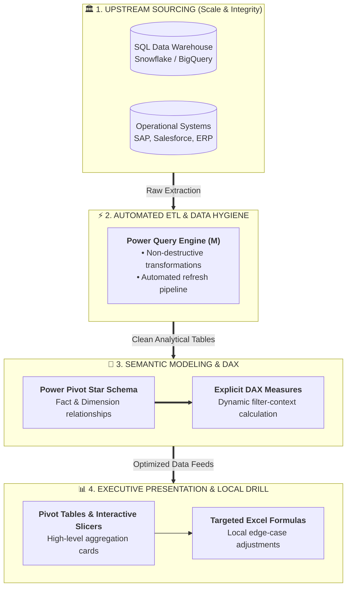

# Why Not Always Formulas? (Enterprise Analytics Boundaries)

> [!quote] Course Core Philosophy (Mostafa Hamed)
> *"ليه مش دايما بنعتمد على المعادلات فى الشغل الاحترافي؟ لأن شغلك مش إكسيل شيت صغير، انت بتتعامل مع داتا كتير فغالباً الداتا مش هتكون في صورة أفضل حل ليها المعادلات... الدوال في الأول والآخر هي حل موضعي، وده مش اللي بحله، أنا بحل مشكلة بيزنس."*  
> — *Mostafa Hamed, "Excel Zero to Hero"*

---

## 1. What Is It?
The **"Why Not Always Formulas"** principle is the architectural demarcation between **cell-level formulas** (localized calculation patches) and **upstream data pipeline modeling** (SQL databases, Power Query ETL, and Star Schema data models with DAX).

It recognizes that while Excel formulas are versatile, relying on thousands of nested cell calculations across massive datasets creates fragile, sluggish, and unmaintainable workbooks.

---

## 2. Why Is It Used?
Data analysts in enterprise environments rarely analyze raw, untransformed data solely with worksheet formulas. They use this principle to:
- **Avoid Workbook Bloat & Freezing**: Heavy formulas like `VLOOKUP` or array calculations across 50,000+ rows destroy recalculation speed.
- **Maintain Single Source of Truth**: Upstream databases enforce referential integrity and schema definitions that formulas cannot guarantee.
- **Scale Analytics Efficiently**: Solving business problems at the data-pipeline level makes dashboards instantly refreshable and self-healing.

---

## 3. How Does It Work?

Enterprise data workflows follow a multi-tier pipeline. Excel formulas operate only at the very final presentation layer, while the heavy lifting is handled upstream:

---

## 4. Architectural Boundaries: Formulas vs Modern Alternatives

| Evaluation Dimension | Cell-Level Formulas | Power Query (ETL) | Power Pivot & DAX | Upstream SQL / CRM |
| :--- | :--- | :--- | :--- | :--- |
| **Primary Scope** | Localized cell patch | Pipeline data cleaning & reshaping | Multi-table relational modeling | Enterprise storage & filtering |
| **Row Scale Limit** | Sluggish beyond 30,000 rows | Millions of rows compressed | Tens of millions via VertiPaq | Billions of records |
| **Fragility** | High (deleted cell breaks `#REF!`) | Very low (applied script steps) | Zero (relationships are schema-bound) | Immutable system schemas |
| **Auditability** | Difficult (inspect cell by cell) | Visual step-by-step query log | Centrally managed measures | Version-controlled SQL scripts |
| **Memory Footprint** | Bloated `.xlsx` file size | High compression engine | Up to 10:1 data compression | Offloaded to database server |

---

## 5. Practical Comparison Example

### The Anti-Pattern: Cell-Formula Dependency
An analyst pastes 50,000 sales transactions and creates 5 helper columns:
- Column G: `=VLOOKUP(B2, Customers, 3, FALSE)` (Client Name)
- Column H: `=VLOOKUP(B2, Customers, 5, FALSE)` (City)
- Column I: `=VLOOKUP(B2, Customers, 6, FALSE)` (Credit Limit)
- Column J: `=YEAR(C2)`
- Column K: `=IF(E2 > 1000, "High", "Low")`
*Result*: 250,000 volatile formula cells. The workbook takes 45 seconds to open and freezes whenever a filter is clicked.

### The Professional Enterprise Pattern:
1. **Upstream SQL**: Pulls only needed dates and joins `Dim_Customers` directly in the query.
2. **Power Query**: Ingests, trims text, sets datatypes, and creates `Year` during load.
3. **Data Model**: Creates a 1-to-many relationship between `Fact_Sales` and `Dim_Customers`.
4. **DAX Measure**: `High Value Deals := CALCULATE(COUNTROWS(Fact_Sales), Fact_Sales[Amount] > 1000)`.
*Result*: 0 helper formula columns, instantaneous recalculation, and a 90% smaller file size.

---

## 6. Common Mistakes
1. **Trying to Memorize Every Formula Verbatim**: Panicking about exact syntax rather than understanding the functional mental model. Excel has IntelliSense and documentation; knowing *when* and *why* to use a tool is what matters.
2. **Re-calculating What Upstream Systems Already Solved**: Using complex text formulas to clean data that could have been filtered in SQL or Power Query in two clicks.
3. **Over-Engineering Nested IFs**: Building 10-level nested `=IF(..., IF(..., IF(...)))` instead of using a lookup table or a clean Power Query conditional column.

---

## 7. When to Use Excel Formulas
- Quick exploratory calculations, ad-hoc audits, and financial scratchpads.
- Dynamic dashboard title headers (e.g. `="Sales Report for " & B1`).
- Custom KPI cards and localized metric cards beside charts.
- Small datasets (< 10,000 rows) requiring quick turnarounds.

---

## 8. When NOT to Use Excel Formulas
- Combining data from multiple tables across 100,000+ rows (use **Power Query Merge** or **Data Model Relationships** instead of `VLOOKUP`).
- Multi-step text parsing on recurring monthly exports (use **Power Query ETL**).
- Dynamic multi-table aggregations (use **Pivot Tables** and **DAX Measures**).

---

## 9. Real-World Analytics Case Study
In the **PwC Call Center Performance Analysis** capstone project (5,000 call records):
- Instead of filling 5,000 cells with `=VLOOKUP` to match agent names to departments, we build an interconnected **Star Schema** with an `Agents` dimension table.
- KPIs like `Call Answer Rate %` and `Abandonment Rate %` are calculated as **explicit DAX measures** rather than repetitive sheet formulas, allowing any slicer (by Topic, Agent, or Month) to dynamically filter metrics in real time.

---

## 10. Related Concepts
- [[Dimensional Modeling]]
- [[ETL Process]]
- [[Power Query]]
- [[Calculated Columns vs DAX Measures]]
- [[VLOOKUP vs XLOOKUP]]
- Notes: [[03_Conditional_Logic_and_Decision_Making]], [[04_Lookup_and_Reference_Functions]]
- Workbook: `11_Demos_and_Workbooks/03_Formulas_and_Functions/Formulas_&_Functions_Part_2.xlsx` (Sheet: `ليه مش دايما معادلات؟`)
