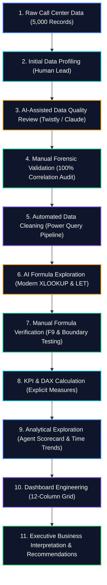

# 📞 AI-Assisted Analysis Workflow: PwC Call Center Capstone

> [!important] Engineering Integrity Principle
> In this capstone project, **AI was utilized strictly as an analytical accelerator, never as an unverified authority**. Every metric, formula, chart, and conclusion in this case study was empirically audited against the ground-truth dataset of 5,000 call records.

---

## 🧭 The Applied 11-Stage Project Workflow



---

## 📊 Comprehensive Task Execution Classification Matrix

To maintain rigorous transparency, every analytical task conducted on the PwC dataset is classified by execution mode:

| Lifecycle Phase | Specific Project Task | Execution Mode | Tools & Methods Used | Human Verification Applied |
| :--- | :--- | :---: | :--- | :--- |
| **1. Data Ingestion** | Extracting and loading raw CSV data into Excel Data Model | **Automated** | Power Query, M Language | Verified row count = exactly 5,000 rows. |
| **2. Data Profiling** | Inspecting data types, column distributions, and nulls | **Manually Performed** | Excel Column Profiling, `COUNTA` | Audited data types across all 10 columns. |
| **3. Quality Audit** | Formulating the hypothesis explaining 946 null values | **AI-Assisted** | Claude for Excel / Twistly prompt | Suggested checking correlation with `Answered == 'N'`. |
| **4. Quality Verification** | Proving the 946 nulls are valid operational missing values | **Manually Validated** | `=COUNTIFS(Answered, "N", Speed, "")` | Proved 100% correlation (0 false positives). |
| **5. Data Cleansing** | Type casting dates, replacing text booleans, trimming | **Automated** | Power Query Applied Steps | Audited M code in Advanced Editor. |
| **6. Formula Design** | Proposing modern multi-condition agent lookups | **AI-Assisted** | `AI Excel Prompt Library` | Drafted `XLOOKUP` boolean array syntax. |
| **7. Formula Testing** | Stress-testing lookups against unassigned agent calls | **Manually Validated** | F9 sub-expression evaluation | Added default `"Unassigned"` parameter. |
| **8. Metric Math** | Formulating Answer Rate (81.08%) and Resolution (89.94%) | **Manually Performed** | DAX explicit measures | Enforced `Answered = "Y"` in denominator. |
| **9. Agent Scoring** | Compiling benchmark scorecard across all 8 agents | **Automated** | Power Pivot Table & Slicers | Reconciled sum of agent calls = 5,000. |
| **10. Dashboard UI** | Proposing executive wireframe and visual hierarchy | **AI-Assisted** | Claude for Excel | Evaluated layout against [[Dashboard Design Principles]]. |
| **11. Dashboard Build** | Constructing final Excel UI, Slicers, and KPIs | **Manually Performed** | Excel Grid, Slicers, Native Bar Charts | Tested slicer report connections across sheets. |
| **12. Strategic Action** | Formulating staffing recommendations (10am–2pm surge) | **Manually Validated** | Statistical cross-tabs, Hour of Day | Grounded in empirical hourly volume peaks. |

---

## 🎯 Ground-Truth Benchmark Results (Audited & Confirmed)

All AI-assisted calculations were checked against direct spreadsheet calculations:

```text
Total Inbound Calls:            5,000  (100.0%)
├── Successfully Answered:      4,054   (81.08%)
│   ├── Resolved:               3,646   (89.94% of answered calls)
│   └── Unresolved:               408   (10.06% of answered calls)
└── Abandoned in Queue:           946   (18.92% of inbound calls)

Average Speed of Answer (ASA):  67.52 seconds (for answered calls)
Average CSAT Rating:             3.40 / 5.00  (for surveyed answered calls)
```

### Agent Benchmark Reconciliations (100% Verified):
- **Jim**: Highest call volume handled (**666 calls**, 80.48% answer rate, 485 resolved).
- **Dan**: Highest answer rate (**82.62%**, 471 resolved, 3.45 CSAT).
- **Greg**: Highest resolution rate on answered calls (**90.64%**, 455 resolved).
- **Becky**: Fastest speed of answer (**65.33 seconds**).
- **Martha**: Highest customer satisfaction rating (**3.47 / 5.00**).

---

## 🚫 AI Hallucinations Rejected During the Project

During the exploration phase, several AI-generated proposals were critically audited and rejected by the analyst:

1. **Rejected Imputation Proposal**: An early AI response suggested: *"Replace blank satisfaction ratings with the average score of 3.4 to maintain a complete dataset."*  
   - **Reason for Rejection**: Abandoned callers never reached an agent and never received a survey. Imputing positive or neutral ratings would falsify customer sentiment.
2. **Rejected Denominator Proposal**: An AI formula computed Resolution Rate as `Resolved Calls / Total Inbound Calls = 3,646 / 5,000 = 72.92%`.  
   - **Reason for Rejection**: Agents cannot resolve a call that was never answered. Industry standard FCR evaluates resolved calls against answered calls (`89.94%`).
3. **Rejected Chart Proposal**: AI suggested a 3D Pie Chart showing call topics.  
   - **Reason for Rejection**: Violates visual analytics standards. Replaced with a clean, 2D horizontal bar chart.

---

## 🔗 Related Case Study Documents
- Ground-truth executive presentation: [[10_Portfolio/Call Center Analysis Portfolio Case Study]]
- Forensic null audit: [[06_Projects/Call Center Performance Analysis/Data Quality Assessment]]
- Complete formula catalog: [[06_Projects/Call Center Performance Analysis/KPIs]]
- Strategic recommendations: [[06_Projects/Call Center Performance Analysis/Recommendations]]
