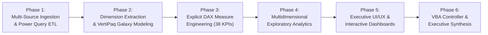

# 5. Analysis Plan & End-to-End Galaxy Methodology

## The 6-Phase Data Analysis Life Cycle (DALC)
To guarantee enterprise rigor and auditability across all three PwC client divisions, the analysis follows a structured 6-phase engineering lifecycle:

---

## 🔬 Core Analytical Hypotheses Across the 3 Divisions

### Division 1: Call Centre Operations & Telephony SLAs
- **Hypothesis 1.1 (Wait Time Elasticity)**: Call abandonment rates are positively correlated with queue wait times; abandonment spikes when Average Speed of Answer (ASA) exceeds 60 seconds during midday volume peaks (11:00 AM – 2:00 PM).
- **Hypothesis 1.2 (Resolution vs Speed)**: Agents with slightly longer Average Handle Time (AHT) achieve higher First-Contact Resolution (FCR) and customer satisfaction (CSAT) ratings than agents rushing calls to clear volume.
- **Hypothesis 1.3 (Topic Complexity)**: Technical Support inquiries have lower resolution rates and higher handle times than Billing and Admin inquiries due to technical diagnostic friction.

### Division 2: Customer Retention & Churn Risk
- **Hypothesis 2.1 (Contract Commitment Horizon)**: Customers on month-to-month contracts exhibit churn rates exceeding $3\times$ the rate of subscribers on 1-year or 2-year commitments.
- **Hypothesis 2.2 (Service Add-On Retention Buffer)**: Subscribing to value-added security services (Online Security, Tech Support, Device Protection) creates an operational "stickiness" that reduces churn probability by $>40\%$.
- **Hypothesis 2.3 (Technical Support as Churn Precursor)**: Opening multiple technical support tickets is a leading indicator of churn; customers logging $\ge 2$ tech tickets churn at significantly higher rates due to unresolved service dissatisfaction.
- **Hypothesis 2.4 (Payment Channel Friction)**: Payment via Electronic Check exhibits higher churn than automated credit card or bank debit methods due to friction in manual monthly payments.

### Division 3: Diversity & Human Capital Parity
- **Hypothesis 3.1 (Executive Glass Ceiling)**: Female representation diminishes systematically as job seniority increases, with the sharpest drop-off occurring between middle management (Job Level 3) and executive leadership (Job Levels 1 & 2).
- **Hypothesis 3.2 (Promotion Velocity Gap)**: FY21 female promotion rates lag behind male promotion rates even when controlling for identical performance rating tiers.
- **Hypothesis 3.3 (Turnover Vulnerability in Junior Cohorts)**: Employee turnover is concentrated in junior officer and specialist roles (Job Levels 5 & 6) and is higher among female professionals due to limited perceived advancement paths.

---

## 🛠️ Step-by-Step Technical Execution Phases

### Phase 1: Multi-Source Ingestion & Power Query ETL ('The Kitchen')
1. **Source Connection**: Ingest all three raw Excel workbooks from `11_Demos_and_Workbooks/10_Projects_and_Demos/PWC/data/`:
   - `01 Call-Center-Dataset.xlsx` $\to$ `Fact_Calls`
   - `02 Churn-Dataset.xlsx` $\to$ `Fact_Churn`
   - `03 Diversity-Inclusion-Dataset.xlsx` (Sheet `Pharma Group AG`) $\to$ `Fact_Employees`
2. **Data Hygiene & Typing**:
   - `Fact_Calls`: Preserve 946 operational nulls in `Speed of answer`, `AvgTalkDuration`, and `Satisfaction rating`. Cast types strictly.
   - `Fact_Churn`: Replace 11 blank space strings (`' '`) in `TotalCharges` (from zero-tenure accounts) with `0`, then cast to Currency / Fixed Decimal.
   - `Fact_Employees`: Standardize job levels (extracting numeric prefix and title), handle 453 nulls in `Leaver FY` (non-leavers), and parse performance ratings.

### Phase 2: Dimension Extraction & Galaxy Schema Modeling
1. **Extract Dedicated & Conformed Dimensions**:
   - `DimDate`: Extracted from `Fact_Calls[Date]` (90 distinct days, calendar attributes: Year, Quarter, Month, Day, DayOfWeek, WeekendFlag).
   - `DimAgent`: Extracted from `Fact_Calls[Agent]` (8 distinct agents, department, target CSAT).
   - `DimTopic`: Extracted from `Fact_Calls[Topic]` (5 distinct inquiry topics, department category).
   - `DimContract`: Extracted from `Fact_Churn[Contract]` (3 distinct terms: Month-to-month, One year, Two year).
   - `DimDepartment`: Extracted from `Fact_Employees[Department @01.07.2020]` (6 distinct corporate business units).
2. **Load into VertiPaq Engine**: Load all 8 tables as Connection Only into the Power Pivot in-memory data model.
3. **Diagram View Relationship Mapping**: Establish 1-to-many relationships pointing from dimensions to fact tables:
   - `DimDate[Date] 1 -> * Fact_Calls[Date]`
   - `DimAgent[Agent] 1 -> * Fact_Calls[Agent]`
   - `DimTopic[Topic] 1 -> * Fact_Calls[Topic]`
   - `DimContract[Contract] 1 -> * Fact_Churn[Contract]`
   - `DimDepartment[Department] 1 -> * Fact_Employees[Department @01.07.2020]`

### Phase 3: Explicit DAX Measure Engineering
Author 38 explicit DAX measures housed within a centralized `_Measures` table across the three analytical domains:
- **Call Center Measures**: `Total Calls`, `Answered Calls`, `Abandoned Calls`, `Answer Rate %`, `Abandonment Rate %`, `Avg Speed of Answer (sec)`, `AHT (sec)`, `Resolved Calls`, `FCR %`, `Satisfaction Score`.
- **Customer Churn Measures**: `Total Customers`, `Churned Customers`, `Churn Rate %`, `Total MRR`, `Churn MRR ($)`, `Retained MRR ($)`, `Avg Tenure (Months)`, `Avg Tech Tickets`, `High Risk Churn Customers`.
- **Diversity & Inclusion Measures**: `Total Employees`, `Female Employees`, `Male Employees`, `Female %`, `Executive Female % (Tiers 1-2)`, `FY20 Promotions`, `FY21 Promotions`, `Female Promotion Rate %`, `Male Promotion Rate %`, `Total Leavers`, `Turnover Rate %`.

### Phase 4: Multidimensional Exploratory Analysis
1. **Operational Queue Analysis**: Generate pivot tables cross-tabulating call arrival hour (9 AM – 6 PM) against answer and abandonment rates.
2. **Agent Performance Quadrant**: Map Average Handle Time against Calls Answered to identify top performers, fast dispatchers, and coaching priorities.
3. **Churn Vulnerability Matrix**: Cross-tabulate contract commitment against internet service tier and tech ticket counts to calculate expected monthly revenue loss.
4. **Gender Progression Waterfall**: Analyze headcount and promotion progression across organizational tiers from Junior Officer (Job Level 6) to Executive Board (Job Level 1).

### Phase 5: Executive UI/UX & Interactive Dashboard Synthesis
1. Design three dedicated executive dashboard tabs (`Call_Center_Dashboard`, `Churn_Dashboard`, `Diversity_Dashboard`) using an 8pt spatial grid, consistent typography, and corporate executive styling.
2. Wire up cross-filtering slicers and timeline controls to enable self-service exploration by department leads and C-suite executives.

### Phase 6: VBA Automation Controller & Executive Synthesis
1. Deploy modular VBA automation modules (`modNavigation`, `modFilterController`, `modDataRefresh`, `modExportPDF`) for smooth multi-page navigation and instant slicer clearing.
2. Synthesize analytical discoveries into strategic, actionable business recommendations for Claire, David Chen, and HR Leadership.
