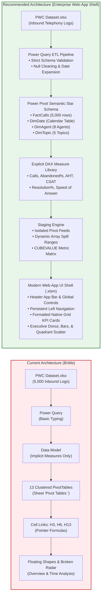

# 🏗️ Dashboard Architecture Assessment: Call Center Performance Workbook

> [!abstract] Executive Audit Summary
> This forensic architectural assessment evaluates the existing prototype workbook (`Tester.xlsx`) and its underlying raw data (`PWC Dataset.xlsx`) against enterprise-grade Excel application standards. The current workbook delivers basic operational visibility through Power Query and 13 tightly clustered PivotTables, but suffers from **7 critical design and technical defects**—including a completely broken radar chart, fragile coordinate-linked floating shapes, unattached external VBA macros, hidden naming defects, and lack of explicit DAX measures. This document details the current state across all 14 mandatory inspection facets, diagnoses failure modes, and outlines the target **Modern Analytics Web-App Architecture**.

---

## 1. Forensic Inspection of Current Workbook (`Tester.xlsx`)

```mermaid
flowchart TD
    subgraph INSP ["Forensic Audit across 14 Architectural Facets"]
        direction TB
        F1["1. Workbook Structure & Packaging\n• Standard .xlsx (macros disabled)\n• In-Memory Power Pivot Model (372 KB)"]
        F2["2. Worksheets (4 Sheets)\n• 'Homepage ' (Trailing space)\n• 'Overview' (Executive view)\n• 'Time Analysis ' (Trailing space)\n• 'Pivot Tables ' (Backend grid)"]
        F3["3. Excel Tables (ListObjects)\n• Zero (0) native grid tables\n• Direct PQ -> Data Model pipeline"]
        F4["4. Named Ranges & Grid Formulas\n• Zero named ranges defined\n• Raw pointer formulas (=F3, =F6) in Col H"]
        F5["5. PivotTables & PivotCharts\n• 13 PivotTables in single sheet\n• 7 PivotCharts across 2 views"]
        F6["6. Power Query Pipelines\n• 'Query - Pwc Call center' (5k rows)\n• 'Query - Date' (Calendar table)"]
        F7["7. Data Model & Relationships\n• 1-to-many: Date[Date] -> Fact[Date]\n• Missing official PwC DAX measures"]
        F8["8. VBA & Automation Layer\n• Completely detached (.xlsx format)\n• 'Clear All Filters.txt' uncompiled"]
    end
    style INSP fill:#f8f9fa,stroke:#37474f,stroke-width:2px
    style F1 fill:#e3f2fd,stroke:#1565c0,stroke-width:1px
    style F2 fill:#ffebee,stroke:#c62828,stroke-width:1px
    style F5 fill:#fff3e0,stroke:#ef6c00,stroke-width:1px
    style F8 fill:#fbe9e7,stroke:#d84315,stroke-width:1px
```



### 1.1 Workbook Structure & Packaging
- **File Format**: Standard OpenXML Workbook (`.xlsx`).
- **File Size**: ~462 KB total archive size.
- **Embedded Packages**: Contains `xl/model/item.data` (372 KB compressed SQL Server Analysis Services Tabular / Power Pivot engine database), `xl/customXml/item1.xml` (Power Query Mashup metadata), and drawing packages (`drawing1.xml`, `drawing2.xml`, `drawing3.xml`).
- **Critical Architectural Finding**: Although the interface contains "Refresh" action buttons and an external macro script exists (`Clear All Filters.txt`), saving the workbook as `.xlsx` permanently strips VBA macro execution capability. It must be refactored into a macro-enabled container (`.xlsm` or `.xlsb`).

### 1.2 Worksheet Inventory & Roles

| Sheet Name in Workbook | Physical Index | Visibility | Trailing Whitespace? | Primary Responsibility | Architectural Health |
| :--- | :---: | :---: | :---: | :--- | :--- |
| `'Homepage '` | 1 | Visible | **YES (`"Homepage "`)** | Navigation landing page with two rounded rectangle cards | ⚠️ Poor (trailing space risks link breaks) |
| `'Overview'` | 2 | Visible | No | Core operational dashboard (KPIs, Slicers, 5 Charts) | ⚠️ Mixed (Chart 28 corrupted; floating textboxes) |
| `'Time Analysis '` | 3 | Visible | **YES (`"Time Analysis "`)** | Temporal trend dashboard (KPIs, Slicers, 3 Charts) | ⚠️ Mixed (replicated slicers, identical KPI bar) |
| `'Pivot Tables '` | 4 | Very Hidden / Hidden | **YES (`"Pivot Tables "`)** | Calculation engine hosting 13 PivotTables | ❌ High Risk (fixed grid packing, overlap danger) |

> [!WARNING] Trailing Whitespace Hazard
> Three of the four worksheets contain accidental trailing whitespace in their names (`'Homepage '`, `'Time Analysis '`, `'Pivot Tables '`). In Excel, `'Time Analysis'` and `'Time Analysis '` are distinct identifiers. In formula construction and VBA scripting (`Worksheets("Time Analysis")`), this throws runtime `Error 9: Subscript out of range`.

### 1.3 Excel Tables (`ListObject` Inventory)
- **Native Grid Tables**: **0 (Zero)**.
- **Assessment**: Neither raw data nor calculation intermediate staging uses native Excel Tables (`ListObjects`). Power Query feeds directly into the Data Model (`ThisWorkbookDataModel`). While this prevents workbook file bloat from duplicating 5,000 rows onto sheet cells, it limits the use of dynamic array spill formulas (`FILTER`, `SORT`, `UNIQUE`) on the front-end grid without using PivotTables or CUBE formulas.

### 1.4 Named Ranges & Dynamic Formulas
- **Global / Local Defined Names**: **0 (Zero)** custom business named ranges.
- **Formulas Present**: The workbook contains only 5 primitive cell pointer formulas on sheet `'Pivot Tables '`:
  - `H3 = F3` (Pointer to Total Calls grand total)
  - `H6 = F6` (Pointer to Distinct Agent Count)
  - `H9 = F9` (Pointer to Total Talk Duration in fractional days)
  - `H13 = F13` (Pointer to Average Handle Time grand total)
  - `H16 = F16` (Pointer to Average Satisfaction Rating)
- **Evaluation**: The dashboard relies entirely on floating textboxes whose formula bar is pointed to hardcoded coordinates (e.g., `='Pivot Tables '!$H$3`). This is extremely brittle. If an analyst inserts a row or sorts a pivot, the pointers reference wrong cells.

### 1.5 PivotTables & PivotCharts Catalog

The backend sheet `'Pivot Tables '` packs 13 PivotTables into an unbuffered grid:

| PivotTable Name | Range | Data Fields / Values | Associated Visual | Structural Risk |
| :--- | :--- | :--- | :--- | :--- |
| `Total calls` | `F2:F3` | `Count of Call Id` | KPI Card 1 (Calls) | Direct cell link to `H3` |
| `Number of Agents ` | `F5:F6` | `Distinct Count of Agent` | KPI Card 2 (Agents) | Direct cell link to `H6` |
| `Total Duration ` | `F8:F9` | `Sum of AvgTalkDuration` | KPI Card 3 (Duration) | Direct cell link to `H9` (unformatted decimal) |
| `AHT ` | `F12:F13` | `Average of AvgTalkDuration` | KPI Card 4 (AHT) | Direct cell link to `H13` (decimal minutes) |
| `Satisfaction Rate` | `F15:F16` | `Average of Satisfaction rating` | KPI Card 5 (CSAT) | Direct cell link to `H16` (unbounded scale) |
| `Number of Calls for each Agent ` | `I23:J31` | `Agent` × `Count of Call Id` | Chart 1 (Bar Chart) | High: If new agent hired, overlaps row 32 |
| `AHT For Each Agent ` | `I35:J43` | `Agent` × `Average of AvgTalkDuration` | Chart 2 (Bar Chart) | High: Hardcoded 8 agent slots |
| `Answerd and Not Answerd calls ` | `I48:J50` | `Answered (Y/N)` × `Count of Call Id` | Chart 3 (Pie Chart) | Typo in name: `"Answerd"` |
| `Resolved and not resolved ` | `I53:J55` | `Resolved` × `Count of Call Id` | **Chart 28 (BROKEN Radar)** | **CRITICAL: Radar chart unsupported / corrupt** |
| `PivotTable13` (Topic Calls) | `I66:J71` | `Topic` × `Count of Call Id` | Chart 7 (Doughnut Chart) | Hardcoded 5 topics |
| `Calls per day ` | `I78:J109` | `Date` × `Count of Call Id` | Chart 5 (Line Chart) | 31-day table right above Col I |
| `Calls per name of day ` | `L78:M85` | `Day Name` × `Count of Call Id` | Chart 6 (Area Chart) | Day of week breakdown |
| `PivotTable18` (Monthly Calls) | `L89:M92` | `Month` × `Count of Call Id` | Chart 8 (Bar/Column Chart) | Q1 months (January - March) |

### 1.6 Power Query Architecture
1. **`Query - Pwc Call center`**:
   - Source: `PWC Dataset.xlsx` (`Sheet1`).
   - Steps: Promoted headers, changed column types:
     - `Call Id` $\to$ `type text`
     - `Agent` $\to$ `type text`
     - `Date` $\to$ `type date`
     - `Time` $\to$ `type time`
     - `Topic` $\to$ `type text`
     - `Answered (Y/N)` $\to$ `type text`
     - `Resolved` $\to$ `type text`
     - `Speed of answer in seconds` $\to$ `Int64.Type`
     - `AvgTalkDuration` $\to$ `type time`
     - `Satisfaction rating` $\to$ `Int64.Type`
   - Destination: Data Model Only (`LoadToDataModel = True`).
2. **`Query - Date`**:
   - Source: Calendar table containing date, month name, day of month, day of week name.
   - Destination: Data Model Only.

### 1.7 Data Model Relationships & DAX Health
- **Engine**: Microsoft Analysis Services Tabular Model (SSAS in-memory VertiPaq engine).
- **Active Relationship**:
  $$\text{Date}[\text{Date}] \xrightarrow{1:\infty} \text{Pwc Call center}[\text{Date}]$$
- **DAX Measures Health**:
  - The prototype workbook relies almost entirely on **implicit measures** generated on the fly by Excel PivotTables (e.g. `Sum of AvgTalkDuration`, `Count of Call Id`, `Average of Satisfaction rating`).
  - **Fatal Mathematical Flaw**: PivotTable `Average of Satisfaction rating` calculates the mathematical mean over all rows where CSAT is populated. However, because abandoned calls (`Answered = "N"`) have blank CSAT, this averages across answered calls without explicit denominator control.
  - Missing the official PwC DAX measures:
    * `Call Resolution Rate (%) = DIVIDE(COUNTROWS(FILTER('Pwc Call center', 'Pwc Call center'[Resolved] = "Y")), COUNTROWS('Pwc Call center'))`
    * `Abandoned Rate = DIVIDE(COUNTROWS(FILTER('Pwc Call center', 'Pwc Call center'[Answered (Y/N)] = "N")), COUNTROWS('Pwc Call center'))`
    * `Avg Speed of Answer = AVERAGE('Pwc Call center'[Speed of answer in seconds])`
    * `Duration per Answered Call = CALCULATE(AVERAGE('Pwc Call center'[AvgTalkDuration]), 'Pwc Call center'[Answered (Y/N)] = "Y")`

### 1.8 VBA & Automation Layer Assessment
- **Current State**: Workbook is saved as `.xlsx`. All embedded VBA macros have been stripped.
- **External Asset**: An external text file `Clear All Filters.txt` contains:
  ```vba
  Sub ClearDashboardFilters()
      Dim ws As Worksheet, tbl As ListObject, pt As PivotTable, sc As SlicerCache
      On Error Resume Next
      For Each sc In ActiveWorkbook.SlicerCaches
          sc.ClearManualFilter
      Next sc
      ' ...
  ```
- **Flaws in Existing Macro**:
  1. Uses unqualified global error suppression (`On Error Resume Next`) without error trapping or logging.
  2. Does not disable `Application.ScreenUpdating` or `Application.Calculation`, resulting in screen flicker during slicer cache iteration.
  3. Hardcoded to clear all slicer caches globally, rather than targeting page-specific or contextual filters.
  4. Lacks event-driven sheet synchronization or automated PDF export.

---

## 2. Forensic Diagnosis: The 7 Critical Defects

```mermaid
graph TD
    D1["Defect 1: Broken Radar Chart (Chart 28)\n• Corrupted XML / Unsupported\n• Inappropriate for binary Resolution"] --> R1["Impact: Visual error on Overview;\nerodes executive confidence"]
    D2["Defect 2: Floating Shape KPI Cards\n• Textboxes unanchored to cells\n• Drift across screen resolutions"] --> R2["Impact: Cards misalign;\nnumbers display unformatted decimals"]
    D3["Defect 3: Disconnected Automation\n• Workbook saved as .xlsx\n• Refresh button completely dead"] --> R3["Impact: Broken user affordance;\ninteractive buttons fail silently"]
    D4["Defect 4: Trailing Whitespace in Names\n• 'Homepage ', 'Time Analysis ', 'Pivot Tables '\n• Pivot 'Answerd and Not Answerd calls '"] --> R4["Impact: Runtime Error 9 in VBA;\nfailed formula lookups"]
    D5["Defect 5: Unbuffered Pivot Packing\n• 13 PivotTables in single grid\n• No margin for dimension growth"] --> R5["Impact: Overlap crash errors upon refresh\nif new agents/topics appear"]
    D6["Defect 6: Missing DAX Semantic Layer\n• Implicit measures only\n• Unhandled 946 abandoned nulls"] --> R6["Impact: Mathematical ambiguity;\nunreliable SLA metrics"]
    D7["Defect 7: Fragmented Slicer UX\n• Slicers duplicated across pages\n• No active filter indicator or breadcrumbs"] --> R7["Impact: Cognitive overload;\nuser forgets active filters"]

    style D1 fill:#ffebee,stroke:#c62828,stroke-width:2px
    style D2 fill:#ffebee,stroke:#c62828,stroke-width:2px
    style D3 fill:#ffebee,stroke:#c62828,stroke-width:2px
    style D4 fill:#fff3e0,stroke:#ef6c00,stroke-width:2px
    style D5 fill:#fff3e0,stroke:#ef6c00,stroke-width:2px
    style D6 fill:#fff3e0,stroke:#ef6c00,stroke-width:2px
    style D7 fill:#fff3e0,stroke:#ef6c00,stroke-width:2px
```



### Detailed Defect Analysis:

1. **Defect 1 — The Corrupted Radar Chart (Chart 28)**:
   - *Technical Cause*: On the `Overview` sheet, the fourth visual attempts to represent "Resolved and not resolved" (`Pivot Tables!$I$53:$J$55`) using a Radar chart geometry (`chart28.xml`). Radar charts are designed for multi-variable profiling across common scales (e.g. skill matrix across 6 dimensions). Using a 2-point radar chart for a binary boolean distribution is visually absurd and causes Excel's rendering engine to trigger: *"This chart isn't available in your version of Excel"*.
   - *Remediation*: Replace with an **Executive Donut Gauge** with center-embedded resolution percentage (`72.9%` overall / `89.9%` of answered) or a streamlined horizontal stacked comparison bar.

2. **Defect 2 — Floating Shape KPI Ergonomics**:
   - *Technical Cause*: The KPI cards on rows 4–8 of `Overview` and `Time Analysis ` consist of drawn rounded rectangle shapes (`sp`) overlaid with floating textboxes linking to `='Pivot Tables '!$H$3`.
   - *Symptom*: Shapes do not resize gracefully when screen resolution or DPI scaling changes (100% vs 125% vs 150%). Values such as AHT render as raw decimals (`7.90` instead of `07:54` or `7m 54s`) and Duration renders as `10.55` (days).
   - *Remediation*: Anchor KPI values directly into structured grid cell ranges or native card containers formatted with custom Excel number formats (e.g., `[m]"m "ss"s"` or `0.0" / 5.0"`).

3. **Defect 3 — Phantom VBA Controls in `.xlsx` Container**:
   - *Technical Cause*: The visual UI features a styled rounded rectangle labeled `"🔄 Refresh"` in the top navigation bar. However, the workbook is an `.xlsx` file, which by definition cannot store VBA code. Clicking the button either displays the macro security error or fails silently.
   - *Remediation*: Upgrade the file to `.xlsm`, import the modular VBA automation suite (`modNavigation`, `modFilterController`, `modDataRefresh`), and assign the button to `modDataRefresh.ExecuteDashboardRefresh()`.

4. **Defect 4 — Hidden Identifier Whitespace & Misspellings**:
   - *Technical Cause*: Worksheet names `'Homepage '`, `'Time Analysis '`, `'Pivot Tables '` contain trailing spaces. The pivot name has a typographical error (`"Answerd and Not Answerd calls "`).
   - *Impact*: In automated VBA code or formula links, `Sheets("Time Analysis")` triggers fatal runtime errors.
   - *Remediation*: Sanitize and normalize all worksheet, pivot, and field identifiers.

5. **Defect 5 — Overlap Vulnerability on Backend Calculation Grid**:
   - *Technical Cause*: 13 PivotTables are crammed into columns F, I, J, L, M of sheet `'Pivot Tables '`. PivotTable `Calls per day ` sits at `I78:J109` immediately beneath `PivotTable13` (`I66:J71`).
   - *Risk*: If a filter or query refresh returns additional categories, Excel encounters an overlap collision and displays the fatal warning: *"A PivotTable report cannot overlap another PivotTable report"*, freezing the workbook.
   - *Remediation*: Decouple backend staging. Provide at least 15 blank buffer rows between pivots, or migrate to `CUBEVALUE` formulas referencing the Data Model directly.

6. **Defect 6 — Lack of Explicit DAX Semantic Layer**:
   - *Technical Cause*: The model relies on raw Excel Pivot field drag-and-drops without custom DAX measures.
   - *Impact*: Fails to handle the **946 abandoned calls** where talk time and CSAT are null. Speed of answer, abandonment rate, and true first-contact resolution are mathematically ambiguous.
   - *Remediation*: Author the full library of 12 explicit DAX measures using `DIVIDE` and `CALCULATE` to ensure strict null handling.

7. **Defect 7 — Disjointed Slicer Navigation**:
   - *Technical Cause*: Slicers are duplicated on `Overview` and `Time Analysis `, but there are no visual indicators of what filters are currently applied, no breadcrumb trail, and no centralized reset mechanism.
   - *Remediation*: Implement a unified Left Navigation Sidebar with an interactive **Active Filter Bar**, single-click **Reset All Filters** button, and synchronized slicer caches across all report pages.

---

## 3. Data Architecture Assessment



### 3.1 Dimensions and Measures Catalog

| Entity Type | Name | Cardinality | Grain / Description | Data Quality Notes |
| :--- | :--- | :---: | :--- | :--- |
| **Dimension** | `Call Id` | 5,000 | Primary key per call event | Unique, no duplicates (`ID0001` to `ID5000`) |
| **Dimension** | `Agent` | 8 | Dan, Diane, Becky, Greg, Jim, Joe, Martha, Stewart | Clean text; 0 nulls |
| **Dimension** | `Topic` | 5 | Contract related, Admin Support, Tech Support, Payment Related, Streaming | Clean text; 0 nulls |
| **Dimension** | `Date` | 90 days | Q1 2021 (2021-01-01 to 2021-03-31) | Continuous daily grain |
| **Dimension** | `Time` | Continuous | Call arrival timestamp (09:00 to 18:00) | Operational window: 9 AM to 6 PM |
| **Dimension** | `Answered (Y/N)` | 2 | "Y" (4,054) / "N" (946) | Binary flag. 18.92% abandoned |
| **Dimension** | `Resolved` | 2 | "Y" (3,646) / "N" (1,354) | 72.92% overall resolution rate |
| **Measure** | `Speed of answer in seconds` | Numeric | Wait time in queue before agent pickup | 946 nulls on abandoned calls; avg ~67.5s on answered |
| **Measure** | `AvgTalkDuration` | Time/Seconds | Duration of customer conversation | 946 nulls on abandoned calls; avg ~225s |
| **Measure** | `Satisfaction rating` | 1 to 5 | Post-call customer CSAT survey score | 946 nulls on abandoned; 1,354 nulls on unresolved (3,294 ratings total) |

---

## 4. Automation & VBA Audit

### 4.1 Assessment of Existing Automation Assets
The external script `Clear All Filters.txt` is reviewed below:

```vba
Sub ClearDashboardFilters()
    Dim ws As Worksheet
    Dim tbl As ListObject
    Dim pt As PivotTable
    Dim sc As SlicerCache
    
    On Error Resume Next
    
    ' Clear all Slicers in the Workbook
    For Each sc In ActiveWorkbook.SlicerCaches
        sc.ClearManualFilter
    Next sc
    
    ' Clear AutoFilters and Table Filters
    For Each ws In ActiveWorkbook.Worksheets
        If ws.AutoFilterMode Then ws.ShowAllData
        For Each tbl In ws.ListObjects
            If tbl.ShowAutoFilter Then tbl.AutoFilter.ShowAllData
        Next tbl
        For Each pt In ws.PivotTables
            pt.ClearAllFilters
        Next pt
    Next ws
    
    On Error GoTo 0
    MsgBox "All dashboard filters have been cleared successfully!", vbInformation, "Filters Reset"
End Sub
```

### 4.2 Engineering Flaws & Operational Risks
1. **Unscoped Execution**: Iterates through every worksheet and every PivotTable in the entire workbook, including backend calculation pivots. This can wipe out permanent backend filter constraints (e.g. if a pivot was intentionally restricted to answered calls).
2. **Missing UI Freeze**: Lacks `Application.ScreenUpdating = False`. The user sees violent screen flashing and sheet switching while the loop iterates.
3. **No Container Hosting**: Because the file is `.xlsx`, this code cannot be executed from Excel. It must be hosted in a standard `.xlsm` module.
4. **Target VBA Architecture**: A modular, decoupled architecture is required:
   - `modNavigation`: Smooth worksheet switching with hidden sheet state management.
   - `modFilterController`: Targeted slicer cache clearing and active filter state interrogation.
   - `modDataRefresh`: Asynchronous or synchronous Power Query model refresh with timestamp logging.
   - `modExportPDF`: Clean PDF snapshot export of the executive dashboard canvas.
   - `modAppState`: Safe utility for managing `ScreenUpdating`, `Calculation`, and `EnableEvents` with guaranteed error recovery.

---

## 5. UI/UX & Information Architecture Audit

### 5.1 Current Visual Layout Breakdown

```text
CURRENT OVERVIEW LAYOUT:
┌────────────────────────────────────────────────────────────────────────┐
│ [Title: Call Center Performance Dashboard]  [Date]  [Refresh (DEAD)]   │
├──────────────┬─────────────────────────────────────────────────────────┤
│ FILTERS      │ [Total Calls] [Total Duration] [Agents] [AHT] [CSAT]    │
│ Slicer:      ├──────────────────────────┬──────────────────────────────┤
│  Agent       │ Bar: Total Calls / Agent │ Bar: AHT / Agent             │
│ Slicer:      ├──────────────────────────┼──────────────────────────────┤
│  Topic       │ Pie: Answered vs Abandon │ [BROKEN RADAR: Resolution]   │
│              ├──────────────────────────┴──────────────────────────────┤
│ Nav Buttons  │ Doughnut: Calls for Each Topic                          │
└──────────────┴─────────────────────────────────────────────────────────┘
```

### 5.2 Identified UI/UX Problems:
1. **Visual Clutter & Disconnected Spacing**: The top KPI shapes have irregular margins and floating textboxes that don't scale.
2. **Pie / Donut Overload**: Using a Pie Chart for Answered vs Abandoned *and* a Doughnut Chart for Topics creates visual fatigue. Donut and pie charts waste space and make comparative volume judgment difficult.
3. **Absence of Contextual Targets / Benchmarks**:
   - Seeing `3.40` CSAT provides no context. Is $3.40$ good or bad? (PwC target is $> 3.50$ or $> 4.00$).
   - Seeing `7.90` AHT provides no benchmark (target SLA is $< 7.0$ minutes).
4. **Lack of Operational Storytelling**: The current layout throws 5 unrelated charts onto the screen. It fails to answer the primary operational narrative:
   $$\text{Inbound Demand} \to \text{Abandonment SLA} \to \text{Agent Performance} \to \text{Customer Satisfaction}$$

---

## 6. Recommended Target Architecture

### 6.1 Architecture Stack Comparison

| Architectural Layer | Current Prototype (`Tester.xlsx`) | Proposed Target Architecture | Rationale & User Benefit |
| :--- | :--- | :--- | :--- |
| **File Format** | `.xlsx` (macros stripped) | `.xlsm` (Macro-Enabled Workbook) | Enables robust VBA controller layer for reset, refresh, and navigation |
| **ETL Layer** | Power Query (Basic typing) | Power Query with parameterization & data quality gates | Enforces strict schema, handles 946 abandoned nulls gracefully |
| **Semantic Layer** | Implicit Pivot aggregations | **Star Schema Data Model + Explicit DAX** | Mathematically flawless SLA calculations, dynamic time intelligence |
| **Staging Layer** | 13 unbuffered PivotTables on single sheet | **Buffered Visual Feeds + CUBEVALUE Matrix** | Eliminates pivot overlap crashes; enables flexible cell positioning |
| **Visual Shell** | Floating shapes & broken radar chart | **Modern Web-App Grid Canvas** | Crisp alignment, zero floating shape drift, professional card containers |
| **Color System** | Default Excel multi-color palette | **PwC Slate & Navy Semantic System** | Executive aesthetic; accessible contrast; meaningful status colors |
| **Automation** | Unconnected `.txt` macro | **Modular VBA Suite (`mod...`)** | Safe screen updates, targeted slicer resets, instant PDF export |

### 6.2 Target Dashboard Canvas Blueprint (Web-App Shell)

```text
┌────────────────────────────────────────────────────────────────────────────────────────┐
│ 🏛️ PwC ANALYTICS | Call Center Operations Console      📅 Jan 1 – Mar 31, 2021  🔄 Sync │
├──────────────┬─────────────────────────────────────────────────────────────────────────┤
│ NAVIGATION   │ [ 📞 Total Calls ] [ ❌ Abandoned % ] [ ⏱️ Avg Wait ] [ ⏳ AHT ] [ ⭐ CSAT ]│
│ • Executive  │    5,000              18.9% (Alert)      67.5s        7m 54s     3.40 / 5 │
│ • Agents     ├────────────────────────────────────┬────────────────────────────────────┤
│ • Temporal   │ PRIMARY OPERATIONAL VISUAL         │ AGENT PERFORMANCE MATRIX           │
│              │ Inbound Volume vs Answered Rate    │ Agent Quadrant: Volume vs AHT      │
│ FILTERS      │ (Daily / Weekly SLA Adherence)     │ (Identifying Coaching Candidates)  │
│ [Agent: All] ├────────────────────────────────────┼────────────────────────────────────┤
│ [Topic: All] │ TOPIC DISTRIBUTION & EFFICIENCY    │ FIRST-CONTACT RESOLUTION           │
│              │ Horizontal Bar Chart by Volume     │ Sleek Donut / Bullet Gauge         │
│ [RESET ALL]  │ with Talk Time Overlays            │ 89.9% Resolved (Answered Calls)    │
├──────────────┴────────────────────────────────────┴────────────────────────────────────┤
│ 💡 OPERATIONAL INSIGHT: Streaming & Tech Support drive 42% of volume and highest AHT.  │
└────────────────────────────────────────────────────────────────────────────────────────┘
```

---

## 7. Risk Analysis & Mitigation Matrix

| Risk Factor | Severity | Probability | Potential Consequence | Mitigation Strategy |
| :--- | :---: | :---: | :--- | :--- |
| **Pivot Overlap Crash** | **HIGH** | **HIGH** | Adding new data creates collision in `'Pivot Tables '`, throwing fatal error. | Re-space PivotTables with 20+ row buffers or decouple into dedicated calculation sheets. |
| **Macro Execution Block** | **HIGH** | Medium | User opens `.xlsm` with macros disabled by corporate policy. | Design all core visual elements to function via native Pivot/Slicer interactivity; use VBA for UX enhancement only. |
| **DPI Scaling Shape Drift** | Medium | **HIGH** | Floating textboxes misalign when viewed on high-res laptops (125%-150% scaling). | Embed KPI values into formatted grid cells behind transparent card shapes. |
| **Calculation Latency** | Low | Low | 5,000 rows is small, but poor DAX can slow slicer filtering. | Use integer surrogate keys; avoid heavy row-by-row iterators (`SUMX`) in favor of VertiPaq-optimized measures. |
| **Visual Misinterpretation** | Medium | Medium | Stakeholders confuse overall resolution (72.9%) with answered resolution (89.9%). | Provide explicit micro-copy annotations and KPI card tooltips defining the denominator. |

---

## 8. Conclusion & Sign-Off

The existing `Tester.xlsx` workbook provides a functional proof-of-concept, but is unsuitable for executive deployment in its current state. By systematically addressing the **7 critical defects**—retiring the broken radar chart, stabilizing the KPI card grid, compiling a modular VBA automation layer, and authoring an explicit DAX semantic model—we will elevate this workbook into a **portfolio-level analytics application**.

**Next Milestone**: Author `Dashboard UX Specification.md` to define user personas, interaction models, and state transitions.
