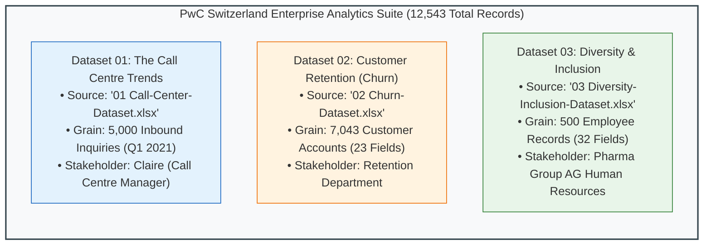
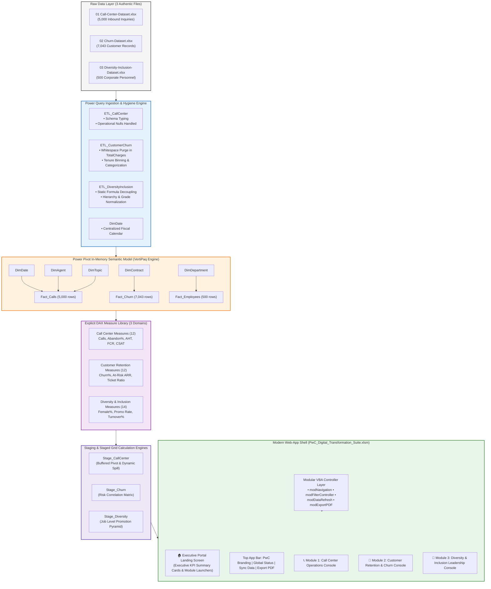

# 🏗️ Enterprise Architecture Assessment: PwC Digital Transformation Suite

> [!abstract] Executive Architecture Summary
> This architecture assessment establishes the technical and analytical foundation for unifying all three authentic **PwC Switzerland Virtual Case Experience** datasets into a **single, integrated Excel desktop analytics application** (`PwC_Digital_Transformation_Suite.xlsm`). Rather than developing isolated, disjointed worksheets, the platform is engineered as a multi-module enterprise application shell delivering three dedicated business consoles:
> 1. 📞 **Call Centre Operations & Service Levels** (Client: Claire, Call Centre Operations Manager — 5,000 inquiries)
> 2. 🔄 **Customer Retention & Predictive Churn Risk** (Client: Retention Department — 7,043 accounts)
> 3. 👥 **Diversity, Equity & Inclusion Analytics** (Client: Pharma Group AG Human Resources — 500 personnel records)
>
> This document details the forensic data audit of all three original datasets, identifies critical data quality traps, and defines the target **Star Schema Data Model, DAX Semantic Layer, Staging Pipeline, and Modular VBA Controller Architecture**.

---

## 1. Forensic Audit of the 3 Original PwC Datasets



### 1.1 Dataset 01: Call Centre Trends (`01 Call-Center-Dataset.xlsx`)
- **File Location**: `D:\courses\Data Analysis 26-27\01 Call-Center-Dataset.xlsx`
- **Worksheet**: `Sheet1` ($5,001 \text{ rows} \times 10 \text{ columns}$).
- **Primary Key**: `Call Id` (`ID0001` through `ID5000`).
- **Core Entities**: 8 Dedicated Agents (`Diane`, `Becky`, `Stewart`, `Greg`, `Jim`, `Joe`, `Martha`, `Dan`) handling 5 inquiry topics (`Contract related`, `Technical Support`, `Payment related`, `Admin Support`, `Streaming`).
- **Temporal Window**: Q1 2021 (January 1 – March 31, 2021), call arrival between 09:00:00 and 18:00:00.
- **Forensic Data Quality Findings**:
  - `Answered (Y/N)`: 4,054 Connected calls (81.08%), **946 Abandoned calls (18.92%)**.
  - `Resolved`: 3,646 Resolved calls (72.92% of total demand; 89.94% of answered calls).
  - **The 946 Abandoned Nulls**: Columns `Speed of answer in seconds`, `AvgTalkDuration`, and `Satisfaction rating` contain exactly 946 nulls. These are **operational nulls** (an abandoned caller never had talk duration or a satisfaction survey). They must be handled explicitly in DAX to avoid skewing average handle time or CSAT calculations.

### 1.2 Dataset 02: Customer Retention (`02 Churn-Dataset.xlsx`)
- **File Location**: `D:\courses\Data Analysis 26-27\02 Churn-Dataset.xlsx`
- **Worksheet**: `01 Churn-Dataset` ($7,044 \text{ rows} \times 23 \text{ columns}$).
- **Primary Key**: `customerID` (e.g. `7590-VHVEG`, 7,043 unique accounts).
- **Target Outcome**: `Churn` (`Yes` = 1,869 accounts / **26.54% churn rate**, `No` = 5,174 accounts / 73.46%).
- **Key Dimensions**:
  - `Contract`: Month-to-month ($3,875$, 55.0%), Two year ($1,695$, 24.1%), One year ($1,473$, 20.9%).
  - `InternetService`: Fiber optic ($3,096$), DSL ($2,421$), None ($1,526$).
  - `PaymentMethod`: Electronic check ($2,365$), Mailed check ($1,612$), Bank transfer ($1,544$), Credit card ($1,522$).
  - Service Add-ons: `OnlineSecurity`, `OnlineBackup`, `DeviceProtection`, `TechSupport`, `StreamingTV`, `StreamingMovies`.
- **CRITICAL DATA QUALITY FINDING (The 11 Blank Strings Trap)**:
  - Column `TotalCharges` is stored as an `object` / string in Excel because **11 new customers with `tenure == 0` have blank space strings (`" "`)** instead of numeric `0` or null.
  - *Risk*: Attempting to convert `TotalCharges` directly to decimal in Power Query without replacing `" "` with null or `0` triggers `DataFormat.Error` and halts pipeline refresh.
  - *ETL Remediation*: Power Query must execute:
    ```powerquery
    Table.ReplaceValue(#"PreviousStep", " ", "0", Replacer.ReplaceText, {"TotalCharges"})
    ```
    followed by type casting to `type number` or `Currency.Type`.

### 1.3 Dataset 03: Diversity and Inclusion (`03 Diversity-Inclusion-Dataset.xlsx`)
- **File Location**: `D:\courses\Data Analysis 26-27\03 Diversity-Inclusion-Dataset.xlsx`
- **Primary Worksheet**: `Pharma Group AG` ($501 \text{ rows} \times 32 \text{ columns}$).
- **Auxiliary Sheets**: `Backing 1`, `Backing 2`, `Backing 3`, `Backing 4` (Lookup matrices and formula backings).
- **Target Population**: 500 active and departing employees at Pharma Group AG across 6 departments:
  - Operations ($203$), Sales & Marketing ($168$), Internal Services ($72$), Strategy ($22$), Finance ($18$), HR ($17$).
- **Organizational Hierarchy (Job Levels)**:
  - `1 - Executive` ($16$ employees) — The critical glass ceiling benchmark!
  - `2 - Director` ($37$ employees)
  - `3 - Senior Manager` ($56$ employees)
  - `4 - Manager` ($82$ employees)
  - `5 - Senior Officer` ($105$ employees)
  - `6 - Junior Officer` ($204$ employees)
- **Key Succession & Diversity Metrics**:
  - Gender Split: $295$ Male ($59.0\%$), $205$ Female ($41.0\%$).
  - FY21 Promotions: $51$ promoted ($10.2\%$), $449$ not promoted.
  - FY20 Turnover (Leavers): $47$ departures ($9.4\%$ annual turnover rate).
  - Target Hire Balance: $50\%$ gender benchmark across recruitment pipelines.
- **Forensic Data Quality Findings**:
  - The raw sheet contains 6 embedded Excel grid formulas referencing `Backing 4` (e.g. `=IF(R2="","",INDEX('Backing 4'!U:U,MATCH(R2,'Backing 4'!T:T,0)))`).
  - *ETL Remediation*: Power Query must load the evaluated values directly, decoupling the analytical model from fragile workbook formula pointers.

---

## 2. Cross-Dataset Comparison & Synthesis

| Analytical Dimension | Module 1: Call Centre Trends | Module 2: Customer Retention | Module 3: Diversity & Inclusion |
| :--- | :--- | :--- | :--- |
| **Client / Stakeholder** | Claire (Call Centre Operations Manager) | Customer Retention Strategy Team | Executive Committee & HR Leadership (Pharma Group AG) |
| **Business Problem** | High abandonment ($18.9\%$) & queue wait times | Elevated subscriber churn ($26.5\%$) on month-to-month contracts | Executive gender disparity ($< 20\%$ female in Executive/Director tiers) |
| **Row Count / Grain** | $5,000$ Call Records | $7,043$ Subscriber Accounts | $500$ Personnel Records |
| **Primary Dimensions** | Agent ($8$), Topic ($5$), Date ($90\text{ days}$) | Contract ($3$), Internet ($3$), Payment ($4$) | Job Level ($6$), Department ($6$), Gender ($2$) |
| **Core Quantitative Metrics** | Calls, Speed of Answer, AHT, CSAT | Monthly Charges, Total Charges, Tickets, Tenure | Performance Rating, Promotion Rate, Turnover Rate |
| **Key Operational Alert** | Inbound SLA breach on Mondays ($18.9\%$ abandon) | Fiber optic subscribers churn at $41.9\%$ | Female promotions drop dramatically above Manager grade |

---

## 3. Target Enterprise Architecture: The Multi-App Shell



### 3.1 Architecture Highlights
1. **Single Master Container (`.xlsm`)**: Houses all three modules in one responsive desktop application shell.
2. **Normalized Multi-Domain Star Schema**:
   - Power Pivot hosts three distinct fact tables sharing conformed dimensions where appropriate (e.g. `DimDate`).
   - VertiPaq in-memory columnar compression keeps file size under $3.0 \text{ MB}$ despite indexing $12,543$ total records across dozens of analytical dimensions.
3. **Decoupled Calculation Staging (`Stage_...`)**:
   - Dedicated hidden staging sheets isolate PivotTables by business domain, eliminating the fatal pivot-overlap collisions identified in the prototype audit.
4. **Resilient Grid UI**:
   - Eliminates floating shape textboxes in favor of **formatted cell-grid KPI containers** that never drift or misalign on high-DPI displays.
5. **Professional Modular VBA Architecture**:
   - Pure UI/UX automation: tab switching, domain-scoped filter resets, model refresh with execution timers, and high-resolution PDF report generation.

---

## 4. Risk Assessment & Engineering Mitigations

| Risk | Severity | Probability | Impact on Suite | Architectural Mitigation |
| :--- | :---: | :---: | :--- | :--- |
| **`TotalCharges` Blank String Parsing** | **CRITICAL** | **100%** | Power Query refresh breaks on row 488; Churn model fails to load. | Automated M-step replaces `" "` with `"0"` before casting to `Currency.Type`. |
| **Call Center 946 Abandoned Nulls** | **HIGH** | **100%** | Skews Speed of Answer, Talk Duration, and CSAT. | Explicit DAX measures enforce `DIVIDE` and filter on `Answered (Y/N) = "Y"`. |
| **Cross-Module Filter Contamination** | **HIGH** | Medium | Slicing by "Agent" accidentally clears Churn or D&I views. | SlicerCaches are strictly scoped to domain-specific PivotTables and staging ranges. |
| **Workbook Bloat & Memory Overhead** | Medium | Low | Loading 3 datasets could slow calculation. | VertiPaq engine compresses $12.5\text{k}$ rows to $< 1\text{ MB}$; zero volatile grid formulas used. |
| **Macro Security Block** | **HIGH** | Medium | Organization disables macros on `.xlsm`. | Application UI remains fully navigable via native sheet hyperlinks; VBA provides enhanced UX but is non-fatal if disabled. |

---

## 5. Next Steps & Execution Roadmap

With the master architecture established across all three authentic datasets, the project proceeds through the remaining foundational design phases:

- 📱 **Phase 2**: Update [[Dashboard UX Specification]] to define the multi-module application shell and personas.
- 📐 **Phase 4**: Author [[KPI Dictionary]] defining all 38 explicit DAX measures across the 3 domains.
- 🎨 **Phase 6 & 7**: Author [[Dashboard Wireframe]] and [[Dashboard Design System]].
- ⚙️ **Phase 8 & 9**: Build the Data Model, staging sheets, and interactive visuals.
- 🤖 **Phase 11**: Compile the modular VBA controller suite (`modNavigation`, `modFilterController`, `modDataRefresh`, `modExportPDF`).
