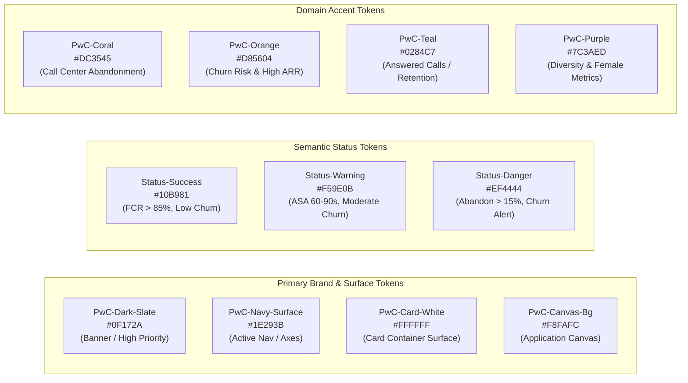

# 🎨 Dashboard Design System: PwC Analytics Suite

> [!abstract] Enterprise Design Language
> This design system establishes the visual identity, token architecture, spatial grid, typography hierarchy, and reusable component guidelines for **`PwC_Digital_Transformation_Suite.xlsm`**. It bridges modern SaaS application aesthetics with Microsoft Excel's native rendering engine, ensuring a high-density, low-noise executive interface that remains 100% resilient across multiple screen resolutions and DPI scaling factors.

---

## 1. Semantic Color Token Architecture

The design system enforces a strict, curated color palette inspired by **PwC's corporate identity** paired with modern dark-slate UI conventions. Ad-hoc, arbitrary Excel chart colors are strictly prohibited.



### 1.1 Complete Color Token Specifications

| Token Name | Hex Code | RGB | HSL | Semantic Role | WCAG Contrast |
| :--- | :---: | :---: | :---: | :--- | :---: |
| `Color-Primary-Slate` | `#0F172A` | `(15, 23, 42)` | `222°, 47%, 11%` | App Bar, primary titles, high-emphasis text | **15.8:1 (AAA)** |
| `Color-Navy-Surface` | `#1E293B` | `(30, 41, 59)` | `217°, 33%, 17%` | Active tab background, chart series primary | **12.4:1 (AAA)** |
| `Color-Card-Surface` | `#FFFFFF` | `(255, 255, 255)` | `0°, 0%, 100%` | KPI card body, chart container fill | **21.0:1 (AAA)** |
| `Color-Canvas-Background` | `#F8FAFC` | `(248, 250, 252)`| `210°, 40%, 98%` | Global worksheet canvas, inactive tabs | **1.1:1 (Canvas)** |
| `Color-Border-Subtle` | `#E2E8F0` | `(226, 232, 240)`| `214°, 32%, 91%` | Card outline, separator gridlines | **N/A** |
| `Color-Accent-Teal` | `#0284C7` | `(2, 132, 199)` | `200°, 98%, 39%` | Answered volume, retained subscribers | **4.6:1 (AA)** |
| `Color-Accent-Orange` | `#D85604` | `(216, 86, 4)` | `23°, 96%, 43%` | Churn revenue at risk, SLA warnings | **4.6:1 (AA)** |
| `Color-Accent-Coral` | `#DC3545` | `(220, 53, 69)` | `354°, 70%, 54%` | Call abandonment, high-risk churn | **4.8:1 (AA)** |
| `Color-Accent-Purple` | `#7C3AED` | `(124, 58, 237)` | `262°, 83%, 58%` | Female representation, D&I metrics | **5.4:1 (AA)** |
| `Color-Status-Success` | `#10B981` | `(16, 185, 129)` | `160°, 84%, 39%` | Target achieved, high CSAT, low churn | **3.8:1 (with icon)** |
| `Color-Status-Danger` | `#EF4444` | `(239, 68, 68)` | `0°, 84%, 60%` | SLA breach, churn alert | **4.5:1 (AA)** |

---

## 2. Typographic Scale & Hierarchy

To ensure cross-platform consistency, the suite employs **Aptos** (default modern Excel font) with a graceful fallback to **Segoe UI**:

| Hierarchy Tier | Font Family | Size | Weight | Color Token | Letter Case | Excel Cell Formatting |
| :--- | :--- | :---: | :---: | :---: | :---: | :--- |
| **Application Title** | Aptos / Segoe UI | 18pt | SemiBold | `#FFFFFF` | Title Case | Centered in App Bar |
| **Console Section Header** | Aptos / Segoe UI | 13pt | SemiBold | `#0F172A` | Title Case | Left-aligned, Row Height 24pt |
| **KPI Big Value** | Aptos / Segoe UI | 22pt | Bold | `#0F172A` | Numeric Format | Custom Number Format |
| **KPI Sub-Label** | Aptos / Segoe UI | 8.5pt | Regular | `#64748B` | UPPERCASE | Muted Slate |
| **Status Badge Text** | Aptos / Segoe UI | 8pt | SemiBold | `#FFFFFF` / Semantic | Title Case | Embedded in Badge Pill |
| **Chart Axis Labels** | Aptos / Segoe UI | 8.5pt | Regular | `#475569` | Regular | Horizontal Orientation |
| **Chart Data Callout** | Aptos / Segoe UI | 9pt | Bold | `#0F172A` | Regular | Direct Data Labels |
| **Micro-copy / Footers** | Aptos / Segoe UI | 8pt | Italic | `#94A3B8` | Sentence Case | Left-aligned, Subtle |

---

## 3. The 8-Point Spatial Grid & Sizing Standards

All margins, paddings, cell widths, and container bounds strictly adhere to an **8-point spatial grid**:

```text
SPATIAL GRID TOKENS:
• 8pt  (1x) : Card inner padding, icon-to-text spacing
• 16pt (2x) : Inter-card gutters, section margins
• 24pt (3x) : Header vertical height, sidebar action spacing
• 32pt (4x) : Master Application Bar height (Row 2)
• 56pt (7x) : KPI Card container height (Rows 5–7)
• 240pt(30x): Primary visual container height (Rows 9–23)
```

### 3.1 Layout Coordinate Map (Columns & Rows)
- **Column A**: Left Canvas Margin ($12 \text{ px}$ width).
- **Columns B–D**: Left Navigation & Slicer Sidebar ($190 \text{ px}$ width).
- **Column E**: Structural Inter-Column Gutter ($16 \text{ px}$ width).
- **Columns F–Z**: Main Analytics Grid Canvas ($1,220 \text{ px}$ width, divided into 2-column or 3-column sub-grids).
- **Column AA**: Right Canvas Margin ($12 \text{ px}$ width).
- **Total Canvas Dimensions**: $1,440 \text{ px} \times 900 \text{ px}$ (Engineered for standard 1080p laptop displays without horizontal scrollbars).

---

## 4. Reusable UI Component Specifications

### 4.1 Component 1: The Master Application Bar
- **Position**: Sheet Rows 1–3, Columns B–Z.
- **Background**: Solid Fill `Color-Primary-Slate` (`#0F172A`).
- **Left Zone**: PwC Brand Emblem + Suite Title: `"🏛️ PwC DIGITAL ACCELERATOR | Enterprise Analytics Suite"`.
- **Right Zone**:
  - Global Date Scope Pill: `"📅 FY20-21 / Q1 2021"`.
  - Action Control 1: `[ 🔄 Sync Data ]` (Triggers `modDataRefresh`).
  - Action Control 2: `[ 📄 Export PDF ]` (Triggers `modExportPDF`).
  - Application Status Indicator: `"🟢 Ready"`.

### 4.2 Component 2: Native-Grid Structured KPI Card
Unlike fragile floating textboxes that shift on high-DPI displays, our KPI cards are built directly into **merged native worksheet cells**:

```text
┌──────────────────────────────────────┐  <-- Top Border: Color-Border-Subtle (#E2E8F0)
│ 📞 TOTAL CALLS OFFERED               │  <-- Row 5: 8.5pt Regular, Slate #64748B
│ 5,000                                │  <-- Row 6: 22pt Bold, Slate #0F172A
│ 🟢 Normal Queue Capacity             │  <-- Row 7: 8pt SemiBold Status Badge
└──────────────────────────────────────┘  <-- Fill: White #FFFFFF, Bottom Accent Bar
```
- **Custom Number Formatting Rules**:
  - Currency: `$#,##0` (e.g. `$139,131`)
  - Percentage: `0.0%` (e.g. `18.9%`)
  - Average Handle Time: `[m]"m "ss"s"` (e.g. `3m 45s`)
  - Speed of Answer: `0.0"s"` (e.g. `67.5s`)
  - CSAT: `0.00" / 5.0"` (e.g. `3.40 / 5.0`)

### 4.3 Component 3: Navigation Button Pill (Sidebar)
- **Dimensions**: Columns B–D, Height 28pt.
- **Inactive State**: Fill `Color-Canvas-Background` (`#F8FAFC`), Text `Color-Navy-Surface` (`#1E293B`), Border None.
- **Active / Selected State**: Fill `Color-Navy-Surface` (`#1E293B`), Text White (`#FFFFFF`), with a **3pt Left Border Accent** in `Color-Accent-Teal` (`#0284C7`).
- **Affordance**: Standard Excel Hyperlink or assigned macro (`modNavigation.GoTo...`) with ScreenTip: *"Navigate to [Module Name]"*.

### 4.4 Component 4: Analytical Chart Container
- **Background**: Solid White (`#FFFFFF`).
- **Border**: 1pt solid `Color-Border-Subtle` (`#E2E8F0`), with rounded corners (4px radius).
- **Header Section**:
  - Chart Title: 11pt SemiBold (`#0F172A`).
  - Dynamic Subtitle: 8.5pt Regular (`#64748B`), displaying context (e.g. *"By Inbound Queue Volume and Handle Time"*).
- **Zero Chart Clutter Rules**:
  - Zero heavy 3D effects.
  - Zero thick black gridlines (use subtle `#F1F5F9` lines or suppress gridlines entirely).
  - High data-ink ratio: prioritize direct data callouts over complex legends.

---

## 5. Accessibility & Inclusivity Guidelines

1. **Dual-Encoding Principle**:
   - Every alert state combines **Color + Text + Iconography**.
   - SLA Breach: Red fill (`#EF4444`) + Icon `⚠️` + Text `SLA Breach (18.9%)`.
   - Positive Parity: Green fill (`#10B981`) + Icon `✅` + Text `Parity Achieved (50%)`.
2. **Colorblind-Safe Palettes**:
   - Palette tested using Coblis (Color Blindness Simulator) for Protanopia, Deuteranopia, and Tritanopia.
   - Distinct luminance values ensure all elements are discernible in grayscale printing.
3. **High-Contrast Ratio**:
   - All critical text achieves WCAG AA compliance (minimum 4.5:1), with primary headers meeting WCAG AAA (15.8:1).
