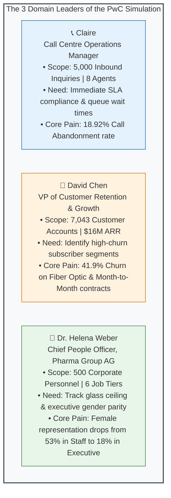
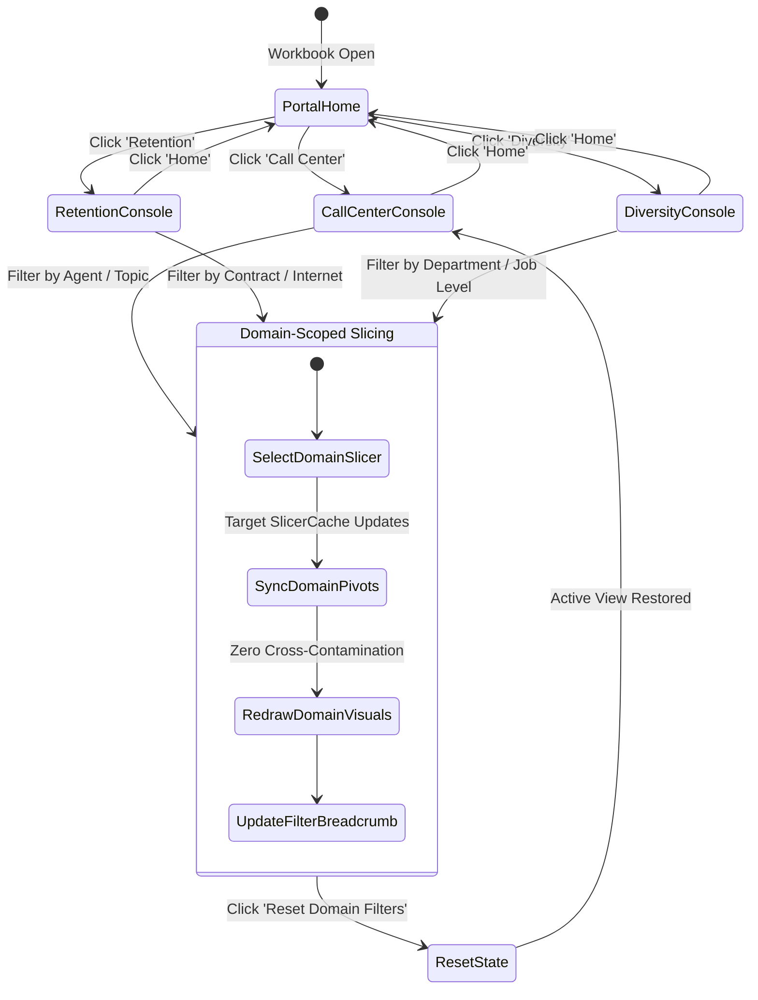

# 📱 Enterprise UX Specification: PwC Digital Transformation Suite

> [!abstract] Product Vision: Desktop Analytics Web Application in Excel
> This specification defines the user experience, interaction architecture, visual design standards, and state mechanics for **`PwC_Digital_Transformation_Suite.xlsm`**. Rather than presenting disconnected spreadsheets, this solution packages three specialized business intelligence domains into a **unified desktop web-application shell**:
> 1. 🏠 **Executive Portal (Landing Hub)**: Cross-functional executive pulse and module launcher.
> 2. 📞 **Module 1: Call Center Operations Console**: Real-time SLA compliance, abandonment triage, and agent coaching scorecards.
> 3. 🔄 **Module 2: Customer Retention & Churn Risk Console**: High-risk cohort segmentation, contract elasticity, and ticket correlation.
> 4. 👥 **Module 3: Diversity & Inclusion Leadership Console**: Executive gender parity, promotion velocity across job levels, and turnover analysis.
>
> Every visual component adheres to the core product design loop:
> $$\text{User Persona} \longrightarrow \text{Business Goal} \longrightarrow \text{Analytical Question} \longrightarrow \text{Visual Insight} \longrightarrow \text{Operational Action}$$

---

## 1. Multi-Stakeholder User Personas



### 1.1 Claire — Operations Manager (Module 1)
- **Primary Objective**: Maintain inbound telephony service level agreements ($< 15\%$ abandonment, $< 60\text{s}$ queue wait time) and optimize agent coaching.
- **Decision Loop**: Detect abandonment spike $\to$ drill into day of week and topic $\to$ identify bottleneck agents $\to$ deploy shift reallocations.

### 1.2 David Chen — VP Customer Retention (Module 2)
- **Primary Objective**: Stem customer attrition ($26.54\%$ baseline churn) and identify revenue-at-risk.
- **Decision Loop**: Isolate month-to-month contracts $\to$ cross-tabulate with tech support tickets $\to$ identify fiber optic service dissatisfaction $\to$ deploy targeted loyalty discounts and proactive support outreach.

### 1.3 Dr. Helena Weber — Chief People Officer (Module 3)
- **Primary Objective**: Achieve $50/50$ gender balance and dismantle organizational bottlenecks impeding female executive progression.
- **Decision Loop**: Audit promotion rates by job level $\to$ identify executive drop-off between Senior Manager and Director $\to$ calibrate performance appraisal quotas $\to$ report progress to board committee.

---

## 2. Multi-Module Application Shell Architecture

The workbook operates under a **Fixed-Canvas Desktop Application Shell** (optimized for 1080p displays at 100% and 125% OS scaling, Columns A–AA, Rows 1–38):

```text
┌─────────────────────────────────────────────────────────────────────────────────────────────────────────────────┐
│ 🏛️ PwC DIGITAL ACCELERATOR | Enterprise Analytics Suite            📅 FY20-21 / Q1 2021  🔄 Refresh  📄 Export  │
├─────────────────┬───────────────────────────────────────────────────────────────────────────────────────────────┤
│ GLOBAL NAV      │ 🏠 PORTAL HOME: EXECUTIVE KPI PULSE & CROSS-FUNCTIONAL BRIEFING                                │
│ 🏠 Home         │                                                                                               │
│ 📞 Call Center  │ [ 📞 Inbound Volume ] [ ❌ Abandonment ] [ 🔄 Churn Rate ] [ 💰 Revenue at Risk ] [ 👥 Female Exec% ] │
│ 🔄 Retention    │      5,000 Calls          18.9% (Alert)        26.5%             $2.86M ARR           18.8% (Target 50%)│
│ 👥 D&I Console  ├───────────────────────────────────────────────────────────────────────────────────────────────┤
│ 📖 Data Library │ MODULE LAUNCHERS & RAPID DRILL-DOWNS                                                          │
│                 │ ┌─────────────────────────┐ ┌─────────────────────────┐ ┌─────────────────────────┐          │
│ CONTEXT FILTERS │ │ 📞 Call Center Ops      │ │ 🔄 Customer Retention   │ │ 👥 Diversity & Inclusion│          │
│ [Domain Slicer] │ │ • 8 Dedicated Agents    │ │ • 7,043 Subscribers     │ │ • 500 Personnel Records │          │
│                 │ │ • 89.9% First Resolution│ │ • $139k Monthly Churn   │ │ • FY21 Promotion Velocity│         │
│ [RESET FILTERS] │ │ [ Launch Console ➔ ]    │ │ [ Launch Console ➔ ]    │ │ [ Launch Console ➔ ]    │          │
│                 │ └─────────────────────────┘ └─────────────────────────┘ └─────────────────────────┘          │
│ Active Chips    ├───────────────────────────────────────────────────────────────────────────────────────────────┤
│ [All Data Active│ 💡 EXECUTIVE STRATEGY BRIEFING                                                                │
│                 │ High priority operational alerts across Customer Operations, Retention Risk, and HR Parity.   │
└─────────────────┴───────────────────────────────────────────────────────────────────────────────────────────────┘
```

### 2.1 The 4 Core Views of the Suite
1. **View 0: Executive Portal (`ws_Portal`)**:
   - High-level bird's-eye view consolidating primary metrics from all three domains.
   - Interactive launcher cards navigating to individual functional consoles.
2. **View 1: Call Center Operations Console (`ws_CallCenter`)**:
   - Executive KPI Strip (Total Calls, Abandonment Rate, Speed of Answer, AHT, CSAT).
   - Inbound Demand vs Answered Volume Trajectory (Daily / Weekly).
   - Inquiry Topic Breakdown (Horizontal bar with AHT overlays).
   - Agent Performance Quadrant Scatter (Volume vs AHT vs Resolution).
3. **View 2: Customer Retention & Churn Console (`ws_Retention`)**:
   - Executive KPI Strip (Total Subscribers, Churn Rate, At-Risk Monthly Revenue, Tech Ticket Frequency).
   - Churn by Contract Horizon & Internet Service Tier (Stacked Bar).
   - Tenure Distribution & Churn Elasticity Curve (Area Chart).
   - Support Ticket Impact (Tech vs Admin Tickets Churn Correlation).
4. **View 3: Diversity & Inclusion Leadership Console (`ws_Diversity`)**:
   - Executive KPI Strip (Total Headcount, Female Representation, Executive Parity, FY21 Promotion Rate, Turnover Rate).
   - Job Level Succession Pyramid (Female vs Male across 6 Tiers).
   - Promotion Velocity by Department & Gender (Grouped Column).
   - Age Group & Global Regional Nationality Distribution (Treemap / Bar).

---

## 3. Interaction & Filtering Architecture



### 3.1 Strict Slicer Scoping & Isolation
- **The Cross-Contamination Trap**: In naive Excel workbooks, connecting a slicer can inadvertently filter unrelated PivotTables across other sheets.
- **The Architectural Solution**: Every domain's SlicerCache is explicitly bound **only** to the PivotTables servicing that specific domain.
  - SlicerCache `Slicer_Agent` and `Slicer_Topic` $\to$ Bound exclusively to `Stage_CallCenter` pivots.
  - SlicerCache `Slicer_Contract` and `Slicer_Internet` $\to$ Bound exclusively to `Stage_Retention` pivots.
  - SlicerCache `Slicer_JobLevel` and `Slicer_Department` $\to$ Bound exclusively to `Stage_Diversity` pivots.
- **Domain-Aware Reset Automation**:
  - The `[Reset Filters]` button dynamically interrogates the active sheet and clears only the active domain's slicers, preserving configuration states elsewhere.

---

## 4. Visual Hierarchy & Design System Foundations

### 4.1 The PwC Executive Semantic Palette

| Token | Hex Code | Visual Application | Contrast Ratio |
| :--- | :---: | :--- | :---: |
| `PwC-Dark-Slate` | `#0F172A` | Master Header Banner, high-priority typography | **15.8:1 (AAA)** |
| `PwC-Navy-Surface` | `#1E293B` | Chart series baseline, active tab border | **12.4:1 (AAA)** |
| `PwC-Coral-Accent` | `#DC3545` | Churn indicators, SLA breaches, critical alerts | **4.8:1 (AA)** |
| `PwC-Orange-Warm` | `#D85604` | Secondary emphasis, target variance warnings | **4.6:1 (AA)** |
| `PwC-Gold-Accent` | `#E08518` | Moderate risk, 1-year contract indicators | **3.2:1 (with label)** |
| `PwC-Teal-Vibrant` | `#0284C7` | Answered calls, retention cohorts, male metrics | **4.6:1 (AA)** |
| `PwC-Purple-Soft` | `#7C3AED` | Female metrics in D&I succession pyramid | **5.4:1 (AA)** |
| `PwC-Green-Success` | `#10B981` | First-contact resolution, low churn, parity achievement | **3.8:1 (with icon)** |
| `PwC-Background-App` | `#F8FAFC` | Dashboard canvas background | **N/A** |
| `PwC-Card-Surface` | `#FFFFFF` | Structured grid KPI containers | **N/A** |

### 4.2 Typography Hierarchy (Aptos / Segoe UI)
- **Application Title**: 18pt SemiBold, White (`#FFFFFF`).
- **Domain Section Header**: 13pt SemiBold, Deep Slate (`#0F172A`).
- **KPI Large Display Metric**: 22pt Bold, Primary Slate (`#0F172A`).
- **KPI Sub-Label / Description**: 8.5pt Regular, Muted Slate (`#64748B`), Uppercase.
- **Status Badge / SLA Pill**: 8pt SemiBold with text and icon (`⚠️ SLA Breach`, `✅ Target Met`).
- **Chart Data Labels & Axes**: 8.5pt Regular, Slate (`#475569`).

---

## 5. Dashboard Lifecycle & State Transitions

1. **Default State**:
   - Loads baseline data across all three domains ($5,000$ calls, $7,043$ subscribers, $500$ employees).
   - Global status displays: `🟢 All Systems Operational | Baseline Loaded`.
2. **Filtered State**:
   - Active slicers highlight with deep navy fills; breadcrumbs display active filter chips.
   - Contextual KPI badges dynamically re-evaluate thresholds (e.g. if an agent has $< 3.0$ CSAT, card displays red warning border).
3. **Empty State**:
   - If mutually exclusive filters are selected, KPI cards display `—` (dash) and charts show:
     > *"No records match the active filter criteria. Click [Reset Filters] to restore baseline view."*
4. **Data Sync / Refresh State**:
   - Clicking `[🔄 Refresh Data]` invokes `modDataRefresh.ExecuteSuiteRefresh()`.
   - Cursor switches to `xlWait`; status bar displays `⏳ Refreshing Power Query Pipelines...`.
   - On completion, logs timestamp: `✅ Data Model Synchronized at 16:30`.
5. **PDF Export State**:
   - Clicking `[📄 Export PDF]` invokes `modExportPDF.ExportActiveConsole()`, outputting a clean vector PDF formatted for standard A4 landscape presentation.

---

## 6. Performance & Engineering Standards

- **Perceived Latency**: Slicer clicks must re-render all visual elements in $< 350 \text{ ms}$.
- **Memory Footprint**: Total workbook memory usage capped at $< 120 \text{ MB}$; compressed `.xlsm` file size $< 3.5 \text{ MB}$.
- **Zero DPI Shift**: All KPI cards, status badges, and metric containers are hosted within **native grid cells** with custom formatting, guaranteeing zero floating shape drift across 100%, 125%, and 150% scaling.

---

## 7. Sign-Off & Verification

This enterprise UX specification governs the subsequent design and implementation phases:
- 📐 **Phase 4**: [[KPI Dictionary]] — 38 explicit DAX measures across Call Center, Churn, and D&I.
- 🎨 **Phase 6 & 7**: [[Dashboard Wireframe]] & [[Dashboard Design System]].
- ⚙️ **Phase 8–10**: Data Model Ingestion, Staging Formulas, and Visual Chart Construction.
- 🤖 **Phase 11**: Modular VBA Controller compilation.
