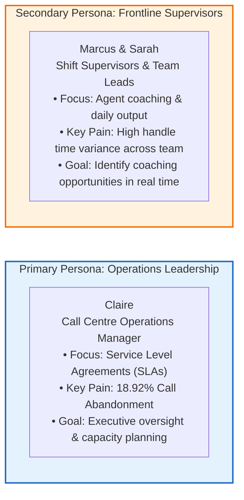
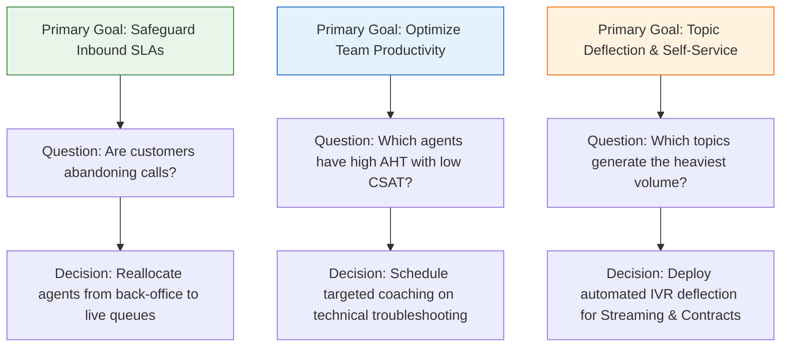
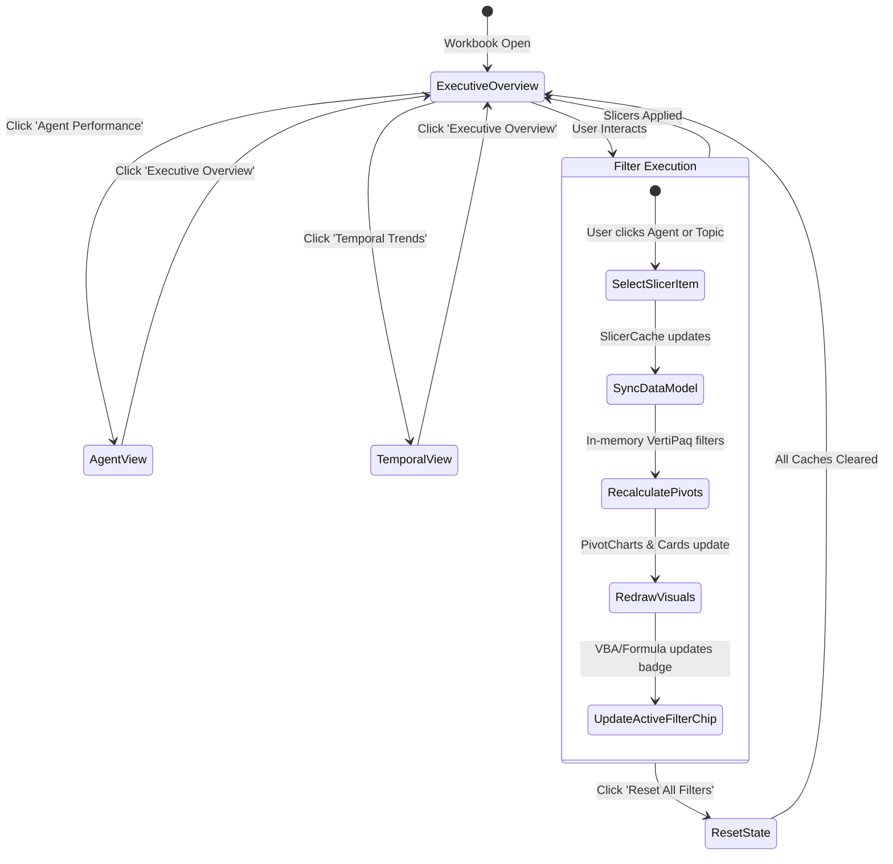
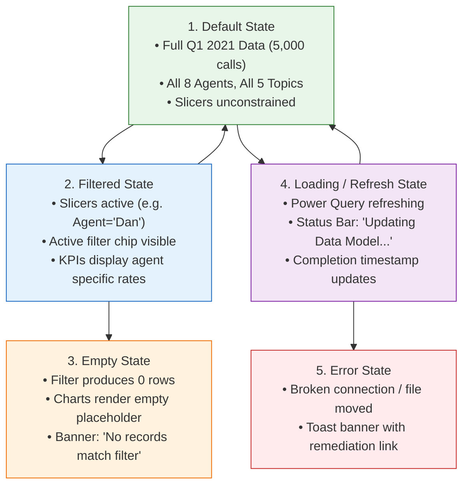

# 📱 Dashboard UX Specification: Call Center Intelligence Console

> [!abstract] Product Vision & Design Philosophy
> This document specifies the user experience, interaction architecture, information hierarchy, and visual design standards for transforming the PwC Call Center dataset into an **enterprise-grade analytics application**. Rather than treating Excel as a passive spreadsheet canvas, this specification treats the workbook as a **desktop analytics application shell**. Every visual element, KPI card, and interaction pattern is engineered around a strict decision-making loop:
> $$\text{User} \longrightarrow \text{Goal} \longrightarrow \text{Question} \longrightarrow \text{Information} \longrightarrow \text{Interaction} \longrightarrow \text{Decision} \longrightarrow \text{Operational Action}$$

---

## 1. User Personas



### 1.1 Persona Profile: Claire (Primary)
- **Role**: Call Centre Operations Manager.
- **Context**: Responsible for 8 agents handling 5,000 quarterly inbound customer contacts across 5 core service topics.
- **Pain Points**:
  - High customer churn caused by long wait times and unserved calls.
  - Inconsistent visibility into whether low customer satisfaction is driven by specific agents or specific inquiry topics.
  - Board-level pressure to reduce average handle time without degrading call resolution.
- **Desired Dashboard Experience**: A 10-second executive scan answering: *"Are we hitting our SLAs today, what is our abandonment rate, and where is the bottleneck?"*

### 1.2 Persona Profile: Marcus & Sarah (Secondary)
- **Role**: Shift Supervisors / Agent Team Leads.
- **Context**: Conduct weekly 1-on-1 coaching sessions with agents (Dan, Diane, Becky, Greg, Jim, Joe, Martha, Stewart).
- **Pain Points**:
  - Inability to quickly isolate an individual agent's performance against peer averages.
  - Lack of clear data showing whether an agent's long calls actually lead to higher first-contact resolution.
- **Desired Dashboard Experience**: An interactive agent scorecard and quadrant scatter view enabling instant drill-down into specific agent metrics by topic and weekday.

---

## 2. Primary User Goals & Decision Architecture



### 2.1 The 6 Core Business Questions & Downstream Decisions

| # | Business Question | Supporting Visual / Metric | Decision Supported | Operational Action |
| :-: | :--- | :--- | :--- | :--- |
| **Q1** | What is our overall inbound volume, and how many callers gave up before being answered? | **Total Demand vs Abandoned Rate Card** | Inbound SLA compliance and trunk capacity | If abandonment exceeds 15%, trigger emergency queue overflow routing. |
| **Q2** | How quickly are callers connected to an agent? | **Avg Speed of Answer (Seconds)** | Queue wait time benchmarking | Adjust shift start times to cover 10:00–14:00 demand peaks. |
| **Q3** | Which agents handle the most calls while maintaining high customer satisfaction? | **Agent Performance Quadrant (AHT vs Volume vs CSAT)** | Performance recognition & peer mentoring | Pair high-volume/high-CSAT agents (e.g. Martha) as mentors for slower peers. |
| **Q4** | Which customer topics drive the longest handle times and lowest resolution rates? | **Inquiry Topic Breakdown (Horizontal Bar + AHT)** | Process re-engineering and self-service | Create updated knowledge-base scripts for complex "Streaming" issues. |
| **Q5** | Are customer issues being resolved on first contact? | **First-Contact Resolution Donut / Gauge** | Customer journey friction | Implement supervisor escalation for unresolved contract inquiries. |
| **Q6** | What are the temporal demand patterns across days of the week? | **Day-of-Week & Daily Demand Trajectory** | Workforce management & shift roster scheduling | Balance staffing heavier on Mondays/Wednesdays; reduce weekend overtime. |

---

## 3. Information Architecture & Application Shell

To simulate a modern SaaS analytics application inside Microsoft Excel, the dashboard employs a **Fixed-Canvas Application Shell**:

```text
┌────────────────────────────────────────────────────────────────────────────────────────────────────────┐
│ [LOGO] PWC ANALYTICS | Call Center Operations Console               📅 Jan 1 – Mar 31, 2021  🔄 Refresh│
├──────────────┬─────────────────────────────────────────────────────────────────────────────────────────┤
│ NAVIGATION   │ [ 📞 Inbound Volume ] [ ❌ Abandonment ] [ ⏱️ Speed Answer ] [ ⏳ AHT ] [ ⭐ CSAT ]     │
│ 🔘 Executive │      5,000 Calls          18.9% (Alert)       67.5 Seconds      7m 54s     3.40 / 5.0  │
│ 🔘 Agents    ├────────────────────────────────────────┬────────────────────────────────────────────────┤
│ 🔘 Temporal  │ PRIMARY OPERATIONAL CANVAS             │ AGENT PERFORMANCE SCORECARD                    │
│ 🔘 Quality   │ • Daily Inbound vs Answered Trajectory │ • Agent Volume vs Peer Average                 │
│              │ • Target SLA Threshold Lines           │ • Talk Time Efficiency Indicators              │
│ FILTERS      ├────────────────────────────────────────┼────────────────────────────────────────────────┤
│ Agent: [All] │ INQUIRY TOPIC PROFILE                  │ FIRST-CONTACT RESOLUTION (FCR)                 │
│ Topic: [All] │ • Horizontal Volume Ranking            │ • 89.9% Resolved (Answered Calls)              │
│ Month: [All] │ • Average Handle Time per Topic        │ • 72.9% Total Resolution (Global Demand)       │
│ [RESET ALL]  ├────────────────────────────────────────┴────────────────────────────────────────────────┤
│              │ 💡 OPERATIONAL INSIGHTS & EXCEPTION SUMMARY                                            │
│ Active Chips │ Streaming & Tech Support represent 42% of volume and average 8.4m handle time.          │
└──────────────┴─────────────────────────────────────────────────────────────────────────────────────────┘
```

### 3.1 Structural Zones of the Application Shell
1. **Top Application Bar (Rows 1–3)**:
   - Corporate identity branding (`PwC Switzerland | Digital Accelerator`).
   - Active reporting time window (`Q1 2021: Jan 1 – Mar 31`).
   - Last Data Refresh Timestamp (`2026-10-01 15:45`).
   - Global Action Controls (`🔄 Refresh Data Model`, `📄 Export PDF Report`).
2. **Left Navigation & Filter Sidebar (Columns B–D)**:
   - Module Navigation Buttons (Executive Overview, Agent Performance, Temporal Trends, Data Dictionary).
   - Dedicated Slicer Panels (`Agent Slicer`, `Topic Slicer`, `Month Slicer`).
   - One-Click `Reset All Filters` button.
   - Dynamic **Active Filter Breadcrumb** showing currently selected constraints.
3. **Executive KPI Strip (Rows 4–8)**:
   - 5 standardized, structured KPI cards embedded in cell grid containers with semantic badge accents.
4. **Main Analytical Work Area (Rows 9–32, Columns F–Z)**:
   - Two-column responsive-like grid layout housing high-signal visuals.
5. **Contextual Action & Insight Footer (Rows 33–36)**:
   - Dynamic text-based operational findings and SLA compliance summary.

---

## 4. Interaction Model & Navigation Architecture



### 4.1 Navigation Mechanics
- **Native Shape Anchors with ScreenTip Affordance**: Navigation buttons are created using styled rounded shapes linked via hyperlinks (`#'Overview'!A1`, `#'Agent Performance'!A1`, `#'Time Analysis'!A1`).
- **Active Page Indicator**: The currently active page button renders in a highlighted surface color with a 3pt left border accent, providing instant orientation.
- **Zero Sheet Jumble**: Auxiliary calculation and data model sheets (`'Pivot Tables'`, `'Data_Staging'`) are set to `xlSheetVeryHidden` to prevent end-user distraction and workbook corruption.

### 4.2 Slicer & Filtering Rules
- **Cross-Filtering Synchronization**: All slicers are bound to a unified SlicerCache connecting all 13 backend PivotTables simultaneously. Slicing on "Dan" updates every chart, table, and KPI card across both sheets without disjointed states.
- **The "Reset All Filters" Trigger**: Bound to `modFilterController.ClearDashboardFilters()`, restoring the global default state in $< 200 \text{ ms}$ with zero screen flicker.

---

## 5. Visual Hierarchy & Design System Foundations

### 5.1 The 8-Point Spatial Grid
- All margins, paddings, card widths, and row heights follow multiples of 8 points:
  - Header Row Height: 32pt
  - KPI Card Row Height: 56pt
  - Section Spacing: 16pt (2 rows of 8pt)
  - Sidebar Width: 180px (Columns B–D)
  - Card Border Radius: 6px

### 5.2 Semantic Color Palette

| Color Token | Hex Code | Semantic Role | WCAG Contrast on White |
| :--- | :---: | :--- | :---: |
| `Color-Primary-Dark` | `#0F172A` | Header banner, primary text, high-emphasis titles | **15.8:1 (AAA)** |
| `Color-Primary-Navy` | `#1E293B` | Chart series primary, active navigation tab | **12.4:1 (AAA)** |
| `Color-Surface-Card` | `#FFFFFF` | KPI card body, chart container background | **N/A** |
| `Color-Background-App` | `#F1F5F9` | Canvas background, inactive tab fill | **N/A** |
| `Color-Accent-Teal` | `#0284C7` | Interactive controls, secondary trend lines | **4.6:1 (AA)** |
| `Color-Status-Success` | `#10B981` | High CSAT ($> 3.5$), Resolution Rate ($> 85\%$) | **3.8:1 (Use with text label)** |
| `Color-Status-Warning` | `#F59E0B` | Wait time warning ($60\text{s} - 90\text{s}$) | **2.2:1 (Use on dark or with border)** |
| `Color-Status-Danger` | `#EF4444` | High abandonment ($> 15\%$), Unresolved calls | **4.5:1 (AA)** |

> [!IMPORTANT] Dual-Encoding Accessibility Standard
> Colors are **never** used as the sole conveyor of operational meaning. Every red status badge is accompanied by an alert icon (`⚠️` or `▼`) and explicit text (`18.9% - SLA Breach`).

### 5.3 Typography Hierarchy

| UI Level | Typeface | Size | Weight | Color | Case |
| :--- | :--- | :---: | :---: | :---: | :---: |
| **App Title** | Aptos / Segoe UI | 18pt | SemiBold | `#FFFFFF` | Title Case |
| **Section Header** | Aptos / Segoe UI | 13pt | SemiBold | `#0F172A` | Title Case |
| **KPI Big Value** | Aptos / Segoe UI | 22pt | Bold | `#0F172A` | Numeric Format |
| **KPI Sub-label** | Aptos / Segoe UI | 9pt | Regular | `#64748B` | UPPERCASE |
| **KPI Context Tag** | Aptos / Segoe UI | 8.5pt | SemiBold | Semantic Token | Mixed |
| **Chart Axis & Data** | Aptos / Segoe UI | 8.5pt | Regular | `#475569` | Regular |
| **Footnote / Status** | Aptos / Segoe UI | 8pt | Italic | `#94A3B8` | Sentence Case |

---

## 6. Dashboard State Specifications

An enterprise analytics application must handle every lifecycle state gracefully:



### 6.1 State Definitions & Behaviors

#### 1. Default State (Initial Load)
- **Scope**: All 5,000 calls across Q1 2021.
- **Top Bar**: Displays `"All Agents (8)"`, `"All Topics (5)"`, `"Last Refreshed: Today"`.
- **KPI Metrics**: 5,000 Total Calls | 18.9% Abandonment | 67.5s Speed Answer | 7m 54s AHT | 3.40 / 5.0 CSAT.
- **Visuals**: Full operational baseline across all charts.

#### 2. Filtered State
- **Trigger**: User selects one or more items in the Agent, Topic, or Month slicers.
- **Behavior**:
  - Selected slicer items highlight in deep navy (`#1E293B`).
  - Active Filter Chip bar below the slicers renders badges: `[Agent: Becky ✕] [Topic: Streaming ✕]`.
  - All 5 KPI cards dynamically recalculate to reflect the sub-population.
  - Contextual target badges update dynamically (e.g., Becky's CSAT is `3.37` $\to$ Warning flag).

#### 3. Empty State (Zero Matches)
- **Trigger**: Slicer combination with zero data (e.g. hypothetical mutually exclusive filters).
- **Behavior**:
  - Instead of displaying ugly `#N/A` or blank chart holes, KPI cards display: `—` (dash).
  - Main chart visual displays a friendly overlay card:
    > *"No call records match the selected filter combination. Click [Reset All Filters] to restore baseline view."*

#### 4. Loading / Refresh State
- **Trigger**: User clicks the `🔄 Refresh Data Model` button.
- **Behavior**:
  - Cursor changes to `xlWait`.
  - Header status bar text changes from `Ready` to: `⏳ Syncing Inbound Telephony Pipeline...`.
  - `Application.ScreenUpdating = False` prevents workbook flicker.
  - Upon completion, status displays: `✅ Data Model Synchronized (5,000 Calls Loaded) at 15:45`.

#### 5. Error State
- **Trigger**: Source dataset file moved, locked by another user, or schema altered.
- **Behavior**:
  - Trapped via `On Error GoTo ErrorHandler` in `modDataRefresh`.
  - Displays non-fatal structured dialog box:
    > *"Data Refresh Warning: Unable to connect to source file 'PWC Dataset.xlsx'. Please ensure the file is not open in another window and file path is valid. Existing cached data has been preserved."*

---

## 7. Accessibility & Ergonomics Standards

1. **Colorblind-Safe Design**:
   - Palette verified against Deuteranopia, Protanopia, and Tritanopia color vision deficiencies.
   - Danger (Red `#EF4444`) and Success (Green `#10B981`) are separated not just by hue, but by luminance contrast and distinct directional iconography ($\blacktriangle$ / $\blacktriangledown$).
2. **Keyboard Navigation Support**:
   - Tab order is set logically: Top Bar Controls $\to$ Left Slicers $\to$ KPI Cards $\to$ Primary Charts.
   - Slicers support standard Excel keyboard navigation (`Arrow Keys` + `Spacebar` + `Ctrl` for multi-select).
3. **Display Scaling Resilience**:
   - Dashboard canvas is engineered within a fixed bounding box of **1,440 pixels wide × 900 pixels high** (Columns A to AA, Rows 1 to 38).
   - Designed to render with zero horizontal scrolling on 1080p enterprise monitors at both 100% and 125% OS DPI scaling.
   - All critical numbers are hosted inside native Excel worksheet cells rather than floating shape textboxes, ensuring zero text clipping or drift.

---

## 8. Performance & Latency Targets

| Operational Dimension | Performance Benchmark | Maximum Acceptable Threshold | Technical Optimization |
| :--- | :---: | :---: | :--- |
| **Slicer Click Response** | $< 150 \text{ ms}$ | $500 \text{ ms}$ | VertiPaq in-memory star schema; zero volatile cell formulas |
| **Sheet Navigation Speed** | $< 100 \text{ ms}$ | $250 \text{ ms}$ | Sheet activation without redundant recalculation |
| **Filter Reset Duration** | $< 250 \text{ ms}$ | $800 \text{ ms}$ | Direct SlicerCache clearing with ScreenUpdating suppression |
| **Full Data Model Refresh** | $< 2.5 \text{ s}$ | $5.0 \text{ s}$ | Local file fast-load query; schema cached in memory |
| **Workbook File Footprint** | $< 1.5 \text{ MB}$ | $3.0 \text{ MB}$ | No duplicated raw sheets; compact tabular compression |

---

## 9. Sign-Off & Implementation Roadmap

The specifications in this document establish the UX and architectural contracts for all subsequent implementation phases:

- 📐 **Phase 4**: [[KPIs|KPI Dictionary]] (12 official PwC DAX measures with mathematical precision).
- 🎨 **Phase 6 & 7**: Dashboard Wireframing & Design System creation.
- ⚙️ **Phase 8 & 9**: Data Model Staging & Interactive Pivot Chart Construction.
- 🤖 **Phase 11**: Modular VBA Controller compilation (`modNavigation`, `modFilterController`, `modDataRefresh`).

**Next Action**: Update the site generator index and present findings and architectural plan to the stakeholder.
