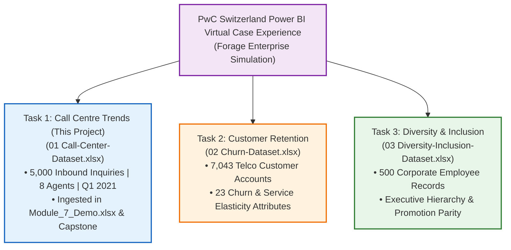
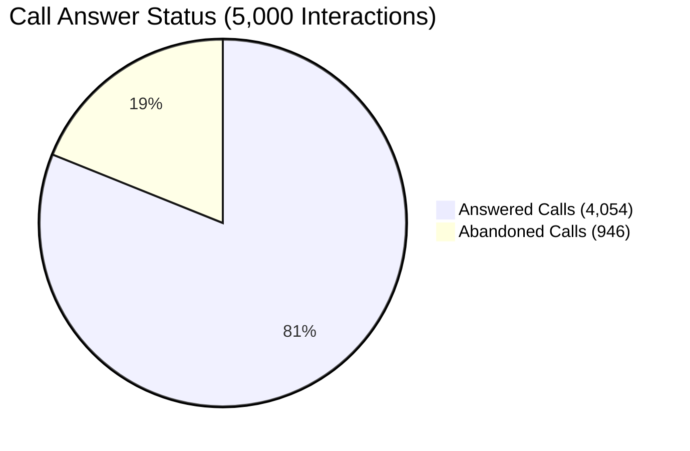

# 2. Master Dataset Documentation & Authentic Provenance

> [!abstract] Provenance & Project Context
> The **PwC Call Center Performance Analysis** dataset originates from the prestigious **PwC Switzerland – Call Centre Trends** job simulation program, hosted on **Forage** (*PwC Switzerland Digital Transformation & Power BI Virtual Case Experience*). Consisting of **5,000 inbound telephonic call interaction logs** recorded between **January 1 and March 31, 2021**, it serves as an industry-standard benchmark for call center operations, First Contact Resolution (FCR), Average Speed of Answer (ASA), and Customer Satisfaction (CSAT) scorecards.

---

## 🌐 Official Sources, Provenance & The PwC Switzerland Simulation Suite

The **Call Centre Trends** dataset analyzed in this capstone represents **Task 1** of the prestigious **PwC Switzerland Power BI Virtual Case Experience on Forage**. In corporate analytics, this simulation is renowned for preparing analysts to handle messy, multi-source operational data across three enterprise domains:



### 📦 The Complete Tripartite Simulation Suite

| Dataset # | Official Filename | PwC Simulation Task | Business Focus | Scope | Direct Official CDN Download Link |
| :---: | :--- | :--- | :--- | :--- | :--- |
| **01** | `01 Call-Center-Dataset.xlsx` | **Call Centre Trends (Active)** | Customer Experience Operations | $5,000$ calls, $8$ agents, Q1 2021 | [Download 01 Call-Center-Dataset.xlsx](https://cdn.theforage.com/vinternships/companyassets/4sLyCPgmsy8DA6Dh3/01%20Call-Center-Dataset.xlsx) |
| **02** | `02 Churn-Dataset.xlsx` | **Customer Retention** | Subscription & Customer Success | $7,043$ telco customers, 23 attributes | [Download 02 Churn-Dataset.xlsx](https://cdn.theforage.com/vinternships/companyassets/4sLyCPgmsy8DA6Dh3/02%20Churn-Dataset.xlsx) |
| **03** | `03 Diversity-Inclusion-Dataset.xlsx` | **Diversity & Inclusion** | Human Capital Management (HR) | $500$ employees, FY20/FY21 promotion cohorts | [Download 03 Diversity-Inclusion-Dataset.xlsx](https://cdn.theforage.com/vinternships/companyassets/4sLyCPgmsy8DA6Dh3/03%20Diversity-Inclusion-Dataset.xlsx) |

> [!IMPORTANT]
> **Authentic Forage CDN Links & Browser Access:**
> The download URLs above point directly to the official Forage Content Delivery Network (`cdn.theforage.com/vinternships/companyassets/4sLyCPgmsy8DA6Dh3/`). These are the authentic source files from the PwC Switzerland simulation, not third-party recreations or modified Kaggle re-uploads. Note that while automated web crawlers may encounter Cloudflare bot-protection when requesting these CDN links programmatically, human users can download and open them directly in any web browser.

### 🏛️ Source Repositories & Reference Hubs
| Source Entity | Platform / Repository | Description | Direct Access Link |
| :--- | :--- | :--- | :--- |
| **Complete Simulation Suite** | GitHub Repository | `Boomslang-Maverick/PWC-Forage-Power-BI-Virtual-Experience` (Contains all 3 original `.xlsx` files + task PDFs/briefs) | [GitHub: Boomslang-Maverick Suite](https://github.com/Boomslang-Maverick/PWC-Forage-Power-BI-Virtual-Experience) |
| **Project Reference Hub** | Canonical Portfolio Documentation | `pwc_digital.transformation` by Tri Wulunggani | [triwgani.github.io/pwc_digital.transformation](https://triwgani.github.io/pwc_digital.transformation/) |
| **Task 1 Benchmark Mirror** | Public Repository | `globalsmile/Call-Center-Analysis` (`01 Call-Center-Dataset.xlsx`, 248 KB) | [GitHub: globalsmile/Call-Center-Analysis](https://github.com/globalsmile/Call-Center-Analysis/blob/main/01%20Call-Center-Dataset.xlsx) |
| **Forage Virtual Simulation** | Educational Origin | PwC Switzerland Power BI & Digital Transformation Case Experience | [Forage: PwC Switzerland Experience](https://www.theforage.com/simulations/pwc-ch/power-bi-cqxg) |
| **Course Master Asset** | Local Storage | Raw Course Workbook (`PWC Dataset.xlsx`, Sheet: `Source Data `) | `09_Source_Materials/Module 9/13/PWC Dataset.xlsx` |
| **Live Student Laboratory** | Hands-on Demo Workbook | Ingested via Power Query into Table `ExternalData_2` | [`Module_7_Demo.xlsx`](file:///d:/courses/Data%20Analysis%2026-27/7-Introducation%20to%20Data%20Fields%20(Excel)/11_Demos_and_Workbooks/07_Data_Cleaning/Module_7_Demo.xlsx) |

> [!TIP]
> **Portfolio Strategy Recommendation:**
> If you are building a professional data analyst portfolio, completing all three tasks from this PwC simulation represents a premier end-to-end showcase:
> 1. **Operations & Service Analytics**: Inbound ticketing, speed of answer, and agent CSAT scorecards (*Task 1*).
> 2. **Revenue & Churn Retention Analytics**: Customer lifetime value, contract risk elasticity, and preventive retention modeling (*Task 2*).
> 3. **Organizational & People Analytics**: Gender promotion parity, executive turnover, and DEI performance KPIs (*Task 3*).

---

## 🔍 Ground-Truth Verification & Distinctive Field Matching

The authenticity of this dataset is confirmed by its signature record markers and exact schema alignment:

| Screenshot / Ingested Field | Canonical Dataset Field | Native Data Type | Sample Initial Values | Verification & Operational Significance |
| :--- | :--- | :---: | :--- | :--- |
| `Call Id` | `Call Id` | Text | `ID0001`, `ID0002`, `ID0003` | Unique primary key. Exactly 5,000 distinct records; zero duplicate keys. |
| `Agent` | `Agent` | Text | `Diane`, `Becky`, `Stewart` | Telephony representative. Exactly 8 agents (`Diane`, `Becky`, `Stewart`, `Greg`, `Dan`, `Jim`, `Martha`, `Joe`). |
| `Date` | `Date` | Date | `2021-01-01` | Date of call arrival spanning Q1 2021 (90 calendar days). |
| `Time` | `Time` | Time / DateTime | `09:12:00` | Telephony ACD switch arrival timestamp. |
| `Topic` | `Topic` | Text | `Contract related` | Customer inquiry category (5 topics: `Contract related`, `Payment related`, `Technical support`, `Admin support`, `Streaming`). |
| `Answered (Y/N)` | `Answered (Y/N)` | Text | `Y`, `N` | Telephony pickup flag (`Y` = Answered, `N` = Abandoned). Exactly 4,054 answered vs 946 abandoned. |
| `Resolved` | `Resolved` | Text | `Y`, `N` | Issue resolution outcome (`Y` = Resolved, `N` = Unresolved). 3,646 resolved. |
| `Speed of answer in seconds` | `Speed of answer in seconds` | Integer | `30`, `null` | Customer queue hold duration. **Contains exactly 946 null values representing abandoned calls!** |
| `AvgTalkDuration` | `AvgTalkDuration` | Time / DateTime | `00:03:45`, `null` | Active agent talk duration. Null for abandoned calls. |
| `Satisfaction rating` | `Satisfaction rating` | Integer | `3`, `null` | Post-call CSAT rating from 1 (Lowest) to 5 (Highest). Average: `3.40 / 5.0`. |
| `Column11`–`Column14` | *Phantom Excel Artifacts* | Blank / Null | `null` | Legacy residual formatting columns present in raw Excel export; purged in Power Query. |

---

## 📊 Summary Operational Statistics (Audited)



- **Total Inbound Inquiries**: `5,000` calls
- **Call Answer Rate**: **`81.08%`** ($4,054$ answered / $5,000$ total)
- **Customer Abandonment Rate**: **`18.92%`** ($946$ callers dropped before agent pickup)
- **First Contact Resolution (FCR) Rate**: **`72.92%`** ($3,646$ resolved / $5,000$ total calls)
- **Resolution Rate of Answered Calls**: **`89.94%`** ($3,646$ resolved / $4,054$ answered)
- **Average Speed of Answer (Overall)**: `67.52 seconds`
- **Average Talk Duration**: `3 minutes 45 seconds` ($00:03:45$)
- **Average Satisfaction Rating (CSAT)**: **`3.40 / 5.0`** (rated across answered calls)

---

## ⚙️ Data Cleaning & ETL Ingestion Pipeline

In `Module_7_Demo.xlsx`, the dataset is ingested directly via Power Query from `09_Source_Materials/Module 9/13/PWC Dataset.xlsx` using the following M code:

```powerquery
shared #"Source Data" = let
    // 1. Ingest workbook object
    Source = Excel.Workbook(
        File.Contents("D:\courses\Data Analysis 26-27\7-Introducation to Data Fields (Excel)\09_Source_Materials\Module 9\13\PWC Dataset.xlsx"), 
        null, 
        true
    ),
    // 2. Extract Data table from 'Source Data ' sheet
    #"Source Data _Sheet" = Source{[Item="Source Data ",Kind="Sheet"]}[Data],
    // 3. Promote first row to column headers
    #"Promoted Headers" = Table.PromoteHeaders(#"Source Data _Sheet", [PromoteAllScalars=true]),
    // 4. Transform data types
    #"Changed Type" = Table.TransformColumnTypes(#"Promoted Headers",{
        {"Call Id", type text}, {"Agent", type text}, {"Date", type date}, 
        {"Time", type datetime}, {"Topic", type text}, {"Answered (Y/N)", type text}, 
        {"Resolved", type text}, {"Speed of answer in seconds", Int64.Type}, 
        {"AvgTalkDuration", type datetime}, {"Satisfaction rating", Int64.Type}, 
        {"Column11", type any}, {"Column12", type any}, {"Column13", type text}, {"Column14", type text}
    }),
    // 5. Purge 4 trailing ghost columns
    #"Removed Ghost Columns" = Table.RemoveColumns(#"Changed Type", {"Column11", "Column12", "Column13", "Column14"})
in
    #"Removed Ghost Columns";
```

---

## Related Knowledge
- Course Notes:
  - [[01_Data_Quality_Dimensions_and_Audit]] — The 946 nulls operational audit.
  - [[02_Data_Cleaning_Techniques_in_Excel]] — Purging ghost columns and handling nulls.
  - [[03_Importing_Data_from_Enterprise_Sources]] — Power Query Excel connector.
  - [[04_Business_Systems_for_Analysts]] — Connecting CRM / Call Center ticketing architectures.
- Project Hub: [[Call Center Performance Analysis]]
- Executive Portfolio: [[Call Center Analysis Portfolio Case Study]]
- Reference: [[Module 7 Dataset Documentation]]
- Demo Workbook: [`Module_7_Demo.xlsx`](file:///d:/courses/Data%20Analysis%2026-27/7-Introducation%20to%20Data%20Fields%20(Excel)/11_Demos_and_Workbooks/07_Data_Cleaning/Module_7_Demo.xlsx)
