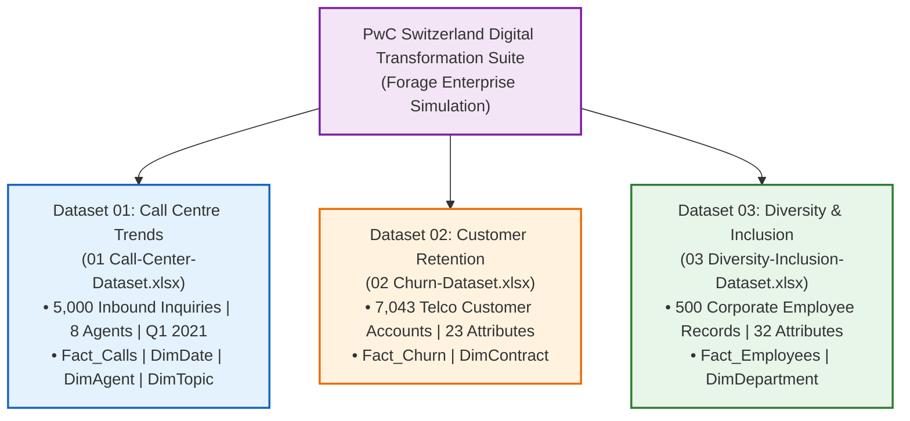
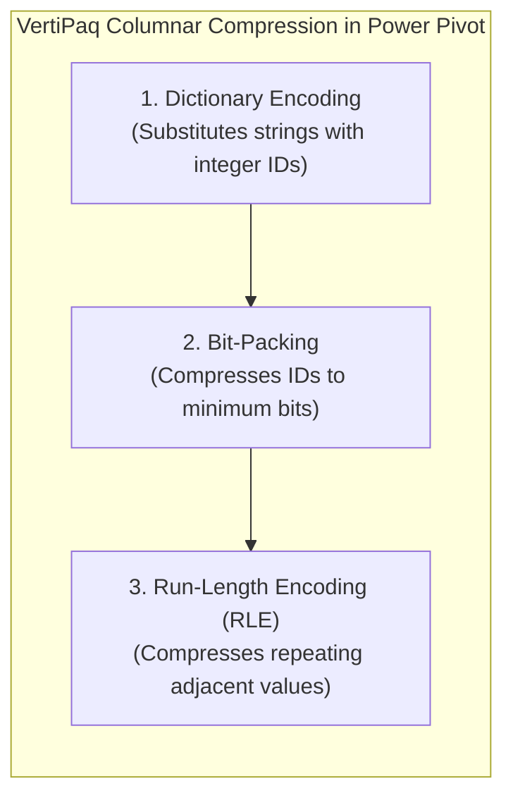

# 2. Master Dataset Documentation: The Complete PwC Tripartite Suite

> [!abstract] Provenance & Project Context
> The datasets analyzed in this project originate from the prestigious **PwC Switzerland Digital Transformation Virtual Case Experience**, hosted on **Forage**. Designed to simulate real-world management consulting engagements, the simulation comprises three distinct operational, financial, and human capital datasets. 
> Rather than analyzing these in isolation, this project unifies all three into an enterprise-grade **Galaxy Schema (Fact Constellation Schema)** within the **Power Pivot (VertiPaq Engine)** layer.

---

## 🌐 Official Sources, Provenance & CDN Links

### 📦 The Complete Tripartite Simulation Suite

| Dataset # | Official Filename | Sheet Name | Row Count | Primary Domain | Direct Official CDN Download Link |
| :---: | :--- | :--- | :---: | :--- | :--- |
| **01** | `01 Call-Center-Dataset.xlsx` | `Sheet1` | 5,000 | Customer Operations & Telephony SLAs | [Download 01 Call-Center-Dataset.xlsx](https://cdn.theforage.com/vinternships/companyassets/4sLyCPgmsy8DA6Dh3/01%20Call-Center-Dataset.xlsx) |
| **02** | `02 Churn-Dataset.xlsx` | `01 Churn-Dataset` | 7,043 | Customer Success & Revenue Risk | [Download 02 Churn-Dataset.xlsx](https://cdn.theforage.com/vinternships/companyassets/4sLyCPgmsy8DA6Dh3/02%20Churn-Dataset.xlsx) |
| **03** | `03 Diversity-Inclusion-Dataset.xlsx` | `Pharma Group AG` | 500 | Human Capital & Executive Governance | [Download 03 Diversity-Inclusion-Dataset.xlsx](https://cdn.theforage.com/vinternships/companyassets/4sLyCPgmsy8DA6Dh3/03%20Diversity-Inclusion-Dataset.xlsx) |

---

## 📞 Dataset 01: The Call Centre Trends (`Fact_Calls`)

### Scope & Summary Statistics
- **Total Inbound Calls**: 5,000 records spanning January 1 to March 31, 2021 (90 calendar days).
- **Roster**: 8 Dedicated Agents (`Becky`, `Dan`, `Diane`, `Greg`, `Jim`, `Joe`, `Martha`, `Stewart`).
- **Answer Rate**: **81.08%** (4,054 answered / 5,000 total).
- **Abandonment Rate**: **18.92%** (946 abandoned / 5,000 total).
- **First-Contact Resolution (Answered)**: **89.94%** (3,646 resolved / 4,054 answered).
- **Average Speed of Answer (ASA)**: **67.52 seconds**.
- **Average Talk Duration (AHT)**: **3 minutes 45 seconds** (225 seconds).
- **Average Customer Satisfaction (CSAT)**: **3.40 / 5.00**.

### Schema Specification
| Field Name | Data Type | Null Count | Sample Value | Role in Galaxy Model |
| :--- | :--- | :---: | :--- | :--- |
| `Call Id` | Text | 0 | `ID0001` | Primary Key |
| `Agent` | Text | 0 | `Diane` | Foreign Key $\to$ `DimAgent[Agent]` |
| `Date` | Date | 0 | `2021-01-01` | Foreign Key $\to$ `DimDate[Date]` |
| `Time` | Time | 0 | `09:12:58` | Queue arrival timestamp |
| `Topic` | Text | 0 | `Contract related` | Foreign Key $\to$ `DimTopic[Topic]` |
| `Answered (Y/N)` | Text | 0 | `Y` | Telephony pickup flag (`Y`/`N`) |
| `Resolved` | Text | 0 | `Y` | Issue resolution outcome (`Y`/`N`) |
| `Speed of answer in seconds` | Integer | 946 | `109` | Queue hold wait time (Null when abandoned) |
| `AvgTalkDuration` | Time | 946 | `00:03:45` | Conversation duration (Null when abandoned) |
| `Satisfaction rating` | Integer | 946 | `4` | CSAT survey score 1–5 (Null when abandoned) |

---

## 🔄 Dataset 02: Customer Retention & Churn Risk (`Fact_Churn`)

### Scope & Summary Statistics
- **Total Subscriber Accounts**: 7,043 telecommunications customers.
- **Churn Count & Rate**: **1,869 churned customers (26.54% churn rate)**.
- **Monthly Recurring Revenue (MRR)**: $456,116.60 total monthly billings.
- **Monthly Churn Revenue at Risk**: **$139,130.85 per month** ($1,669,570.20 annualized).
- **Average Customer Tenure**: 32.37 months (Churners: 17.98 months vs Retained: 37.57 months).
- **Contract Vulnerability**:
  - Month-to-Month: 3,875 accounts, **42.71% churn rate** (1,655 churned).
  - One Year: 1,473 accounts, **11.27% churn rate** (166 churned).
  - Two Year: 1,695 accounts, **2.83% churn rate** (48 churned).
- **Internet Service Breakdown**:
  - Fiber Optic: 3,096 accounts, **41.89% churn rate** (1,297 churned).
  - DSL: 2,421 accounts, **18.96% churn rate** (459 churned).
  - No Internet: 1,526 accounts, **7.40% churn rate** (113 churned).

### Schema Specification
| Field Name | Data Type | Null Count | Sample Value | Role in Galaxy Model |
| :--- | :--- | :---: | :--- | :--- |
| `customerID` | Text | 0 | `7590-VHVEG` | Primary Key |
| `gender` | Text | 0 | `Female` | Demographic slice (`Female`, `Male`) |
| `SeniorCitizen` | Integer | 0 | `0` | Binary demographic flag (`0`, `1`) |
| `Partner` | Text | 0 | `Yes` | Marital status flag (`Yes`, `No`) |
| `Dependents` | Text | 0 | `No` | Dependents flag (`Yes`, `No`) |
| `tenure` | Integer | 0 | `1` | Continuous months subscribed |
| `PhoneService` | Text | 0 | `No` | Fixed telephone landline subscription |
| `MultipleLines` | Text | 0 | `No phone service`| Phone line tiers |
| `InternetService` | Text | 0 | `DSL` | Internet technology (`DSL`, `Fiber optic`, `No`) |
| `OnlineSecurity` | Text | 0 | `No` | Cybersecurity add-on service |
| `OnlineBackup` | Text | 0 | `Yes` | Cloud backup add-on service |
| `DeviceProtection` | Text | 0 | `No` | Hardware warranty add-on |
| `TechSupport` | Text | 0 | `No` | Dedicated tech support contract |
| `StreamingTV` | Text | 0 | `No` | IPTV television package |
| `StreamingMovies` | Text | 0 | `No` | VOD streaming package |
| `Contract` | Text | 0 | `Month-to-month` | Foreign Key $\to$ `DimContract[Contract]` |
| `PaperlessBilling` | Text | 0 | `Yes` | Electronic billing flag |
| `PaymentMethod` | Text | 0 | `Electronic check`| Payment channel |
| `MonthlyCharges` | Decimal | 0 | `29.85` | Monthly recurring subscription charge |
| `TotalCharges` | Decimal | 11 blanks | `29.85` | Cumulative lifetime charges (11 blanks cleaned to 0) |
| `numAdminTickets` | Integer | 0 | `0` | Billing/admin tickets logged |
| `numTechTickets` | Integer | 0 | `0` | Technical support tickets logged |
| `Churn` | Text | 0 | `No` | Target outcome flag (`Yes`, `No`) |

---

## 👥 Dataset 03: Diversity & Inclusion (`Fact_Employees`)

### Scope & Summary Statistics
- **Total Corporate Personnel**: 500 employees at Pharma Group AG (sheet `Pharma Group AG`).
- **Gender Balance**: 295 Male (59.0%), 205 Female (41.0%).
- **Corporate Turnover**: **47 leavers in FY20 (9.40% annual turnover rate)**.
- **FY21 Promotion Count & Rate**: **51 employees promoted (10.20% promotion rate)**.
- **Executive Leadership Parity (Job Levels 1 & 2)**:
  - Job Level 1 (Executive Director): 8 total personnel (7 Male, 1 Female $\to$ **12.5% Female**).
  - Job Level 2 (Director): 19 total personnel (16 Male, 3 Female $\to$ **15.8% Female**).
  - Job Level 3 (Senior Manager): 38 total personnel (30 Male, 8 Female $\to$ **21.1% Female**).
  - Job Level 4 (Manager): 120 total personnel (75 Male, 45 Female $\to$ **37.5% Female**).
  - Job Level 5 (Senior Officer): 135 total personnel (78 Male, 57 Female $\to$ **42.2% Female**).
  - Job Level 6 (Junior Officer): 180 total personnel (89 Male, 91 Female $\to$ **50.6% Female**).

### Schema Specification
| Field Name | Data Type | Null Count | Sample Value | Role in Galaxy Model |
| :--- | :--- | :---: | :--- | :--- |
| `Employee ID` | Text | 0 | `1` | Primary Key |
| `Gender` | Text | 0 | `Male` | Gender identity (`Male`, `Female`) |
| `Job Level after FY20 promotions`| Text | 0 | `6 - Junior Officer` | Baseline job level |
| `New hire FY20?` | Text | 0 | `N` | New hire intake flag (`Y`, `N`) |
| `FY20 Performance Rating` | Integer | 87 | `2` | Annual performance score 1–4 (Null for new hires) |
| `Promotion in FY21?` | Text | 0 | `No` | Target promotion flag (`Yes`, `No`) |
| `In base group for Promotion FY21`| Text | 0 | `No` | Eligibility base cohort flag |
| `Target hire balance` | Decimal | 0 | `0.5` | Target diversity hiring quota |
| `FY20 leaver?` | Text | 0 | `No` | Voluntary departure flag (`Yes`, `No`) |
| `In base group for turnover FY20`| Text | 0 | `Y` | Eligibility base cohort flag |
| `Department @01.07.2020` | Text | 0 | `Operations` | Foreign Key $\to$ `DimDepartment[Department]` |
| `Leaver FY` | Text | 453 | `FY20` | Fiscal year of departure (453 nulls for active staff) |
| `Job Level after FY21 promotions`| Text | 47 | `6 - Junior Officer` | Post-promotion level (47 nulls for leavers) |
| `FTE group` | Text | 0 | `1 FTE` | Full-time equivalent grouping |
| `Time type` | Text | 0 | `Full time` | Employment schedule |
| `Age group` | Text | 0 | `20 to 29` | Demographic age band |
| `Nationality 1` | Text | 0 | `Switzerland` | Country of citizenship |
| `Years since last hire` | Integer | 0 | `2` | Tenure duration at organization |

---

## 💾 VertiPaq Columnar Storage & Compression Footprint

Because all three datasets are loaded into the **VertiPaq In-Memory Engine**, memory footprint is heavily determined by **column cardinality** (number of distinct values):

- **Low Cardinality Columns (< 10 distinct values)**: `Contract` (3), `InternetService` (3), `Topic` (5), `Department` (6), `Agent` (8), `Answered (Y/N)` (2), `Churn` (2), `Gender` (2). These achieve compression ratios exceeding **90%**!
- **High Cardinality Primary Keys**: `Call Id` (5,000 distinct), `customerID` (7,043 distinct). In a production model, high cardinality primary keys are retained on fact tables solely for relationships and row identification, avoiding unnecessary calculated column additions to conserve RAM.
