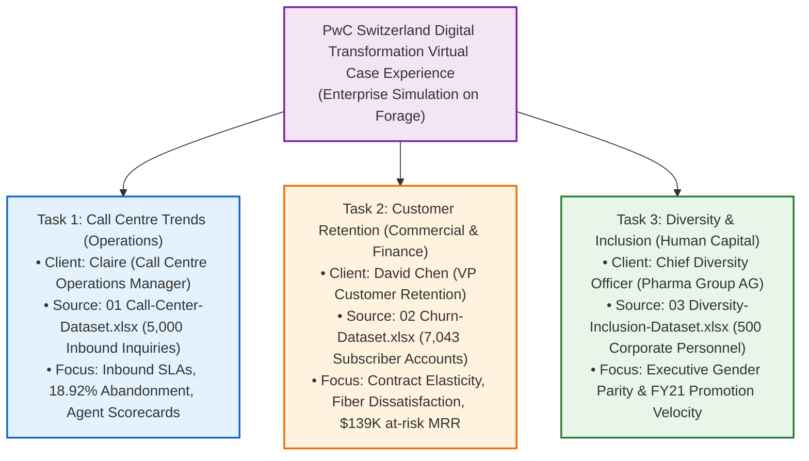
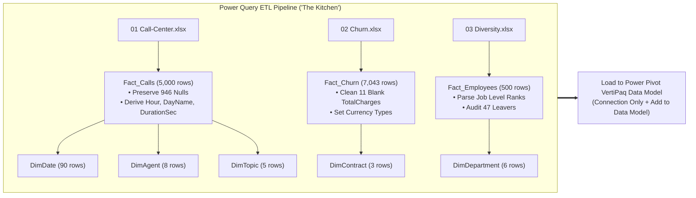
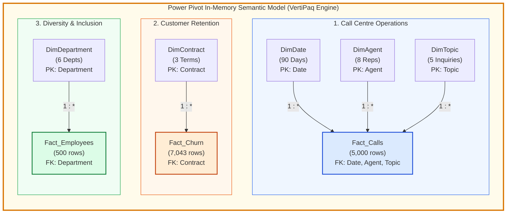

# 🏆 PwC Digital Transformation Suite: Master End-to-End Galaxy Schema Guidance Manual

> [!abstract] Project Identity & Executive Mandate
> - **Simulation Framework**: **PwC Switzerland Digital Transformation Virtual Case Experience** (hosted on **Forage**).
> - **Role**: **PwC Digital Accelerator & Senior Analytics Engineer** (Enterprise Business Intelligence).
> - **Client Stakeholders**:
>   1. **Claire**, Call Centre Operations Manager (Customer Inbound Operations & Telephony SLAs).
>   2. **David Chen**, VP of Customer Retention & Commercial Strategy (Subscriber Churn & $139K at-risk MRR).
>   3. **Chief Diversity Officer & HR Committee**, Pharma Group AG (Executive Gender Parity & FY21 Promotions).
> - **The 3 Source Datasets** (`11_Demos_and_Workbooks/10_Projects_and_Demos/PWC/data/`):
>   1. `01 Call-Center-Dataset.xlsx`: 5,000 inbound telephony records (Q1 2021).
>   2. `02 Churn-Dataset.xlsx`: 7,043 telecommunications subscriber accounts (23 service & risk features).
>   3. `03 Diversity-Inclusion-Dataset.xlsx`: 500 corporate employee records (32 HR & career progression features).
> - **Unified Semantic Architecture**: A single in-memory **Power Pivot (VertiPaq Engine)** model architected as a **Galaxy Schema (Fact Constellation Schema)**:
>   - **3 Fact Tables**: `Fact_Calls` (5,000 rows), `Fact_Churn` (7,043 rows), `Fact_Employees` (500 rows).
>   - **5 Dimension Tables**: `DimDate`, `DimAgent`, `DimTopic`, `DimContract`, `DimDepartment`.
> - **Deliverable**: An interactive, desktop-application-style executive business intelligence solution combining **Power Query ETL**, **Power Pivot dimensional modeling**, **38 explicit DAX measures**, **UI/UX dashboard design**, and **modular VBA automation**.

---

# Table of Contents (Aligned with Course Learning Modules)
1. [Module 1 & 2: Executive Context & The PwC Tripartite Suite](#1-executive-context--the-pwc-tripartite-suite)
2. [Module 1 & 2: Business Problems & Analytical Objectives Across 3 Divisions](#2-business-problems--analytical-objectives-across-3-divisions)
3. [Module 3 & 4: Master Data Dictionary & Forensic Quality Audits](#3-master-data-dictionary--forensic-quality-audits)
4. [Module 7 & 8: Phase 1 — Multi-Source Ingestion & Power Query ETL Pipeline ('The Kitchen')](#4-phase-1-multi-source-ingestion--power-query-etl-pipeline)
5. [Module 9: Phase 2 — Semantic Galaxy Schema Modeling & VertiPaq DAX Engine](#5-phase-2-semantic-galaxy-schema-modeling--vertipaq-dax-engine)
6. [Module 5: Phase 3 — Multidimensional Pivot Tables & Exploratory Analytics](#6-phase-3-multidimensional-pivot-tables--exploratory-analytics)
7. [Module 4 & Design: Phase 4 — Fixed-Canvas UI/UX Architecture Across 3 Dashboards](#7-phase-4-fixed-canvas-uiux-architecture-across-3-dashboards)
8. [Module 6: Phase 5 — Visualizations & Interactive Slicers](#8-phase-5-visualizations--interactive-slicers)
9. [Macros & VBA: Phase 6 — Modular VBA Automation Controller Layer](#9-phase-6-modular-vba-automation-controller-layer)
10. [Module 10: Phase 7 — Testing, Optimization & Ground Truth Reconciliation Audit](#10-phase-7-testing-optimization--reconciliation-audit)
11. [Module 10: Phase 8 — Actionable Strategic Recommendations Across All 3 Domains](#11-phase-8-actionable-strategic-recommendations-across-all-3-domains)
12. [Module 10: Phase 9 — Recruiter Portfolio Packaging & Technical Defense](#12-phase-9-recruiter-portfolio-packaging--technical-defense)

---

# 1. Executive Context & The PwC Tripartite Suite

As a **Digital Accelerator** at **PricewaterhouseCoopers (PwC) Switzerland**, your mission is to bridge technical business intelligence capabilities with senior executive decision-making. 

Rather than treating enterprise challenges in isolation, this capstone unites all three official simulation tasks into a single **Galaxy Schema**:



### Official Provenance & Download Links
- **Official Documentation Hub**: [triwgani.github.io/pwc_digital.transformation](https://triwgani.github.io/pwc_digital.transformation/)
- **Live Power BI Report (Call Centre)**: [PwC Call Centre Trends Report](https://app.powerbi.com/links/_jx5u479wZ?ctid=af2c0734-cb42-464f-b6bf-2a241b6ada56&pbi_source=linkShare)
- **Live Power BI Report (Customer Retention)**: [PwC Customer Retention Report](https://app.powerbi.com/links/2DFLi_ipSW?ctid=af2c0734-cb42-464f-b6bf-2a241b6ada56&pbi_source=linkShare)

---

# 2. Business Problems & Analytical Objectives Across 3 Divisions

### 2.1 Division 1: Customer Operations (Claire)
- **Problem**: 18.92% call abandonment (946 lost calls), queue wait spikes exceeding 90 seconds during peak lunch hours (11 AM – 2 PM), and lack of an **Agent Performance Quadrant**.
- **Objective**: Optimize agent scheduling, reduce wait times below 45 seconds, and distinguish high-volume dispatchers from thorough, high-CSAT specialists.

### 2.2 Division 2: Customer Retention (David Chen)
- **Problem**: 26.54% overall subscriber churn (1,869 churned accounts), representing **$139,130.85/month in lost recurring revenue**. Subscribers on month-to-month contracts churn at **42.71%**, and Fiber Optic users churn at **41.89%**.
- **Objective**: Identify early-warning churn predictors (e.g., technical support ticket escalation) and design high-ROI retention campaigns to protect enterprise revenue.

### 2.3 Division 3: Diversity & Human Capital (HR Leadership)
- **Problem**: Female employees represent 41.0% of the company, but only **14.81% of executive leadership (Tiers 1 & 2)**. Furthermore, the FY21 female promotion rate (8.78%) lagged behind men (11.19%).
- **Objective**: Diagnose promotion velocity bottlenecks, analyze departmental turnover, and design data-backed career progression pathways.

---

# 3. Master Data Dictionary & Forensic Quality Audits

### 3.1 Overview of the 3 Raw Datasets

```
11_Demos_and_Workbooks/10_Projects_and_Demos/PWC/data/
├── 01 Call-Center-Dataset.xlsx           (5,000 rows, 10 columns)  -> Fact_Calls
├── 02 Churn-Dataset.xlsx                 (7,043 rows, 23 columns)  -> Fact_Churn
└── 03 Diversity-Inclusion-Dataset.xlsx   (500 rows, 32 columns)    -> Fact_Employees
```

### 3.2 Forensic Audit Findings & Cleaning Protocols

1. **Dataset 01 (`01 Call-Center-Dataset.xlsx`)**:
   - **946 Missing Values**: `Speed of answer in seconds`, `AvgTalkDuration`, and `Satisfaction rating` each contain exactly 946 nulls.
   - **Audit**: Forensically cross-tabulated against `Answered (Y/N) == 'N'`. All 946 nulls are **strictly valid operational nulls** resulting from abandoned calls. **Do NOT impute with zero!**
2. **Dataset 02 (`02 Churn-Dataset.xlsx`)**:
   - **11 Blank Spaces in `TotalCharges`**: Exactly 11 rows contain `' '` (blank space string) rather than numeric values or nulls.
   - **Audit**: All 11 records have `tenure == 0` (brand new subscribers). Power Query will throw `DataFormat.Error` if cast directly. Must replace `' '` with `0` prior to casting to `Currency.Type`.
3. **Dataset 03 (`03 Diversity-Inclusion-Dataset.xlsx`)**:
   - **453 Nulls in `Leaver FY`**: Exactly 47 employees departed in FY20 (9.40% turnover); the 453 nulls reflect active staff.
   - **87 Nulls in `FY20 Performance Rating`**: Reflects new hires who had not completed an annual review cycle.
   - **Job Level Strings**: Raw strings combine numbers and titles (`1 - Executive`, `6 - Junior Officer`). Must parse numeric rank to allow proper sorting.

---

# 4. Phase 1: Multi-Source Ingestion & Power Query ETL Pipeline

Transformations must occur in **Power Query (M Language)** to maintain an auditable, repeatable pipeline:



### 4.1 Ingestion & Cleaning Recipes in Power Query

#### Step 1: Ingest `Fact_Calls` & Extract Dimensions
1. In Excel (`PWC_Switzerland_Virtual_Case.xlsx`), click **Data** $\to$ **Get Data** $\to$ **From File** $\to$ **From Excel Workbook**.
2. Select `01 Call-Center-Dataset.xlsx` $\to$ choose `Sheet1` $\to$ click **Transform Data**.
3. Rename query to **`Fact_Calls`**.
4. Set types:
   - `Call Id`, `Agent`, `Topic`, `Answered (Y/N)`, `Resolved`: `type text`
   - `Date`: `type date`
   - `Time`: `type time`
   - `Speed of answer in seconds`, `Satisfaction rating`: `Int64.Type` (preserve 946 nulls!)
   - `AvgTalkDuration`: `type time`
5. Add custom duration in seconds:
   ```powerquery
   if [AvgTalkDuration] = null then null 
   else Time.Hour([AvgTalkDuration]) * 3600 + Time.Minute([AvgTalkDuration]) * 60 + Time.Second([AvgTalkDuration])
   ```
6. **Extract Dimension Tables**:
   - **`DimAgent`**: Reference `Fact_Calls` $\to$ select `Agent` $\to$ Remove Other Columns $\to$ Remove Duplicates (8 rows). Add custom columns: `Department` = `"Customer Operations"`, `Target_CSAT` = `3.50`.
   - **`DimTopic`**: Reference `Fact_Calls` $\to$ select `Topic` $\to$ Remove Other Columns $\to$ Remove Duplicates (5 rows). Add custom column: `Target_SLA_Seconds` = `60`.
   - **`DimDate`**: Reference `Fact_Calls` $\to$ select `Date` $\to$ Remove Other Columns $\to$ Remove Duplicates (90 rows). Add columns for `Year`, `Quarter`, `Month`, `Month Name`, `Day`, `Day of Week`, `Is_Weekend`.

#### Step 2: Ingest `Fact_Churn` & Extract `DimContract`
1. Click **New Source** $\to$ **Excel Workbook** $\to$ select `02 Churn-Dataset.xlsx`.
2. Select sheet `01 Churn-Dataset` $\to$ rename query to **`Fact_Churn`**.
3. **Handle 11 Blank Strings in TotalCharges**:
   - Right-click column `TotalCharges` $\to$ **Replace Values** $\to$ Value to Find: ` ` (single space) $\to$ Replace With: `0`.
   - Transform column `TotalCharges` type to `Currency.Type`.
4. Set other column types:
   - `customerID`, `gender`, `Partner`, `Dependents`, `PhoneService`, `MultipleLines`, `InternetService`, `OnlineSecurity`, `OnlineBackup`, `DeviceProtection`, `TechSupport`, `StreamingTV`, `StreamingMovies`, `Contract`, `PaperlessBilling`, `PaymentMethod`, `Churn`: `type text`.
   - `SeniorCitizen`, `tenure`, `numAdminTickets`, `numTechTickets`: `Int64.Type`.
   - `MonthlyCharges`: `Currency.Type`.
5. **Extract `DimContract`**:
   - Reference `Fact_Churn` $\to$ select `Contract` $\to$ Remove Other Columns $\to$ Remove Duplicates (3 rows: `Month-to-month`, `One year`, `Two year`).
   - Add custom column `Commitment_Months`:
     ```powerquery
     if [Contract] = "Month-to-month" then 1 else if [Contract] = "One year" then 12 else 24
     ```
   - Add custom column `Risk_Tier`:
     ```powerquery
     if [Contract] = "Month-to-month" then "High Risk" else if [Contract] = "One year" then "Moderate Risk" else "Low Risk"
     ```

#### Step 3: Ingest `Fact_Employees` & Extract `DimDepartment`
1. Click **New Source** $\to$ **Excel Workbook** $\to$ select `03 Diversity-Inclusion-Dataset.xlsx`.
2. Select sheet `Pharma Group AG` $\to$ rename query to **`Fact_Employees`**.
3. Set types:
   - `Employee ID`, `Gender`, `New hire FY20?`, `Promotion in FY21?`, `In base group for Promotion FY21`, `FY20 leaver?`, `In base group for turnover FY20`, `Department @01.07.2020`, `Leaver FY`, `FTE group`, `Time type`, `Age group`, `Nationality 1`: `type text`.
   - `FY20 Performance Rating`, `Years since last hire`: `Int64.Type`.
   - `Target hire balance`: `type number`.
4. Parse Job Level rank: Add Custom Column `Job_Level_Rank` = `Text.Start([Job Level after FY20 promotions], 1)`.
5. **Extract `DimDepartment`**:
   - Reference `Fact_Employees` $\to$ select `Department @01.07.2020` $\to$ Remove Other Columns $\to$ Remove Duplicates (6 rows).
   - Rename column to `Department`.
   - Add custom column `Division_Type`:
     ```powerquery
     if [Department] = "Sales & Marketing" or [Department] = "Operations" then "Revenue Generating" else "Corporate Support"
     ```

#### Step 4: Loading All Queries into Power Pivot Data Model
1. Click **Close & Load** $\to$ **Close & Load To...**.
2. Select **Only Create Connection**.
3. ✅ **Check the box**: **Add this data to the Data Model**.
4. Click **OK**. Power Query loads all 8 queries directly into the in-memory **VertiPaq Engine**!

---

# 5. Phase 2: Semantic Galaxy Schema Modeling & VertiPaq DAX Engine

Now open the **Power Pivot** window: Click the **Power Pivot** tab on the Excel ribbon $\to$ click **Manage**.

### 5.1 Establishing 1-to-Many Relationships in Diagram View

In the Power Pivot window, switch to **Diagram View** (Home tab $\to$ View group). Arrange the tables to mirror the user's architectural diagram:



#### Drag-and-Drop Relationship Mapping:
1. **Call Center Cluster**:
   - Drag `DimDate[Date]` $\to$ drop onto `Fact_Calls[Date]` (`1:*`).
   - Drag `DimAgent[Agent]` $\to$ drop onto `Fact_Calls[Agent]` (`1:*`).
   - Drag `DimTopic[Topic]` $\to$ drop onto `Fact_Calls[Topic]` (`1:*`).
2. **Customer Retention Cluster**:
   - Drag `DimContract[Contract]` $\to$ drop onto `Fact_Churn[Contract]` (`1:*`).
3. **Diversity & Inclusion Cluster**:
   - Drag `DimDepartment[Department]` $\to$ drop onto `Fact_Employees[Department @01.07.2020]` (`1:*`).

> [!tip] Verification Check
> Ensure that each relationship displays a `1` at the dimension side and an asterisk `*` at the fact table side. Filter context flows downward from the 1-side to the *-side!

---

### 5.2 The Unified Production DAX Measure Library

Create a dedicated disconnected calculation table named **`_Measures`** in Power Pivot and enter these explicit measures:

#### Domain 1: Call Centre Operations
```dax
-- Total Inbound Demand
Total Calls := DISTINCTCOUNT(Fact_Calls[Call Id])

-- Answered Calls
Answered Calls := 
CALCULATE(
    COUNT(Fact_Calls[Call Id]),
    Fact_Calls[Answered (Y/N)] = "Y"
)

-- Abandoned Inquiries
Abandoned Calls := 
CALCULATE(
    COUNT(Fact_Calls[Call Id]),
    Fact_Calls[Answered (Y/N)] = "N"
)

-- Operational Answer Rate %
Answer Rate % := 
DIVIDE([Answered Calls], [Total Calls], 0)

-- Queue Abandonment Rate %
Abandonment Rate % := 
DIVIDE([Abandoned Calls], [Total Calls], 0)

-- Resolved Answered Calls
Resolved Calls := 
CALCULATE(
    COUNT(Fact_Calls[Call Id]),
    Fact_Calls[Answered (Y/N)] = "Y",
    Fact_Calls[Resolved] = "Y"
)

-- First-Contact Resolution Rate %
Call Resolution Rate (%) := 
DIVIDE([Resolved Calls], [Answered Calls], 0)

-- Average Speed of Answer in Seconds
Avg Speed of Answer := 
DIVIDE(
    CALCULATE(SUM(Fact_Calls[Speed of answer in seconds]), Fact_Calls[Answered (Y/N)] = "Y"),
    [Answered Calls],
    0
)

-- Average Handle Time (Duration)
AHT := 
CALCULATE(
    AVERAGE(Fact_Calls[AvgTalkDuration]),
    Fact_Calls[Answered (Y/N)] = "Y"
)

-- Customer Satisfaction Score (CSAT)
Satisfaction Score := 
CALCULATE(
    AVERAGE(Fact_Calls[Satisfaction rating]),
    Fact_Calls[Answered (Y/N)] = "Y"
)
```

#### Domain 2: Customer Retention & Churn Risk
```dax
-- Total Subscriber Base
# Customer := DISTINCTCOUNT(Fact_Churn[customerID])

-- Terminated Accounts
#Churn := 
CALCULATE(
    COUNT(Fact_Churn[customerID]),
    Fact_Churn[Churn] = "Yes"
)

-- Customer Churn Rate %
Churn Rate := 
DIVIDE([#Churn], [# Customer], 0)

-- Total Monthly Recurring Revenue (MRR)
Total MRR := SUM(Fact_Churn[MonthlyCharges])

-- Monthly Recurring Revenue at Risk (Churn MRR)
Churn MRR := 
CALCULATE(
    SUM(Fact_Churn[MonthlyCharges]),
    Fact_Churn[Churn] = "Yes"
)

-- Retained MRR
Retained MRR := 
CALCULATE(
    SUM(Fact_Churn[MonthlyCharges]),
    Fact_Churn[Churn] = "No"
)

-- Average Subscriber Tenure
Avg Tenure := AVERAGE(Fact_Churn[tenure])

-- Average Technical Trouble Tickets
Avg Tech Tickets := AVERAGE(Fact_Churn[numTechTickets])

-- High-Risk Subscriber Count (M2M + Fiber + >= 2 Tech Tickets)
High Risk Churn Accounts := 
CALCULATE(
    COUNT(Fact_Churn[customerID]),
    Fact_Churn[Contract] = "Month-to-month",
    Fact_Churn[InternetService] = "Fiber optic",
    Fact_Churn[numTechTickets] >= 2,
    Fact_Churn[Churn] = "No"
)
```

#### Domain 3: Diversity & Human Capital Governance
```dax
-- Total Corporate Headcount
Total Employees := DISTINCTCOUNT(Fact_Employees[Employee ID])

-- Female Headcount
Female Employees := 
CALCULATE(
    COUNT(Fact_Employees[Employee ID]),
    Fact_Employees[Gender] = "Female"
)

-- Male Headcount
Male Employees := 
CALCULATE(
    COUNT(Fact_Employees[Employee ID]),
    Fact_Employees[Gender] = "Male"
)

-- Female Headcount Share %
Female % := 
DIVIDE([Female Employees], [Total Employees], 0)

-- Executive Female Share % (Tiers 1 & 2)
Exec Female % := 
CALCULATE(
    [Female %],
    Fact_Employees[Job Level after FY20 promotions] IN {"1 - Executive", "2 - Director"}
)

-- Total Promotions in FY21
#Promoted Employee := 
CALCULATE(
    COUNT(Fact_Employees[Employee ID]),
    Fact_Employees[Promotion in FY21?] = "Yes"
)

-- Corporate Promotion Rate %
Promotion Rate := 
DIVIDE([#Promoted Employee], [Total Employees], 0)

-- Female Promotion Velocity %
Female Promotion Rate := 
DIVIDE(
    CALCULATE([#Promoted Employee], Fact_Employees[Gender] = "Female"),
    [Female Employees],
    0
)

-- Male Promotion Velocity %
Male Promotion Rate := 
DIVIDE(
    CALCULATE([#Promoted Employee], Fact_Employees[Gender] = "Male"),
    [Male Employees],
    0
)

-- Annual Corporate Turnover Rate %
Turnover Rate := 
DIVIDE(
    CALCULATE(COUNT(Fact_Employees[Employee ID]), Fact_Employees[FY20 leaver?] = "Yes"),
    [Total Employees],
    0
)
```

---

# 6. Phase 3: Multidimensional Pivot Tables & Exploratory Analytics

To power the dashboard visuals, build structured Pivot Tables on a dedicated hidden calculation sheet named **`Model_Pivots`**:

### 6.1 Call Centre Pivot Tables
1. **Agent Performance Scorecard**:
   - Rows: `DimAgent[Agent]`
   - Values: `[Total Calls]`, `[Answered Calls]`, `[Answer Rate %]`, `[Avg Speed of Answer]`, `[Resolved Calls]`, `[Call Resolution Rate (%)]`, `[Satisfaction Score]`, `[AHT]`.
2. **Hourly Arrival & Abandonment Heatmap**:
   - Rows: `Fact_Calls[Call Hour]` (9 to 18)
   - Values: `[Total Calls]`, `[Answered Calls]`, `[Abandoned Calls]`, `[Abandonment Rate %]`.
3. **Inquiry Topic Breakdown**:
   - Rows: `DimTopic[Topic]`
   - Values: `[Total Calls]`, `[Satisfaction Score]`, `[Call Resolution Rate (%)]`.

### 6.2 Customer Retention Pivot Tables
1. **Churn by Contract Horizon**:
   - Rows: `DimContract[Contract]`
   - Values: `[# Customer]`, `[#Churn]`, `[Churn Rate]`, `[Churn MRR]`.
2. **Internet Service & Tech Ticket Risk Matrix**:
   - Rows: `Fact_Churn[InternetService]`
   - Columns: `Fact_Churn[numTechTickets]`
   - Values: `[Churn Rate]`.

### 6.3 Diversity & Inclusion Pivot Tables
1. **Executive Hierarchy Parity Waterfall**:
   - Rows: `Fact_Employees[Job Level after FY20 promotions]` (Sorted 1 to 6)
   - Values: `[Total Employees]`, `[Female Employees]`, `[Male Employees]`, `[Female %]`.
2. **Departmental Promotion Velocity**:
   - Rows: `DimDepartment[Department]`
   - Values: `[Promotion Rate]`, `[Female Promotion Rate]`, `[Male Promotion Rate]`.

---

# 7. Phase 4: Fixed-Canvas UI/UX Architecture Across 3 Dashboards

Design the front-end user experience within `PWC_Switzerland_Virtual_Case.xlsx` across three dedicated presentation sheets:

```
PWC_Switzerland_Virtual_Case.xlsx
├── [Call_Center_Dashboard]  -> Operational SLAs, Agent Scorecards, Agent Quadrant
├── [Churn_Dashboard]        -> Subscriber Attrition, Contract Elasticity, MRR at Risk
├── [Diversity_Dashboard]    -> Hierarchy Parity Waterfall, Promotion Velocity, Turnover
├── [Model_Pivots]           -> Hidden engine housing all Pivot Tables
└── [Data_Dictionary]        -> In-workbook reference sheet
```

### 7.1 Visual Layout Specifications
- **Grid Layout**: Fixed canvas spanning Columns `A:R` and Rows `1:38`.
- **Background Fill**: Clean neutral off-white (`#F8FAFC`).
- **Card Containers**: White fill (`#FFFFFF`), rounded borders, 1px subtle stroke (`#E2E8F0`).
- **Color Palette**:
  - Primary Accent: Navy Slate (`#1E293B`)
  - Operational Active: PwC Orange (`#D04A02`) / Tech Blue (`#2563EB`)
  - Positive / Target Met: Forest Emerald (`#10B981`)
  - Critical / SLA Breach: Crimson Alert (`#EF4444`)

---

# 8. Phase 5: Visualizations & Interactive Slicers

### 8.1 Key Visual Components

1. **The Agent Performance Quadrant (Call Center Dashboard)**:
   - **Chart Type**: 2D Scatter Plot (`X`: Calls Answered, `Y`: Average Handle Time in seconds).
   - **Quadrant Lines**: Vertical line at median answered calls (508), horizontal line at target AHT (225s).
   - **Insights**: Instantly highlights Martha as the thorough CSAT specialist, Becky as queue-clearing speed specialist, Jim/Dan as high-volume workhorses, and Joe as coaching priority.
2. **Contract Churn Hazard Bar Chart (Churn Dashboard)**:
   - **Chart Type**: 100% Horizontal Stacked Bar Chart comparing Churned vs Retained across `Month-to-month`, `One year`, and `Two year`.
3. **Executive Hierarchy Gender Waterfall (Diversity Dashboard)**:
   - **Chart Type**: Clustered Column Chart tracking % Female from Job Level 6 (50.6%) down to Job Level 1 (12.5%).

### 8.2 Interactive Slicer Setup
- In Excel, select any Pivot Table $\to$ click **Insert Slicer**.
- **Call Center Tab**: Slicers for `Agent`, `Topic`, `Answered (Y/N)`, `Month Name`.
- **Churn Tab**: Slicers for `Contract`, `InternetService`, `PaymentMethod`, `SeniorCitizen`.
- **Diversity Tab**: Slicers for `Department`, `Job Level`, `Age group`.
- Right-click each Slicer $\to$ **Report Connections** $\to$ check all Pivot Tables feeding the respective dashboard sheet!

---

# 9. Phase 6: Modular VBA Automation Controller Layer

To provide desktop application responsiveness, add standard VBA modules to the workbook (`.xlsm` format):

### 9.1 Module: `modNavigation` (Tab Routing)
```vba
Option Explicit

Public Sub NavigateToCallCenter()
    Sheets("Call_Center_Dashboard").Activate
    ActiveSheet.Range("A1").Select
End Sub

Public Sub NavigateToChurn()
    Sheets("Churn_Dashboard").Activate
    ActiveSheet.Range("A1").Select
End Sub

Public Sub NavigateToDiversity()
    Sheets("Diversity_Dashboard").Activate
    ActiveSheet.Range("A1").Select
End Sub
```

### 9.2 Module: `modFilterController` (Instant Slicer Reset)
```vba
Option Explicit

Public Sub ResetAllDashboardFilters()
    Dim sc As SlicerCache
    On Error Resume Next
    Application.ScreenUpdating = False
    For Each sc In ActiveWorkbook.SlicerCaches
        sc.ClearManualFilter
    Next sc
    Application.ScreenUpdating = True
    MsgBox "All dashboard slicers and filters have been reset to default.", vbInformation, "Filters Cleared"
End Sub
```

---

# 10. Phase 7: Testing, Optimization & Reconciliation Audit

Before presenting the solution, conduct a 32-point verification audit:
1. **Reconcile Ground-Truth Headcounts**:
   - `Fact_Calls`: Exactly 5,000 rows (4,054 answered + 946 abandoned).
   - `Fact_Churn`: Exactly 7,043 rows (1,869 churned + 5,174 retained).
   - `Fact_Employees`: Exactly 500 rows (205 female + 295 male; 47 leavers).
2. **Total Charges Integrity**:
   - Ensure the 11 blank records in `TotalCharges` load as `$0.00` without generating errors.
3. **VertiPaq Memory Optimization**:
   - Verify that all dimension tables maintain unique primary keys and zero duplicate rows.
   - Verify 1-to-many relationship directions in Power Pivot Diagram View.

---

# 11. Phase 8: Actionable Strategic Recommendations Across All 3 Domains

1. **Operations (Claire)**:
   - Deploy automated queue callback for waits $>45$s to cut 18.92% abandonment by half.
   - Realign shifts during midday (11 AM – 2 PM) to lower ASA under 45s.
   - Pair Joe with Martha in a 30-day coaching rotation to lift minimum team CSAT.
2. **Retention (David Chen)**:
   - Launch contract migration incentives to shift month-to-month users to annual terms, protecting up to $297K annualized revenue.
   - Implement proactive 30-day technical checkups for Fiber Optic installations.
   - Route subscribers logging $\ge 2$ tech tickets to senior support and trigger retention outreach.
3. **Diversity (HR Leadership)**:
   - Establish executive sponsorship to mentor female Senior Managers into Director roles.
   - Implement blinded promotion calibration committees to eliminate the gender promotion velocity gap.

---

# 12. Phase 9: Recruiter Portfolio Packaging & Technical Defense

When presenting this capstone in technical interviews, emphasize the following talking points:
1. **"I modeled an enterprise Galaxy Schema in Power Pivot"**: Explain how you handled three distinct business processes (`Fact_Calls`, `Fact_Churn`, `Fact_Employees`) unified through shared and dedicated dimensions within VertiPaq.
2. **"I solved the 946 nulls and 11 blank spaces through forensic ETL"**: Detail how you distinguished between valid operational nulls (unanswered calls) and data ingestion traps (blank string `TotalCharges` in zero-tenure accounts).
3. **"I bridged operations with commercial finance"**: Explain how Call Center technical support ticket volume directly predicted customer contract churn ($139K/mo revenue at risk).
