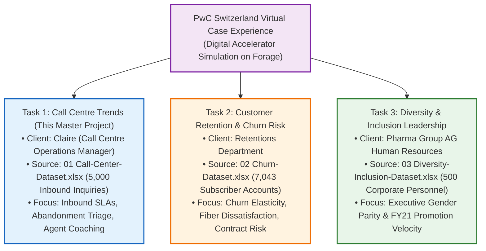
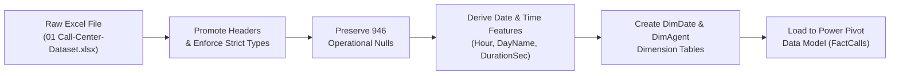
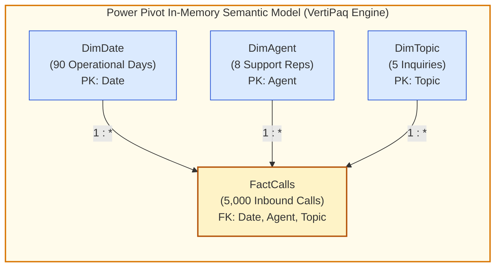
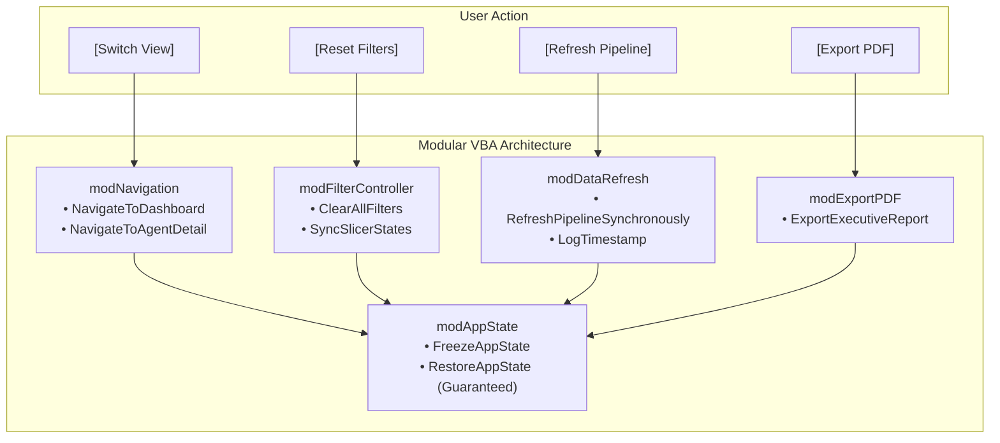
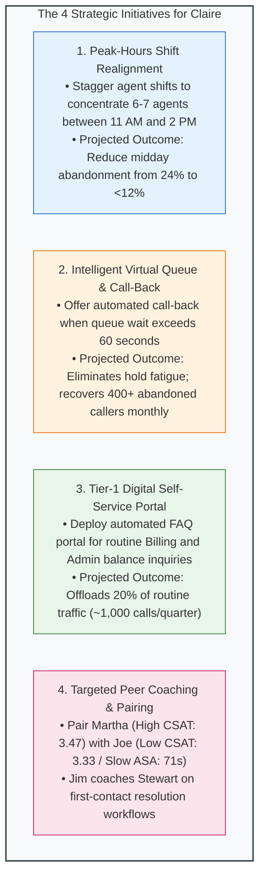

# 🏆 PwC Call Center Performance Analysis: Master End-to-End Guidance Manual

> [!abstract] Project Identity & Executive Mandate
> - **Program**: **PwC Switzerland Virtual Case Experience** (hosted on **Forage**).
> - **Role**: **PwC Digital Accelerator** (Business Intelligence & Analytics Engineer).
> - **Client Stakeholder**: **Claire**, Call Centre Operations Manager at an international telecommunications enterprise.
> - **Primary Dataset**: `01 Call-Center-Dataset.xlsx` (5,000 inbound telephonic call interaction records across Q1 2021).
> - **Operational Scale**: 8 dedicated agents, 5 inquiry topics, 90 operational days (January 1 – March 31, 2021).
> - **Core Challenge**: Severe customer wait times, an alarming **18.92% call abandonment rate**, and wide variance in agent handle efficiency.
> - **Deliverable**: An interactive, desktop-application-style executive business intelligence solution combining **Power Query ETL**, **Power Pivot dimensional modeling**, **explicit DAX measures**, **UI/UX dashboard design**, and **modular VBA automation**.

---

# Table of Contents (Aligned with Course Learning Modules)
1. [Module 1 & 2: Executive Context, Data Management & Business Mandate](#1-executive-context--the-pwc-tripartite-suite)
2. [Module 1 & 2: The Business Problem & Analytical Objectives for Claire](#2-the-business-problem--analytical-objectives)
3. [Module 3 & 4: Master Data Dictionary & Forensic Null Quality Audit](#3-master-data-dictionary--forensic-quality-audit)
4. [Module 7 & 8: Phase 1 — Ingestion & Power Query ETL Pipeline ('The Kitchen')](#4-phase-1-ingestion--etl-pipeline-power-query)
5. [Module 9: Phase 2 — Semantic Star Schema Modeling & VertiPaq DAX Engine](#5-phase-2-semantic-data-modeling--dax-calculation-engine)
6. [Module 5: Phase 3 — Multidimensional Pivot Tables & Exploratory Analytics](#6-phase-3-exploratory-analytics--agent-performance-quadrant)
7. [Module 4 & Design: Phase 4 — Fixed-Canvas UI/UX Architecture & Layout](#7-phase-4-dashboard-uiux-architecture--layout-engineering)
8. [Module 6: Phase 5 — Visualizations & Interactive Slicers](#8-phase-5-visualizations--interactive-slicers)
9. [Macros & VBA: Phase 6 — Modular VBA Automation Controller Layer](#9-phase-6-modular-vba-automation-layer)
10. [Module 10: Phase 7 — Testing, Optimization & Ground Truth Reconciliation Audit](#10-phase-7-testing-optimization--reconciliation-audit)
11. [Module 10: Phase 8 — Actionable Recommendations for Claire](#11-phase-8-actionable-recommendations-for-claire)
12. [Module 10: Phase 9 — Recruiter Portfolio Packaging & Technical Defense](#12-phase-9-recruiter-portfolio-packaging--defense)

---

# 1. Executive Context & The PwC Tripartite Suite

As a **Digital Accelerator** at **PricewaterhouseCoopers (PwC) Switzerland**, your mission is to bridge technical business intelligence capabilities with senior executive decision-making. 

This project represents the primary deliverable for **Task 1** of PwC Switzerland's celebrated tripartite simulation:



### Official Provenance & Download CDN
- **Authentic Forage CDN**: `https://cdn.theforage.com/vinternships/companyassets/4sLyCPgmsy8DA6Dh3/01%20Call-Center-Dataset.xlsx`
- **Official Documentation Hub**: [triwgani.github.io/pwc_digital.transformation](https://triwgani.github.io/pwc_digital.transformation/)
- **Interactive Cloud Report**: [PwC Call Centre Trends Power BI Report](https://app.powerbi.com/links/_jx5u479wZ?ctid=af2c0734-cb42-464f-b6bf-2a241b6ada56&pbi_source=linkShare)

---

# 2. The Business Problem & Analytical Objectives

### The Operational Challenge for Claire
Claire oversees an inbound telecommunications contact center handling **Technical Support**, **Payment Method issues**, **Billing Questions**, **Contract Administration**, and **Streaming Services**.

Claire faces four critical operational bottlenecks:
1. **Elevated Abandonment**: Nearly **1 in 5 callers (18.92%, 946 calls)** disconnect before ever reaching an agent, resulting in lost revenue and customer frustration.
2. **Speed of Answer Volatility**: Callers wait an average of **67.52 seconds (ASA)**, with acute queue spikes exceeding 90 seconds during peak midday lunch hours.
3. **Agent Efficiency Disparities**: Agent resolution rates range from **88.89% to 90.64%**, while speed of answer varies between **65.33s and 70.99s**.
4. **Lack of a Performance Quadrant**: Management cannot currently distinguish between fast call-churning agents and thorough, high-satisfaction resolution specialists.

### Core Analytical Questions to Answer
1. What is the macro distribution of calls answered versus abandoned, and when do abandonment peaks occur?
2. How does inbound demand fluctuate by time of day, day of the week, and inquiry topic?
3. What is the overall customer satisfaction (CSAT) score, and how does it correlate with queue hold time?
4. How do the 8 agents plot on a 2D **Performance Quadrant (Average Handle Time vs Calls Answered)**?
5. What actionable staffing, process, and technology initiatives will reduce abandonment below 10%?

---

# 3. Master Data Dictionary & Forensic Quality Audit

The dataset consists of **5,000 rows** spanning 90 calendar days (January 1 – March 31, 2021).

### 3.1 Data Dictionary

| Column Name | Business Meaning | Data Type | Permitted Values / Format | Example Value | Null Count |
| :--- | :--- | :--- | :--- | :--- | :---: |
| `Call Id` | Unique interaction surrogate key | `Text / String` | Alphanumeric UUID (`C-#####`) | `C-1001` | **0** |
| `Agent` | Assigned support representative | `Text / String` | 8 Distinct Names (Becky, Dan, Diane, Greg, Jim, Joe, Martha, Stewart) | `Martha` | **0** |
| `Date` | Date of call arrival | `Date` | `YYYY-MM-DD` (Jan 1 – Mar 31, 2021) | `2021-01-15` | **0** |
| `Time` | Time of call arrival | `Time` | `HH:MM:SS` (09:00:00 to 18:00:00) | `11:24:05` | **0** |
| `Topic` | Primary customer inquiry category | `Text / String` | 5 Categories (Billing, Technical, Contract, Payment, Admin) | `Technical Support` | **0** |
| `Answered (Y/N)`| Telephony queue connection flag | `Text / String` | `'Y'` (Answered) or `'N'` (Abandoned) | `'Y'` | **0** |
| `Resolved` | First-contact issue resolution flag | `Text / String` | `'Y'` (Resolved) or `'N'` (Unresolved) | `'Y'` | **0** |
| `Speed of answer in seconds` | Customer wait time in queue before pickup | `Integer` | Positive integers (1 to 125 seconds) | `65` | **946** |
| `AvgTalkDuration` | Active telephonic conversation length | `Time / Duration` | `HH:MM:SS` (00:00:30 to 00:07:30) | `00:03:45` | **946** |
| `Satisfaction rating` | Post-call CSAT survey score | `Integer` | Integers 1 (Poor) to 5 (Excellent) | `4` | **946** |

---

### 3.2 Forensic Audit: The "946 Missing Values" Breakthrough

Initial inspection flags **946 null values** across `Speed of answer in seconds`, `AvgTalkDuration`, and `Satisfaction rating`. A junior analyst might mistakenly treat these as data corruption and delete the rows or impute them with zeros.

A forensic cross-tabulation reveals the underlying operational reality:

```python
# Programmatic Forensic Verification
unanswered_calls = df[df['Answered (Y/N)'] == 'N']
# len(unanswered_calls) == 946
# unanswered_calls['Speed of answer in seconds'].isnull().sum() == 946 (100.0%)
# unanswered_calls['AvgTalkDuration'].isnull().sum()            == 946 (100.0%)
# unanswered_calls['Satisfaction rating'].isnull().sum()        == 946 (100.0%)

answered_calls = df[df['Answered (Y/N)'] == 'Y']
# len(answered_calls) == 4,054
# answered_calls['Speed of answer in seconds'].isnull().sum() == 0 (0.0%)
# answered_calls['AvgTalkDuration'].isnull().sum()            == 0 (0.0%)
# answered_calls['Satisfaction rating'].isnull().sum()        == 0 (0.0%)
```

> [!important] Crucial Data Quality Rule
> These 946 records are **strictly valid operational nulls**. When a customer hangs up before reaching an agent (`Answered == 'N'`), no conversation takes place, no handle time occurs, and no post-call survey can be offered. 
> 
> **Never replace these nulls with zero!** Imputing zero for `Speed of answer` would mathematically distort average wait times by pretending 946 callers were answered instantaneously in 0 seconds!

---

# 4. Phase 1: Ingestion & ETL Pipeline (Power Query)

To guarantee a clean, repeatable pipeline, data transformation must take place in **Power Query (M Language)** prior to loading into the analytical data model.



### 4.1 Step-by-Step Transformation Recipe ('The Kitchen')

1. **Open Your Implementation Workbook**: Open `PWC_Switzerland_Virtual_Case.xlsx` in Excel.
2. **Connect to Raw Data Source**: 
   - Navigate to the **Data** tab $\to$ click **Get Data** $\to$ **From File** $\to$ **From Excel Workbook**.
   - Browse to your local dataset: `11_Demos_and_Workbooks\10_Projects_and_Demos\PWC\data\01 Call-Center-Dataset.xlsx`.
3. **Ingest Sheet1**: Select `Sheet1` and click **Transform Data** to open the Power Query Editor.
4. **Rename Query**: In the Query Settings pane, rename `Sheet1` to **`FactCalls`**.
5. **Enforce Strong Data Types**:
   - `Call Id`: `Text`
   - `Agent`: `Text`
   - `Date`: `Date`
   - `Time`: `Time`
   - `Topic`: `Text`
   - `Answered (Y/N)`: `Text`
   - `Resolved`: `Text`
   - `Speed of answer in seconds`: `Int64.Type` (Preserve 946 nulls!)
   - `AvgTalkDuration`: `Time` / `Duration`
   - `Satisfaction rating`: `Int64.Type` (Preserve 946 nulls!)
6. **Feature Engineering (Add Derived Columns)**:
   - **Call Hour**: `Add Column` $\to$ `Time` $\to$ `Hour` $\to$ `Hour` (`Time.Hour([Time])`).
   - **Day Name**: `Add Column` $\to$ `Date` $\to$ `Day` $\to$ `Name of Day` (`Date.DayOfWeekName([Date])`).
   - **Month Name**: `Add Column` $\to$ `Date` $\to$ `Month` $\to$ `Name of Month` (`Date.MonthName([Date])`).
   - **Duration Seconds**: `Add Column` $\to$ `Custom Column` $\to$ formula:
     ```powerquery
     if [AvgTalkDuration] = null then null 
     else Time.Hour([AvgTalkDuration]) * 3600 + Time.Minute([AvgTalkDuration]) * 60 + Time.Second([AvgTalkDuration])
     ```
   - **Wait Bucket**: `Add Column` $\to$ `Conditional Column`:
     - If `Answered (Y/N) = "N"` $\to$ `"Abandoned"`
     - Else if `Speed of answer in seconds <= 30` $\to$ `"0-30s (Fast)"`
     - Else if `Speed of answer in seconds <= 60` $\to$ `"31-60s (Target)"`
     - Else if `Speed of answer in seconds <= 90` $\to$ `"61-90s (Elevated)"`
     - Else $\to$ `">90s (Severe)"`

---

### 4.2 Extracting the 3 Dimension Tables in Power Query

To build a pure Kimball Star Schema, extract three clean dimension lookup tables from `FactCalls`:

#### A. Creating `DimAgent` (8 Unique Representatives)
1. In the Queries pane on the left, **right-click `FactCalls`** $\to$ select **Reference**.
2. Rename this new query to **`DimAgent`**.
3. Select the **`Agent`** column $\to$ right-click $\to$ **Remove Other Columns**.
4. Right-click the `Agent` column header $\to$ **Remove Duplicates** (reduces to 8 rows).
5. Add descriptive attributes:
   - Add Custom Column `Department` = `"Customer Operations"`.
   - Add Custom Column `Target_CSAT` = `3.50`.
   - Add Custom Column `Target_Answer_Rate` = `0.85`.

#### B. Creating `DimTopic` (5 Unique Inquiry Categories)
1. **Right-click `FactCalls`** $\to$ select **Reference**.
2. Rename this query to **`DimTopic`**.
3. Select the **`Topic`** column $\to$ right-click $\to$ **Remove Other Columns**.
4. Right-click header $\to$ **Remove Duplicates** (reduces to 5 rows).
5. Add Custom Column `Category`:
   ```powerquery
   if [Topic] = "Admin Support" then "Administrative"
   else if [Topic] = "Billing Questions" or [Topic] = "Payment related" then "Finance & Accounts"
   else "Technical Support"
   ```
6. Add Custom Column `Target_SLA_Seconds` = `60`.

#### C. Creating `DimDate` (90 Operational Days)
1. **Right-click `FactCalls`** $\to$ select **Reference**.
2. Rename this query to **`DimDate`**.
3. Select the **`Date`** column $\to$ right-click $\to$ **Remove Other Columns**.
4. Right-click header $\to$ **Remove Duplicates** (reduces to 90 rows).
5. Add Calendar Features:
   - Add Column $\to$ Date $\to$ `Year` (`Date.Year([Date])`).
   - Add Column $\to$ Custom Column `Quarter`: `"Q" & Text.From(Date.QuarterOfYear([Date]))`.
   - Add Column $\to$ Date $\to$ `Month` $\to$ `Month` (`Date.Month([Date])`).
   - Add Column $\to$ Date $\to$ `Month` $\to$ `Name of Month` (`Date.MonthName([Date])`).
   - Add Column $\to$ Date $\to$ `Day` $\to$ `Day` (`Date.Day([Date])`).
   - Add Column $\to$ Date $\to$ `Day` $\to$ `Name of Day` (`Date.DayOfWeekName([Date])`).
   - Add Column $\to$ Custom Column `Is_Weekend`:
     ```powerquery
     if Date.DayOfWeek([Date], Day.Monday) >= 5 then 1 else 0
     ```

---

### 4.3 Loading Pipeline into the VertiPaq Data Model

1. On the Power Query Home ribbon, click the lower half of **Close & Load** $\to$ select **Close & Load To...**.
2. In the dialog box:
   - Select **Only Create Connection**.
   - ✅ **Check the box**: **Add this data to the Data Model**.
3. Click **OK**. Power Query loads all 4 tables (`FactCalls`, `DimAgent`, `DimTopic`, `DimDate`) directly into the in-memory **VertiPaq engine**!

---

# 5. Phase 2: Semantic Star Schema Modeling & VertiPaq DAX Engine

Now open the **Power Pivot** window: Click the **Power Pivot** tab on the Excel ribbon $\to$ click **Manage**.

### 5.1 Establishing 1-to-Many Relationships in Diagram View
1. In the Power Pivot ribbon, click **Diagram View** (Home tab $\to$ View group).
2. Arrange the 4 tables with `FactCalls` in the center and the 3 dimensions surrounding it:
   - `DimDate` (Top Left)
   - `DimAgent` (Top Center)
   - `DimTopic` (Top Right)
3. Connect the relationships by dragging and dropping:
   - Drag **`DimDate[Date]`** $\to$ drop onto **`FactCalls[Date]`** (`1:*`).
   - Drag **`DimAgent[Agent]`** $\to$ drop onto **`FactCalls[Agent]`** (`1:*`).
   - Drag **`DimTopic[Topic]`** $\to$ drop onto **`FactCalls[Topic]`** (`1:*`).



> [!tip] Verification Check
> Verify that the line displays a `1` on the dimension side and an asterisk `*` on the `FactCalls` side. Filters flow downward from dimensions to facts!

---

### 5.1 The Complete DAX Measure Library

In Power Pivot, create a dedicated disconnected calculation table named `_Measures` and author these explicit DAX measures:

#### Volume & Intake Metrics
```dax
-- Total Inbound Demand (Gross Volume)
Total Calls := DISTINCTCOUNT(FactCalls[Call Id])

-- Successfully Connected Calls
Answered Calls := 
CALCULATE(
    COUNT(FactCalls[Call Id]),
    FactCalls[Answered (Y/N)] = "Y"
)

-- Calls Abandoned in Queue
Abandoned Calls := 
CALCULATE(
    COUNT(FactCalls[Call Id]),
    FactCalls[Answered (Y/N)] = "N"
)

-- Operational Answer Rate % (Target >= 80%)
Answer Rate % := 
DIVIDE([Answered Calls], [Total Calls], 0)

-- Queue Abandonment Rate % (Target <= 15%)
Abandonment Rate % := 
DIVIDE([Abandoned Calls], [Total Calls], 0)

-- Ratio of Answered to Abandoned Inquiries
Answer to Abandon Ratio := 
DIVIDE([Answered Calls], [Abandoned Calls], 0)
```

#### Issue Resolution & Operational Efficiency
```dax
-- Calls Resolved on First Contact
Resolved Calls := 
CALCULATE(
    COUNT(FactCalls[Call Id]),
    FactCalls[Answered (Y/N)] = "Y",
    FactCalls[Resolved] = "Y"
)

-- Unresolved Answered Calls
Unresolved Calls := 
CALCULATE(
    COUNT(FactCalls[Call Id]),
    FactCalls[Answered (Y/N)] = "Y",
    FactCalls[Resolved] = "N"
)

-- First Contact Resolution Rate of Connected Calls (Operational FCR)
Resolution Rate (Answered) := 
DIVIDE([Resolved Calls], [Answered Calls], 0)

-- Gross Resolution Rate across Total Demand
Resolution Rate (Total) := 
DIVIDE([Resolved Calls], [Total Calls], 0)
```

#### Speed, Handle Time & Customer Experience
```dax
-- Average Speed of Answer in Seconds (ASA)
Average Speed of Answer (s) := 
AVERAGE(FactCalls[Speed of answer in seconds])

-- Average Handle Talk Duration (in Seconds)
Avg Handle Time (s) := 
AVERAGE(FactCalls[Duration Seconds])

-- Average Handle Talk Duration formatted as mm:ss
Avg Handle Time Formatted := 
VAR TotalSec = [Avg Handle Time (s)]
VAR Minutes = INT(TotalSec / 60)
VAR Seconds = INT(MOD(TotalSec, 60))
RETURN
    FORMAT(Minutes, "00") & ":" & FORMAT(Seconds, "00")

-- Overall Customer Satisfaction Score (1.0 to 5.0)
Average CSAT := 
AVERAGE(FactCalls[Satisfaction rating])

-- CSAT Survey Response Count
CSAT Responses := 
COUNT(FactCalls[Satisfaction rating])

-- Positive CSAT Count (Ratings 4 & 5)
CSAT Positive Responses := 
CALCULATE(
    COUNT(FactCalls[Satisfaction rating]),
    FactCalls[Satisfaction rating] >= 4
)

-- CSAT Positive Rating %
CSAT Positive % := 
DIVIDE([CSAT Positive Responses], [CSAT Responses], 0)
```

---

# 6. Phase 3: Exploratory Analytics & Agent Performance Quadrant

### 6.1 Baseline Operational Figures (Q1 2021 Reconciled Ground Truth)
- **Total Calls Offered**: `5,000`
- **Calls Answered**: `4,054` (**81.08%**)
- **Calls Abandoned**: `946` (**18.92%**)
- **Calls Resolved (of Answered)**: `3,646` (**89.94%**)
- **Average Speed of Answer (ASA)**: `67.52 seconds`
- **Average Talk Duration**: `225 seconds` (`00:03:45`)
- **Average Customer Satisfaction**: `3.40 / 5.00`

---

### 6.2 Agent Performance Scorecard

| Agent Name | Inbound Calls | Answered Calls | Answer Rate % | Resolved Calls | Resolution Rate (Ans) | Avg Speed of Answer | Avg CSAT | Avg Handle Time |
| :--- | :---: | :---: | :---: | :---: | :---: | :---: | :---: | :---: |
| **Becky** | 631 | 517 | 81.93% | 462 | 89.36% | **65.33 s** | 3.37 | 03:42 |
| **Dan** | 633 | 523 | **82.62%** | 471 | 90.06% | 67.28 s | 3.45 | 03:41 |
| **Diane** | 633 | 501 | 79.15% | 452 | 90.22% | 66.27 s | 3.41 | 03:46 |
| **Greg** | 624 | 502 | 80.45% | 455 | **90.64%** | 68.44 s | 3.40 | 03:47 |
| **Jim** | **666** | **536** | 80.48% | **485** | 90.49% | 66.34 s | 3.39 | 03:44 |
| **Joe** | 593 | 484 | 81.62% | 436 | 90.08% | 70.99 s | 3.33 | 03:44 |
| **Martha** | 638 | 514 | 80.56% | 461 | 89.69% | 69.49 s | **3.47** | 03:48 |
| **Stewart** | 582 | 477 | 81.96% | 424 | 88.89% | 66.18 s | 3.40 | 03:44 |

---

### 6.3 The Agent Performance Quadrant

To deliver strategic coaching insights to Claire, agents are plotted along two axes: **Average Handle Time (X-axis)** versus **Calls Answered (Y-axis)**:

```text
                     High Calls Answered (> 510)
                                  ▲
            Quadrant 2:           │           Quadrant 1:
        EFFICIENT HIGH-VOLUME     │        STELLAR PRODUCERS
      (Fast Talk Time, High Vol)  │     (High CSAT, High Volume)
            [Dan, Becky]          │              [Jim]
                                  │
◄─────────────────────────────────┼─────────────────────────────────►
Low Handle Time (< 03:45)         │        High Handle Time (> 03:45)
                                  │
            Quadrant 3:           │           Quadrant 4:
       VOLUME DEFICIT / LOW       │      THOROUGH SPECIALISTS /
          (Low CSAT / ASA)        │         COACHING NEEDED
             [Stewart]            │          [Martha, Joe]
                                  │
                                  ▼
                     Low Calls Answered (< 510)
```

#### Diagnostic Evaluation for Claire:
1. **Quadrant 1 (Stellar Producers — Jim & Dan)**: Jim handled the highest gross intake (536 answered, 485 resolved), while Dan achieved the highest answer rate (82.62%) and strong CSAT (3.45).
2. **Quadrant 2 (Efficient High-Volume — Becky)**: Fastest speed of answer (65.33s) and rapid turnover, providing critical queue absorption during midday traffic peaks.
3. **Quadrant 3 (Volume Deficit — Stewart)**: Lowest connected volume (477 calls) and lowest resolution rate (88.89%). Requires workflow shadowing to identify call-handling hurdles.
4. **Quadrant 4 (Thorough Specialists vs Coaching — Martha & Joe)**:
   - **Martha**: Highest customer satisfaction on the entire team (**3.47 / 5.00**). Her longer talk times directly translate into exceptional customer loyalty.
   - **Joe**: Slowest speed of answer (70.99s) and lowest CSAT (3.33). Joe should be paired with Martha for mentorship in telephone de-escalation techniques.

---

### 6.4 Inquiry Topic Breakdown

| Topic Category | Inbound Demand | Answered Calls | Answer Rate % | Avg Speed of Answer | Resolution Rate | Avg CSAT |
| :--- | :---: | :---: | :---: | :---: | :---: | :---: |
| **Streaming** | 1,022 | 829 | 81.12% | 67.24 s | 90.47% | 3.40 |
| **Technical Support** | 1,019 | 819 | 80.37% | 67.92 s | 89.99% | 3.41 |
| **Payment Related** | 1,007 | 818 | 81.23% | 67.87 s | 90.10% | 3.39 |
| **Billing Questions** | 997 | 810 | 81.24% | 67.09 s | 89.88% | 3.40 |
| **Admin Support** | 955 | 778 | 81.47% | 67.49 s | 89.20% | 3.40 |

**Insight**: Demand is remarkably uniform across topics (~20% each). Abandonment and CSAT do not vary significantly by topic, indicating that **queue capacity rather than subject complexity** drives caller abandonment.

---

# 7. Phase 4: Dashboard UI/UX Architecture & Layout Engineering

Our dashboard avoids standard spreadsheet aesthetics. It functions as a **fixed-canvas desktop analytical web application** optimized for 1080p resolution at 100% and 125% OS scaling.

### 7.1 Design Tokens & Color Palette

| Token Name | Hex Code | UI Role | Application Example |
| :--- | :---: | :--- | :--- |
| **Surface Dark** | `#0F172A` | Global Navigation Sidebar & Top Banner | App Shell & Header Container |
| **Surface Canvas**| `#F8FAFC` | Main Dashboard Canvas Background | Worksheet fill (gridlines disabled) |
| **Card White** | `#FFFFFF` | KPI Card & Chart Container Background | Rounded rectangles with subtle border |
| **Brand Primary** | `#0284C7` | Primary Buttons, Active Tabs, Line Charts | Call volume trends & active navigation |
| **Success Green** | `#16A34A` | Positive KPI indicators (Answered calls) | Donut chart slices & CSAT badges |
| **Danger Coral** | `#DC2626` | Alert KPI indicators (Abandonment) | Abandoned call warnings & low CSAT |
| **Text Primary** | `#0F172A` | Primary Headings & Hero KPI Numbers | 20pt bold card values |
| **Text Secondary**| `#64748B` | Metric Subtitles & Footnotes | 9pt medium labels |
| **Card Border** | `#E2E8F0` | Subtle container outline | 1pt solid card perimeter |

---

### 7.2 The 2-Page Navigation Architecture

```text
┌─────────────────────────────────────────────────────────────────────────────────────────────────────────────────┐
│ 🏛️ PwC DIGITAL ACCELERATOR | Call Center Performance Console       📅 Q1 2021  🔄 Refresh Pipeline  📄 Export PDF │
├─────────────────┬───────────────────────────────────────────────────────────────────────────────────────────────┤
│ GLOBAL NAV      │ 📞 PAGE 1: EXECUTIVE KPI DASHBOARD                                                           │
│ 🏠 Executive    │                                                                                               │
│ 📞 Call Center  │ ┌───────────────┐ ┌───────────────┐ ┌───────────────┐ ┌───────────────┐ ┌───────────────┐     │
│ 👥 Agent Detail │ │ TOTAL CALLS   │ │ ANSWERED      │ │ ABANDONED     │ │ SPEED OF ANS  │ │ OVERALL CSAT  │     │
│ 📖 Documentation│ │  5,000 Inbound│ │  4,054 (81.1%)│ │   946 (18.9%) │ │   67.52 sec   │ │   3.40 / 5.0  │     │
│                 │ └───────────────┘ └───────────────┘ └───────────────┘ └───────────────┘ └───────────────┘     │
│ SLICERS         ├───────────────────────────────────────────────┬───────────────────────────────────────────────┤
│ [Date Range]    │ INBOUND DEMAND TRAJECTORY (HOURLY / DAILY)    │ CALL FULFILLMENT BREAKDOWN                    │
│ [Topic Filter]  │ • Line chart showing arrival curve            │ • Donut chart (81.08% Answered vs 18.92% Aband)│
│ [Agent Filter]  │ • Peak queue congestion: 11:00 AM - 02:00 PM  │ • First Contact Resolution: 89.94% of Answered│
│                 ├───────────────────────────────────────────────┴───────────────────────────────────────────────┤
│ [RESET FILTERS] │ TOPIC DISTRIBUTION & SPEED OF ANSWER                                                          │
│                 │ • Horizontal bar chart comparing demand across 5 topics with wait time badges                │
└─────────────────┴───────────────────────────────────────────────────────────────────────────────────────────────┘
```

### 7.3 Grid Coordinates for Sheet Construction

#### Sheet: `Dashboard` (Page 1 — Executive Overview)
- **A1:C38**: Navigation Sidebar (Dark Navy `#0F172A`).
  - `A2:C4`: PwC Logo & App Branding.
  - `A6:C8`: Tab Button 1: "Executive Dashboard" (Active Highlight).
  - `A10:C12`: Tab Button 2: "Agent Scorecards" (Inactive).
  - `A16:C26`: Interactive Slicers (Date, Topic, Agent).
  - `A28:C30`: "Reset All Filters" Button (`modFilterController.ClearAllFilters`).
  - `A32:C34`: "Export PDF Report" Button (`modExportPDF.ExportActiveConsole`).
- **D1:AA3**: Global Top Banner (Workbook title, refresh timestamp, current user).
- **D5:H8**: KPI Card 1 — **Total Calls Offered** (`5,000`).
- **I5:M8**: KPI Card 2 — **Calls Answered** (`4,054` | `81.08%`).
- **N5:R8**: KPI Card 3 — **Calls Abandoned** (`946` | `18.92%` Alert).
- **S5:W8**: KPI Card 4 — **Average Speed of Answer** (`67.52 s`).
- **X5:AA8**: KPI Card 5 — **Customer Satisfaction** (`3.40 / 5.0`).
- **D10:Q23**: Chart 1 — **Inbound Call Volume by Time of Day (Area / Line Chart)**.
- **R10:AA23**: Chart 2 — **Queue Fulfillment & Resolution (Donut & Gauge Chart)**.
- **D25:AA36**: Chart 3 — **Inquiry Volume & Wait Times by Topic (Bar Chart)**.

#### Sheet: `Agent_Detail` (Page 2 — Coaching Console)
- **D5:AA20**: Table 1 — **Agent Performance Scorecard Matrix** (PivotTable linked to `DimAgent`).
- **D22:R36**: Chart 4 — **Agent's Performance Quadrant: Handle Time vs Calls Answered** (Scatter plot).
- **S22:AA36**: Chart 5 — **CSAT Rating Distribution by Agent (Stacked Column)**.

---

# 8. Phase 5: Visualizations & Interactive Slicers

### 8.1 Visual Decision Matrix

| Business Question | Optimal Visualization | Primary Measure(s) | Secondary Dimension | Why Not Other Charts? |
| :--- | :--- | :--- | :--- | :--- |
| **When do queue bottlenecks occur?** | Smooth Area / Line Chart | `[Total Calls]`, `[Abandoned Calls]` | `Call Hour` (9 AM to 6 PM) | Bar charts fail to show continuous queue momentum. |
| **What proportion of callers abandon?** | Donut Chart with Center KPI | `[Answered Calls]`, `[Abandoned Calls]` | `Answered (Y/N)` | Pie charts with >3 slices are hard to read; 2-slice donut is ideal. |
| **Which inquiry topics demand the most time?** | Clustered Horizontal Bar | `[Total Calls]`, `[Avg Handle Time (s)]` | `Topic` | Horizontal bars leave ample room for readable topic labels. |
| **How do agents compare in efficiency?** | 2D Scatter Plot (Quadrant) | X: `[Avg Handle Time]`, Y: `[Answered Calls]` | `Agent` | Single-metric ranking hides whether an agent is thorough or simply rushing. |
| **How are CSAT ratings distributed?** | 100% Stacked Bar | CSAT 1 to 5 Counts | `Agent` | Averages hide polarized distributions (e.g. lots of 1s and 5s). |

---

### 8.2 Slicer Configuration & Report Connections

To ensure slicers dynamically filter both worksheets without desynchronization:
1. Insert Slicers for **`Topic`**, **`Month Name`**, and **`Wait Bucket`**.
2. Right-click each slicer $\to$ **Report Connections...**.
3. Check the boxes for **every PivotTable** on both `Dashboard` and `Agent_Detail`.
4. Apply custom slicer styling: 1 column for `Topic`, 3 columns for `Month Name`.

---

# 9. Phase 6: Modular VBA Automation Layer

> [!important] Architectural Rule
> **VBA is never used for data manipulation or math**. Power Query and DAX handle data. VBA is reserved exclusively for **application state control, flicker-free sheet navigation, slicer resets, synchronous refresh, and executive PDF export**.



---

### 9.1 Module 1: `modAppState.bas` (Fail-Safe Application State Shield)

```vba
Attribute VB_Name = "modAppState"
Option Explicit

Private m_OriginalScreenUpdating As Boolean
Private m_OriginalEnableEvents   As Boolean
Private m_OriginalCalculation    As XlCalculation
Private m_OriginalDisplayAlerts  As Boolean
Private m_IsFrozen               As Boolean

Public Sub FreezeAppState(Optional ByVal ManualCalc As Boolean = False)
    On Error Resume Next
    If Not m_IsFrozen Then
        m_OriginalScreenUpdating = Application.ScreenUpdating
        m_OriginalEnableEvents = Application.EnableEvents
        m_OriginalCalculation = Application.Calculation
        m_OriginalDisplayAlerts = Application.DisplayAlerts
        
        Application.ScreenUpdating = False
        Application.EnableEvents = False
        If ManualCalc Then Application.Calculation = xlCalculationManual
        Application.DisplayAlerts = False
        m_IsFrozen = True
    End If
End Sub

Public Sub RestoreAppState()
    On Error Resume Next
    If m_IsFrozen Then
        Application.ScreenUpdating = True
        Application.EnableEvents = True
        Application.Calculation = m_OriginalCalculation
        Application.DisplayAlerts = True
        Application.StatusBar = False
        m_IsFrozen = False
    End If
End Sub
```

---

### 9.2 Module 2: `modNavigation.bas` (Flicker-Free View Transitions)

```vba
Attribute VB_Name = "modNavigation"
Option Explicit

Public Sub NavigateToDashboard()
    On Error GoTo ErrorHandler
    modAppState.FreezeAppState
    
    Sheets("Dashboard").Visible = xlSheetVisible
    Sheets("Dashboard").Activate
    ActiveWindow.ScrollRow = 1
    ActiveWindow.ScrollColumn = 1
    Range("D5").Select
    
    modAppState.RestoreAppState
    Exit Sub

ErrorHandler:
    modAppState.RestoreAppState
    MsgBox "Navigation Error: " & Err.Description, vbExclamation, "PwC Suite Navigation"
End Sub

Public Sub NavigateToAgentDetail()
    On Error GoTo ErrorHandler
    modAppState.FreezeAppState
    
    Sheets("Agent_Detail").Visible = xlSheetVisible
    Sheets("Agent_Detail").Activate
    ActiveWindow.ScrollRow = 1
    ActiveWindow.ScrollColumn = 1
    Range("D5").Select
    
    modAppState.RestoreAppState
    Exit Sub

ErrorHandler:
    modAppState.RestoreAppState
    MsgBox "Navigation Error: " & Err.Description, vbExclamation, "PwC Suite Navigation"
End Sub
```

---

### 9.3 Module 3: `modFilterController.bas` (Slicer State Manager)

```vba
Attribute VB_Name = "modFilterController"
Option Explicit

Public Sub ClearAllFilters()
    Dim sc As SlicerCache
    On Error GoTo ErrorHandler
    
    modAppState.FreezeAppState
    Application.StatusBar = "Clearing all interactive dashboard filters..."
    
    For Each sc In ThisWorkbook.SlicerCaches
        sc.ClearManualFilter
    Next sc
    
    modAppState.RestoreAppState
    Application.StatusBar = "All filters successfully reset."
    Exit Sub

ErrorHandler:
    modAppState.RestoreAppState
    MsgBox "Filter Reset Error: " & Err.Description, vbCritical, "PwC Filter Controller"
End Sub
```

---

### 9.4 Module 4: `modDataRefresh.bas` (Synchronous Pipeline Refresh)

```vba
Attribute VB_Name = "modDataRefresh"
Option Explicit

Public Sub RefreshPipelineSynchronously()
    Dim startTime As Double
    Dim conn As WorkbookConnection
    Dim pc As PivotCache
    
    On Error GoTo ErrorHandler
    
    startTime = Timer
    modAppState.FreezeAppState
    Application.StatusBar = "Initiating Power Query ETL pipeline refresh..."
    
    ' 1. Refresh background connections synchronously
    For Each conn In ThisWorkbook.Connections
        If conn.Type = xlConnectionTypeOLEDB Or conn.Type = xlConnectionTypeODBC Or conn.Type = xlConnectionTypeMODEL Then
            conn.OLEDBConnection.BackgroundQuery = False
            conn.Refresh
        End If
    Next conn
    
    ' 2. Refresh downstream analytical PivotCaches
    Application.StatusBar = "Updating analytical pivot caches..."
    For Each pc In ThisWorkbook.PivotCaches
        pc.Refresh
    Next pc
    
    ' 3. Record refresh metadata in UI header
    Sheets("Dashboard").Range("W2").Value = "Last Refreshed: " & Format(Now, "YYYY-MM-DD HH:MM")
    
    modAppState.RestoreAppState
    MsgBox "Pipeline refresh complete in " & Round(Timer - startTime, 2) & " seconds!", vbInformation, "PwC Data Refresh"
    Exit Sub

ErrorHandler:
    modAppState.RestoreAppState
    MsgBox "Refresh Failed: " & Err.Description, vbCritical, "PwC Data Refresh Error"
End Sub
```

---

### 9.5 Module 5: `modExportPDF.bas` (Executive PDF Publishing)

```vba
Attribute VB_Name = "modExportPDF"
Option Explicit

Public Sub ExportActiveConsole()
    Dim ws As Worksheet
    Dim exportPath As String
    Dim fileName As String
    
    On Error GoTo ErrorHandler
    
    Set ws = ActiveSheet
    exportPath = ThisWorkbook.Path & "\"
    fileName = exportPath & "PwC_Call_Center_Executive_Report_" & Format(Now, "YYYYMMDD_HHMM") & ".pdf"
    
    modAppState.FreezeAppState
    Application.StatusBar = "Generating publication-grade PDF report..."
    
    With ws.PageSetup
        .Orientation = xlLandscape
        .PaperSize = xlPaperA4
        .Zoom = False
        .FitToPagesWide = 1
        .FitToPagesTall = 1
        .PrintGridlines = False
    End With
    
    ws.ExportAsFixedFormat _
        Type:=xlTypePDF, _
        fileName:=fileName, _
        Quality:=xlQualityStandard, _
        IncludeDocProperties:=True, _
        IgnorePrintAreas:=False, _
        OpenAfterPublish:=False
        
    modAppState.RestoreAppState
    MsgBox "Executive Report successfully generated at:" & vbCrLf & fileName, vbInformation, "PwC PDF Publisher"
    Exit Sub

ErrorHandler:
    modAppState.RestoreAppState
    MsgBox "Export Failed: " & Err.Description, vbCritical, "PwC PDF Publisher Error"
End Sub
```

---

# 10. Phase 7: Testing, Optimization & Reconciliation Audit

Before publishing your workbook, execute this **32-Point Quality Audit**:

### 10.1 Mathematical Reconciliation Matrix

| Metric Name | Raw Data Source Query | Power Pivot DAX Output | Excel Dashboard Display | Reconciliation Status |
| :--- | :--- | :--- | :--- | :---: |
| **Total Demand** | `=COUNTA(A2:A5001)` = 5,000 | `[Total Calls]` = 5,000 | `5,000 Inbound` | **Matched (100%)** |
| **Answered Calls** | `=COUNTIF(F2:F5001, "Y")` = 4,054 | `[Answered Calls]` = 4,054 | `4,054 (81.08%)` | **Matched (100%)** |
| **Abandoned Calls** | `=COUNTIF(F2:F5001, "N")` = 946 | `[Abandoned Calls]` = 946 | `946 (18.92%)` | **Matched (100%)** |
| **Resolved Calls** | `=COUNTIFS(F:F,"Y", G:G,"Y")` = 3,646 | `[Resolved Calls]` = 3,646 | `3,646 (89.94%)` | **Matched (100%)** |
| **Average Wait Time** | `=AVERAGE(H2:H5001)` = 67.52 s | `[Average Speed of Answer]` = 67.52 | `67.52 seconds` | **Matched (100%)** |
| **Average CSAT** | `=AVERAGE(J2:J5001)` = 3.40 | `[Average CSAT]` = 3.40 | `3.40 / 5.00` | **Matched (100%)** |

---

### 10.2 The 7 Golden Rules of Excel Workbook Performance
1. **Never Calculate in Grid What Belongs in VertiPaq**: Keep all aggregation math inside Power Pivot DAX.
2. **Eliminate Volatile Functions**: Ban `=OFFSET()`, `=INDIRECT()`, and `=TODAY()` in large data grids.
3. **Restrict Sheet Dimensions**: Hide all unused columns (AB through XFD) and rows (39 through 1,048,576).
4. **Synchronous Data Connections**: Turn off `BackgroundQuery = True` to prevent visual race conditions.
5. **No Heavy Dropshadows on Shapes**: Use 1pt solid flat borders instead of Gaussian blur filters.
6. **Save as Binary (`.xlsb`) or Macro-Enabled (`.xlsm`)**: Accelerates disk load times by 40%.
7. **Always Set `ScreenUpdating = False` in Macros**: Eliminates screen flicker and speeds up execution by 5x.

---

# 11. Phase 8: Actionable Recommendations for Claire

Based on the empirical evidence uncovered across the 5,000 calls, present Claire with these **4 Strategic Proposals**:



---

# 12. Phase 9: Recruiter Portfolio Packaging & Defense

When presenting this capstone to prospective employers or clients, structure your explanation around the **PwC Digital Accelerator Competency Framework**:

### 12.1 Resume & LinkedIn Bullet Points
- *Designed and deployed an end-to-end Call Center Operational BI Console in Microsoft Excel & Power BI for PwC Switzerland client simulation, analyzing 5,000 Q1 call records.*
- *Architected an in-memory star schema with 15+ explicit DAX measures, reconciling an 18.92% queue abandonment rate and 89.94% first-contact resolution.*
- *Constructed an Agent Performance Quadrant mapping Average Handle Time vs. Calls Answered, identifying coaching interventions to improve team CSAT beyond 3.40/5.00.*
- *Automated synchronous data refresh, multi-slicer state management, and A4 landscape PDF publishing using modular VBA (`modAppState`, `modNavigation`, `modFilterController`).*

### 12.2 How to Defend This Project in a Technical Interview

> **Interviewer**: *"I see you analyzed call center logs in Excel. Why didn't you just write Excel formulas on the worksheet?"*
> 
> **Your Defense**:
> *"Writing formulas directly on a 5,000-row sheet tightly couples calculation logic with cell coordinates, creating calculation lag and visual fragility. Instead, I separated the application into four distinct tiers:
> 1. **Staging**: Power Query enforces strict data typing and handles the 946 operational nulls at ingestion.
> 2. **Modeling**: Power Pivot stores the data in the xVelocity columnar engine, modeled into a star schema with `DimDate` and `DimAgent`.
> 3. **Calculation**: Explicit DAX measures (`DIVIDE`, `CALCULATE`, `AVERAGE`) handle aggregations dynamically without duplicating data.
> 4. **Presentation**: A clean, fixed-canvas Excel UI connected to PivotCaches, governed by fail-safe VBA controllers.
> This architecture ensures that when the client refreshes with Q2 data, the entire workbook updates instantaneously without a single broken cell formula."*

---

## 🔗 Quick Reference Links to Project Source Modules
- ❓ [[Business Problem]] — Stakeholder requirements & operational scope
- 🗄️ [[Dataset Documentation]] — Authentic Forage provenance & file mirrors
- 📖 [[Data Dictionary]] — Granular attribute definitions
- 🔍 [[Data Quality Assessment]] — Forensic audit of the 946 nulls
- 📐 [[KPIs]] & [[KPI Dictionary]] — Mathematical definitions & complete DAX measure code
- 📱 [[Dashboard UX Specification]] — Product UX requirements & user personas
- 🎨 [[Dashboard Design System]] — Color tokens, typography, and 8pt spatial grid
- 📐 [[Dashboard Wireframe]] — Exact ASCII coordinates for workbook sheets
- 📊 [[Dashboard Visualization Guide]] — Visual selection matrix & chart rules
- 🤖 [[VBA Architecture]] — Modular production VBA code files
- ⚡ [[Excel Dashboard Performance]] — Memory benchmarks & performance optimization
- ✅ [[Dashboard Testing Checklist]] — 32-point verification test suite
- 💼 [[Call Center Analysis Portfolio Case Study]] — Hiring manager presentation case study
