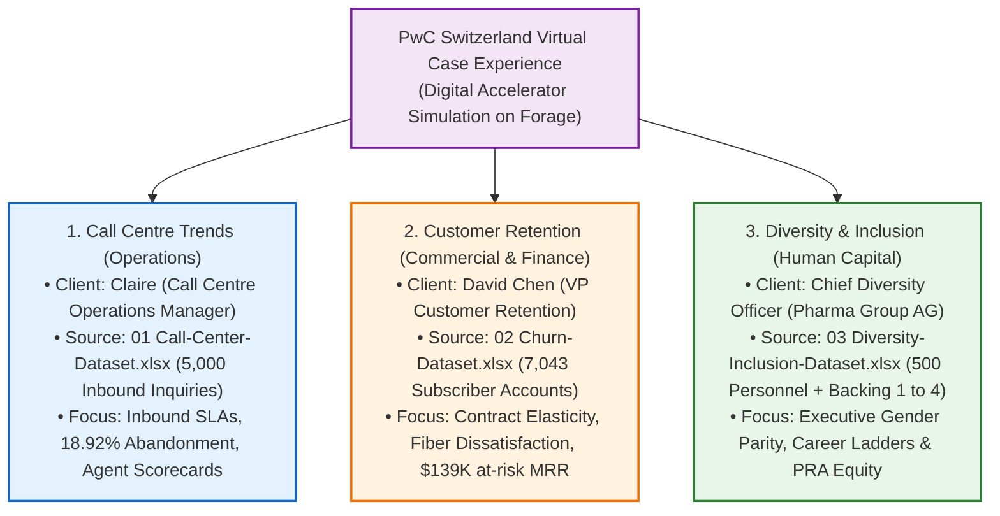

# PwC Switzerland Digital Transformation Suite: End-to-End Galaxy Schema Project

> [!abstract] Capstone Case Study Overview & Provenance
> - **Simulation Framework**: **PwC Switzerland Digital Transformation Virtual Case Experience** (hosted on **Forage**).
> - **Organizational Role**: **Digital Accelerator & Senior Analytics Engineer** at PwC Switzerland, upskilling in digital transformation, dimensional modeling, and modern Business Intelligence tools to empower clients to solve operational, financial, and organizational challenges through technology.
> - **Scope & Datasets**: Complete, end-to-end operationalization of all **three official PwC datasets** and **four auxiliary Backing lookups** unified under a single **Galaxy Schema (Fact Constellation Schema)**:
>   1. **`01 Call-Center-Dataset.xlsx`** (5,000 rows): Customer Operations & Inbound Telephony SLAs.
>   2. **`02 Churn-Dataset.xlsx`** (7,043 rows): Customer Retention, Churn Risk Elasticity & $139K at-risk MRR.
>   3. **`03 Diversity-Inclusion-Dataset.xlsx`** (500 rows + 4 Backing sheets): Human Capital, Executive Gender Parity, Career Ladders, and Performance Review Assessment (PRA) equity benchmarks.
> - **Unified Semantic Architecture**: A single in-memory **Power Pivot (VertiPaq Engine)** data model containing **3 Fact Tables** (`Fact_Calls`, `Fact_Churn`, `Fact_Employees`), **5 Core Dimension Tables** (`DimDate`, `DimAgent`, `DimTopic`, `DimContract`, `DimDepartment`), and **4 Auxiliary Dimensions** (`Dim_EmployeeCensus`, `Dim_CareerLadder`, `Dim_NationalityCensus`, `Dim_PRA_Equity`).
> - **Primary Deliverables**: Interactive executive dashboard architecture featuring executive KPI cards, agent performance scorecards, the **Agent Performance Quadrant**, customer churn hazard distributions, gender progression waterfalls, and modular VBA automation.

---

## 🏛️ The PwC Switzerland Tripartite Simulation Suite

This master project provides a unified, end-to-end business intelligence implementation encompassing all three core simulation tasks designed by **PricewaterhouseCoopers (PwC) Switzerland**:

### 💡 Core Pillars of the PwC Digital Accelerator Mindset
1. **End-to-End Enterprise Integration**: Bridging isolated operational silos (telephony queues, subscription billing, and HR personnel rosters) into a single enterprise semantic layer.
2. **Dimensional Modeling Mastery**: Moving beyond single flat tables to architect a performant **Galaxy Schema** that optimizes VertiPaq dictionary encoding and minimizes memory footprint.
3. **Evidence-Based Executive Storytelling**: Transforming raw transactional logs into boardroom-ready visual intelligence that drives operational cost reductions, customer retention, and organizational equity.

---

## 🌌 Galaxy Schema Semantic Data Model Architecture

The core of this capstone is the **Galaxy Schema (Fact Constellation Schema)** constructed directly within the in-memory **Power Pivot (VertiPaq Engine)** layer:

```mermaid
flowchart TD
    subgraph VertiPaq ["Power Pivot In-Memory Semantic Model (VertiPaq Engine)"]
        direction TB
        
        subgraph Cluster1 ["1. Call Centre Operations Star Cluster"]
            direction TB
            DimDate["DimDate\n(90 Days)\nPK: Date"]
            DimAgent["DimAgent\n(8 Reps)\nPK: Agent"]
            DimTopic["DimTopic\n(5 Inquiries)\nPK: Topic"]
            Fact_Calls["Fact_Calls\n(5,000 rows)\nFK: Date, Agent, Topic"]
            
            DimDate -->|1 : *| Fact_Calls
            DimAgent -->|1 : *| Fact_Calls
            DimTopic -->|1 : *| Fact_Calls
        end

        subgraph Cluster2 ["2. Customer Retention Star Cluster"]
            direction TB
            DimContract["DimContract\n(3 Terms)\nPK: Contract"]
            Fact_Churn["Fact_Churn\n(7,043 rows)\nFK: Contract"]
            
            DimContract -->|1 : *| Fact_Churn
        end

        subgraph Cluster3 ["3. Diversity & Inclusion Star Cluster (with Backing Lookups)"]
            direction TB
            DimDepartment["DimDepartment\n(6 Depts)\nPK: Department"]
            Dim_EmployeeCensus["Dim_EmployeeCensus\n(Backing 1, 500 rows)\nPK: Employee ID"]
            Dim_CareerLadder["Dim_CareerLadder\n(Backing 2, 5 rows)\nPK: Source_Grade"]
            Dim_NationalityCensus["Dim_NationalityCensus\n(Backing 3, 21 rows)\nPK: Nationality"]
            Dim_PRA_Equity["Dim_PRA_Equity\n(Backing 4, 30 rows)\nPK: Dept_JL"]
            
            Fact_Employees["Fact_Employees\n(500 rows)\nFK: Dept, EmpID, Nationality, PRA"]
            
            DimDepartment -->|1 : *| Fact_Employees
            Dim_EmployeeCensus <-->|1 : 1| Fact_Employees
            Dim_CareerLadder -->|1 : *| Fact_Employees
            Dim_NationalityCensus -->|1 : *| Fact_Employees
            Dim_PRA_Equity -->|1 : *| Fact_Employees
        end
    end

    style VertiPaq fill:#fffbeb,stroke:#d97706,stroke-width:3px
    style Cluster1 fill:#eff6ff,stroke:#2563eb,stroke-width:1px
    style Cluster2 fill:#fff7ed,stroke:#ea580c,stroke-width:1px
    style Cluster3 fill:#f0fdf4,stroke:#16a34a,stroke-width:1px
    
    style Fact_Calls fill:#dbeafe,stroke:#1d4ed8,stroke-width:2px
    style Fact_Churn fill:#ffedd5,stroke:#c2410c,stroke-width:2px
    style Fact_Employees fill:#dcfce7,stroke:#15803d,stroke-width:2px
```

### Table Metadata & Cardinality Specs

| Table Name | Table Type | Source Sheet | Row Count | Primary Key (PK) / Foreign Keys (FK) | Role in Galaxy Model |
| :--- | :--- | :--- | :---: | :--- | :--- |
| **`Fact_Calls`** | Fact Table | `01 Call-Center-Dataset.xlsx` (`Sheet1`) | 5,000 | PK: `Call Id` \| FK: `Date`, `Agent`, `Topic` | Inbound telephony transactions, queue hold times, talk durations, CSAT ratings |
| **`DimDate`** | Dimension | Extracted from `Fact_Calls` | 90 | PK: `Date` | Master temporal dimension (Year, Quarter, Month, Day of Week, Weekend Flag) |
| **`DimAgent`** | Dimension | Extracted from `Fact_Calls` | 8 | PK: `Agent` | Customer service representative profiles, baseline targets |
| **`DimTopic`** | Dimension | Extracted from `Fact_Calls` | 5 | PK: `Topic` | Customer inquiry categories (Billing, Technical, Contract, Payment, Admin) |
| **`Fact_Churn`** | Fact Table | `02 Churn-Dataset.xlsx` (`01 Churn-Dataset`) | 7,043 | PK: `customerID` \| FK: `Contract` | Subscriber contract details, service add-ons, monthly charges, ticket escalations, churn target |
| **`DimContract`** | Dimension | Extracted from `Fact_Churn` | 3 | PK: `Contract` | Commitment terms (`Month-to-month`, `One year`, `Two year`), commitment risk weighting |
| **`Fact_Employees`**| Fact Table | `03 Diversity-Inclusion-Dataset.xlsx` (`Pharma Group AG`) | 500 | PK: `Employee ID` \| FK: `Department`, `Nationality 1`, `PRA` | Personnel demographics, job levels, performance ratings, promotion history, turnover |
| **`DimDepartment`** | Dimension | Extracted from `Fact_Employees`| 6 | PK: `Department` | Organizational business units (`Operations`, `Sales & Marketing`, `Finance`, `HR`, etc.) |
| **`Dim_EmployeeCensus`**| Auxiliary Dimension | `03 Diversity-Inclusion-Dataset.xlsx` (`Backing 1`) | 500 | PK: `Employee ID` (1:1 with `Fact_Employees`) | Granular employee census: years in grade (`Y_GRADE`), years of service (`Y_SERVIC`), age |
| **`Dim_CareerLadder`**| Auxiliary Dimension | `03 Diversity-Inclusion-Dataset.xlsx` (`Backing 2`) | 5 | PK: `Source_Grade` (1:* with `Fact_Employees`) | Career ladder promotion mapping (`Junior Officer` $\to$ `Senior Officer` $\to$ `Manager` $\to$ `Senior Manager` $\to$ `Director` $\to$ `Executive`) |
| **`Dim_NationalityCensus`**| Auxiliary Dimension | `03 Diversity-Inclusion-Dataset.xlsx` (`Backing 3`) | 21 | PK: `Nationality` (1:* with `Fact_Employees`) | Nationality demographics benchmark summing to exactly 500 corporate personnel |
| **`Dim_PRA_Equity`**| Auxiliary Dimension | `03 Diversity-Inclusion-Dataset.xlsx` (`Backing 4`) | 30 | PK: `Department_and_Job_Level` (1:* with `Fact_Employees`) | Performance Review Assessment (PRA) gender equity benchmarks (`Even`, `Uneven - Men benefit`, `Inconclusive`) |

---

## 🖥️ Unified Solution Architecture Across 3 Dashboard Pages

The final client deliverable within Microsoft Excel (`PWC_Switzerland_Virtual_Case.xlsx`) presents a 3-tab executive business intelligence suite:

1. **Tab 1: Call Centre Operations (`Call_Center_Dashboard`)**
   - **Executive KPI Cards**: Total Calls (5,000), Answer Rate (81.08%), Abandonment Rate (18.92%), ASA (67.52s), FCR (89.94%), Average CSAT (3.40 / 5.00).
   - **Visualizations**: Hourly Call Arrival & Abandonment Heatmap (9 AM – 6 PM), Agent Scorecard Matrix, and the acclaimed **Agent Performance Quadrant (Average Handle Time vs Calls Answered)**.
   - **Slicers**: `Agent`, `Topic`, `Answered (Y/N)`, `Month Name`.

2. **Tab 2: Customer Retention & Churn Risk (`Churn_Dashboard`)**
   - **Executive KPI Cards**: Total Subscribers (7,043), Churn Rate (26.54%), Monthly Recurring Revenue at Risk ($139,130.85/mo), Average Tech Tickets per Customer (0.42).
   - **Visualizations**: Churn by Contract Term (42.7% Month-to-Month vs 2.8% Two-Year), Internet Service Risk Distribution (Fiber Optic 41.9% churn vs DSL 19.0%), Tech Ticket Escalation Hazard Curve.
   - **Slicers**: `Contract`, `InternetService`, `PaymentMethod`, `SeniorCitizen`.

3. **Tab 3: Diversity, Equity & Executive Parity (`Diversity_Dashboard`)**
   - **Executive KPI Cards**: Total Personnel (500), Overall Female Ratio (41.0%), Executive Leadership Female Representation (Tier 1 & 2: 14.81%), FY21 Promotion Rate (10.2%), Annual Turnover Rate (9.4%), Average Years in Grade (2.6 yrs).
   - **Visualizations**: Executive Hierarchy Gender Waterfall (Staff to C-Suite), Departmental Promotion Velocity by Gender, Performance Review Assessment (PRA) Equity Status Matrix from `Backing 4`.
   - **Slicers**: `Department`, `Job Level`, `Age Group`, `PRA_Status`.

---

## 📚 Complete Project Documentation Index

1. 🏆 **[[Master Project Guidance Manual]]** — **The Complete End-to-End Master Implementation Guide (Ingestion, Power Query ETL, Power Pivot Galaxy Modeling, Backing 1-4 Lookups, DAX, VBA & Dashboards)**
2. ❓ [[Business Problem]] — Tripartite business context & stakeholder mandates for Claire, David Chen, and HR Leadership
3. 🗄️ [[Dataset Documentation]] — Provenance, Forage CDN download links, and granular file metadata for all 3 datasets and Backing 1-4 sheets
4. 📖 [[Data Dictionary]] — Master data dictionary detailing all fields across primary datasets and auxiliary lookups
5. 🔍 [[Data Quality Assessment]] — Forensic audit of 5,000 calls, 7,043 churn accounts, 500 employee records, and Backing 1-4 validation
6. 🗺️ [[Analysis Plan]] — Analytical hypotheses, methodologies, and DALC framework across all 3 domains
7. 📐 [[KPIs]] — Mathematical formulas and business definitions for all production metrics
8. 📖 [[KPI Dictionary]] — Production DAX measure formulations, calculation types, and benchmark targets
9. 💡 [[Findings]] — Evidence-based findings across Call Center SLAs, Churn Drivers, and Executive Gender Parity
10. 🚀 [[Recommendations]] — Strategic, actionable roadmap for Operations, Retention, and Executive HR
11. 🔄 [[Project Retrospective]] — Engineering retrospective, VertiPaq memory optimization, and Digital Accelerator lessons
12. 🏗️ [[Dashboard Architecture Assessment]] — Architectural assessment of the multi-model Galaxy Schema workbook
13. 📱 [[Dashboard UX Specification]] — Product UX specifications, personas, and navigation state machine
14. 🎨 [[Dashboard Design System]] — Color tokens, typography, 8pt spatial grid, and UI components
15. 📐 [[Dashboard Wireframe]] — ASCII layout blueprints and grid coordinates for the 3 executive dashboards
16. 📊 [[Dashboard Visualization Guide]] — Visual decision matrix, quadrant charts, and anti-pattern catalog
17. 🤖 [[VBA Architecture]] — Modular VBA automation codebase (`modNavigation`, `modFilterController`, `modDataRefresh`)
18. ⚡ [[Excel Dashboard Performance]] — Memory benchmarks and VertiPaq optimization rules for Galaxy Schemas
19. ✅ [[Dashboard Testing Checklist]] — 32-point end-to-end verification checklist
20. 🤖 [[AI-Assisted Analysis Workflow]] — AI-assisted engineering workflows across multi-dataset modeling

---

## 🌐 External Links & Canonical References
- 🌐 **Interactive Power BI Cloud Report**: [PwC Call Centre Trends Live Report](https://app.powerbi.com/links/_jx5u479wZ?ctid=af2c0734-cb42-464f-b6bf-2a241b6ada56&pbi_source=linkShare)
- 🌐 **Interactive Churn Power BI Report**: [PwC Customer Retention Live Report](https://app.powerbi.com/links/2DFLi_ipSW?ctid=af2c0734-cb42-464f-b6bf-2a241b6ada56&pbi_source=linkShare)
- 📖 **Canonical Documentation Hub**: [triwgani.github.io/pwc_digital.transformation](https://triwgani.github.io/pwc_digital.transformation/)
