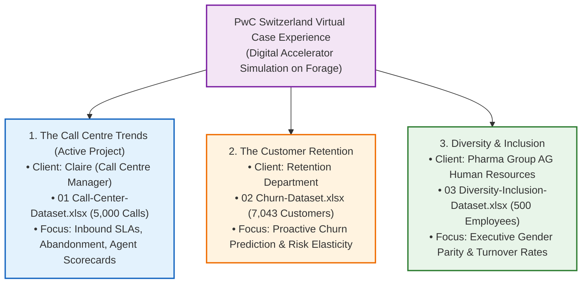
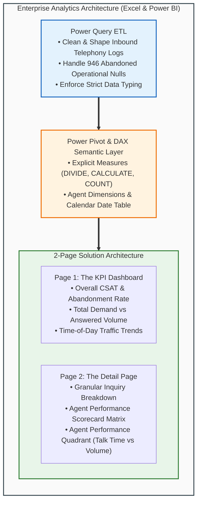

# PwC Call Center Performance Analysis (Capstone Project)

> [!abstract] Capstone Case Study Overview & Provenance
> - **Simulation Framework**: **PwC Switzerland Virtual Case Experience** (hosted on **Forage**).
> - **Organizational Role**: **Digital Accelerator** at PwC, upskilling in digital transformation and modern Business Intelligence tools to empower clients to solve operational challenges through technology.
> - **Client / Stakeholder**: **Claire** (Call Centre Manager at an international telecommunications enterprise).
> - **Dataset Scale**: 5,000 Call Records (`01 Call-Center-Dataset.xlsx`, Q1 2021: January 1 – March 31, 2021).
> - **Staffing**: 8 Dedicated Agents across 5 Customer Inquiry Topics.
> - **Core Challenge**: High customer wait times, an 18.92% call abandonment rate, and inconsistent first-contact resolution.
> - **Primary Deliverable**: Interactive 2-page operational dashboard architecture (**The KPI Dashboard** & **The Detail Page**) featuring executive KPI cards, agent performance scorecards, the **Agent Performance Quadrant (Average Handle Time vs Calls Answered)**, and automated slicer filtering.

---

## 🏛️ The PwC Switzerland Digital Transformation Suite

This capstone project operationalizes **Task 1** of the acclaimed tripartite simulation designed by **PricewaterhouseCoopers (PwC) Switzerland**:

### 💡 Core Lessons Learned as a PwC Digital Accelerator
1. **Upskilling in the Digital Age**: Transforming raw enterprise logs into interactive visual intelligence to eliminate operational blind spots.
2. **The Digital Accelerator Mindset**: Bridging human expertise and analytical technology (Excel, Power Pivot, DAX, and Power BI) to drive tangible organizational value.
3. **From Reactive to Proactive Operations**: Shifting contact center management from post-mortem complaint tracking to real-time capacity and SLA management.

---

## 🖥️ Modern Analytics Architecture & Dashboard Pages

The client solution is structured across two complementary reporting views:

- 🌐 **Live Power BI Cloud Report**: [Open Interactive PwC Call Center Report](https://app.powerbi.com/links/_jx5u479wZ?ctid=af2c0734-cb42-464f-b6bf-2a241b6ada56&pbi_source=linkShare)
- 📖 **Canonical Documentation Hub**: [triwgani.github.io/pwc_digital.transformation](https://triwgani.github.io/pwc_digital.transformation/)

---

## Quick Links to Project Modules
1. ❓ [[Business Problem]] — Stakeholder requirements for Claire & key operational questions
2. 🗄️ [[Dataset Documentation]] — Scope, authentic Forage provenance & the 3-dataset suite
3. 📖 [[Data Dictionary]] — Granular metadata across all 3 PwC simulation datasets
4. 🔍 [[Data Quality Assessment]] — Grounded forensic audit of all 5,000 rows & 946 nulls
5. 🗺️ [[Analysis Plan]] — Hypothesis testing & analytical methodology
6. 📐 [[KPIs]] — Mathematical formulas & official PwC DAX measure library
7. 💡 [[Findings]] — Evidence-based insights & Agent Performance Quadrant
8. 🚀 [[Recommendations]] — Actionable staffing, process, & technology proposals for Claire
9. 🔄 [[Project Retrospective]] — Engineering lessons & Digital Accelerator competencies
10. 💼 [[Call Center Analysis Portfolio Case Study]] — Recruiter-ready showcase
11. 🏗️ [[Dashboard Architecture Assessment]] — Forensic audit of workbook, 7 critical defects & target architecture
12. 📱 [[Dashboard UX Specification]] — Product UX specs, personas, state machines & visual hierarchy

---

## Supporting Resources (Gemini Notebook)
- 📊 [[Call Center KPI Analytics|Call Center KPI Analytics & Operations Benchmarks]]
- 🎨 [[Executive Dashboard Design Principles|Executive Dashboard Design & Interface Ergonomics]]
- 🌐 [Gemini Notebook Source Reference](https://notebook.google.com/notebook/bcdef821-08bc-4186-9221-2c747d5a2b15?authuser=1)

