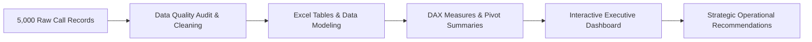

# PwC Call Center Performance Analysis (Capstone Project)

> [!abstract] Capstone Case Study Overview
> - **Client / Context**: PwC Virtual Business Intelligence Simulation / Global Telecom Client
> - **Dataset Scale**: 5,000 Call Records (January 1, 2021 – March 31, 2021)
> - **Staffing**: 8 Dedicated Agents across 5 Call Topics
> - **Core Challenge**: High customer wait times, an 18.92% call abandonment rate, and inconsistent first-contact resolution.
> - **Primary Deliverable**: Interactive 3-tier Executive Excel Dashboard featuring KPI cards, agent performance scorecards, hourly volume trends, and a custom VBA filter reset macro.

## Quick Links to Project Modules
1. ❓ [[Business Problem]] — Stakeholder requirements & key questions
2. 🗄️ [[Dataset Documentation]] — Scope, timeframe & schema overview
3. 📖 [[Data Dictionary]] — Granular column-by-column metadata
4. 🔍 [[Data Quality Assessment]] — Grounded forensic audit of all 5,000 rows
5. 🗺️ [[Analysis Plan]] — Hypothesis testing & analytical methodology
6. 📐 [[KPIs]] — Mathematical formulas & DAX definitions
7. 💡 [[Findings]] — Evidence-based insights & agent performance variances
8. 🚀 [[Recommendations]] — Actionable staffing, process, & technology proposals
9. 🔄 [[Project Retrospective]] — Engineering lessons & competencies demonstrated
10. 💼 [[Call Center Analysis Portfolio Case Study]] — Recruiter-ready showcase

---

## Supporting Resources (Gemini Notebook)
- 📊 [[Call Center KPI Analytics|Call Center KPI Analytics & Operations Benchmarks]]
- 🎨 [[Executive Dashboard Design Principles|Executive Dashboard Design & Interface Ergonomics]]
- 🌐 [Gemini Notebook Source Reference](https://notebook.google.com/notebook/bcdef821-08bc-4186-9221-2c747d5a2b15?authuser=1)

