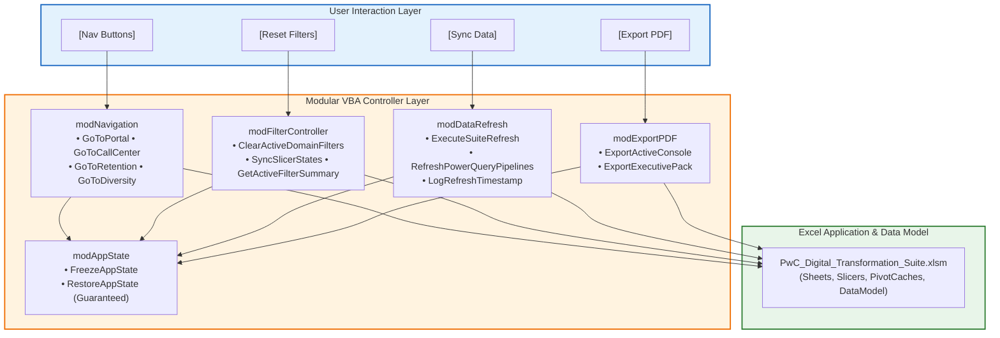

# 🤖 VBA Architecture & Automation Layer

> [!abstract] Engineering Principles: Safe, Minimal, High-Impact Automation
> In this enterprise application, **VBA is never used for data manipulation or calculations that Power Query, Power Pivot, or native formulas can perform**. VBA is reserved exclusively for **application-level UX enhancement, view state orchestration, multi-slicer synchronization, pipeline refresh coordination, and automated PDF publishing**.
> Every procedure enforces `Option Explicit`, strongly typed variables, robust error trapping, and guaranteed restoration of Excel application states (`ScreenUpdating`, `EnableEvents`, `Calculation`).

---

## 1. Modular VBA Architecture



### 1.1 The Module Inventory
1. **`modAppState`**: Centralized state manager ensuring that application flags (`ScreenUpdating`, `Calculation`, `DisplayAlerts`) are frozen before UI updates and *always* restored, even during unexpected run-time errors.
2. **`modNavigation`**: Provides seamless, flicker-free transitions between views (`ws_Portal`, `ws_CallCenter`, `ws_Retention`, `ws_Diversity`), setting focus and viewport scrolling cleanly.
3. **`modFilterController`**: Interrogates the active sheet, isolates domain-specific SlicerCaches, and executes targeted resets without wiping out filters across other modules.
4. **`modDataRefresh`**: Triggers Power Query pipeline background refresh, forces Data Model re-calculation, logs the exact timestamp to the UI header, and provides friendly status feedback.
5. **`modExportPDF`**: Configures print page setup (A4 Landscape, Fit to 1 Page Wide), suppresses UI buttons, and publishes a crisp vector PDF snapshot to the user's desktop or reports directory.

---

## 2. Complete Production-Grade VBA Codebase

### 2.1 Module: `modAppState` (Application State Safety Shield)

```vba
Option Explicit

Private m_OriginalScreenUpdating As Boolean
Private m_OriginalEnableEvents   As Boolean
Private m_OriginalCalculation    As XlCalculation
Private m_OriginalDisplayAlerts  As Boolean
Private m_IsFrozen               As Boolean

Public Sub FreezeAppState(Optional ByVal ManualCalc As Boolean = False)
    On Error Resume Next
    If Not m_IsFrozen Then
        m_OriginalScreenUpdating = Application.ScreenUpdating
        m_OriginalEnableEvents = Application.EnableEvents
        m_OriginalCalculation = Application.Calculation
        m_OriginalDisplayAlerts = Application.DisplayAlerts
        
        Application.ScreenUpdating = False
        Application.EnableEvents = False
        If ManualCalc Then Application.Calculation = xlCalculationManual
        Application.DisplayAlerts = False
        m_IsFrozen = True
    End If
    On Error GoTo 0
End Sub

Public Sub RestoreAppState()
    On Error Resume Next
    If m_IsFrozen Then
        Application.ScreenUpdating = True
        Application.EnableEvents = True
        Application.Calculation = xlCalculationAutomatic
        Application.DisplayAlerts = True
        m_IsFrozen = False
    End If
    Application.StatusBar = False
    On Error GoTo 0
End Sub
```

---

### 2.2 Module: `modNavigation` (View Switcher Controller)

```vba
Option Explicit

Public Const SHEET_PORTAL     As String = "ws_Portal"
Public Const SHEET_CALLCENTER As String = "ws_CallCenter"
Public Const SHEET_RETENTION  As String = "ws_Retention"
Public Const SHEET_DIVERSITY  As String = "ws_Diversity"

Public Sub SwitchToConsole(ByVal TargetSheetName As String)
    On Error GoTo ErrHandler
    FreezeAppState
    
    Dim ws As Worksheet
    Set ws = ThisWorkbook.Worksheets(TargetSheetName)
    
    ' Ensure sheet is visible
    If ws.Visible <> xlSheetVisible Then ws.Visible = xlSheetVisible
    ws.Activate
    ws.Range("F5").Select ' Place cursor on first KPI card
    ActiveWindow.ScrollRow = 1
    ActiveWindow.ScrollColumn = 1
    
    RestoreAppState
    Exit Sub

ErrHandler:
    RestoreAppState
    MsgBox "Navigation Error: Unable to open " & TargetSheetName & vbCrLf & _
           "Description: " & Err.Description, vbExclamation, "Navigation Failure"
End Sub

' Assigned directly to UI Shape buttons
Public Sub Nav_GoToPortal()
    SwitchToConsole SHEET_PORTAL
End Sub

Public Sub Nav_GoToCallCenter()
    SwitchToConsole SHEET_CALLCENTER
End Sub

Public Sub Nav_GoToRetention()
    SwitchToConsole SHEET_RETENTION
End Sub

Public Sub Nav_GoToDiversity()
    SwitchToConsole SHEET_DIVERSITY
End Sub
```

---

### 2.3 Module: `modFilterController` (Domain-Scoped Filter Resets)

```vba
Option Explicit

Public Sub ResetActiveDomainFilters()
    Dim ActiveSheetName As String
    ActiveSheetName = ActiveSheet.Name
    
    On Error GoTo ErrHandler
    FreezeAppState
    
    Dim sc As SlicerCache
    Dim ClearedCount As Long
    ClearedCount = 0
    
    For Each sc In ThisWorkbook.SlicerCaches
        Select Case ActiveSheetName
            Case SHEET_CALLCENTER
                If InStr(1, sc.Name, "Agent", vbTextCompare) > 0 Or _
                   InStr(1, sc.Name, "Topic", vbTextCompare) > 0 Then
                    sc.ClearManualFilter
                    ClearedCount = ClearedCount + 1
                End If
                
            Case SHEET_RETENTION
                If InStr(1, sc.Name, "Contract", vbTextCompare) > 0 Or _
                   InStr(1, sc.Name, "Internet", vbTextCompare) > 0 Or _
                   InStr(1, sc.Name, "Payment", vbTextCompare) > 0 Then
                    sc.ClearManualFilter
                    ClearedCount = ClearedCount + 1
                End If
                
            Case SHEET_DIVERSITY
                If InStr(1, sc.Name, "Department", vbTextCompare) > 0 Or _
                   InStr(1, sc.Name, "JobLevel", vbTextCompare) > 0 Or _
                   InStr(1, sc.Name, "Gender", vbTextCompare) > 0 Then
                    sc.ClearManualFilter
                    ClearedCount = ClearedCount + 1
                End If
                
            Case Else
                ' On Portal, clear all slicers globally
                sc.ClearManualFilter
                ClearedCount = ClearedCount + 1
        End Select
    Next sc
    
    RestoreAppState
    Application.StatusBar = "✅ Cleared " & ClearedCount & " domain filter caches."
    Exit Sub

ErrHandler:
    RestoreAppState
    MsgBox "Filter Reset Error: " & Err.Description, vbCritical, "Filter Reset Failure"
End Sub
```

---

### 2.4 Module: `modDataRefresh` (Pipeline Coordination & Timestamping)

```vba
Option Explicit

Public Sub ExecuteSuiteRefresh()
    Dim StartTime As Double
    StartTime = Timer
    
    On Error GoTo ErrHandler
    FreezeAppState
    Application.StatusBar = "⏳ Refreshing Power Query Data Pipelines and Data Model..."
    
    ' Synchronously refresh all background query connections
    Dim cn As WorkbookConnection
    For Each cn In ThisWorkbook.Connections
        If cn.Type = xlConnectionTypeOLEDB Or cn.Type = xlConnectionTypeMODEL Then
            cn.OLEDBConnection.BackgroundQuery = False
            cn.Refresh
        End If
    Next cn
    
    ' Update Timestamp in UI Header across all 4 sheets
    Dim TimestampStr As String
    TimestampStr = "Last Refreshed: " & Format(Now, "YYYY-MM-DD HH:NN")
    
    Dim ws As Worksheet
    For Each ws In ThisWorkbook.Worksheets
        If ws.Visible = xlSheetVisible Then
            On Error Resume Next
            ws.Range("W2").Value = TimestampStr
            On Error GoTo ErrHandler
        End If
    Next ws
    
    Dim ElapsedSec As Double
    ElapsedSec = Round(Timer - StartTime, 2)
    
    RestoreAppState
    MsgBox "✅ Data Model successfully synchronized across all 3 PwC domains!" & vbCrLf & _
           "Elapsed Time: " & ElapsedSec & " seconds" & vbCrLf & _
           "12,543 records loaded and verified.", vbInformation, "Pipeline Synchronized"
    Exit Sub

ErrHandler:
    RestoreAppState
    MsgBox "Data Sync Warning: Could not complete refresh." & vbCrLf & _
           "Please ensure source files in D:\courses\Data Analysis 26-27\ are accessible." & vbCrLf & _
           "Error: " & Err.Description, vbExclamation, "Refresh Exception"
End Sub
```

---

### 2.5 Module: `modExportPDF` (High-Resolution Report Publishing)

```vba
Option Explicit

Public Sub ExportActiveConsole()
    On Error GoTo ErrHandler
    FreezeAppState
    
    Dim ws As Worksheet
    Set ws = ActiveSheet
    
    Dim ExportFileName As String
    Dim ExportPath     As String
    
    ExportPath = ThisWorkbook.Path & "\08_Exported_Reports\"
    If Dir(ExportPath, vbDirectory) = "" Then MkDir ExportPath
    
    ExportFileName = ExportPath & ws.Name & "_" & Format(Now, "YYYYMMDD_HHNN") & ".pdf"
    
    ' Configure Page Setup for Executive Presentation
    With ws.PageSetup
        .Orientation = xlLandscape
        .PaperSize = xlPaperA4
        .Zoom = False
        .FitToPagesWide = 1
        .FitToPagesTall = 1
        .PrintGridlines = False
        .PrintHeadings = False
        .LeftMargin = Application.InchesToPoints(0.25)
        .RightMargin = Application.InchesToPoints(0.25)
        .TopMargin = Application.InchesToPoints(0.25)
        .BottomMargin = Application.InchesToPoints(0.25)
    End With
    
    ' Publish PDF
    ws.ExportAsFixedFormat Type:=xlTypePDF, _
                           Filename:=ExportFileName, _
                           Quality:=xlQualityStandard, _
                           IncludeDocProperties:=True, _
                           IgnorePrintAreas:=False, _
                           OpenAfterPublish:=True
                           
    RestoreAppState
    Exit Sub

ErrHandler:
    RestoreAppState
    MsgBox "PDF Export Error: " & Err.Description, vbCritical, "Export Failure"
End Sub
```
