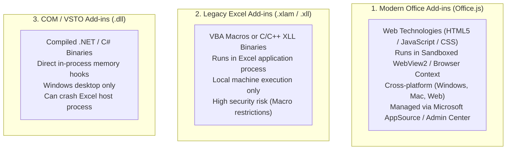

# AI Excel Installation Guide & Add-in Architecture

> [!abstract] Installation Standard
> This guide outlines the official, verified deployment workflows for integrating approved AI add-ins into Microsoft Excel, explaining the underlying architectural distinctions between modern Office Add-ins, legacy Excel add-ins, and COM add-ins.

---

## 🏗️ Architectural Foundations: Understanding Add-in Types

Before installing any third-party spreadsheet tool, data analysts and enterprise engineers must understand the three distinct add-in architectures supported by Microsoft Excel:



| Add-in Architecture | Technology Stack | Runtime Environment | Platform Support | Security Model | AI Tools in Scope |
| :--- | :--- | :--- | :--- | :--- | :--- |
| **Office Add-ins** *(Modern)* | HTML5, JavaScript, TypeScript, CSS, Office.js | Sandboxed Edge WebView2 (Desktop) or Browser iframe (Web) | Windows, Mac, iPad, Excel on the Web | High (Strict sandbox; cannot access local filesystem or execute unauthorized system binaries) | **GPT for MS Excel (Twistly)**, **Claude for Excel (Anthropic)** |
| **Excel Add-ins** *(Legacy)* | VBA (`.xlam`), C/C++ (`.xll`) | Excel calculation thread | Windows Desktop, macOS Desktop | Medium/Low (Subject to macro security and certificate policies) | Legacy custom functions (UDFs) |
| **COM Add-ins** *(Enterprise)* | C++, C#, .NET VSTO (`.dll`) | Direct in-process Win32 memory | Windows Desktop only | Low sandbox (Full local user privileges; registry installation) | Enterprise database connectors, SAP Analysis |

---

## 📥 Universal Installation Workflow: Microsoft AppSource

Both **GPT for MS Excel (Twistly)** and **Claude for Excel (Anthropic)** are modern **Office Add-ins** distributed via the official Microsoft AppSource catalog.

### Step-by-Step Installation Procedure

```text
Microsoft Excel
      ↓
Home (or Insert) Ribbon Tab
      ↓
Add-ins Button
      ↓
More Add-ins (Office Add-ins Dialog)
      ↓
Store / Search Tab
      ↓
Enter Publisher / Product Name
      ↓
Verify Publisher Identity & Permissions
      ↓
Click "Add"
      ↓
Accept License Terms & Privacy Policy
      ↓
Open Add-in Task Pane & Complete Authentication
```

#### Detailed Procedural Steps:
1. **Open Microsoft Excel**: Launch Excel Desktop (Microsoft 365) or Excel on the Web (`excel.office.com`).
2. **Navigate to the Add-ins Portal**:
   - In modern Microsoft 365: Click the **Home** tab ➔ Locate the **Add-ins** button on the far right of the ribbon.
   - Alternatively: Click the **Insert** tab ➔ Select **Get Add-ins** (or **Add-ins**).
3. **Search for the Approved Add-in**:
   - Type `"Twistly"` to locate **GPT for MS Excel**.
   - Type `"Claude"` to locate **Claude for Excel** by Anthropic.
4. **Verify Publisher Legitimacy**:
   - Check the author: Always confirm the publisher is **Twistly** or **Anthropic PBC**.
   - Inspect ratings, permissions, and terms of service.
5. **Install the Add-in**:
   - Click the green **Add** button.
   - Acknowledge the permissions modal: *"This add-in will have access to the document contents..."*
   - Click **Continue**.
6. **Access & Authenticate**:
   - The add-in ribbon icon will appear in the **Home** tab or a dedicated add-in tab.
   - Click the icon to open the sidebar task pane.
   - Sign in with your registered account credentials (or enter your OpenAI/Twistly/Anthropic API credentials if using BYOK mode).

---

## 🛠️ Tool-Specific Installation Matrix

### 1. GPT for MS Excel — Twistly
- **Publisher Name**: **Twistly** ([twistlycells.ai](https://twistlycells.ai))
- **Direct AppSource Link**: [Microsoft AppSource Listing for GPT for MS Excel](https://appsource.microsoft.com/en-us/product/office/WA200005271)
- **Supported Excel Platforms**: Excel for Microsoft 365 (Windows/Mac), Excel 2016+, Excel on the Web.
- **Authentication**: Email sign-in inside the task pane. Free starter tier available; Pro tier or Bring-Your-Own-Key (BYOK) OpenAI API key connection for enterprise workloads.
- **Key Requirement**: Enable dynamic arrays and modern JavaScript engine in Office settings.

### 2. Claude for Excel — Anthropic
- **Publisher Name**: **Anthropic PBC** ([anthropic.com](https://anthropic.com))
- **Direct AppSource Link**: [Microsoft AppSource Listing for Claude for Excel](https://appsource.microsoft.com/en-us/product/office/WA200007559)
- **Supported Excel Platforms**: Excel for Microsoft 365 (Windows, macOS, Web).
- **Authentication**: Requires active Anthropic user login associated with a **Pro, Max, Team, or Enterprise** subscription.
- **Key Requirement**: Modern Microsoft Edge WebView2 runtime installed on Windows hosts.

---

## 🏢 Enterprise Governance & IT Administrator Policies

In corporate, banking, healthcare, or government environments, individual users may encounter restrictions when attempting to install add-ins:

> [!warning] Enterprise IT Restrictions
> If the **Add-ins** button is greyed out or displays *"Sorry, your organization has disabled the Office Store"*, your enterprise uses centralized Microsoft 365 Tenant Administration. **Do not attempt to bypass organizational group policies.**

### Centralized Admin Deployment Workflow:
1. Enterprise IT Administrators deploy vetted add-ins via the **Microsoft 365 Admin Center** (`admin.microsoft.com`) under **Settings** ➔ **Integrated apps**.
2. Administrators can assign the add-in to specific security groups (e.g., *Data-Analytics-Team*) rather than the entire tenant.
3. Once deployed centrally, the add-in appears automatically under the user's **Admin Managed** tab in the Office Add-ins dialog.

---

## ❌ Common Installation Errors & Troubleshooting

| Error Message / Symptom | Root Cause | Verified Remediation |
| :--- | :--- | :--- |
| **"Office Store is not available"** | Tenant administrator has blocked individual AppSource downloads. | Request add-in deployment from IT through the Centralized Deployment Portal. |
| **"Add-in Error: We could not load the add-in"** | Local browser cache corruption or outdated WebView2 engine on Windows. | Update Microsoft Edge WebView2 runtime via Windows Update; clear Office add-in cache via `%LOCALAPPDATA%\Microsoft\Office\16.0\Wef\`. |
| **"#NAME? on AI functions"** | `GPT for MS Excel` custom functions have not registered with the local calculation engine. | Open the Twistly task pane to initialize the Office.js custom function bridge; check internet connectivity. |
| **"Authentication Expired / Invalid API Key"** | Expired session token or depleted OpenAI/Anthropic API balance. | Open add-in sidebar settings, re-authenticate or update the API secret key. |
