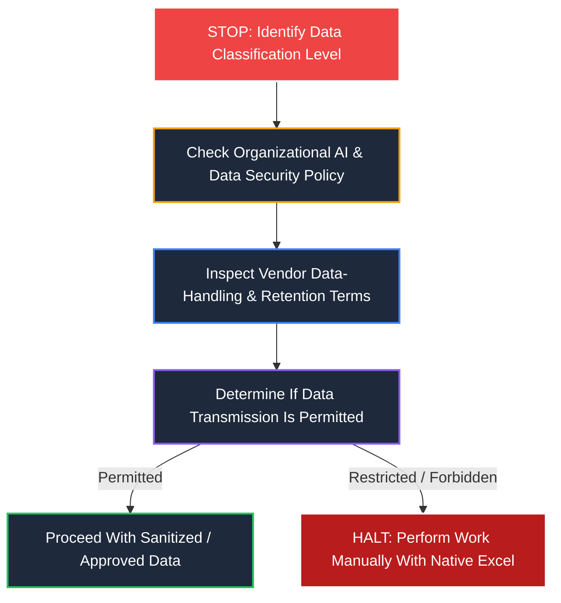

# 🔒 AI Excel Security, Privacy & Enterprise Governance

> [!caution] Confidentiality Notice
> **Excel spreadsheets frequently contain the most sensitive intellectual property in an enterprise**: payroll data, unreleased financial earnings, customer PII, trade secrets, and client transaction records. Sending workbook content to public AI models without strict authorization poses severe regulatory, legal, and operational risks.

---

## 🚦 The 5-Step Security Decision Flow

Whenever considering using an AI add-in or prompting an external model with workbook content, execute this mandatory decision gate:

---

## ❓ The 8 Mandatory Pre-Flight Questions

Before transmitting cell data, table ranges, or workbook metadata to an AI service, an analyst must formally answer these 8 questions:

1. **What specific data leaves Excel?**
   - Does the add-in transmit only the targeted cell, the entire active worksheet, or all tabs in the workbook?
2. **Who processes and stores the data?**
   - Is data sent directly to the model provider (OpenAI, Anthropic) or routed through a third-party intermediary proxy?
3. **What permissions does the Office add-in demand?**
   - Does it request read-only access to selections, or broad read/write access to the entire document context?
4. **What does the vendor's commercial privacy agreement state?**
   - Are terms governed by a standard consumer policy or a legally binding Enterprise Business Associate Agreement (BAA)?
5. **Is transmitted data retained on external servers?**
   - What is the data retention window (zero-retention, 30-day abuse monitoring, or indefinite storage)?
6. **Is workbook data utilized to train or fine-tune public models?**
   - Does the vendor have an enforceable zero-data-retention (ZDR) guarantee for commercial API customers?
7. **Is external AI processing formally permitted by corporate compliance?**
   - Does your organization's IT Security and Legal council permit cloud-based LLM tools for this classification of data?
8. **Does the spreadsheet contain confidential, regulated, or client data?**
   - Does the file contain Personally Identifiable Information (PII), Protected Health Information (PHI/HIPAA), payment data (PCI-DSS), or material non-public financial information?

---

## 🛡️ Tool-Specific Governance & Data Handling Architectures

### 1. GPT for MS Excel (Twistly)
- **Data Flow**: Cell-level formulas (`=AI.ASK(...)`) serialize the referenced cell text and send HTTPS requests to Twistly cloud infrastructure, which calls OpenAI's API.
- **Enterprise Mode (BYOK)**: When using your organization's direct OpenAI API key (Bring Your Own Key), interactions are governed under **OpenAI's Commercial API Data Policy** (which explicitly guarantees customer data is **not** used to train OpenAI foundation models).
- **Consumer/Free Tier**: Standard terms apply; enterprise-sensitive data must never be processed under free, unvetted tier accounts.

### 2. Claude for Excel (Anthropic)
- **Data Flow**: Operates inside an authenticated task pane. When analyzing workbooks, context from the open spreadsheet is packaged and transmitted over TLS encryption to Anthropic's cloud endpoints.
- **Enterprise Controls**: Available under Claude **Team and Enterprise** agreements. Anthropic's commercial terms specify that customer inputs and outputs are **not** used for training models by default.
- **Local Isolation**: Add-in conversations are generally session-based and do not write permanent logs to the client's local disk outside Office temporary caches.

---

## 🧹 Practical Data Sanitization Before AI Assistance

If organizational policy permits AI assistance for general formula construction but prohibits transmitting sensitive business records, **anonymize and sanitize the schema** before prompting:

| Original Sensitive Record | Sanitized / Synthetic Equivalent |
| :--- | :--- |
| `Employee: John Doe, SSN: 001-23-4567, Salary: $145,000` | `Employee: Emp_01, SSN: XXX-XX-XXXX, Salary: 50000` |
| `Client: Pfizer Inc, Contract: $2.4M Pharma Trial` | `Client: Client_A, Contract: 100000 Retail Order` |
| `Customer Phone: +1 (212) 555-0199` | `Customer Phone: +1 (555) 000-0000` |

### General Rule:
> **Ask AI about the mathematical pattern and formula syntax using dummy column headers, never the live customer data.**
