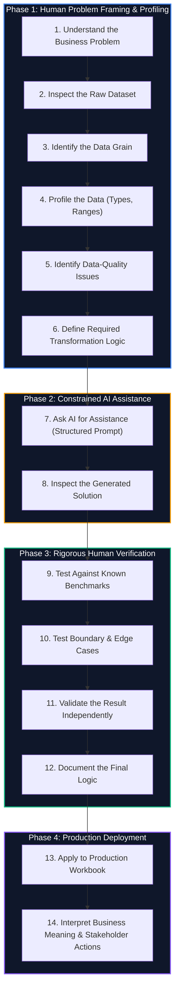

# 🔄 Professional AI Excel Workflow: The 14-Step Methodology

> [!important] Core Doctrine
> **AI accelerates analytical work; it does not replace analytical understanding.**
>
> An analyst who prompts an AI model before understanding the dataset is merely delegating errors to an algorithm. Professional data analytics requires disciplined, upfront human investigation before involving artificial intelligence.

---

## 🧭 The End-to-End Analytical Lifecycle

---

## 📋 Granular Step-by-Step Breakdown

### Phase 1: Human Problem Framing & Data Understanding

#### Step 1: Understand the Business Problem
- **Action**: Meet with stakeholders or review project briefs. Define the commercial question before touching the keyboard.
- **Example**: In the [[Call Center Performance Analysis]], the business problem was identifying why customer satisfaction dipped in February and whether staffing levels met the 80/20 Service Level Agreement.

#### Step 2: Inspect the Raw Dataset
- **Action**: Open the file without applying edits. Check total row count, column count, delimiters, and file size.
- **Rule**: Never prompt AI on a dataset you haven't scrolled through with your own eyes.

#### Step 3: Identify the Data Grain
- **Action**: Determine what a single row represents. Is it one transaction? One customer? One daily summary? One call?
- **Call Center Case**: Exactly one inbound customer service call per row (5,000 discrete calls).

#### Step 4: Profile the Data
- **Action**: Review data types across columns. Ensure dates are true serial numbers, numerical measures contain valid numbers, and IDs are formatted as strings.

#### Step 5: Identify Data-Quality Issues
- **Action**: Audit against the [[Six Dimensions of Data Quality]]: completeness, uniqueness, validity, accuracy, consistency, timeliness.
- **Critical Check**: Differentiate between corrupted data and valid operational nulls (e.g., abandoned calls with blank duration).

#### Step 6: Define the Required Transformation
- **Action**: Write down in plain English (or pseudo-code) exactly what calculation or transformation must occur.
- **Example**: *"Compute the average speed of answer strictly for answered calls, grouping by agent."*

---

### Phase 2: Constrained AI Assistance

#### Step 7: Ask AI for Assistance
- **Action**: Use structured prompt engineering from the [[AI Excel Prompt Library]]. Supply context, table names, constraints, and target outcomes.
- **Best Practice**: Request modern functions (`XLOOKUP`, `SUMIFS`, `LET`, dynamic arrays) and ask the model to explain its rationale.

#### Step 8: Inspect the Generated Solution
- **Action**: Read the formula or code line-by-line. Never paste code into an enterprise sheet without reading it first.
- **Audit**: Did the AI use volatile functions like `INDIRECT` or `OFFSET`? Did it lock ranges (`$`) properly? Did it assume columns that don't exist?

---

### Phase 3: Rigorous Human Verification

#### Step 9: Test Against Known Benchmarks
- **Action**: Apply the generated formula to a small sample of 3–5 rows where you have manually calculated the expected answer by hand.
- **Goal**: Verify mathematical and logical parity.

#### Step 10: Test Boundary & Edge Cases
- **Action**: Stress-test the solution against hostile inputs:
  - Blank/empty cells
  - Zero values (prevent `#DIV/0!`)
  - Duplicate keys
  - Negative values
  - Unexpected text in numeric fields

#### Step 11: Validate the Result Independently
- **Action**: Build an independent cross-check. For example, verify that `SUM(Answered Calls) + SUM(Abandoned Calls) == Total Inbound Calls`.

#### Step 12: Document the Final Logic
- **Action**: Add cell comments, name your formulas using `LET`, or record documentation in your Second Brain notes. Explain *why* the formula was constructed this way.

---

### Phase 4: Production Deployment & Stakeholder Communication

#### Step 13: Apply to Production Workbook
- **Action**: Paste the verified formula into the production table. If using AI custom functions (`AI.ASK`), convert the calculated results to static values (`Paste as Values`) to prevent continuous recalculation.

#### Step 14: Interpret Business Meaning & Stakeholder Actions
- **Action**: Translate the numerical output into strategic business decisions.
- **Outcome**: Deliver insights that drive operational improvements, resource reallocation, or cost reduction.

---

## ⚡ Comparison: Amateur vs Professional AI Usage

| Attribute | The Amateur Approach | The Professional Analyst Approach |
| :--- | :--- | :--- |
| **Initial Step** | Copies raw problem immediately into ChatGPT/Claude | Explores raw data, validates grain, and formulates manual logic |
| **Prompt Style** | *"How do I fix my Excel error?"* | Structured prompt with schema, constraints, expected types, and context |
| **Code Review** | Blind copy-paste into cell | Line-by-line inspection of functions, precedence, and range locking |
| **Verification** | Assumes output is correct if no error banner appears | Tests with known manual calculations and edge cases (blanks, duplicates) |
| **Maintenance** | Helpless when formula breaks later | Understands the underlying mechanics and debugs independently |
| **Final Goal** | Get a quick formula | Deliver rigorous, defensible, auditable business intelligence |
