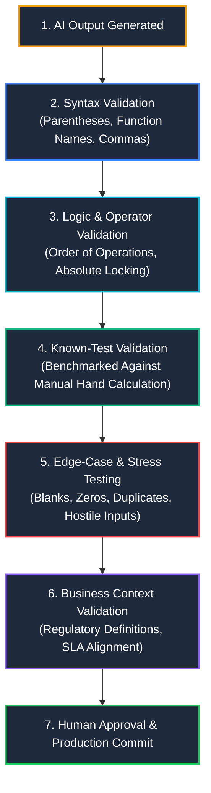

# 🛡️ AI Output Verification Framework

> [!warning] The Verification Mandate
> **Never commit unverified AI output to production spreadsheets.**
> Generative AI models are predictive text engines; they do not possess a runtime calculation engine. When an AI generates an Excel formula, it creates syntax that looks statistically plausible based on training data, but it cannot execute or verify whether that formula produces correct numbers on your specific dataset.

---

## 🔬 The 6-Stage Verification Pipeline



---

## 📋 Comprehensive Analyst Verification Checklist

Before publishing any AI-assisted formula, model, or dashboard, complete every item in this checklist:

```markdown
### Pre-Execution Inspection
- [ ] Does the formula execute without throwing standard Excel errors (#VALUE!, #REF!, #NAME?, #SPILL!)?
- [ ] Are all range coordinates properly locked with absolute references ($A$2:$A$100) or structured references ([@Column])?
- [ ] Does the operator precedence evaluate correctly (* and / before + and -)?
- [ ] Are there volatile functions (OFFSET, INDIRECT) that should be replaced with index-based functions (INDEX, XLOOKUP)?

### Empirical & Boundary Testing
- [ ] Was the formula tested on at least 3 normal, expected records?
- [ ] Was the calculation tested against a known hand-calculated benchmark?
- [ ] Was the formula tested on empty / blank cells? Does it return blank or throw an error?
- [ ] Was it tested on zero values to prevent #DIV/0! exceptions?
- [ ] Was it tested against duplicate lookup keys? (Does it handle multi-match scenarios properly?)
- [ ] Was it tested against unexpected data types (e.g. text in numeric fields)?

### Business & Governance Alignment
- [ ] Does the calculation align 100% with the corporate KPI definition?
- [ ] Can I explain the entire formula step-by-step to a non-technical stakeholder without referencing AI?
- [ ] Has the final verified formula been documented with comments or recorded in the project notes?
- [ ] Have external AI formulas (=AI.ASK) been converted to static values to prevent ongoing recalculation?
```

---

## 🛠️ Native Excel Forensic Auditing Tools

Excel provides built-in auditing utilities that analysts must use to dissect and verify AI-generated output:

### 1. Evaluate Formula Tool (`Alt` ➔ `M` ➔ `V`)
- **What it does**: Steps through a nested formula one operation at a time, evaluating sub-expressions inside out.
- **Why it matters**: Reveals exactly which step in a nested `IF`/`XLOOKUP`/`LET` formula causes an unexpected output or type coercion.

### 2. In-Formula F9 Evaluation
- **What it does**: Highlight any sub-expression inside the Formula Bar and press `F9` to calculate only that highlighted chunk.
- **Example**: In `=IF(ISBLANK(A2), 0, XLOOKUP(A2, B2:B10, C2:C10))`, highlight `ISBLANK(A2)` and press `F9` to see if it evaluates to `TRUE` or `FALSE`.
- **Warning**: Always press `Esc` afterwards to exit without saving the static evaluated number!

### 3. Trace Precedents & Dependents (`Alt` ➔ `M` ➔ `P` / `Alt` ➔ `M` ➔ `D`)
- **What it does**: Draws blue tracer arrows on the worksheet connecting the active cell to all cells that feed data into it (precedents) or depend upon it (dependents).
- **Audit Value**: Verifies that the AI formula didn't accidentally link to an unrelated row or drift off-grid.

### 4. Data Type Verification Functions
- `=ISNUMBER(cell)`: Proves whether a number is a genuine numerical value or text disguised as a number.
- `=ISTEXT(cell)`: Identifies covert text strings.
- `=TYPE(cell)`: Returns `1` for Number, `2` for Text, `4` for Boolean, `16` for Error, `64` for Array.
