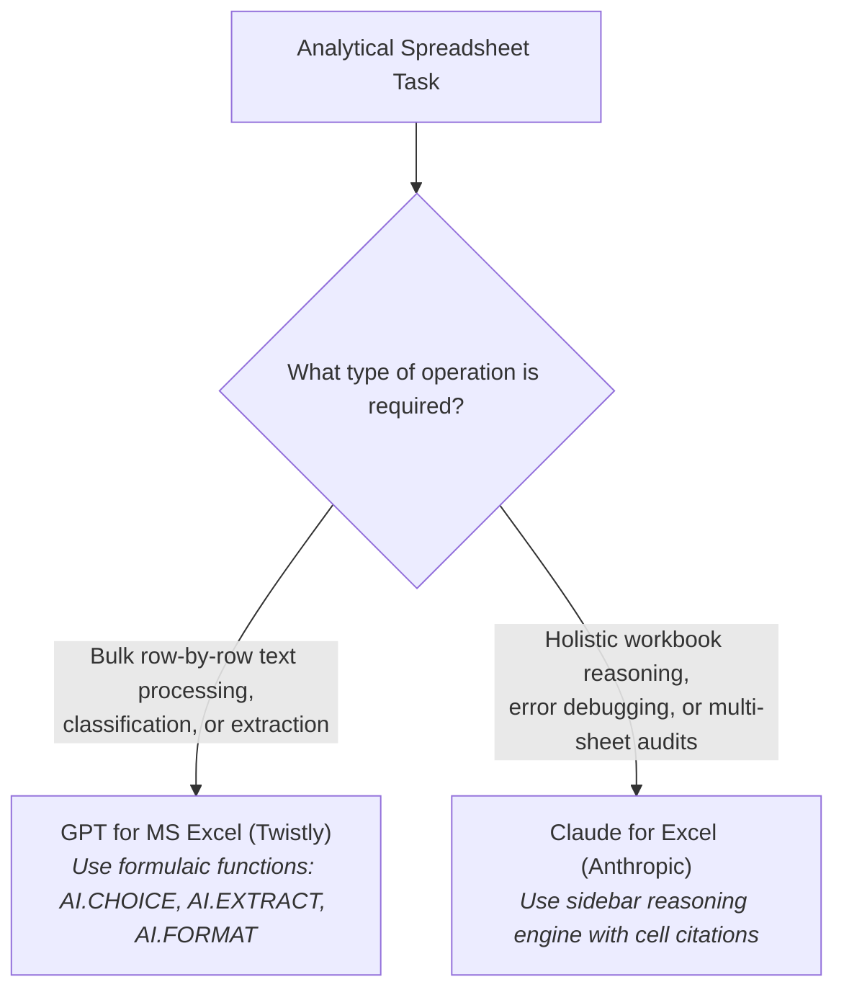

# ⚖️ AI Tool Comparison: GPT for MS Excel vs Claude for Excel

> [!note] Analytical Comparison Standard
> This document provides an objective, side-by-side technical comparison of **GPT for MS Excel (Twistly)** and **Claude for Excel (Anthropic)** based strictly on verified software architectures, marketplace documentation, and observed operational mechanics.  
> **Tools are not ranked, and no single product is declared superior.** Each tool implements a distinct architectural model designed for different spreadsheet workflows.

---

## 📊 Objective Capability & Architecture Matrix

| Capability / Attribute | GPT for MS Excel — Twistly | Claude for Excel — Anthropic |
| :--- | :--- | :--- |
| **Primary Integration Model** | **Cell-Formula Functions** (`AI.ASK`, `AI.TABLE`, `AI.FILL`, etc.) + Task Pane sidebar | **Conversational Task Pane Sidebar** with full workbook DOM reading & editing capabilities |
| **Official Publisher** | **Twistly** ([twistlycells.ai](https://twistlycells.ai)) | **Anthropic PBC** ([anthropic.com](https://anthropic.com)) |
| **Marketplace Distribution** | Microsoft AppSource (Office Add-ins Catalog) | Microsoft AppSource (Office Add-ins Catalog) |
| **Formula Assistance** | Generates dynamic array formulas and scalar outputs directly inside cells via `AI.` functions | Formulates standard and modern Excel formulas (`XLOOKUP`, `LET`, dynamic arrays) in the sidebar chat for manual or automated insertion |
| **Formula Explanation** | Available via sidebar task pane chat | Comprehensive step-by-step formula deconstruction with dependency flow analysis in sidebar chat |
| **Data Analysis** | Cell-level transformations, text sentiment tagging, and formulaic tabular synthesis | Multi-tab spreadsheet reasoning, trend identification, anomaly detection, and business metric evaluation |
| **Data Transformation** | Direct cell-level cleaning (`AI.FORMAT`, `AI.EXTRACT`, `AI.TRANSLATE`, `AI.CHOICE`) across thousands of rows | Interactive workbook editing, restructuring messy ranges, and maintaining existing downstream dependencies |
| **Workbook Editing** | Populates individual cells and dynamic spilled ranges based on formula execution | Can propose and directly apply multi-cell and multi-sheet modifications across the open workbook |
| **Charts & Visualizations** | Indirect (generates clean tabular data for native Excel charts) | Recommends optimal chart formats, suggests visual layout adjustments, and helps configure native Excel chart series |
| **Pivot Tables** | Indirect (generates structured input data) | Recommends Pivot Table field configurations (Rows, Columns, Values, Filters) and assists in calculating summary percentages |
| **Natural-Language Interaction** | Function prompts within formulas (`=AI.ASK("prompt")`) and sidebar chat | Contextual dialogue interface in sidebar task pane with cell citations |
| **Evidence & Citations** | Standard cell formula inputs | **Cell-level citations** linking statements to specific sheet coordinates (e.g., `Sheet1!$D$15`) |
| **Plan & Subscription Requirements** | Free trial credits available; paid Pro/Team subscription via Twistly or Bring-Your-Own-Key (BYOK) OpenAI API connection | Requires active Anthropic **Pro, Max, Team, or Enterprise** account |
| **Supported Platforms** | Excel for Microsoft 365 (Windows, Mac, Web), Excel 2016+ | Excel for Microsoft 365 (Windows, Mac, Web) with modern WebView2 engine |
| **Primary Limitations** | High formula volume can cause recalculation latency; requires constant internet; potential token exhaustion on automatic calculation | Does not execute or write raw VBA macros; requires compatible Microsoft 365 version; cannot run in air-gapped environments |

---

## 🔍 Architectural Divergence: How to Choose Based on Task Needs

### When GPT for MS Excel (Twistly) Fits Best:
- **Repetitive Text Processing**: Classifying 2,000 survey comments into sentiment buckets with `=AI.CHOICE(A2, Categories)`.
- **Entity Extraction**: Pulling phone numbers, SKUs, or email addresses from unstructured descriptions into a structured column.
- **Dynamic Synthetic Tables**: Rapidly generating mock 50-row datasets for template testing via `=AI.TABLE(...)`.

### When Claude for Excel (Anthropic) Fits Best:
- **Complex Model Debugging**: Understanding why a 15-tab financial model is throwing `#REF!` or circular dependency warnings.
- **Auditing Legacy Workbooks**: Deciphering complicated formulas written by other analysts, supported by cell citations.
- **Executive Planning**: Formulating end-to-end KPI architectures and designing cohesive dashboard wireframes based on entire sheets.
