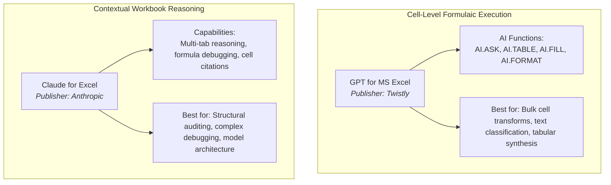

# 🤖 AI for Excel: Foundations & Modern Analytics Workflows

> [!important] Core Principle
> **Use AI to accelerate Excel work, but never use AI to avoid understanding Excel.**
>
> An analyst must always be able to:
> - Explain the underlying formula logic
> - Reproduce the logic independently
> - Test the result with diverse inputs
> - Identify boundary failure cases and edge conditions
> - Defend the analytical decision to business stakeholders
>
> without depending on the AI tool.

---

## 🎯 The Pedagogical Mission

The integration of Artificial Intelligence into Microsoft Excel represents the biggest productivity shift since the introduction of Power Query and Dynamic Arrays. However, generative AI tools are probabilistic calculation assistants, not deterministic calculation engines. When an analyst blindly copies an AI-generated formula without comprehending its logic, they introduce catastrophic operational risk to financial models, executive dashboards, and business intelligence pipelines.

This dedicated track establishes a rigorous, professional workflow for AI-augmented data analytics:

```
Excel Fundamentals
        ↓
Understand the Logic
        ↓
Use AI as an Assistant
        ↓
Inspect AI Output
        ↓
Test & Validate
        ↓
Improve Manually
        ↓
Document the Final Logic
        ↓
Apply to Real Data
```

---

## 🛠️ The Two Primary Tools in Focus

This curriculum evaluates and documents two verified, production-grade Excel AI integrations:



1. **[[GPT for MS Excel — Twistly]]**:
   - Focus: Native formula functions (`AI.ASK`, `AI.TABLE`, `AI.EXTRACT`, `AI.FILL`, etc.) that execute directly inside cell grids.
   - Architectural role: High-throughput batch text extraction, classification, sentiment tagging, and prompt-driven table generation.

2. **[[Claude for Excel — Anthropic]]**:
   - Focus: Context-aware sidebar reasoning engine capable of reading multi-tab workbooks, analyzing formula dependencies, and providing cell-level citations.
   - Architectural role: High-order spreadsheet reasoning, financial model inspection, automated error diagnostics, and formula debugging.

---

## 🗺️ Knowledge Layer Navigation

| Document | Purpose |
| :--- | :--- |
| **[[AI Excel Workflow]]** | 14-step end-to-end analytical workflow from business problem to human validation |
| **[[AI Excel Installation Guide]]** | Official setup guide for Office Add-ins, permissions, and environments |
| **[[GPT for MS Excel — Twistly]]** | In-depth technical specification of Twistly formula functions with syntax and limits |
| **[[Claude for Excel — Anthropic]]** | Capabilities, workbook reasoning mechanics, and human verification boundaries |
| **[[AI Tool Comparison]]** | Objective side-by-side feature and architectural capability matrix |
| **[[AI Excel Prompt Library]]** | Production-tested prompt patterns for formulas, debugging, ETL, and dashboards |
| **[[AI Output Verification]]** | 7-stage verification framework and audit checklist |
| **[[AI Excel Security and Privacy]]** | Governance framework, data classification, and enterprise privacy auditing |
| **[[Human Skill vs AI Assistance]]** | Clear demarcation of what AI accelerates vs what humans must own |
| **[[AI for Data Analysts MOC]]** | Central Map of Content linking concepts, tools, practice, and projects |

---

## 🔗 Integrated Vault Ecosystem

The AI knowledge layer is not an isolated track; it is deeply embedded within our ground-truth analytics curriculum:

- **Core Formulas**: Cross-referenced with [[XLOOKUP]], [[INDEX and MATCH]], and [[FILTER]].
- **Data Quality**: Aligned with the [[Six Dimensions of Data Quality]] and [[Data Cleaning]].
- **ETL & Power Query**: Paired with [[01_Power_Query_Fundamentals_and_ETL]].
- **Capstone Project**: Demonstrated live in [[06_Projects/Call Center Performance Analysis/AI-Assisted Analysis Workflow|Call Center AI-Assisted Analysis Workflow]].
- **Practical Drills**: 10 progressive hands-on exercises in [[05_Practice/AI Assisted Excel/]] and the running [[AI Experiment Log]].
