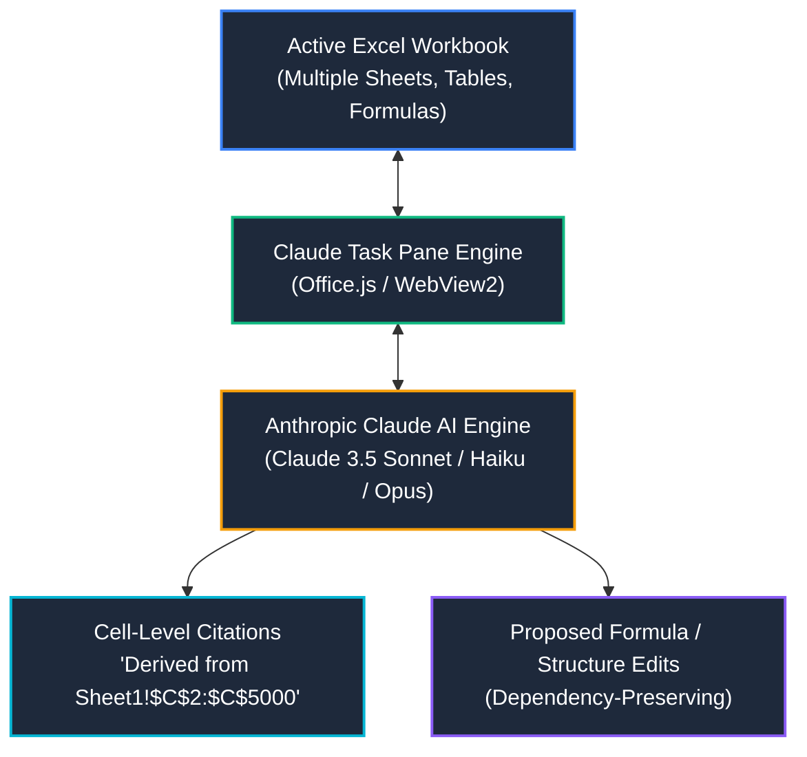

# Claude for Excel — Anthropic

> [!important] Publisher & Official Product Notice
> **Publisher**: **Anthropic** ([anthropic.com](https://anthropic.com))  
> **Product Name**: **Claude for Excel** (Official Office Add-in)  
> **Marketplace**: Microsoft AppSource / Microsoft 365 Add-in Catalog  
> **Subscription Requirements**: Active Anthropic **Pro, Max, Team, or Enterprise** account.  
> **Disambiguation**: Claude for Excel is a dedicated task-pane add-in running inside Excel with read/write access to open workbooks. It is distinct from the web-based *Claude for Microsoft 365* cloud file connector.

---

## 🔍 Tool Overview & Architectural Engine

Claude for Excel embeds Anthropic's Claude 3.5 / 3.7 family of models directly into the Microsoft Excel interface via a native sidebar task pane. Unlike cell-formula add-ins that execute individual scalar prompts row-by-row, Claude for Excel is engineered for **contextual workbook reasoning**: it reads the global document object model (DOM), analyzes multi-tab schemas, traces cell precedence and dependence chains, and recommends structural edits with granular cell citations.

### Supported Platforms & Environment Matrix
- **Supported Environments**: Excel for Microsoft 365 (Windows 10/11, macOS), Excel on the Web (modern browsers).
- **Unsupported / Restricted**: Older desktop Excel standalone releases (Excel 2013, Excel 2016/2019 MSI installations without modern Edge WebView2). Does not write or execute legacy Visual Basic for Applications (VBA) macro binaries directly.

---

## ⚡ Core Capabilities: What Claude Can Assist With

Claude for Excel provides analytical acceleration across five distinct spreadsheet dimensions:

### 1. Multi-Sheet Context & Workbook Navigation
- **Holistic Model Reading**: Inspects schemas across multiple tabs simultaneously (e.g., reconciling `FactCalls` with `DimAgent` and `DimDepartment`).
- **Data Flow Mapping**: Traces how raw source tables flow into intermediate staging tables, lookup ranges, and summary KPI dashboards.
- **Onboarding & Code Audits**: Quickly explains complex workbooks built by previous analysts, identifying hidden assumptions and undocumented logic.

### 2. Intelligent Formula Assistance & Dependency Preservation
- **Formula Generation**: Writes modern dynamic array formulas (`FILTER`, `UNIQUE`, `SORTBY`, `XLOOKUP`) based on natural language problem statements.
- **Formula Explanation**: Deconstructs nested formulas (e.g., multi-condition `INDEX/MATCH`, `SUMIFS`, nested `LET`) into clear step-by-step logic trees.
- **Dependency Preservation**: When suggesting cell adjustments, Claude preserves upstream and downstream formula references to avoid creating cascading `#REF!` errors.

### 3. Forensic Error Debugging
- **Error Root-Cause Analysis**: Diagnoses why cells evaluate to `#VALUE!`, `#N/A`, `#SPILL!`, `#DIV/0!`, or `#NUM!`.
- **Type Mismatch Detection**: Highlights instances where numerical values are covertly stored as text strings (e.g., `'100`), preventing mathematical aggregation.
- **Circular Reference Isolation**: Pinpoints recursive dependencies causing calculation loops.

### 4. Tabular Analytics, Pivots & Chart Planning
- **Pivot Table Strategy**: Suggests optimal field placement (Rows, Columns, Values, Filters) and aggregation types (`SUM`, `COUNT`, `% of Column Total`).
- **Visual Chart Selection**: Recommends appropriate visualization formats based on preattentive visual attributes (e.g., horizontal bar charts for categorical rankings vs line charts for continuous time series).

### 5. Cell-Level Citations & Grounding
- **Transparent Evidence**: Accompanies answers with explicit cell coordinates (e.g., *"Based on row 14 of the 'Assumptions' tab where inflation is set to 3.5%"*), allowing instant verification in the grid.

---

## ⚖️ Division of Responsibility: AI Assistance vs Human Verification

> [!warning] The Golden Rule of AI Assistance
> **Never assume that Claude's output is automatically correct.** Claude produces highly convincing, statistically plausible spreadsheet logic that can contain subtle edge-case errors, silent omissions, or boundary calculation flaws.

Below is the mandatory operational division of responsibility for professional analysts:

| Operational Area | What Claude Can Assist With | What the Analyst MUST Verify |
| :--- | :--- | :--- |
| **Formula Formulation** | Generating complex formulas, nesting `IFERROR`/`LET`, suggesting modern dynamic functions | Verify range locking (`$`), test with blank/null cells, ensure correct operator precedence (`*` before `+`). |
| **Error Diagnostics** | Explaining standard Excel error codes and suggesting potential fixes | Check underlying raw cell values to confirm the proposed fix doesn't mask genuine data corruption. |
| **Data Profiling** | Identifying missing columns, obvious duplicates, and outliers in visible rows | Verify data grain, evaluate statistical validity of nulls (e.g., abandoned calls vs true missing data). |
| **KPI Formulation** | Suggesting standard industry metrics (FCR, CSAT, ASA, SLA 80/20) | Confirm proposed formula aligns with the organization's specific business contracts and governance rules. |
| **Workbook Edits** | Proposing updated values or formulas across selected ranges | Review every cell edit before clicking "Apply", test downstream balance sheets/financial reconciliations. |
| **Chart Selection** | Recommending visual chart types and color palettes | Ensure no 3D distortion, audit axis truncation (zero-baselines on bar charts), test readability for color-blind users. |

---

## 🛡️ Best Practices for Interacting with Claude for Excel

1. **Provide Clear Context**: Specify table names, column headers, and desired output locations in your prompts.
2. **Constrain the Logic**: Explicitly state constraints (e.g., *"Use only Excel 2021 compatible functions; do not use VBA; avoid volatile functions like OFFSET"*).
3. **Request Cell Citations**: Ask Claude to specify which exact cell ranges it evaluated to reach its conclusion.
4. **Iterative Problem Solving**: Break massive analytical requests into modular steps:
   - Step 1: Profile and validate data grain.
   - Step 2: Formulate helper columns or intermediate tables.
   - Step 3: Compute summary measures.
5. **Critique the Output**: Always issue a follow-up prompt: *"What assumptions did you make, and in what edge cases could this formula fail?"*
