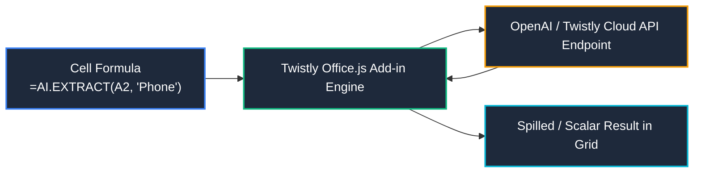

# GPT for MS Excel — Twistly

> [!important] Publisher & Attribution Notice
> **Publisher**: **Twistly** ([twistlycells.ai](https://twistlycells.ai))  
> **Official Marketplace Listing**: Microsoft AppSource (Office Add-ins)  
> **Disambiguation**: **GPT for MS Excel is NOT an official product of OpenAI**. It is an independent third-party Office add-in developed by Twistly that connects Microsoft Excel workbooks to OpenAI large language model APIs (e.g., GPT-4o, GPT-4 Turbo) through custom worksheet functions and an interactive task pane.

---

## 🔍 Tool Overview & Architecture

GPT for MS Excel by Twistly introduces a suite of native spreadsheet functions prefixed with `AI.` directly into the Excel formula engine. These functions execute asynchronous API calls to LLM endpoints, returning scalar text, categorized choices, or dynamically spilled arrays directly into worksheet cells.



### Supported Platforms & Requirements
- **Excel Platforms**: Excel for Microsoft 365 (Windows & Mac), Excel on the Web, Excel 2016/2019 (with Office.js requirement set 1.1+).
- **Authentication**: Free trial tier with starter credits; Pro/Team subscription via Twistly or Bring-Your-Own-Key (BYOK) OpenAI API connection for enterprise privacy and unlimited volume.
- **Network**: Constant internet connectivity required. Not functional in offline or strictly air-gapped environments.

---

## 📚 Core AI Function Reference

Below is the verified reference manual for Twistly custom functions:

---

### 1. `AI.ASK`

#### Purpose
Prompts the language model with an open-ended natural language question, returning a text or numeric response directly into the cell.

#### Syntax
```excel
=AI.ASK(prompt, [value])
```

#### Inputs
- `prompt` *(Required, String)*: The instruction or question to send to the model.
- `[value]` *(Optional, Reference/String)*: Optional cell reference providing context data for the prompt.

#### Outputs
- *(String)*: The scalar text completion generated by the AI model.

#### Example
```excel
=AI.ASK("Summarize the customer complaint in under 10 words:", B2)
```

#### Data Analyst Use Case
Generating rapid executive bullet summaries of customer feedback logs or call transcript notes directly beside raw survey rows.

#### Common Mistakes
- Omitting quotation marks around the string prompt.
- Expecting numerical calculation results that require exact mathematical precision (AI may hallucinate arithmetic; use native Excel `SUM`/`AVERAGE` instead).

#### Limitations
- Re-evaluates upon workbook recalculation if automatic calculation is enabled, consuming API tokens.

#### Verification Steps
1. Verify the summary against the original row text.
2. Confirm the word limit was strictly respected.

---

### 2. `AI.TABLE`

#### Purpose
Generates a dynamic 2D table complete with headers and rows based on a descriptive prompt.

#### Syntax
```excel
=AI.TABLE(prompt, [headers])
```

#### Inputs
- `prompt` *(Required, String)*: Description of the dataset or template to generate.
- `[headers]` *(Optional, Array/String)*: Explicit column headers to constrain table structure.

#### Outputs
- *(Dynamic Array)*: A multi-row, multi-column spilled range.

#### Example
```excel
=AI.TABLE("Generate 5 synthetic retail transactions with Date, Product, Region, and SalesAmount")
```

#### Data Analyst Use Case
Synthesizing realistic dummy test data to stress-test complex formula logic, pivot tables, and dashboard layouts before production data arrives.

#### Common Mistakes
- Placing `AI.TABLE` in a cell where adjacent cells are occupied, triggering an Excel `#SPILL!` error.

#### Limitations
- Synthetic data cannot replace real statistical distributions for econometric modeling.

#### Verification Steps
1. Ensure the destination range has adequate empty space to prevent `#SPILL!`.
2. Inspect data types across columns to verify dates and numbers are properly parsed.

---

### 3. `AI.TRANSLATE`

#### Purpose
Translates cell text from a source language to a specified target language.

#### Syntax
```excel
=AI.TRANSLATE(text, target_language, [source_language])
```

#### Inputs
- `text` *(Required, Reference/String)*: Cell containing the text to translate.
- `target_language` *(Required, String)*: Desired output language (e.g., `"English"`, `"French"`, `"Arabic"`).
- `[source_language]` *(Optional, String)*: Source language if known, otherwise auto-detected.

#### Outputs
- *(String)*: Translated text.

#### Example
```excel
=AI.TRANSLATE(C2, "English")
```

#### Data Analyst Use Case
Standardizing international customer support survey feedback or multi-regional product descriptions into a common corporate language.

#### Common Mistakes
- Passing empty cells without wrapping in an `IF(C2="","", ...)` check, incurring wasted API calls.

#### Limitations
- Nuances, idiomatic industry jargon, and regional colloquialisms may be mistranslated.

#### Verification Steps
1. Spot-check 10% of translated records with native speakers or reference dictionaries.

---

### 4. `AI.FORMAT`

#### Purpose
Reformats unstructured, messy, or inconsistently formatted cell text into a standardized target format.

#### Syntax
```excel
=AI.FORMAT(text, target_format)
```

#### Inputs
- `text` *(Required, Reference/String)*: The unformatted cell value.
- `target_format` *(Required, String)*: Description or mask of the desired pattern (e.g., `"(###) ###-####"`, `"YYYY-MM-DD"`, `"Proper Case"`).

#### Outputs
- *(String)*: Formatted text adhering to the target pattern.

#### Example
```excel
=AI.FORMAT(D2, "Standard International Phone: +1-XXX-XXX-XXXX")
```

#### Data Analyst Use Case
Standardizing phone numbers, postal codes, and employee ID codes imported from disparate legacy ERP/CRM dumps.

#### Common Mistakes
- Assuming the output is a native Excel numeric serial date; it is often returned as text.

#### Limitations
- Inconsistent source data with missing digits may be hallucinated or truncated unpredictably.

#### Verification Steps
1. Test with `LEN()` to verify uniform character counts across cleaned outputs.
2. Confirm no arbitrary filler digits were introduced.

---

### 5. `AI.EXTRACT`

#### Purpose
Extracts specific named entities, substrings, or attributes from freeform unstructured text.

#### Syntax
```excel
=AI.EXTRACT(text, entity_to_extract)
```

#### Inputs
- `text` *(Required, Reference/String)*: Source cell containing unstructured narrative or strings.
- `entity_to_extract` *(Required, String)*: The specific attribute to extract (e.g., `"Email Address"`, `"Invoice Number"`, `"Order Date"`).

#### Outputs
- *(String)*: The isolated attribute value.

#### Example
```excel
=AI.EXTRACT(A2, "Invoice Number")
```

#### Data Analyst Use Case
Parsing unstructured bank statement transaction descriptions or automated billing emails to pull invoice IDs and tax numbers into structured columns.

#### Common Mistakes
- Requesting multiple disparate entities in a single call without specifying delimiter formatting.

#### Limitations
- If the entity is absent, the function may return `"N/A"` or blank depending on the prompt; handle with `IFERROR`.

#### Verification Steps
1. Filter results for blank or error outputs.
2. Verify extracted strings match source substring coordinates.

---

### 6. `AI.FILL`

#### Purpose
Infers a pattern from provided few-shot examples and auto-completes target rows based on context.

#### Syntax
```excel
=AI.FILL(example_range, target_range)
```

#### Inputs
- `example_range` *(Required, Range)*: Input/output pair cells demonstrating the pattern.
- `target_range` *(Required, Range)*: Input cells to evaluate against the pattern.

#### Outputs
- *(Dynamic Array / String)*: Completed values adhering to the inferred logic.

#### Example
```excel
=AI.FILL(A2:B4, A5:A20)
```

#### Data Analyst Use Case
Handling complex string splitting or parsing where standard Excel Flash Fill (`Ctrl+E`) fails due to irregular delimiters or contextual semantic variations.

#### Common Mistakes
- Providing ambiguous or contradictory example rows that confuse pattern inference.

#### Limitations
- Slower than native Excel Flash Fill; should only be used when Flash Fill pattern detection fails.

#### Verification Steps
1. Review the first 5 generated outputs against the input logic.
2. Validate edge cases with non-standard lengths.

---

### 7. `AI.CHOICE`

#### Purpose
Classifies input text into one of a strictly defined list of categories.

#### Syntax
```excel
=AI.CHOICE(text, valid_choices_range_or_array)
```

#### Inputs
- `text` *(Required, Reference/String)*: The text to classify.
- `valid_choices_range_or_array` *(Required, Range/Array)*: Allowed category labels (e.g., `{"Positive", "Neutral", "Negative"}` or reference to `$F$2:$F$4`).

#### Outputs
- *(String)*: Exactly one value selected from the provided valid choices.

#### Example
```excel
=AI.CHOICE(E2, $K$2:$K$5)
```

#### Data Analyst Use Case
Automating sentiment categorization, ticket prioritization (`"Urgent"`, `"High"`, `"Medium"`, `"Low"`), or customer department routing across inbound support tickets.

#### Common Mistakes
- Not locking category references (`$K$2:$K$5`), causing lookup range drift when dragging down.

#### Limitations
- Multi-intent text (e.g., a review with both positive and negative comments) will be forced into a single category.

#### Verification Steps
1. Build a quick Pivot Table of `AI.CHOICE` outputs to confirm 100% of rows map strictly to valid categories.
2. Manually audit border-line cases.

---

### 8. `AI.LIST`

#### Purpose
Generates a one-dimensional array (vertical list) of items matching a specific prompt.

#### Syntax
```excel
=AI.LIST(prompt)
```

#### Inputs
- `prompt` *(Required, String)*: Description of items to enumerate.

#### Outputs
- *(Dynamic Array)*: Vertical column of spilled items.

#### Example
```excel
=AI.LIST("List the 10 most common customer churn reasons in retail banking")
```

#### Data Analyst Use Case
Brainstorming dimension categories, data validation picklist values, or survey answer options during analytical planning phases.

#### Common Mistakes
- Failing to specify quantity limits in the prompt, leading to inconsistent list lengths.

#### Limitations
- Cannot be directly edited without breaking array spill integrity; copy and paste as values (`Ctrl+Shift+V`) for manual editing.

#### Verification Steps
1. Verify list uniqueness with `=COUNTA(range) = COUNTA(UNIQUE(range))`.

---

## ⚠️ Analyst Best Practices & Operational Hazards

1. **Recalculation Cost**: Never leave hundreds of `AI.` formulas running on `Automatic Calculation` in massive workbooks. Every edit triggers recalculation, exhausting API quotas and causing severe UI latency.
2. **Convert to Static Values**: Once verified, copy AI formula columns and use **Paste as Values** (`Ctrl+Alt+V` ➔ `Values` or `Ctrl+Shift+V`).
3. **Never Trust Math to AI**: Never use `AI.ASK` for sums, percentages, or weighted averages. Always use native Excel functions (`SUMIFS`, `XLOOKUP`, `CALCULATE`).
