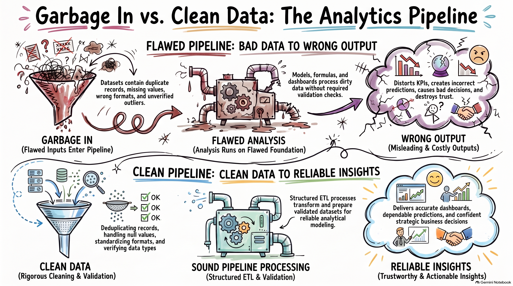

# Analytics Pipeline & Tool Stack Comparison

## Why This Resource Matters
Understanding where Excel fits into the broader modern data stack (SQL, Python, Power BI, Databricks, Snowflake) prevents architectural misuse. Excel excels at ad-hoc exploration, agile modeling, and rapid executive dashboards, while cloud warehouses and automated ETL pipelines handle petabyte-scale extraction and governance.

---

## Source Visual Artifact

---

## Source Summary
The curated infographic from Gemini Notebook contrasts modern analytics pipeline stages across various tools:
- **Ingestion & Storage**: Raw data sources (APIs, CRM, ERP, Flat Files) moving through staging schemas.
- **Transformation (ETL/ELT)**: Where Power Query M code maps directly to SQL / dbt transformations in production data engineering.
- **Semantic Layer & Modeling**: Power Pivot Data Models and DAX metrics serving the identical relational role as Power BI tabular models and Analysis Services cubes.
- **Presentation & Action**: Excel worksheets, interactive dashboards, and automated alerts delivering actionable intelligence to decision makers.

---

## My Understanding
Excel is not merely a spreadsheet; when paired with Power Query and Power Pivot, it is a self-contained miniature Business Intelligence (BI) engine. Mastering these capabilities in Excel creates a seamless transition to Power BI, Fabric, and enterprise tabular modeling because the core concepts—M language, star schema design, and DAX calculations—are 100% transferable.

---

## Key Takeaways
1. **Pipeline Continuity**: Skills developed in Power Query apply directly to Power BI and Azure Data Factory.
2. **Right Tool for the Stage**: Excel handles end-user data modeling and rapid stakeholder iteration faster than formal engineering tickets.
3. **Reproducibility**: Structuring transformations inside Power Query ensures pipeline auditability.

---

## Practical Application
Referenced in Module 8 ([[01_Power_Query_Fundamentals_and_ETL]]) and Module 9 ([[01_Dimensional_Modeling_Principles]]) to position Excel's data stack against enterprise tools.

---

## Concepts Supported
- [[ETL Process]]
- [[Power Query]]
- [[Data Analysis Life Cycle]]
- [[Dimensional Modeling]]

---

## Related Course Lessons
- [[01_Power_Query_Fundamentals_and_ETL]]
- [[01_Dimensional_Modeling_Principles]]

---

## Project Connection
- [[06_Projects/Call Center Performance Analysis/Analysis Plan]]

---

## Original Source
[Open Gemini Notebook Source](https://notebook.google.com/notebook/bcdef821-08bc-4186-9221-2c747d5a2b15?authuser=1)
Asset file: `assets/analytics-pipeline-data-comparison.png`
