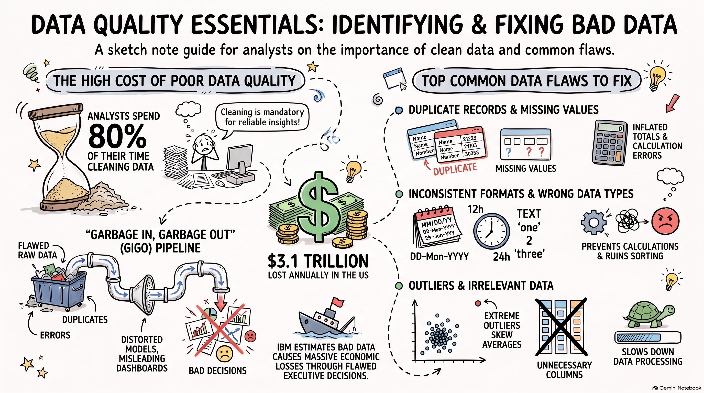

# Data Quality Essentials Guide

## Why This Resource Matters
Reliable analytics require robust upstream data quality checks. The **Data Quality Essentials Guide** provides a practical, high-impact overview of data hygiene fundamentals, standardizing how analysts inspect raw datasets, identify anomalies, and enforce structural data integrity before building formulas, pivot tables, or dashboard visualizations.

---

## Source Visual Artifact

---

## Source Summary
The essentials guide outlines critical principles for operational data reliability:
- **Core Pillars of Quality**: Evaluating data against Completeness, Accuracy, Validity, Consistency, Uniqueness, and Timeliness.
- **Data Inspection Workflows**: Detecting trailing whitespaces, unescaped characters, inconsistent casing, and mixed data types in numeric columns.
- **Audit Verification Strategies**: Distinguishing between valid operational missing values (such as unfulfilled transactions or unanswered calls) and systemic data pipeline failures.
- **Transformation Toolset**: Applying Excel formula functions (`TRIM`, `CLEAN`, `PROPER`, `IFERROR`, `ISNUMBER`) alongside Power Query automated ETL transformation steps.

---

## My Understanding
In our [[Call Center Performance Analysis]] forensic investigation, applying these essentials principles enabled us to rigorously account for all 946 null values across speed-of-answer, talk duration, and customer satisfaction ratings. By validating that nulls existed solely when `Answered == 'N'`, we preserved the true operational statistics of answered calls without corrupting baseline wait times.

---

## Key Takeaways
1. **Quality Before Analysis**: Bad data fed into sophisticated formulas produces misleading conclusions (Garbage In, Garbage Out).
2. **Formulaic vs ETL Cleaning**: Use Excel formulas for quick, ad-hoc cell cleaning; use Power Query for automated, repeatable pipeline hygiene.
3. **Audit Trails**: Document every transformation and data assumption clearly in project data dictionaries and quality assessments.

---

## Concepts Supported
- [[Six Dimensions of Data Quality]]
- [[Data Cleaning]]
- [[ETL Process]]
- [[Power Query]]

---

## Related Course Lessons
- [[01_Data_Quality_Dimensions_and_Audit]]
- [[01_Data_Types_and_Formatting]]
- [[01_Power_Query_Fundamentals_and_ETL]]

---

## Practice Opportunities
- [[Ex05_Data_Cleaning_and_Transformation]]
- [[Ex07_Supplementary_Dynamic_Lookups_and_KPIs]]

---

## Project Connection
- [[06_Projects/Call Center Performance Analysis/Data Quality Assessment]]
- [[06_Projects/Call Center Performance Analysis/Data Dictionary]]

---

## Original Source
[Open Gemini Notebook Source](https://notebook.google.com/notebook/bcdef821-08bc-4186-9221-2c747d5a2b15?authuser=1)  
Asset file: `assets/data-quality-essentials-guide.png`
